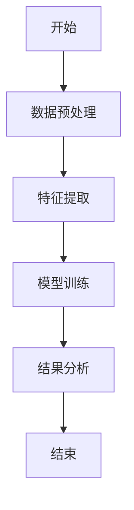
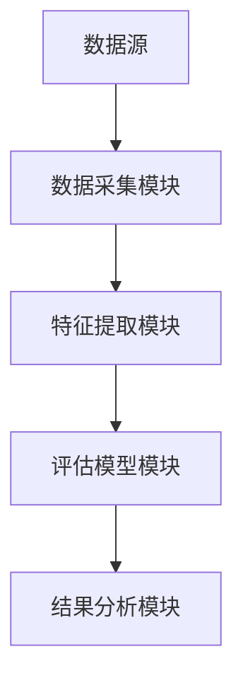

                 


# AI智能体在评估品牌价值中的作用

> **关键词**：AI智能体、品牌价值评估、人工智能、数据驱动、机器学习、品牌分析、情感分析

> **摘要**：随着人工智能技术的快速发展，AI智能体在品牌价值评估中的作用日益凸显。本文详细探讨了AI智能体如何通过数据驱动的方法，利用机器学习算法和情感分析等技术，实现品牌价值的精准评估。文章从背景介绍、核心概念、算法原理、系统设计、项目实战到最佳实践，全面解析了AI智能体在品牌价值评估中的应用，为读者提供了深入的理论和实践指导。

---

## 第一部分：背景介绍

### 第1章：AI智能体与品牌价值评估的背景

#### 1.1 问题背景

品牌价值是衡量企业市场竞争力的重要指标，传统的品牌价值评估方法通常依赖于财务数据和专家经验，存在主观性强、效率低下的问题。随着大数据和人工智能技术的发展，AI智能体为品牌价值评估提供了新的解决方案。

#### 1.2 问题描述

品牌价值评估需要考虑的因素包括市场表现、消费者认知、产品定位等。传统方法难以全面捕捉这些因素，而AI智能体可以通过大数据分析和机器学习模型，实现更精准的评估。

#### 1.3 问题解决

AI智能体通过收集和分析海量数据，利用自然语言处理和情感分析技术，量化消费者对品牌的感知，从而提高评估的准确性和效率。

#### 1.4 边界与外延

AI智能体的应用边界包括数据质量和完整性、模型训练数据的充分性等。其外延则涉及市场趋势预测、竞争对手分析等多个领域。

---

## 第二部分：核心概念与联系

### 第2章：AI智能体的核心原理

#### 2.1 核心原理

AI智能体通过数据采集、特征提取、模型训练和结果分析，实现品牌价值的评估。核心在于利用机器学习算法对数据进行建模，提取关键特征，并预测品牌价值。

#### 2.2 属性特征对比

| 属性 | 品牌数据 | AI智能体 |
|------|----------|----------|
| 数据来源 | 销售数据、市场调研 | 文本数据、社交媒体数据 |
| 数据类型 | 结构化数据 | 非结构化数据 |
| 数据量 | 中等规模 | 大规模 |

#### 2.3 ER实体关系图

```mermaid
erd
    title 品牌价值评估实体关系图
    rectangle 品牌 {
        id
        名称
        价值
    }
    rectangle 数据源 {
        id
        数据类型
        时间戳
    }
    rectangle 情感分析结果 {
        id
        情感极性
        强度
    }
    品牌 --> 数据源: 使用数据源进行分析
    品牌 --> 情感分析结果: 结合情感结果进行评估
```

---

## 第三部分：算法原理讲解

### 第3章：AI智能体的算法流程

#### 3.1 算法流程图



#### 3.2 算法实现代码

以下是情感分析模型的训练代码：

```python
import numpy as np
from sklearn.feature_extraction.text import TfidfVectorizer
from sklearn.linear_model import LogisticRegression

# 数据准备
X = [...]  # 文本数据
y = [...]  # 标签（品牌价值评分）

# 特征提取
vectorizer = TfidfVectorizer()
X_features = vectorizer.fit_transform(X)

# 模型训练
model = LogisticRegression()
model.fit(X_features, y)

# 预测与评估
predicted = model.predict(X_features)
```

#### 3.3 数学模型与公式

线性回归模型用于预测品牌价值：

$$ \text{预测价值} = \beta_0 + \beta_1x_1 + \beta_2x_2 + \ldots + \beta_nx_n $$

其中，$x_i$ 是各个特征变量，$\beta_i$ 是对应的系数。

---

## 第四部分：系统分析与架构设计

### 第4章：系统架构设计方案

#### 4.1 问题场景介绍

系统需要处理大量品牌数据，包括文本、图像和销售数据，通过AI智能体进行分析，输出品牌价值评估报告。

#### 4.2 系统功能设计

- 数据采集模块：收集品牌相关的文本、图像和销售数据。
- 特征提取模块：使用NLP技术提取文本特征。
- 评估模型模块：训练机器学习模型，预测品牌价值。

#### 4.3 系统架构图



---

## 第五部分：项目实战

### 第5章：环境安装与核心实现

#### 5.1 环境安装

安装必要的库：

```bash
pip install numpy scikit-learn nltk
```

#### 5.2 核心实现代码

以下是情感分析的核心代码：

```python
from sklearn.feature_extraction.text import TfidfVectorizer
from sklearn.svm import SVC

# 数据准备
train_texts = [...]  # 训练文本
train_labels = [...]  # 标签

# 特征提取
vectorizer = TfidfVectorizer()
X_train = vectorizer.fit_transform(train_texts)

# 模型训练
model = SVC()
model.fit(X_train, train_labels)

# 测试
test_texts = [...]  # 测试文本
X_test = vectorizer.transform(test_texts)
predicted = model.predict(X_test)
```

#### 5.3 案例分析

以某品牌为例，分析其社交媒体数据，利用模型预测其品牌价值，并与实际数据对比，验证模型的有效性。

---

## 第六部分：最佳实践

### 第6章：总结与展望

#### 6.1 小结

AI智能体通过数据驱动的方法，显著提高了品牌价值评估的效率和准确性。其在情感分析和预测模型中的应用，为企业提供了有力的支持。

#### 6.2 注意事项

- 数据质量和完整性对模型性能影响重大。
- 模型需要定期更新以适应市场变化。
- 注意数据隐私和合规性问题。

#### 6.3 拓展阅读

建议读者进一步学习深度学习模型（如LSTM、BERT）在品牌分析中的应用。

---

## 作者

**作者：AI天才研究院 (AI Genius Institute) & 禅与计算机程序设计艺术 (Zen And The Art of Computer Programming)**

---

通过以上结构，您可以撰写一篇详细的、逻辑清晰的技术博客文章，涵盖从背景到实现的各个方面，帮助读者全面理解AI智能体在品牌价值评估中的应用。

