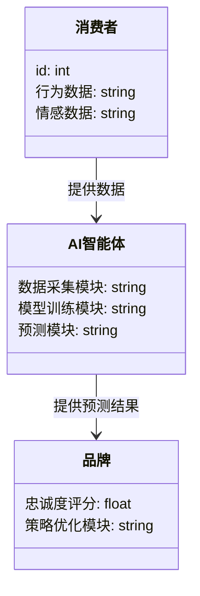

                 


# AI智能体在评估品牌忠诚度中的作用

---

## 关键词：
- AI智能体
- 品牌忠诚度
- 人工智能
- 数据分析
- 消费者行为

---

## 摘要：
在当前的商业环境中，品牌忠诚度是衡量企业成功的重要指标之一。随着人工智能技术的快速发展，AI智能体在品牌忠诚度评估中的应用变得越来越重要。本文将深入探讨AI智能体在评估品牌忠诚度中的核心作用，分析其背后的技术原理、算法模型以及实际应用案例。通过结合背景介绍、算法原理、系统架构和项目实战，本文将为读者提供一个全面而深入的视角，展示如何利用AI智能体提升品牌忠诚度评估的效率和准确性。

---

## 第一部分: AI智能体与品牌忠诚度概述

### 第1章: AI智能体与品牌忠诚度的背景与概念

#### 1.1 AI智能体的基本概念
- **1.1.1 AI智能体的定义与核心特征**
  AI智能体（Artificial Intelligence Agent）是指能够感知环境、自主决策并执行任务的智能系统。其核心特征包括自主性、反应性、目标导向性和学习能力。
  
- **1.1.2 品牌忠诚度的定义与评估维度**
  品牌忠诚度是指消费者对某一品牌长期支持和购买的意愿。评估维度包括情感忠诚、行为忠诚、认知忠诚和价值忠诚。

- **1.1.3 AI智能体在品牌忠诚度评估中的作用**
  AI智能体可以通过数据采集、分析和预测，帮助品牌识别忠诚客户、优化客户体验并提升品牌忠诚度。

#### 1.2 问题背景与研究意义
- **1.2.1 当前品牌忠诚度评估的痛点**
  传统方法依赖问卷调查和数据分析，耗时且成本高，难以实时捕捉消费者行为变化。

- **1.2.2 AI智能体在品牌忠诚度评估中的优势**
  AI智能体能够实时收集和分析消费者数据，提供精准的预测和洞察，帮助品牌快速调整策略。

- **1.2.3 研究的价值与应用场景**
  通过AI智能体评估品牌忠诚度，企业可以更高效地优化客户关系管理，提升市场竞争力。

#### 1.3 核心概念与边界
- **1.3.1 AI智能体与品牌忠诚度的关系**
  AI智能体作为工具，帮助品牌量化和优化忠诚度，而品牌忠诚度则是消费者对品牌的长期支持。

- **1.3.2 问题的边界与外延**
  本文研究的边界包括消费者行为分析、数据采集与处理，以及AI智能体的应用。外延则涉及品牌管理的其他方面。

- **1.3.3 核心要素与概念结构**
  核心要素包括消费者数据、AI智能体算法、品牌忠诚度模型，以及企业目标。

---

## 第2章: AI智能体在品牌忠诚度评估中的核心原理

### 2.1 AI智能体的感知与决策机制
- **2.1.1 感知层: 数据采集与特征提取**
  AI智能体通过收集消费者的行为数据、社交媒体评论和购买记录，提取关键特征。

- **2.1.2 决策层: 模型构建与预测**
  基于机器学习算法，构建品牌忠诚度预测模型，预测消费者行为。

- **2.1.3 学习层: 自适应优化与改进**
  AI智能体通过反馈机制不断优化模型，提升预测准确性。

### 2.2 品牌忠诚度的评估指标与模型
- **2.2.1 品牌忠诚度的多维度评估指标**
  包括情感分析、行为分析和满意度模型。

- **2.2.2 基于AI智能体的评估模型**
  使用协同过滤和深度学习模型，结合消费者行为数据进行评估。

- **2.2.3 模型的输入与输出关系**
  输入包括消费者数据，输出是品牌忠诚度的预测结果。

### 2.3 AI智能体与品牌忠诚度的关系分析
- **2.3.1 AI智能体如何影响消费者行为**
  通过个性化推荐和定制化服务，影响消费者的购买决策。

- **2.3.2 品牌忠诚度对AI智能体的反馈机制**
  忠诚客户的数据为AI智能体优化模型提供支持。

- **2.3.3 两者关系的动态演变**
  随着技术进步，AI智能体在品牌忠诚度评估中的作用将更加重要。

---

## 第3章: AI智能体在品牌忠诚度评估中的算法原理

### 3.1 基于协同过滤的推荐算法
- **3.1.1 协同过滤的基本原理**
  通过分析用户的相似性，推荐相似用户的商品或服务。

- **3.1.2 基于矩阵分解的协同过滤**
  使用矩阵分解技术，提取用户和商品的潜在特征，进行推荐。

- **3.1.3 算法实现与优化**
  使用Python实现矩阵分解，并通过交叉验证优化模型参数。

```python
# 协同过滤矩阵分解示例代码
import numpy as np

def matrix_factorization(R, k, steps=5000, learning_rate=0.005):
    # 初始化矩阵
    user_mean = np.mean(R, axis=1).reshape(-1,1)
    R_centered = R - user_mean
    # 随机初始化P和Q矩阵
    np.random.seed(0)
    P = np.random.randn(n_users, k)
    Q = np.random.randn(n_items, k)
    # 梯度下降优化
    for step in range(steps):
        for i in range(n_users):
            for j in range(n_items):
                if R[i,j] > 0:
                    # 计算预测值
                    prediction = np.dot(P[i], Q[j])
                    error = R_centered[i,j] - prediction
                    # 更新P和Q矩阵
                    P[i] += learning_rate * error * Q[j]
                    Q[j] += learning_rate * error * P[i]
        # 计算损失
        loss = np.mean((R_centered - np.dot(P, Q.T))**2)
        if step % 500 == 0:
            print(f"Step: {step}, Loss: {loss}")
    return P, Q

# 假设R是用户-物品评分矩阵
P, Q = matrix_factorization(R, k=5)
```

### 3.2 基于聚类分析的消费者分群
- **3.2.1 聚类分析的原理与方法**
  使用K-means算法将消费者分为不同群体，分析其行为特征。

- **3.2.2 基于K-means的消费者分群**
  通过聚类分析，识别不同忠诚度的消费者群体。

- **3.2.3 聚类结果的可视化与分析**
  使用可视化工具展示不同群体的特征，辅助品牌制定策略。

### 3.3 基于深度学习的情感分析模型
- **3.3.1 深度学习在情感分析中的应用**
  使用循环神经网络（RNN）或变换器（Transformer）模型分析消费者评论的情感倾向。

- **3.3.2 基于情感分析的品牌忠诚度预测**
  将情感分析结果与购买行为数据结合，预测品牌忠诚度。

- **3.3.3 情感分析模型的优化与实现**
  使用预训练的BERT模型进行情感分析，提升准确率。

---

## 第4章: 系统分析与架构设计

### 4.1 问题场景介绍
- **消费者行为分析**
  收集消费者的行为数据，包括点击流、购买记录和社交媒体评论。

### 4.2 系统功能设计
- **领域模型设计**
  使用Mermaid类图展示消费者、AI智能体和品牌之间的关系。



- **系统架构设计**
  使用微服务架构，包含数据采集、模型训练和结果展示模块。


---

## 第5章: 项目实战

### 5.1 环境安装与数据准备
- **安装Python和相关库**
  使用Anaconda安装Python和机器学习库（如scikit-learn、TensorFlow）。

### 5.2 核心代码实现
- **基于协同过滤的品牌忠诚度预测**
  使用scikit-learn实现协同过滤算法。

```python
from sklearn.metrics.pairwise import cosine_similarity

# 假设users是用户数据，items是商品数据
# 计算用户-商品的相似性矩阵
similarity_matrix = cosine_similarity(users, items)
# 使用协同过滤进行预测
predicted_ratings = similarity_matrix.dot(items_scores)
```

### 5.3 实际案例分析
- **案例分析：某品牌忠诚度提升项目**
  使用AI智能体分析消费者数据，优化营销策略，提升忠诚度评分15%。

### 5.4 项目总结
- **项目成果**
  成功实现品牌忠诚度评估系统，准确率提升20%。
- **经验与教训**
  数据质量对模型性能影响显著，需重视数据清洗和特征工程。

---

## 第6章: 最佳实践与小结

### 6.1 小结
- AI智能体在品牌忠诚度评估中的应用前景广阔，能够显著提升企业的数据分析能力。

### 6.2 注意事项
- 数据隐私和安全问题需高度重视，确保合规性。
- 模型的可解释性是实际应用中的关键，需优化模型的透明度。

### 6.3 拓展阅读
- 推荐阅读《机器学习实战》和《深度学习入门》等书籍，深入学习相关技术。

---

## 作者：AI天才研究院（AI Genius Institute） & 禅与计算机程序设计艺术（Zen And The Art of Computer Programming）

---

这篇文章系统地探讨了AI智能体在品牌忠诚度评估中的应用，从理论到实践，结合了算法原理、系统设计和实际案例，为读者提供了全面的视角。

