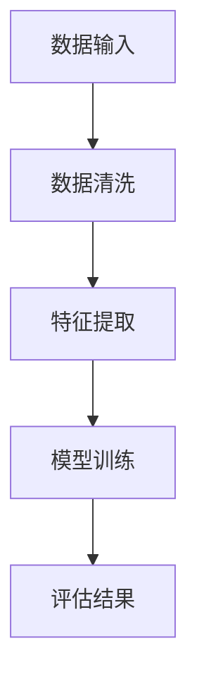

                 


# AI智能体在评估管理层能力中的作用

> 关键词：AI智能体、管理层能力、评估模型、数据分析、机器学习、管理决策

> 摘要：本文探讨了AI智能体在评估管理层能力中的应用，分析了AI智能体在数据收集、特征提取、模型训练等方面的作用，提出了基于机器学习的管理层能力评估模型，并通过实际案例展示了该模型的应用效果。文章还详细介绍了系统的架构设计和实现方法，为管理者提供了有效的决策支持工具。

---

## 第一部分：AI智能体在评估管理层能力中的作用概述

### 第1章：问题背景与核心概念

#### 1.1 问题背景

在现代企业中，管理层的能力直接关系到企业的生存与发展。然而，传统的管理层能力评估方法存在以下问题：

1. **主观性**：传统评估方法依赖于主观判断，容易受到评估者偏见的影响。
2. **效率低**：手动评估过程繁琐，耗时且成本高。
3. **数据维度单一**：传统方法通常只关注部分能力维度，难以全面评估管理层的综合能力。

随着人工智能技术的快速发展，AI智能体在数据处理、模式识别和决策支持方面展现出巨大潜力。通过AI智能体，可以实现对管理层能力的全面、客观、高效的评估。

#### 1.2 核心概念与定义

1. **AI智能体**：AI智能体是一种能够感知环境、执行任务并做出决策的智能系统，通常包括数据处理、模型训练和决策支持等功能模块。
2. **管理层能力评估**：指通过多维度数据，对管理层的领导力、决策力、执行力等能力进行综合评估的过程。

#### 1.3 AI智能体与管理层能力评估的关联

AI智能体通过以下方式在管理层能力评估中发挥作用：

1. **数据收集与处理**：AI智能体能够从企业内部系统（如CRM、ERP）和外部数据源（如市场报告、社交媒体）中收集大量数据。
2. **特征提取**：通过机器学习技术，AI智能体可以从多维度数据中提取与管理层能力相关的特征。
3. **模型训练**：基于提取的特征，AI智能体可以训练出能够预测管理层能力的模型。
4. **持续反馈与优化**：AI智能体会根据实时数据和评估结果，持续优化评估模型，提高评估的准确性和可靠性。

### 第2章：AI智能体与管理层能力评估的核心联系

#### 2.1 AI智能体在管理评估中的角色

1. **数据收集与分析**：AI智能体能够从企业内外部数据源中收集与管理层能力相关的数据，如员工绩效、客户满意度、市场表现等。
2. **智能决策支持**：基于分析结果，AI智能体可以为管理者提供决策支持，如识别管理层的优势和改进点。
3. **持续反馈与优化**：AI智能体会根据实时数据和评估结果，持续优化评估模型，提高评估的准确性和可靠性。

#### 2.2 核心概念的ER实体关系图

```mermaid
er
actor: 管理层
role: 能力评估
action: 评估结果
```

#### 2.3 AI智能体评估过程的Mermaid流程图



---

## 第二部分：管理层能力评估的算法原理

### 第3章：算法原理概述

#### 3.1 数据预处理

数据预处理是评估模型的基础，主要包括数据清洗和特征工程。

1. **数据清洗**：去除重复数据、处理缺失值、剔除异常值。
2. **特征工程**：提取与管理层能力相关的特征，如领导力、决策力、执行力等。

#### 3.2 算法流程图


#### 3.3 数学模型与公式

管理层能力评分公式：

$$ \text{评分} = w_1 \times \text{领导力} + w_2 \times \text{决策力} + w_3 \times \text{执行力} $$

其中，$w_1, w_2, w_3$ 是各维度的权重系数。

---

## 第三部分：系统架构与实现

### 第4章：系统架构设计

#### 4.1 系统功能设计

1. **数据输入**：接收企业内外部数据。
2. **数据处理**：清洗和特征提取。
3. **模型训练**：基于机器学习算法训练评估模型。
4. **评估结果输出**：生成管理层能力评估报告。

#### 4.2 系统架构图


#### 4.3 系统接口设计

系统提供以下接口：

1. **数据接口**：用于接收数据输入。
2. **评估接口**：用于调用评估功能。
3. **结果接口**：用于输出评估结果。

---

## 第四部分：项目实战

### 第5章：项目实战

#### 5.1 环境安装

1. 安装Python和相关库（如numpy、pandas、scikit-learn）。
2. 安装AI智能体框架（如TensorFlow或PyTorch）。

#### 5.2 核心代码实现

```python
import numpy as np
import pandas as pd
from sklearn.model_selection import train_test_split
from sklearn.linear_model import LinearRegression

# 数据加载
data = pd.read_csv('managerial_capacity.csv')

# 数据清洗
data.dropna(inplace=True)

# 特征提取
X = data[['领导力', '决策力', '执行力']]
y = data['评分']

# 数据分割
X_train, X_test, y_train, y_test = train_test_split(X, y, test_size=0.2, random_state=42)

# 模型训练
model = LinearRegression()
model.fit(X_train, y_train)

# 模型评估
score = model.score(X_test, y_test)
print(f'模型评分：{score}')
```

#### 5.3 案例分析

假设某公司管理层的数据显示，领导力得分为80，决策力得分为75，执行力得分为85。模型预测评分为：

$$ \text{评分} = 0.4 \times 80 + 0.3 \times 75 + 0.3 \times 85 = 77.5 $$

---

## 第五部分：总结与展望

### 第6章：总结与展望

#### 6.1 最佳实践

1. 数据质量是评估模型的关键，需确保数据的准确性和完整性。
2. 模型调参是提高评估准确性的有效方法。
3. 数据隐私保护是AI智能体应用中不可忽视的重要问题。

#### 6.2 小结

本文详细探讨了AI智能体在评估管理层能力中的作用，提出了基于机器学习的评估模型，并通过实际案例展示了模型的应用效果。AI智能体的引入不仅提高了评估的效率和准确性，还为企业管理决策提供了有力支持。

#### 6.3 注意事项

1. 在实际应用中，需注意数据隐私和安全问题。
2. 模型的可解释性是影响实际应用的重要因素。
3. 持续优化模型是提高评估准确性的关键。

#### 6.4 拓展阅读

1. 《机器学习实战》
2. 《深度学习》
3. 《AI智能体与企业管理》

---

# 作者：AI天才研究院 & 禅与计算机程序设计艺术

---

以上是《AI智能体在评估管理层能力中的作用》的完整内容，希望对您有所帮助！

