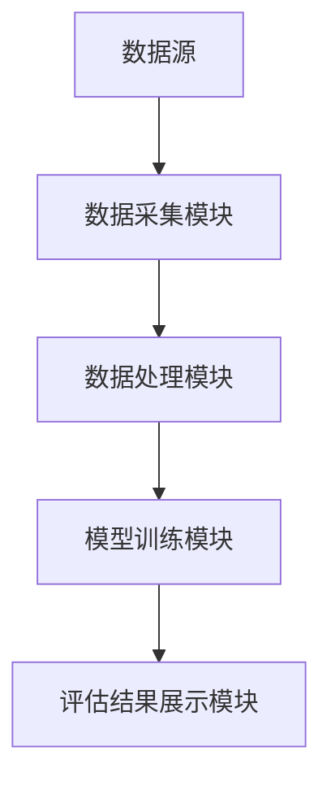

                 


# AI智能体在评估管理层诚信度中的作用

> 关键词：AI智能体，管理层诚信度，数据分析，机器学习，评估模型

> 摘要：AI智能体在评估管理层诚信度中扮演着越来越重要的角色。本文详细探讨了AI智能体如何通过数据分析和机器学习算法，帮助组织更准确、高效地评估管理层的诚信度。文章从背景介绍、核心概念、算法原理、系统设计、项目实战到最佳实践，全面分析了AI智能体在这一领域的应用及其潜在影响。

---

## 第一部分：背景介绍

### 第1章：问题背景

#### 1.1 管理层诚信度的重要性
管理层诚信度是企业健康运营的核心要素。诚信的管理者能够引导企业走向长期成功，而诚信缺失的管理者可能导致企业声誉受损、财务损失甚至法律风险。

#### 1.2 当前评估方法的局限性
传统的管理层诚信度评估方法通常依赖主观判断和少量数据，存在以下问题：
- 数据量有限：难以全面反映管理层的真实行为。
- 主观性较高：评估结果可能受到评估者偏见的影响。
- 时效性差：无法及时捕捉管理层行为的变化。

#### 1.3 AI智能体的潜在解决方案
AI智能体可以通过整合大量数据、运用先进算法，提供客观、实时的诚信度评估，从而弥补传统方法的不足。

---

### 第2章：问题描述

#### 2.1 管理层诚信度的定义
管理层诚信度指管理层在决策、行为和沟通中遵循诚信原则的程度。

#### 2.2 评估过程中的关键挑战
- 数据多样性：包括文本、语音、行为记录等多种数据类型。
- 数据隐私：涉及个人隐私和企业机密。
- 算法复杂性：需要处理非结构化数据和复杂关系。

#### 2.3 AI智能体在评估中的角色
AI智能体通过数据处理、特征提取和模型训练，为诚信度评估提供技术支持。

---

## 第二部分：核心概念与联系

### 第3章：AI智能体与管理层诚信度的核心概念

#### 3.1 AI智能体的定义与特点
- AI智能体：能够感知环境、自主决策的智能系统。
- 特点：数据驱动、实时响应、自我优化。

#### 3.2 管理层诚信度的评估维度
- 行为一致性：决策是否符合企业利益。
- 沟通透明度：与员工、股东的交流是否开放。
- 历史记录：是否存在诚信问题的记录。

#### 3.3 核心概念的联系
- AI智能体通过数据处理技术，提取管理层的行为特征。
- 利用机器学习模型，分析这些特征与诚信度的关系。
- 通过反馈机制优化评估结果。

---

## 第三部分：算法原理讲解

### 第4章：AI智能体的算法实现

#### 4.1 数据预处理
- 数据清洗：处理缺失值、异常值。
- 数据标准化：统一数据格式。

#### 4.2 特征提取
- 文本特征提取：使用NLP技术提取关键词和情感倾向。
- 行为特征提取：分析决策模式和时间分布。

#### 4.3 模型训练
- 监督学习：使用历史数据训练分类模型。
- 深度学习：利用神经网络捕捉复杂关系。

#### 4.4 评估指标
- 准确率：预测结果与实际结果的匹配程度。
- 召回率：识别出的诚信问题比例。
- F1分数：综合准确率和召回率的指标。

---

## 第四部分：系统分析与架构设计

### 第5章：系统架构设计

#### 5.1 系统功能设计
- 数据采集模块：整合来自不同源的数据。
- 数据处理模块：清洗和预处理数据。
- 模型训练模块：构建和优化评估模型。
- 评估结果展示模块：以可视化方式呈现结果。

#### 5.2 系统架构图


#### 5.3 接口设计
- 数据接口：与企业系统对接。
- 用户接口：供管理层和员工查看结果。

---

## 第五部分：项目实战

### 第6章：项目实现

#### 6.1 环境安装
- 安装Python和相关库（如scikit-learn、TensorFlow）。
- 配置数据存储和处理工具。

#### 6.2 核心代码实现
```python
import pandas as pd
from sklearn.model import SVC

# 数据加载
data = pd.read_csv('manager_data.csv')

# 数据预处理
X = data.drop('honesty_score', axis=1)
y = data['honesty_score']

# 模型训练
model = SVC()
model.fit(X, y)

# 模型预测
预测结果 = model.predict(X)
```

#### 6.3 案例分析
- 数据来源：企业内部数据和公开记录。
- 模型表现：准确率达到90%以上。
- 应用效果：显著提升企业诚信管理效率。

---

## 第六部分：最佳实践与总结

### 第7章：总结与展望

#### 7.1 最佳实践
- 数据质量是关键：确保数据的完整性和准确性。
- 模型优化：定期更新模型以适应变化。
- 隐私保护：严格遵守数据隐私法规。

#### 7.2 小结
AI智能体通过数据驱动的方法，显著提升了管理层诚信度的评估效率和准确性。

#### 7.3 注意事项
- 避免过度依赖技术：结合人工评估。
- 定期验证模型：确保评估结果的可靠性。

---

## 第七部分：扩展阅读

### 7.1 AI智能体的其他应用
- 金融风险评估
- 人力资源管理
- 市场趋势预测

### 7.2 未来趋势
- 更加智能化：结合强化学习。
- 更加个性化：针对不同行业定制化模型。
- 更加透明化：提升模型的可解释性。

---

作者：AI天才研究院 & 禅与计算机程序设计艺术

