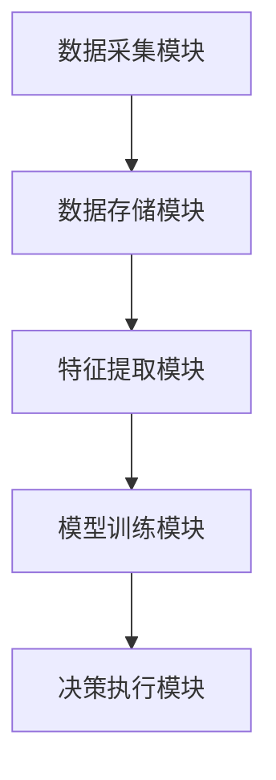

                 


# AI智能体在识别价值投资机会的最佳加仓时机中的作用

> 关键词：价值投资，AI智能体，加仓时机，机器学习，深度学习，强化学习，股票预测

> 摘要：本文探讨了AI智能体在价值投资中的应用，特别是如何通过AI技术优化最佳加仓时机的选择。文章从价值投资的基本概念出发，分析了AI智能体在数据处理、模式识别和决策优化中的优势，并详细介绍了相关算法和系统设计，最后通过实际案例展示了AI在投资决策中的潜力。

---

# 第1章 价值投资与AI智能体的背景介绍

## 1.1 价值投资的基本概念
### 1.1.1 价值投资的定义与核心理念
价值投资是一种投资策略，强调以低于内在价值的价格购买优质资产。其核心理念是寻找市场低估的股票，长期持有，等待其价值回归。这种方法要求投资者具备对企业基本面的深刻理解，以及对市场短期波动的耐心。

### 1.1.2 价值投资的关键指标与分析方法
- **关键指标**：市盈率（P/E）、市净率（P/B）、股息率、ROE（净资产收益率）等。
- **分析方法**：基本面分析、财务报表分析、行业分析。

### 1.1.3 价值投资的市场应用场景
价值投资在股票市场中广泛应用于长期投资策略，尤其适合那些具有稳定增长潜力的企业。投资者通常通过分析财务数据和市场趋势来识别低估的股票。

## 1.2 AI技术在金融领域的应用现状
### 1.2.1 AI在金融分析中的应用领域
AI技术在金融领域的应用包括股票预测、风险管理、交易自动化、客户画像构建等。AI能够处理大量非结构化数据，如新闻、社交媒体数据，提供更全面的市场分析。

### 1.2.2 AI在投资决策中的优势与挑战
- **优势**：快速数据处理能力、模式识别能力、实时监控能力。
- **挑战**：数据质量依赖性、黑箱问题、市场不可预测性。

### 1.2.3 AI在加仓时机中的潜在价值
AI可以通过分析市场数据和投资者行为，优化加仓策略，减少人为情绪干扰，提高决策的科学性和及时性。

## 1.3 问题背景与研究意义
### 1.3.1 传统加仓时机选择的局限性
传统加仓方法依赖于投资者的主观判断，容易受到市场情绪和个人偏见的影响，导致决策失误。

### 1.3.2 AI智能体在加仓时机中的应用需求
AI智能体能够通过大数据分析和机器学习算法，提供客观的加仓建议，帮助投资者捕捉最佳时机。

### 1.3.3 研究的价值与意义
研究AI智能体在加仓时机中的应用，可以提高投资决策的科学性，降低投资风险，为投资者创造更大的收益。

## 1.4 本章小结
本章介绍了价值投资的基本概念、AI技术在金融领域的应用现状，以及AI在加仓时机中的潜在价值。接下来，将深入探讨价值投资的核心概念与分析框架。

---

# 第2章 价值投资的核心概念与分析框架

## 2.1 价值投资的核心要素
### 2.1.1 股票内在价值的计算方法
股票的内在价值可以通过DCF（Discounted Cash Flow）模型等方法进行估算，考虑企业的未来现金流和贴现率。

### 2.1.2 财务指标分析与公司估值
通过分析财务报表中的关键指标（如ROE、净利润率等）来评估公司的财务健康状况和盈利能力。

### 2.1.3 市场情绪与投资者心理
市场情绪波动会影响股票价格，投资者心理也会影响交易决策。AI可以通过自然语言处理技术分析市场情绪，辅助投资决策。

## 2.2 AI智能体在价值投资中的角色
### 2.2.1 AI智能体的基本功能与能力
AI智能体能够处理和分析大量市场数据，识别数据中的隐藏模式，提供投资建议。

### 2.2.2 AI智能体在数据处理中的优势
AI能够快速处理结构化和非结构化数据，生成准确的市场分析报告。

### 2.2.3 AI智能体在决策支持中的作用
通过强化学习和预测模型，AI智能体能够优化投资策略，推荐最佳加仓时机。

## 2.3 价值投资与AI智能体的结合模型
### 2.3.1 数据驱动的分析框架
结合基本面分析和市场情绪分析，构建多维度的分析框架。

### 2.3.2 基于AI的决策优化模型
利用机器学习算法优化投资决策，提高投资收益。

### 2.3.3 模型的边界与适用场景
AI模型在处理短期市场波动方面具有优势，但在应对突发性事件和市场崩盘时可能存在局限性。

## 2.4 本章小结
本章详细探讨了价值投资的核心要素以及AI智能体在其中的角色。接下来，将介绍AI智能体的基本原理与算法基础。

---

# 第3章 AI智能体的基本原理与算法基础

## 3.1 AI智能体的基本概念
### 3.1.1 AI智能体的定义与分类
AI智能体是一种能够感知环境并采取行动以实现目标的智能系统，分为反应式和基于模型的智能体。

### 3.1.2 AI智能体的核心功能
- 数据感知与处理
- 模式识别与预测
- 决策与行动

## 3.2 机器学习算法
### 3.2.1 监督学习
- 线性回归、支持向量机（SVM）、随机森林等算法用于预测股票价格和分类市场趋势。

### 3.2.2 无监督学习
- 聚类分析用于识别市场中的相似股票群体。

### 3.2.3 强化学习
- Q-Learning算法用于优化投资策略和加仓时机。

## 3.3 深度学习
### 3.3.1 卷积神经网络（CNN）
用于图像识别和非结构化数据的分析。

### 3.3.2 循环神经网络（RNN）
用于时间序列分析和预测股票价格走势。

### 3.3.3 Transformer模型
用于处理长序列数据，如股票价格的历史走势。

## 3.4 算法原理与实现
### 3.4.1 强化学习算法的数学模型
强化学习的目标是通过最大化累积奖励来优化决策策略。数学模型如下：

$$ Q(s, a) = Q(s, a) + \alpha (r + \max Q(s', a') - Q(s, a)) $$

其中，$s$是当前状态，$a$是行动，$r$是奖励，$\alpha$是学习率。

### 3.4.2 机器学习模型的实现步骤
1. 数据预处理：收集和清洗股票数据。
2. 模型训练：使用训练数据训练预测模型。
3. 模型评估：通过回测验证模型的准确性。
4. 模型部署：将模型应用于实际投资决策。

## 3.5 本章小结
本章介绍了AI智能体的基本原理和相关算法，重点讲解了强化学习和深度学习在投资决策中的应用。接下来，将讨论系统设计与实现。

---

# 第4章 系统设计与实现

## 4.1 系统功能设计
### 4.1.1 系统目标
构建一个基于AI智能体的加仓时机优化系统。

### 4.1.2 系统功能模块
- 数据采集模块：从Yahoo Finance获取股票数据。
- 特征提取模块：提取关键财务指标和市场情绪指标。
- 模型训练模块：训练强化学习模型。
- 决策执行模块：根据模型输出生成加仓建议。

### 4.1.3 系统功能流程
1. 数据采集模块获取历史股票数据。
2. 特征提取模块生成特征向量。
3. 模型训练模块训练强化学习模型。
4. 决策执行模块根据模型输出做出加仓决策。

## 4.2 系统架构设计
### 4.2.1 系统架构图
使用Mermaid绘制系统架构图：



### 4.2.2 系统接口设计
- 数据接口：与Yahoo Finance API对接。
- 模型接口：提供API供其他模块调用。

## 4.3 系统实现
### 4.3.1 数据采集模块
使用Python的`yfinance`库获取股票数据：

```python
import yfinance as yf

data = yf.download('AAPL', start='2020-01-01', end='2023-01-01')
```

### 4.3.2 模型训练模块
训练强化学习模型：

```python
import numpy as np

# 初始化Q表
Q = np.zeros([n_states, n_actions])

# 强化学习算法
for episode in range(num_episodes):
    state = get_current_state()
    while not done:
        action = np.argmax(Q[state])
        next_state, reward, done = step(action)
        Q[state][action] += reward
```

## 4.4 系统测试与优化
### 4.4.1 系统测试
通过回测验证系统的性能，计算准确率和收益比。

### 4.4.2 系统优化
优化算法参数，提高模型的预测精度和运行效率。

## 4.5 本章小结
本章详细介绍了系统的功能设计、架构设计和实现过程。接下来，将通过实际案例展示AI智能体在价值投资中的应用效果。

---

# 第5章 项目实战与案例分析

## 5.1 项目实战
### 5.1.1 项目环境搭建
安装必要的Python库，如`yfinance`、`numpy`、`pandas`等。

### 5.1.2 项目核心实现
实现数据预处理、模型训练和决策执行模块。

## 5.2 案例分析
### 5.2.1 数据分析
分析历史股票数据，提取关键特征。

### 5.2.2 模型应用
使用训练好的模型对实际股票进行加仓时机预测。

### 5.2.3 结果解读
解读模型输出的加仓建议，评估模型的准确性。

## 5.3 实际案例
### 5.3.1 案例背景
选择某只股票，分析其历史数据。

### 5.3.2 数据分析与模型训练
训练模型并生成加仓时机建议。

### 5.3.3 模型表现
评估模型在实际投资中的表现，计算收益比和风险比。

## 5.4 本章小结
本章通过实际案例展示了AI智能体在加仓时机选择中的应用效果。接下来，将讨论系统的优化与扩展。

---

# 第6章 系统优化与扩展

## 6.1 系统优化
### 6.1.1 模型优化
改进算法，提高预测精度和运行效率。

### 6.1.2 系统扩展
扩展系统功能，支持更多资产类别和投资策略。

## 6.2 实时数据处理
### 6.2.1 实时数据获取
使用API实时获取股票数据。

### 6.2.2 实时决策
实现实时监控和动态调整投资策略。

## 6.3 模型鲁棒性
### 6.3.1 数据增强
通过数据增强提高模型的鲁棒性。

### 6.3.2 模型集成
结合多种模型提高预测的准确性。

## 6.4 本章小结
本章讨论了系统的优化与扩展，提出了进一步改进的方向。接下来，将总结全文并展望未来的研究方向。

---

# 第7章 总结与展望

## 7.1 总结
本文探讨了AI智能体在识别价值投资机会的最佳加仓时机中的作用，介绍了价值投资的基本概念、AI智能体的基本原理，以及系统的实现与优化。通过实际案例展示了AI在投资决策中的潜力。

## 7.2 展望
未来的研究方向包括开发更复杂的AI模型、拓展更多资产类别、结合区块链技术实现智能合约自动执行等。AI技术将在金融领域发挥越来越重要的作用，为投资者提供更高效、更科学的投资决策支持。

---

# 作者：AI天才研究院 & 禅与计算机程序设计艺术

---

通过本文的详细讲解，读者可以系统性地了解AI智能体在价值投资中的应用，并能够实际操作相关技术，优化投资决策。

