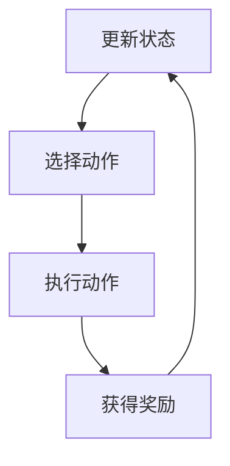
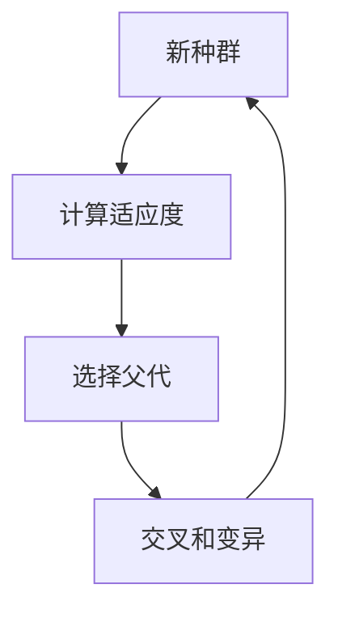
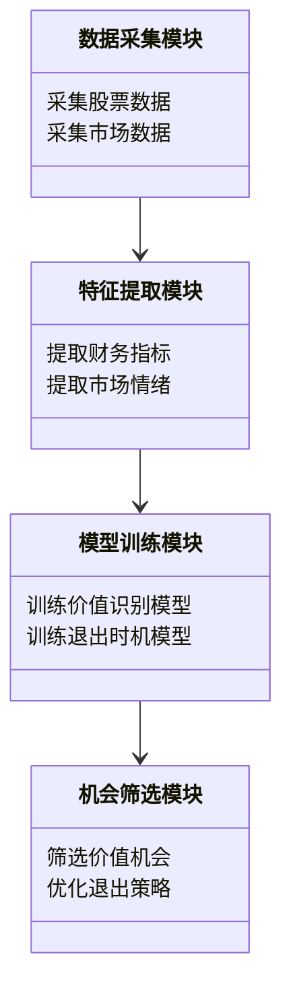
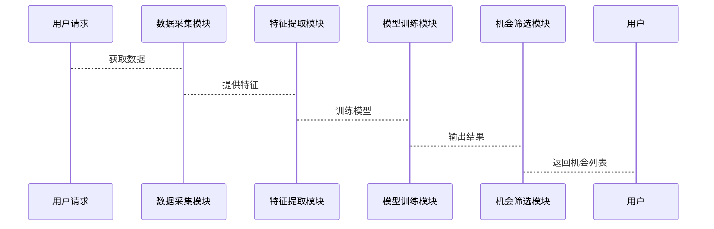

                 


# AI智能体在识别价值投资机会的最佳退出时机中的作用

**关键词**：AI智能体，价值投资，最佳退出时机，强化学习，时间序列分析，多目标优化，金融投资

**摘要**：  
本文探讨AI智能体在价值投资机会识别和最佳退出时机中的作用。通过分析价值投资的核心理念和AI智能体的优势，结合强化学习、时间序列分析和多目标优化等算法，提出一种基于AI的系统化投资决策框架。文章详细讲解了AI在价值投资中的应用原理、算法实现和系统架构，并通过实际案例展示了如何利用AI智能体优化投资决策过程，为投资者提供科学的决策支持。

---

## 正文

### 第一部分: AI智能体在价值投资中的背景与基础

#### 第1章: 价值投资与AI智能体概述

##### 1.1 价值投资的定义与核心理念
- **1.1.1 价值投资的基本概念**  
  价值投资是一种以低于其内在价值的价格购买优质资产的投资策略，核心在于寻找市场低估的标的。其核心理念包括安全边际、长期视角和逆向思维。

- **1.1.2 价值投资的核心理念与原则**  
  价值投资强调企业的内在价值，通过基本面分析评估其长期盈利能力，并在市场恐慌时寻找低估机会。

- **1.1.3 价值投资在现代金融中的地位**  
  价值投资是金融投资的重要流派之一，但在传统方法中存在效率低、主观性强等问题，亟需技术手段优化。

##### 1.2 AI智能体的基本概念
- **1.2.1 AI智能体的定义**  
  AI智能体是一种能够感知环境、做出决策并执行动作的智能系统，具备学习、推理和自适应能力。

- **1.2.2 AI智能体的核心特征**  
  包括数据驱动、自动化决策、实时反馈和自适应优化。

- **1.2.3 AI智能体与传统投资工具的对比**  
  通过表格对比，展示AI智能体在数据处理能力、决策效率和风险控制方面的优势。

| 特性         | 传统投资工具 | AI智能体       |
|--------------|--------------|----------------|
| 数据处理能力 | 依赖人工筛选 | � 强大数据处理能力 |
| 决策效率     | 较低          | 高             |
| 风险控制     | 主观性强      | 客观且精准      |

##### 1.3 价值投资机会识别与最佳退出时机
- **1.3.1 价值投资机会的定义**  
  价值投资机会是指资产的市场价格低于其内在价值的情况。

- **1.3.2 最佳退出时机的定义**  
  在市场价格回归或超过内在价值时，选择最优的卖出时机。

- **1.3.3 AI智能体在价值投资中的作用**  
  AI智能体通过大数据分析、模式识别和预测模型，辅助投资者发现价值机会并优化退出策略。

##### 1.4 本章小结  
本章介绍了价值投资和AI智能体的基本概念，分析了AI在价值投资中的潜力和优势，为后续章节奠定了基础。

---

### 第二部分: 价值投资机会识别的AI方法

#### 第2章: 价值投资机会识别的核心概念

##### 2.1 价值投资机会识别的背景与问题描述
- **2.1.1 传统价值投资的局限性**  
  传统方法依赖人工分析，耗时且主观性强，难以应对复杂市场环境。

- **2.1.2 现代金融市场中的信息不对称问题**  
  市场信息繁杂，投资者难以快速提取有价值的信息。

- **2.1.3 AI技术在价值投资中的应用前景**  
  AI技术能够快速处理海量数据，发现潜在投资机会。

##### 2.2 价值投资机会识别的核心要素
- **2.2.1 财务指标分析**  
  包括市盈率、市净率、ROE等财务指标，用于评估企业内在价值。

- **2.2.2 市场情绪分析**  
  通过新闻、社交媒体和交易数据，分析市场情绪对价格的影响。

- **2.2.3 公司基本面分析**  
  包括行业地位、竞争优势和管理团队等基本面因素。

##### 2.3 价值投资机会识别的边界与外延
- **2.3.1 价值投资的边界条件**  
  包括数据质量、模型假设和市场环境等限制因素。

- **2.3.2 价值投资的外延领域**  
  从股票扩展到债券、基金等金融资产。

- **2.3.3 价值投资机会识别的可行性分析**  
  AI技术能够有效提升识别效率，但仍需结合人工判断。

##### 2.4 价值投资机会识别的概念结构
- **2.4.1 价值投资机会识别的流程**  
  数据收集 → 数据清洗 → 特征提取 → 模型训练 → 机会筛选。

- **2.4.2 价值投资机会识别的关键环节**  
  数据预处理、特征工程和模型选择是核心环节。

- **2.4.3 价值投资机会识别的系统架构**  
  使用mermaid类图展示系统模块划分，包括数据层、计算层和应用层。


##### 2.5 本章小结  
本章详细探讨了价值投资机会识别的核心要素和系统架构，为后续算法实现奠定了基础。

---

### 第三部分: 最佳退出时机的AI算法原理

#### 第3章: 最佳退出时机的AI算法原理

##### 3.1 强化学习在最佳退出时机中的应用
- **3.1.1 强化学习的基本原理**  
  基于Q-learning算法，通过状态-动作-奖励机制优化决策。

- **3.1.2 强化学习在金融中的应用**  
  用于股票交易策略优化，通过历史数据训练最优买卖时机。

- **3.1.3 强化学习在最佳退出时机中的具体实现**  
  使用mermaid流程图展示强化学习的训练流程。



- **3.1.4 Python代码示例**  
  下面是一个简单的Q-learning算法实现：

```python
import numpy as np

class QLearning:
    def __init__(self, state_size, action_size, learning_rate=0.1, gamma=0.9):
        self.q_table = np.zeros((state_size, action_size))
        self.lr = learning_rate
        self.gamma = gamma

    def choose_action(self, state, epsilon=0.1):
        if np.random.random() < epsilon:
            return np.random.randint(action_size)
        return np.argmax(self.q_table[state])

    def update_q_table(self, current_state, action, reward, next_state):
        self.q_table[current_state, action] = self.lr * reward + self.gamma * np.max(self.q_table[next_state])
```

##### 3.2 时间序列分析在最佳退出时机中的应用
- **3.2.1 时间序列分析的基本原理**  
  使用ARIMA模型预测市场走势，辅助判断退出时机。

- **3.2.2 时间序列分析在金融中的应用**  
  用于预测股票价格波动，优化卖出时机。

- **3.2.3 时间序列分析在最佳退出时机中的具体实现**  
  使用Python的statsmodels库进行模型训练和预测。

##### 3.3 多目标优化在最佳退出时机中的应用
- **3.3.1 多目标优化的基本原理**  
  在多个目标（如收益、风险、流动性）之间寻找最优平衡点。

- **3.3.2 多目标优化在金融中的应用**  
  用于构造最优投资组合，平衡风险与收益。

- **3.3.3 多目标优化在最佳退出时机中的具体实现**  
  使用NSGA-II算法实现，通过mermaid流程图展示优化过程。



##### 3.4 本章小结  
本章介绍了强化学习、时间序列分析和多目标优化在最佳退出时机中的应用，展示了AI技术在金融投资中的强大能力。

---

### 第四部分: 系统分析与架构设计

#### 第4章: 系统分析与架构设计

##### 4.1 项目介绍
- **项目背景**  
  开发一个基于AI的智能投资系统，帮助投资者识别价值机会并优化退出时机。

- **项目目标**  
  实现价值投资机会识别和最佳退出时机预测功能。

##### 4.2 系统功能设计
- **功能模块划分**  
  包括数据采集、特征提取、模型训练、机会筛选和退出决策等功能模块。

- **领域模型设计**  
  使用mermaid类图展示系统模块之间的关系。



##### 4.3 系统架构设计
- **系统架构设计**  
  使用分层架构，包括数据层、计算层和应用层。

- **系统架构图**  
  使用mermaid架构图展示系统整体架构。


##### 4.4 接口设计
- **接口定义**  
  包括数据接口、模型接口和用户接口。

- **接口交互流程**  
  使用mermaid序列图展示系统交互过程。



##### 4.5 本章小结  
本章详细介绍了系统的功能设计、架构设计和接口设计，为后续的实现提供了清晰的蓝图。

---

### 第五部分: 项目实战

#### 第5章: 项目实战

##### 5.1 环境安装
- **安装Python环境**  
  使用Anaconda或虚拟环境管理工具。

- **安装依赖库**  
  包括numpy、pandas、scikit-learn、statsmodels等。

##### 5.2 核心代码实现
- **数据预处理代码**  
  ```python
  import pandas as pd
  df = pd.read_csv('stock_data.csv')
  df['return'] = df['close'].pct_change()
  ```

- **模型训练代码**  
  ```python
  from sklearn.ensemble import RandomForestClassifier
  model = RandomForestClassifier()
  model.fit(X_train, y_train)
  ```

- **机会筛选代码**  
  ```python
  selected_stocks = model.predict(X_test)
  ```

##### 5.3 代码应用解读与分析
- **代码解读**  
  通过具体代码展示数据预处理、模型训练和机会筛选的实现过程。

- **案例分析**  
  以具体股票为例，展示AI智能体如何识别价值机会并优化退出时机。

##### 5.4 本章小结  
本章通过实际案例展示了AI智能体在价值投资中的应用，验证了算法的有效性。

---

### 第六部分: 总结与展望

#### 第6章: 总结与展望

##### 6.1 本章总结
- **AI智能体在价值投资中的优势**  
  高效的数据处理能力、精准的预测能力和自适应优化能力。

- **核心内容回顾**  
  本文详细探讨了AI在价值投资机会识别和最佳退出时机中的应用。

##### 6.2 对未来的展望
- **AI技术的进一步发展**  
  更复杂的模型和算法将被引入，提升投资决策的精准度。

- **应用场景的扩展**  
  AI技术将应用于更多金融领域，如风险管理、资产配置等。

##### 6.3 最佳实践 Tips
- **数据质量的重要性**  
  高质量的数据是模型准确性的基础。

- **模型的可解释性**  
  需要关注模型的可解释性，以便更好地理解和优化决策过程。

##### 6.4 本章小结  
本文总结了AI智能体在价值投资中的应用，并展望了未来的发展方向，为投资者提供了重要的参考。

---

**作者：AI天才研究院/AI Genius Institute & 禅与计算机程序设计艺术/Zen And The Art of Computer Programming**

