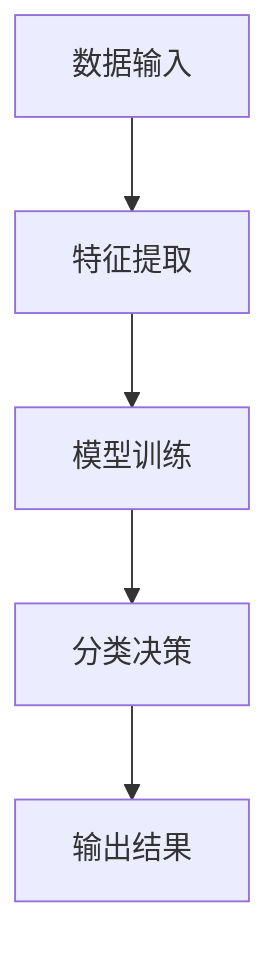
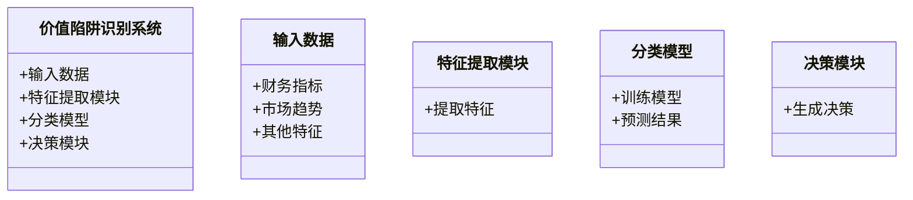
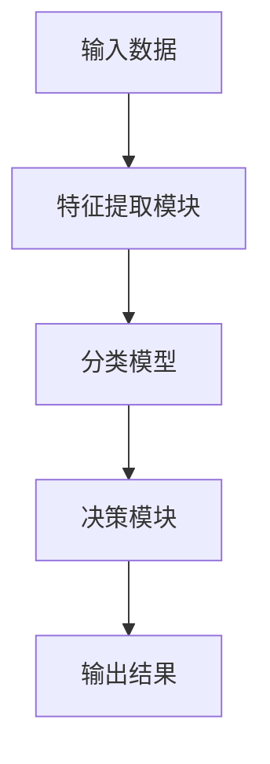
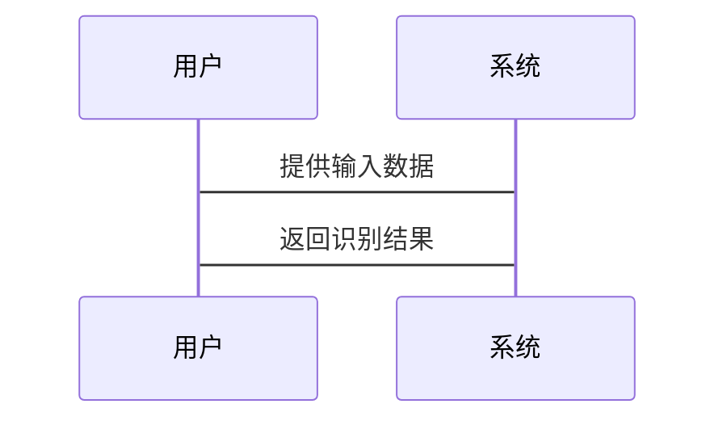

                 


# AI智能体在识别价值陷阱中的应用

> 关键词：AI智能体，价值陷阱，深度学习，分类算法，系统架构

> 摘要：本文探讨了AI智能体在识别价值陷阱中的应用，从问题背景、核心概念、算法原理到系统架构和项目实战，详细分析了如何利用AI技术来识别和避免价值陷阱，帮助做出更明智的决策。

---

# 第一部分: AI智能体在识别价值陷阱中的应用概述

# 第1章: 问题背景与核心概念

## 1.1 问题背景

### 1.1.1 价值陷阱的定义与特征
价值陷阱是指那些表面上看似有吸引力，但实际上存在隐藏风险或问题的投资机会或商业决策。识别这些陷阱对于投资者和企业至关重要，因为它们可能导致重大损失。

### 1.1.2 传统识别方法的局限性
传统方法依赖于人工分析，效率低下且容易受主观因素影响，难以处理海量数据和复杂场景。

### 1.1.3 AI智能体的引入动机
AI智能体通过自动化学习和分析，能够快速识别复杂模式，提高识别效率和准确性。

## 1.2 核心概念与联系

### 1.2.1 AI智能体的定义与属性
AI智能体是一种能够感知环境、执行任务并做出决策的智能系统，具备学习、推理和自适应能力。

### 1.2.2 价值陷阱识别的流程与模型
- 数据收集与预处理
- 特征提取与选择
- 模型训练与优化
- 决策与反馈

### 1.2.3 实体关系图（ER图）
```mermaid
erd
    table 价值陷阱识别系统 {
        id 自然人
        id 机构
        id 投资标的
    }
```

---

# 第2章: AI智能体的核心算法原理

## 2.1 算法原理

### 2.1.1 识别价值陷阱的分类模型
分类模型用于将数据分为价值陷阱和非陷阱两类。

### 2.1.2 基于深度学习的特征提取
深度学习通过多层神经网络提取高维特征，捕捉数据中的复杂模式。

### 2.1.3 算法流程图（mermaid）


## 2.2 数学模型与公式

### 2.2.1 分类模型的损失函数
$$L = -\sum_{i=1}^{n} y_i \log(p_i) + (1 - y_i)\log(1 - p_i)$$

### 2.2.2 深度学习模型的优化目标
$$\min_{\theta} \mathbb{E}_{(x,y)}[\mathcal{L}(x,y;\theta)]$$

### 2.2.3 示例说明
使用随机森林或神经网络模型进行分类，训练数据包括财务指标、市场趋势等特征。

---

# 第3章: 系统分析与架构设计

## 3.1 系统功能设计

### 3.1.1 领域模型（mermaid类图）


### 3.1.2 系统架构图（mermaid架构图）


### 3.1.3 接口设计与交互流程（mermaid序列图）


---

# 第4章: 项目实战

## 4.1 项目实战

### 4.1.1 环境安装与配置
安装Python、TensorFlow、Scikit-learn等库。

### 4.1.2 核心代码实现

```python
import numpy as np
from sklearn.ensemble import RandomForestClassifier
from sklearn.metrics import accuracy_score

# 示例数据
X = np.array([[1, 2], [3, 4], [5, 6], [7, 8]])
y = np.array([0, 1, 0, 1])

# 训练模型
model = RandomForestClassifier()
model.fit(X, y)

# 预测
new_data = np.array([[2, 3]])
prediction = model.predict(new_data)
print("预测结果:", prediction)
print("准确率:", accuracy_score(y_true=y, y_pred=model.predict(X)))
```

### 4.1.3 案例分析与解读
以具体投资案例为例，展示AI智能体如何识别价值陷阱，并提供决策建议。

---

# 第5章: 最佳实践与小结

## 5.1 最佳实践
- 数据质量至关重要，确保数据准确性和完整性。
- 模型选择要根据具体场景调整，避免过度拟合。
- 定期更新模型，适应市场变化。

## 5.2 小结
本文详细探讨了AI智能体在识别价值陷阱中的应用，从算法原理到系统设计，再到项目实战，展示了如何利用AI技术提高识别效率和准确性。

## 5.3 注意事项
- 确保模型的可解释性，避免黑箱操作。
- 保护数据隐私，遵守相关法律法规。

## 5.4 拓展阅读
建议阅读《深度学习实战》和《人工智能系统设计》等书籍，深入理解AI技术的应用。

---

# 作者：AI天才研究院 & 禅与计算机程序设计艺术

本文由AI天才研究院和禅与计算机程序设计艺术团队撰写，感谢您的阅读！

