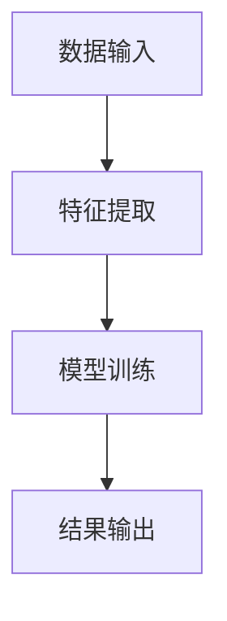
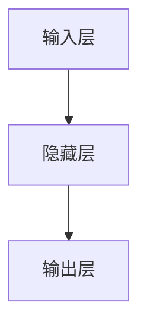
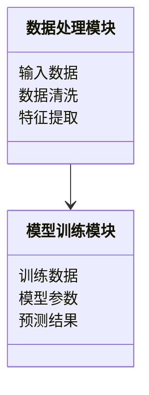
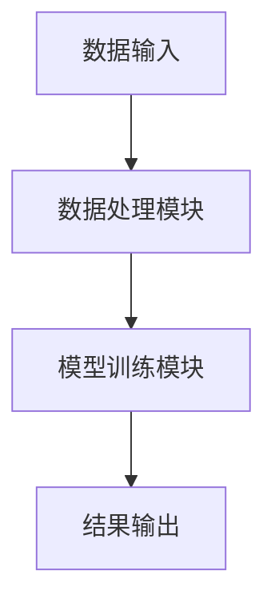

                 


# AI智能体在识别优质成长股中的应用

> 关键词：AI智能体，优质成长股，股票分析，机器学习，深度学习

> 摘要：本文探讨了AI智能体在识别优质成长股中的应用，通过分析AI智能体的核心原理、算法实现、系统架构设计以及项目实战，展示了如何利用AI技术提升股票筛选效率和准确性。文章内容涵盖从数据预处理到模型训练的完整流程，结合实际案例和代码实现，为读者提供了深入的技术见解和实践指导。

---

# 第1章: AI智能体与优质成长股的背景介绍

## 1.1 AI智能体的基本概念

### 1.1.1 什么是AI智能体
AI智能体（Artificial Intelligence Agent）是指能够感知环境、做出决策并执行行动的智能系统。它通过输入数据，利用算法进行分析和学习，最终输出预测结果或执行指令。

### 1.1.2 AI智能体的核心要素
AI智能体主要由以下几个核心要素组成：
1. **感知模块**：负责接收和处理外部输入的数据。
2. **决策模块**：基于感知数据进行分析和判断，生成决策。
3. **执行模块**：根据决策结果执行相应的操作。

### 1.1.3 AI智能体与传统算法的区别
AI智能体与传统算法相比，具有更强的自主性和适应性。传统算法通常是基于规则的静态模型，而AI智能体能够通过学习和优化不断提升性能。

## 1.2 优质成长股的定义与特征

### 1.2.1 优质成长股的定义
优质成长股是指那些具有持续增长潜力，能够在较长时期内实现业绩稳步提升的股票。这类股票通常来自行业前景良好、公司基本面强劲、管理团队优秀的企业。

### 1.2.2 优质成长股的特征分析
优质成长股通常具备以下特征：
1. **高成长性**：收入和利润持续增长。
2. **低估值**：相对于内在价值，市场价格较低。
3. **良好基本面**：财务状况健康，资产负债率合理。
4. **行业地位**：市场占有率高，行业领先。

### 1.2.3 优质成长股的筛选标准
筛选优质成长股时，通常参考以下指标：
1. **市盈率（P/E）**：衡量股票价格与盈利的关系。
2. **市净率（P/B）**：衡量股票价格与资产净值的关系。
3. **ROE（净资产收益率）**：衡量公司盈利能力。

## 1.3 AI智能体在股票分析中的应用背景

### 1.3.1 传统股票分析方法的局限性
传统股票分析方法依赖于经验和主观判断，存在以下问题：
1. **主观性**：分析结果受分析师个人判断影响。
2. **效率低**：手动分析耗时且效率低下。
3. **不一致性**：不同分析师可能得出不同结论。

### 1.3.2 AI技术在金融领域的优势
AI技术能够通过大数据分析和机器学习，快速识别数据中的模式和趋势，具有以下优势：
1. **高效性**：自动化处理大量数据。
2. **准确性**：基于数据驱动的分析更客观。
3. **适应性**：能够根据市场变化自动调整模型。

### 1.3.3 AI智能体在成长股识别中的潜力
AI智能体能够通过分析大量历史数据，发现传统方法难以察觉的成长股特征，帮助投资者发现潜在的投资机会。

---

## 1.4 本章小结

本章介绍了AI智能体的基本概念和优质成长股的定义与特征，分析了传统股票分析方法的局限性和AI技术在金融领域的优势，为后续章节的深入分析奠定了基础。

---

# 第2章: AI智能体的核心概念与原理

## 2.1 AI智能体的核心概念

### 2.1.1 感知模块
感知模块负责接收和处理外部数据，通常包括数据清洗、特征提取和数据增强等步骤。

### 2.1.2 决策模块
决策模块基于感知数据进行分析和判断，生成决策。常用的算法包括机器学习和深度学习模型。

### 2.1.3 执行模块
执行模块根据决策结果执行相应的操作，例如发出买入或卖出指令。

## 2.2 AI智能体的原理分析

### 2.2.1 数据输入与特征提取
数据输入是AI智能体的第一步，特征提取是关键。例如，从股票历史数据中提取价格、成交量等特征。

### 2.2.2 模型训练与优化
通过训练模型，AI智能体能够学习股票价格的变化规律，并不断优化模型参数。

### 2.2.3 结果输出与反馈机制
AI智能体输出预测结果后，通过反馈机制调整模型参数，提升预测准确性。

## 2.3 AI智能体的数学模型与公式

### 2.3.1 数据预处理公式
$$ x' = \frac{x - \mu}{\sigma} $$
其中，$\mu$ 是均值，$\sigma$ 是标准差。

### 2.3.2 模型训练公式
$$ L = \sum_{i=1}^{n} (y_i - \hat{y}_i)^2 $$
其中，$L$ 是损失函数，$y_i$ 是真实值，$\hat{y}_i$ 是预测值。

### 2.3.3 预测结果公式
$$ \hat{y} = f(x) $$
其中，$f(x)$ 是模型函数。

## 2.4 本章小结

本章详细介绍了AI智能体的核心概念和工作原理，包括感知、决策和执行模块的分析，以及数学模型的建立。

---

# 第3章: 数据获取与预处理

## 3.1 数据来源与获取方法

### 3.1.1 金融数据的获取渠道
常用的金融数据来源包括：
1. **API接口**：如Yahoo Finance API、Alpha Vantage。
2. **数据库**：如Yahoo Finance数据库、本地CSV文件。
3. **网络爬虫**：从金融网站获取实时数据。

### 3.1.2 数据清洗与整理
数据清洗是确保数据质量的重要步骤，包括处理缺失值、异常值和重复数据。

### 3.1.3 数据特征工程
特征工程是通过提取和转换数据，生成更有意义的特征。例如，从价格数据中提取移动平均线、相对强弱指数等。

## 3.2 数据预处理的流程与方法

### 3.2.1 数据标准化
$$ x' = \frac{x - \mu}{\sigma} $$
其中，$\mu$ 是均值，$\sigma$ 是标准差。

### 3.2.2 数据归一化
$$ x' = \frac{x - \min(x)}{\max(x) - \min(x)} $$

### 3.2.3 数据增强
数据增强是通过增加数据的多样性和复杂性，提升模型的泛化能力。例如，随机裁剪、旋转等。

## 3.3 数据预处理的代码实现

### 3.3.1 数据清洗代码
```python
import pandas as pd

# 加载数据
df = pd.read_csv('stock_data.csv')

# 处理缺失值
df.dropna(inplace=True)

# 处理重复值
df.drop_duplicates(inplace=True)
```

### 3.3.2 特征提取代码
```python
# 提取收盘价
close_prices = df['Close'].values

# 计算移动平均线
window = 10
ma = pd.Series(close_prices).rolling(window).mean().values
```

### 3.3.3 数据增强代码
```python
from sklearn.preprocessing import StandardScaler

# 标准化数据
scaler = StandardScaler()
normalized_data = scaler.fit_transform(close_prices.reshape(-1, 1))
```

## 3.4 本章小结

本章详细介绍了数据获取与预处理的流程，包括数据来源、清洗、特征提取和数据增强的方法，并提供了具体的代码实现。

---

# 第4章: AI智能体的算法实现

## 4.1 算法选择与优化

### 4.1.1 传统机器学习算法
常用的机器学习算法包括线性回归、支持向量机（SVM）和随机森林等。

### 4.1.2 深度学习算法
常用的深度学习算法包括神经网络、卷积神经网络（CNN）和长短期记忆网络（LSTM）。

### 4.1.3 算法优化方法
算法优化包括超参数调整、模型集成和早停（Early Stopping）等方法。

## 4.2 算法实现的流程图



## 4.3 算法实现的数学模型

### 4.3.1 线性回归模型
$$ y = \beta_0 + \beta_1x + \epsilon $$

### 4.3.2 神经网络模型


### 4.3.3 损失函数
$$ L = \sum_{i=1}^{n} (y_i - \hat{y}_i)^2 $$

## 4.4 本章小结

本章介绍了AI智能体的算法实现，包括算法选择、流程图和数学模型的建立。

---

# 第5章: 系统架构设计

## 5.1 项目介绍
本项目旨在构建一个AI智能体，用于识别优质成长股。系统包括数据处理模块、特征提取模块、模型训练模块和结果输出模块。

## 5.2 系统功能设计

### 5.2.1 领域模型


### 5.2.2 系统架构


## 5.3 本章小结

本章详细介绍了系统的架构设计，包括功能模块和系统流程图。

---

# 第6章: 项目实战

## 6.1 环境安装
需要安装以下环境：
1. Python 3.6+
2. Pandas、NumPy、Scikit-learn、Keras等库。

## 6.2 系统核心实现源代码

### 6.2.1 数据处理代码
```python
import pandas as pd
import numpy as np

# 加载数据
df = pd.read_csv('stock_data.csv')

# 数据清洗
df.dropna(inplace=True)

# 特征提取
X = df[['Open', 'High', 'Low', 'Volume']]
y = df['Close']
```

### 6.2.2 模型训练代码
```python
from sklearn.model_selection import train_test_split
from sklearn.linear_model import LinearRegression

# 划分训练集和测试集
X_train, X_test, y_train, y_test = train_test_split(X, y, test_size=0.2, random_state=42)

# 训练模型
model = LinearRegression()
model.fit(X_train, y_train)

# 预测结果
y_pred = model.predict(X_test)
```

### 6.2.3 结果输出代码
```python
from sklearn.metrics import mean_squared_error

# 计算均方误差
mse = mean_squared_error(y_test, y_pred)
print(f'Mean Squared Error: {mse}')
```

## 6.3 项目小结

本章通过实际案例展示了AI智能体的实现过程，包括环境安装、数据处理和模型训练的代码实现。

---

# 第7章: 总结与展望

## 7.1 总结
本文详细探讨了AI智能体在识别优质成长股中的应用，包括数据预处理、算法实现和系统架构设计。通过实际案例，展示了如何利用AI技术提升股票筛选效率和准确性。

## 7.2 投资策略建议
基于AI智能体的分析结果，投资者可以制定更科学的投资策略，例如：
1. **长期投资**：选择具有高成长性的股票。
2. **分散投资**：降低投资风险。
3. **定期调整**：根据市场变化及时调整投资组合。

## 7.3 未来展望
随着AI技术的不断发展，AI智能体在股票分析中的应用将更加广泛和深入。未来的研究方向包括：
1. **多模态数据融合**：结合文本、图像等多种数据源进行分析。
2. **强化学习应用**：提升智能体的决策能力。
3. **实时交易系统**：开发实时交易的AI智能体。

---

# 作者：AI天才研究院 & 禅与计算机程序设计艺术

--- 

本文详细介绍了AI智能体在识别优质成长股中的应用，涵盖了从数据预处理到模型训练的完整流程，结合实际案例和代码实现，为读者提供了深入的技术见解和实践指导。

