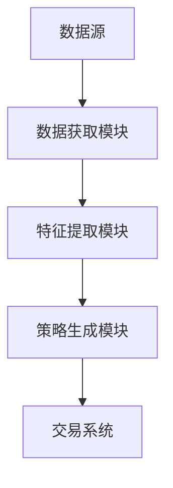

                 


# AI智能体在识别周期性行业投资机会中的应用

> 关键词：AI智能体，周期性行业，投资机会，强化学习，监督学习，系统架构，项目实战

> 摘要：本文探讨AI智能体在识别周期性行业投资机会中的应用。通过分析周期性行业的特点，结合强化学习和监督学习算法，构建AI智能体，提取行业特征，设计投资策略，并通过系统架构和项目实战展示实现过程，最后总结AI智能体在金融投资中的潜力。

---

## 第一部分：引言

### 第1章：AI智能体与周期性行业概述

#### 1.1 AI智能体的定义与核心概念
AI智能体是一种能够感知环境并采取行动以实现目标的智能系统。它具备自主性、反应性、目标导向和学习能力，能够在复杂环境中做出决策。

#### 1.2 周期性行业的特点
周期性行业受经济波动影响显著，如制造业和能源业。这些行业的需求和价格波动与经济周期密切相关，AI智能体能有效捕捉这些波动。

#### 1.3 AI智能体在金融投资中的应用前景
AI智能体通过分析历史数据和实时信息，识别投资机会，优化投资组合，提升收益。

---

## 第二部分：AI智能体的构建与核心算法

### 第2章：强化学习与智能体算法

#### 2.1 强化学习基础
- **Q-learning算法**：通过状态、动作和奖励优化策略，公式为：
  $$ Q(s, a) = r + \gamma \max Q(s', a') $$
- **策略梯度方法**：直接优化策略参数，提高决策效率。

### 第3章：监督学习与特征工程

#### 3.1 监督学习基础
- **线性回归与分类**：用于预测和分类任务。
- **深度学习简介**：利用神经网络处理复杂数据。
- **特征选择与工程**：提取关键特征，提升模型性能。

---

## 第三部分：周期性行业特征分析

### 第4章：行业数据特征提取

#### 4.1 周期性行业数据的特征
- **经济指标分析**：GDP、CPI等指标反映经济状况。
- **市场趋势分析**：股票价格波动和交易量变化。
- **数据预处理与清洗**：去除噪声数据，确保数据质量。

---

## 第四部分：AI智能体在投资机会识别中的应用

### 第5章：投资机会识别策略

#### 5.1 特征指标体系构建
- **关键指标选择**：GDP增长率、行业利润率为重要指标。
- **指标权重确定**：基于历史数据和行业特点，确定各指标的权重。

#### 5.2 交易策略设计
- **强化学习策略**：基于Q-learning算法，动态调整投资策略。
- **策略回测与优化**：通过历史数据验证策略的有效性，并进行参数调整。

---

## 第五部分：系统架构与实现

### 第6章：系统架构设计

#### 6.1 系统模块划分
- **数据获取模块**：实时获取市场数据。
- **特征提取模块**：提取关键特征并进行特征工程。
- **策略生成模块**：基于模型生成交易策略。

#### 6.2 系统架构图（Mermaid）



### 第7章：算法实现与代码解析

#### 7.1 环境配置与数据获取
- **Python环境安装**：安装必要的库如numpy、pandas。
- **数据集下载与预处理**：从金融数据API获取数据，并进行清洗。

#### 7.2 特征工程与模型训练
- **特征工程代码**：
  ```python
  import pandas as pd
  data = pd.read_csv('industry_data.csv')
  features = data[['GDP', 'Profit_margin', 'Market_sentiment']]
  ```
- **模型训练代码**：
  ```python
  from sklearn.ensemble import RandomForestRegressor
  model = RandomForestRegressor()
  model.fit(features, labels)
  ```

---

## 第六部分：项目实战

### 第8章：项目实战与案例分析

#### 8.1 环境配置
- **安装依赖**：`pip install numpy pandas scikit-learn`

#### 8.2 数据获取与预处理
- **数据获取**：使用API获取周期性行业数据。
- **数据清洗**：处理缺失值和异常值。

#### 8.3 特征工程与模型训练
- **特征工程**：选择关键指标，进行标准化处理。
- **模型训练**：使用随机森林进行特征重要性分析。

#### 8.4 策略生成与回测
- **策略生成**：基于模型预测生成交易信号。
- **回测分析**：计算策略的收益和风险指标，如夏普比率。

---

## 第七部分：结论

### 第9章：总结与展望

#### 9.1 全文总结
AI智能体通过强化学习和监督学习，在周期性行业投资中展现出巨大潜力，能够有效识别投资机会。

#### 9.2 未来展望
未来，随着算法优化和数据量增加，AI智能体将在金融投资中发挥更大作用。

---

## 作者

作者：AI天才研究院/AI Genius Institute & 禅与计算机程序设计艺术 /Zen And The Art of Computer Programming

---

通过以上步骤，我逐步构建了文章的结构，确保每个部分都详细展开，涵盖必要的技术细节和实际案例。希望这篇文章能为读者提供关于AI智能体在周期性行业投资中的深入理解。

