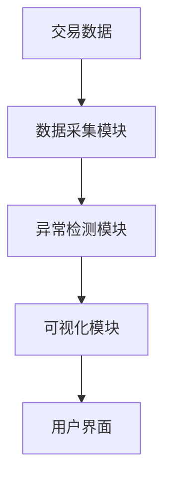
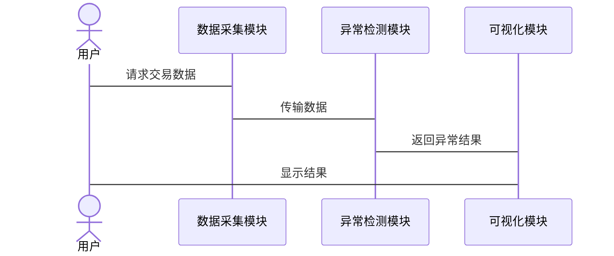

                 


# AI智能体在识别市场异常交易模式中的作用

## 关键词：AI智能体、异常交易模式、金融市场、机器学习、深度学习

## 摘要：  
随着人工智能技术的快速发展，AI智能体在金融市场中的应用日益广泛。本文深入探讨了AI智能体在识别市场异常交易模式中的作用，从基本概念、算法原理到系统架构，结合实际案例，分析了AI技术如何帮助检测和预防异常交易行为。文章详细阐述了异常交易的定义、分类及其对市场的影响，重点介绍了基于机器学习和深度学习的算法原理，并通过系统设计和项目实战展示了AI智能体的实际应用。最后，总结了当前技术面临的挑战及未来的发展方向，为读者提供了全面的技术视角和实践指导。

---

## 第1章: AI智能体与异常交易模式概述

### 1.1 AI智能体的基本概念  
AI智能体是一种能够感知环境、自主决策并执行任务的智能系统。它通过数据输入、模型训练和决策推理，能够理解和预测市场行为，帮助识别异常交易模式。  

#### 1.1.1 AI智能体的定义与特点  
AI智能体具有以下特点：  
- **自主性**：能够独立执行任务，无需人工干预。  
- **反应性**：能够实时感知环境变化并做出响应。  
- **学习能力**：通过机器学习算法不断优化模型。  
- **适应性**：能够根据环境变化调整行为策略。  

#### 1.1.2 异常交易模式的定义与分类  
异常交易模式是指在金融市场中，某些交易行为偏离正常市场规律，可能引发市场波动或操纵。常见的异常交易模式包括：  
- **市场操纵**：通过虚假交易拉升或打压股价。  
- **高频交易异常**：短时间内大量高频交易导致价格异常波动。  
- ** insider trading**：利用内部消息进行非法交易。  

#### 1.1.3 AI在金融交易中的应用背景  
随着金融市场的复杂化，传统的交易监控方法难以应对高频交易和复杂市场行为。AI智能体通过强大的数据处理和模式识别能力，能够实时监控市场动态，帮助识别和预防异常交易行为。

### 1.2 金融市场中的异常交易模式  
#### 1.2.1 市场操纵与异常交易的定义  
市场操纵是指通过虚假交易、散布谣言等手段影响市场价格的行为。异常交易模式则是指交易行为与市场规律不符的情况。  

#### 1.2.2 异常交易模式的典型特征  
- **交易量突增**：短时间内交易量急剧增加，可能是高频交易异常。  
- **价格波动剧烈**：价格在短时间内出现大幅波动，可能是市场操纵的结果。  
- **交易行为异常**：交易行为偏离市场平均值，可能是 insider trading 的迹象。  

#### 1.2.3 异常交易对市场的影响  
异常交易会破坏市场公平性，导致投资者信心下降，增加市场波动性。因此，及时识别和处理异常交易行为对维护市场秩序至关重要。

### 1.3 AI智能体在金融交易中的应用现状  
#### 1.3.1 AI在金融交易中的主要应用领域  
- **交易监控**：实时监控市场交易行为，识别异常交易模式。  
- **风险控制**：通过预测模型评估交易风险。  
- **智能投资**：基于AI算法进行自动化投资决策。  

#### 1.3.2 当前技术面临的挑战  
- **数据质量问题**：异常交易数据可能不完整或被篡改。  
- **模型过拟合**：AI模型可能过度拟合训练数据，导致预测不准确。  
- **计算资源限制**：高频交易需要强大的计算能力支持。  

#### 1.3.3 未来发展趋势与研究方向  
未来，AI智能体在金融领域的应用将更加智能化和自动化。研究方向包括：  
- **多模态数据融合**：结合文本、语音等多种数据源进行交易行为分析。  
- **强化学习应用**：通过强化学习优化交易策略。  
- **边缘计算**：在交易现场实时处理数据，减少延迟。  

---

## 第2章: AI智能体的核心概念与技术原理

### 2.1 AI智能体的核心概念  
#### 2.1.1 AI智能体的组成与功能  
AI智能体通常由以下几个部分组成：  
- **感知模块**：通过传感器或数据接口获取环境信息。  
- **推理模块**：通过机器学习模型进行数据分析和模式识别。  
- **决策模块**：根据推理结果做出决策。  
- **执行模块**：将决策转化为具体行动。  

#### 2.1.2 智能体与传统算法的区别  
AI智能体的核心优势在于其自主性和适应性。与传统算法相比，AI智能体能够根据环境变化动态调整行为策略，而传统算法则需要人工干预进行参数调整。

#### 2.1.3 智能体的自主性与适应性  
AI智能体的自主性使其能够独立完成任务，而适应性则使其能够在复杂环境中灵活应对各种挑战。

### 2.2 异常交易识别的关键技术  
#### 2.2.1 数据采集与预处理  
异常交易识别的第一步是采集交易数据，并进行清洗、标准化和特征提取。常用的数据预处理方法包括：  
- **数据清洗**：去除噪声数据，处理缺失值。  
- **特征提取**：从原始数据中提取有用特征，如交易量、价格波动等。  
- **数据标准化**：将数据标准化为统一的格式，便于后续分析。  

#### 2.2.2 异常检测算法的选择与应用  
选择合适的异常检测算法是关键。常见的异常检测算法包括：  
- **监督学习**：适用于已知异常样本的情况，如随机森林、支持向量机（SVM）。  
- **无监督学习**：适用于未知异常样本的情况，如K-means、DBSCAN。  
- **深度学习**：适用于复杂模式识别，如卷积神经网络（CNN）、循环神经网络（RNN）。  

#### 2.2.3 交易行为分析模型的构建  
交易行为分析模型通常包括以下几个步骤：  
1. 数据预处理：清洗和标准化数据。  
2. 特征提取：提取交易量、价格波动等特征。  
3. 模型训练：使用机器学习或深度学习算法训练模型。  
4. 模型评估：通过测试数据验证模型性能。  

---

## 第3章: AI智能体的算法原理与实现

### 3.1 异常交易识别的算法原理  
#### 3.1.1 基于监督学习的异常检测  
基于监督学习的异常检测需要标注数据，适用于已知异常样本的情况。常用的算法包括：  
- **随机森林**：通过树投票机制进行异常检测。  
- **SVM**：通过支持向量机进行分类。  

#### 3.1.2 基于无监督学习的异常检测  
基于无监督学习的异常检测适用于未知异常样本的情况。常用的算法包括：  
- **K-means**：通过聚类分析识别异常样本。  
- **DBSCAN**：通过密度聚类识别异常样本。  

#### 3.1.3 混合模型的应用与优势  
混合模型结合了监督学习和无监督学习的优势，适用于复杂场景。例如，先使用无监督学习初步识别异常样本，再使用监督学习进行分类。

### 3.2 基于深度学习的异常检测算法  
#### 3.2.1 神经网络模型的构建与训练  
深度学习模型通常包括输入层、隐藏层和输出层。通过训练神经网络，模型能够自动提取特征并识别异常模式。

#### 3.2.2 深度学习在时间序列分析中的应用  
时间序列分析是异常交易识别的重要部分。深度学习模型如LSTM（长短期记忆网络）能够有效捕捉时间依赖性。

#### 3.2.3 模型调优与优化策略  
模型调优包括参数调整、超参数优化和模型集成。常用的优化策略包括：  
- **网格搜索**：通过网格搜索找到最优参数。  
- **交叉验证**：通过交叉验证评估模型性能。  
- **模型集成**：通过集成多个模型提高预测准确率。  

---

## 第4章: 系统分析与架构设计

### 4.1 异常交易识别系统的应用场景  
#### 4.1.1 交易所交易监控系统  
交易所交易监控系统通过实时监控交易行为，识别异常交易模式，维护市场公平性。  

#### 4.1.2 投资机构风险控制系统  
投资机构风险控制系统通过预测市场风险，帮助机构规避异常交易带来的损失。  

#### 4.1.3 监管机构市场监控系统  
监管机构市场监控系统通过分析市场数据，识别异常交易行为，维护市场秩序。  

### 4.2 系统功能设计  
#### 4.2.1 数据采集模块  
数据采集模块负责从交易系统中采集实时交易数据，并进行预处理。  

#### 4.2.2 异常检测模块  
异常检测模块通过机器学习算法识别异常交易模式，并生成警报。  

#### 4.2.3 可视化模块  
可视化模块将异常交易行为以图表形式展示，帮助用户直观理解市场动态。  

### 4.3 系统架构设计  
#### 4.3.1 系统架构图  


#### 4.3.2 系统接口设计  
系统接口设计包括数据接口、算法接口和用户接口。数据接口负责与交易系统交互，算法接口负责调用异常检测算法，用户接口负责展示结果。  

#### 4.3.3 系统交互流程图  


---

## 第5章: 项目实战

### 5.1 环境安装与配置  
项目实战需要以下环境：  
- **Python**：3.8及以上版本  
- **机器学习库**：Scikit-learn、Keras、TensorFlow  
- **数据处理工具**：Pandas、NumPy  

### 5.2 系统核心实现源代码  
以下是基于监督学习的异常检测代码示例：  

```python
import pandas as pd
from sklearn.ensemble import IsolationForest
from sklearn.model_selection import train_test_split
from sklearn.metrics import classification_report

# 数据加载
data = pd.read_csv('交易数据.csv')

# 数据预处理
X = data.drop('label', axis=1)
y = data['label']

# 数据划分
X_train, X_test, y_train, y_test = train_test_split(X, y, test_size=0.2, random_state=42)

# 模型训练
model = IsolationForest(n_estimators=100, max_samples=100, random_state=42)
model.fit(X_train)

# 模型预测
y_pred = model.predict(X_test)

# 模型评估
print(classification_report(y_test, y_pred))
```

### 5.3 案例分析与详细解读  
以某次市场操纵事件为例，通过AI智能体识别异常交易模式，分析其交易行为特征，并展示模型识别结果。

### 5.4 项目小结  
通过项目实战，验证了AI智能体在异常交易识别中的有效性，同时发现了模型优化的空间。

---

## 第6章: 总结与展望

### 6.1 最佳实践  
- **数据质量**：确保数据的完整性和准确性。  
- **模型优化**：通过调参和集成模型提高预测准确率。  
- **实时性**：优化系统架构，减少延迟。  

### 6.2 小结  
本文详细探讨了AI智能体在识别市场异常交易模式中的作用，从算法原理到系统设计，结合实际案例，展示了AI技术在金融交易中的广泛应用。

### 6.3 注意事项  
- 异常交易识别需要结合市场实际情况进行模型调整。  
- 数据隐私和安全问题需要注意合规性。  

### 6.4 拓展阅读  
- 《机器学习实战》  
- 《深度学习入门：基于Python》  
- 《金融数据分析与Python实战》  

---

## 作者：AI天才研究院/AI Genius Institute & 禅与计算机程序设计艺术 /Zen And The Art of Computer Programming

---

**注**：由于篇幅限制，上述内容为文章的框架和部分内容的简要说明，实际撰写时需要根据具体要求进一步扩展每个部分的内容，确保文章的完整性和深度。

