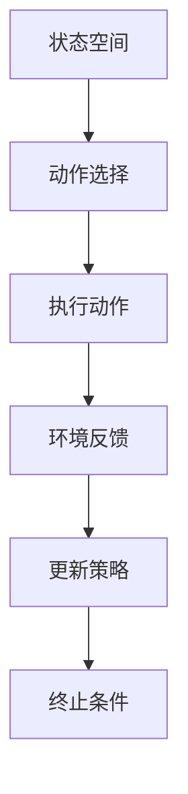
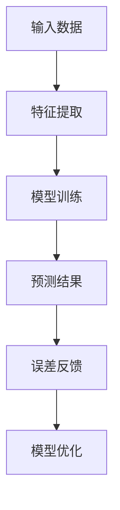
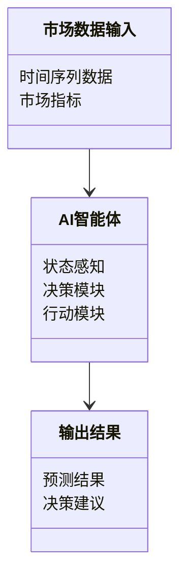
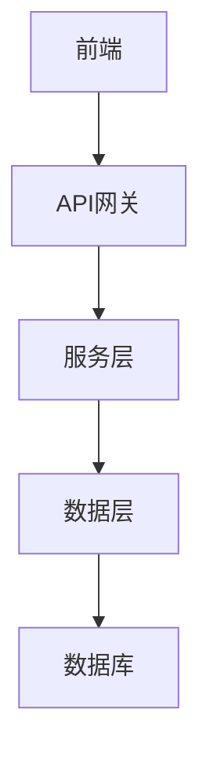
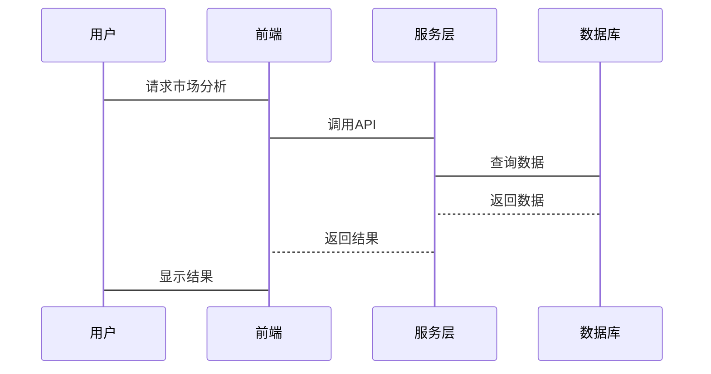

                 


# AI智能体在识别市场结构性变化中的作用

---

## 关键词：
AI智能体、市场结构性变化、强化学习、监督学习、系统架构、项目实战

---

## 摘要：
随着人工智能技术的快速发展，AI智能体在识别市场结构性变化中的作用日益显著。本文将从背景、核心概念、算法原理、系统架构、项目实战等多维度展开，详细探讨AI智能体如何通过强化学习和监督学习等算法，精准捕捉市场变化，为企业决策提供有力支持。通过实际案例分析和系统设计，本文将深入解析AI智能体在市场分析中的应用价值和未来发展方向。

---

## 第1章: 背景介绍

### 1.1 问题背景
#### 1.1.1 市场结构性变化的定义
市场结构性变化指的是市场中供需关系、竞争格局、消费者行为等关键因素的变化。这种变化通常表现为市场趋势的转变、竞争对手策略调整、消费者偏好变化等。

#### 1.1.2 AI智能体的定义与特点
AI智能体（AI Agent）是一种能够感知环境、做出决策并采取行动的智能系统。其特点包括自主性、反应性、目标导向性和学习能力。

#### 1.1.3 问题描述与解决方法
市场结构性变化难以预测，传统方法依赖于人工分析，效率低且容易出错。AI智能体通过机器学习和大数据分析，能够快速识别市场变化，提供实时反馈和决策支持。

#### 1.1.4 边界与外延
AI智能体的应用边界包括数据质量和数量、模型训练时间、计算资源等。外延则涉及领域知识的结合、多智能体协作等。

#### 1.1.5 核心要素与概念结构
核心要素包括数据输入、模型训练、决策输出等。概念结构通过对比表格和ER图展示。

---

## 第2章: 核心概念与联系

### 2.1 AI智能体的核心原理
#### 2.1.1 强化学习与监督学习
强化学习通过试错优化策略，监督学习基于标记数据进行分类。

#### 2.1.2 神经网络与深度学习
深度学习通过多层神经网络提取特征，强化学习通过策略网络优化决策。

#### 2.1.3 多智能体协作机制
通过通信协议，多个AI智能体协同工作，提升整体决策能力。

### 2.2 市场结构性变化的特征
#### 2.2.1 数据特征分析
数据的时序性、波动性、周期性等特征。

#### 2.2.2 时间序列分析
通过ARIMA模型预测市场趋势。

#### 2.2.3 预测模型构建
基于LSTM的市场变化预测模型。

---

## 第3章: 算法原理讲解

### 3.1 算法原理
#### 3.1.1 强化学习算法流程图


#### 3.1.2 监督学习算法流程图


### 3.2 数学模型与公式
#### 3.2.1 强化学习数学模型
$$ R(s, a) = \text{奖励函数} $$

#### 3.2.2 神经网络数学模型
$$ y = \sigma(wx + b) $$

---

## 第4章: 系统分析与架构设计

### 4.1 系统场景介绍
AI智能体识别市场变化的应用场景，包括实时监控、预测预警等。

### 4.2 系统功能设计
#### 4.2.1 领域模型设计


#### 4.2.2 系统架构设计


#### 4.2.3 接口设计与交互流程


---

## 第5章: 项目实战

### 5.1 环境安装
#### 5.1.1 安装Python与依赖
```
pip install numpy pandas scikit-learn tensorflow
```

### 5.2 核心代码实现
#### 5.2.1 强化学习代码示例
```python
import numpy as np

class AI-Agent:
    def __init__(self, state_space, action_space):
        self.state_space = state_space
        self.action_space = action_space
        self.model = self.build_model()

    def build_model(self):
        # 构建神经网络模型
        pass

    def act(self, state):
        # 选择动作
        pass

    def train(self, state, action, reward, next_state):
        # 更新模型参数
        pass
```

#### 5.2.2 监督学习代码示例
```python
from sklearn.linear_model import LinearRegression

model = LinearRegression()
X = np.array([[1], [2], [3]])
y = np.array([2, 4, 6])
model.fit(X, y)
print(model.predict([[4]]))
```

### 5.3 案例分析与解读
通过具体案例，分析AI智能体如何识别市场变化，并提供实时反馈。

### 5.4 项目小结
总结项目实现的关键点和经验教训。

---

## 第6章: 总结与展望

### 6.1 总结
AI智能体在识别市场结构性变化中的应用价值和实现方法。

### 6.2 小结
通过对比和分析，得出AI智能体的优势和局限性。

### 6.3 注意事项
数据质量、模型选择、计算资源等注意事项。

### 6.4 未来展望
AI智能体与其他技术的结合，如边缘计算、区块链等。

---

## 参考文献
[1] 《深度学习》—— Ian Goodfellow  
[2] 《强化学习》—— Richard S. Sutton  
[3] 《机器学习实战》—— 周志华  

---

## 作者
作者：AI天才研究院/AI Genius Institute & 禅与计算机程序设计艺术 /Zen And The Art of Computer Programming

