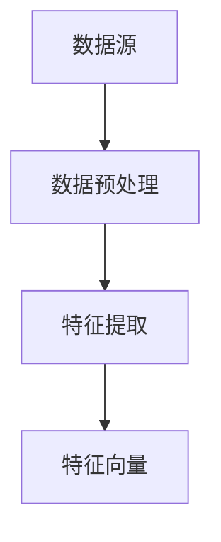
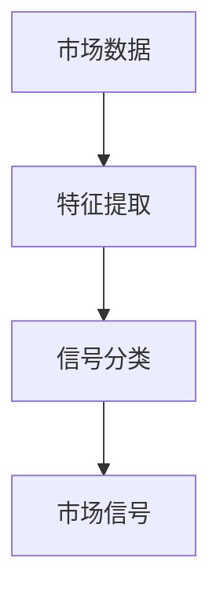
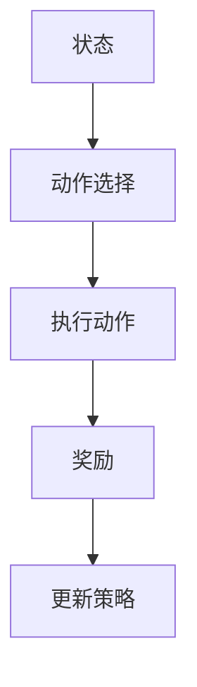
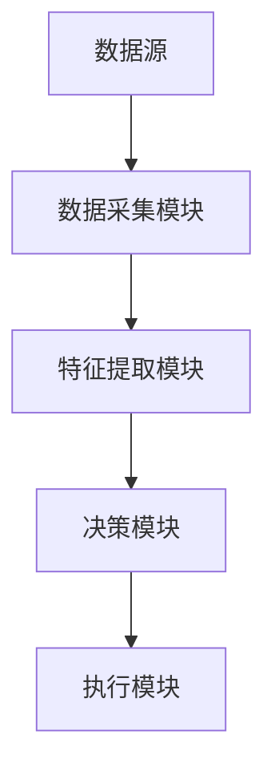

                 


# AI智能体在识别市场结构性机会中的作用

> 关键词：AI智能体、市场机会识别、强化学习、无监督学习、市场信号、系统架构

> 摘要：本文探讨了AI智能体在识别市场结构性机会中的应用，分析了其感知、决策和执行机制，并通过算法原理、系统架构和实际案例，详细阐述了AI智能体在市场机会识别中的作用及其优势。文章旨在为读者提供深入的技术见解，帮助其理解AI智能体在市场分析中的潜力和实现方法。

---

## 第一部分：引言

### 第1章：AI智能体与市场机会识别概述

#### 1.1 AI智能体的定义与核心概念

AI智能体（Artificial Intelligence Agent，简称AI Agent）是指具有感知环境、做出决策并执行动作的智能系统。它能够通过数据输入、信息处理和智能决策，帮助用户在复杂市场环境中识别结构性机会。AI智能体的核心概念包括以下几点：

- **自主性**：能够自主感知环境并做出决策。
- **反应性**：能够实时响应环境变化。
- **目标导向性**：具有明确的目标，通过优化算法实现目标。

#### 1.2 市场结构性机会的定义与重要性

市场结构性机会指的是在市场中由于供需变化、技术进步、政策调整等因素所形成的潜在收益机会。识别这些机会需要对市场数据进行深度分析和预测。AI智能体通过强大的数据处理能力和智能算法，能够快速识别这些机会，帮助企业和投资者制定更有效的策略。

#### 1.3 本书的目的与结构

本文旨在通过系统化的分析，探讨AI智能体在识别市场结构性机会中的应用，并通过实际案例展示其优势。文章结构如下：

1. 引言：介绍AI智能体和市场机会识别的基本概念。
2. 核心概念与原理：分析AI智能体的感知、决策和执行机制。
3. 算法原理：详细讲解强化学习、监督学习和无监督学习。
4. 数学模型：推导相关算法的数学公式并分析其应用。
5. 系统架构：设计AI智能体的系统架构并展示其实现。
6. 项目实战：通过实际案例展示AI智能体的应用。
7. 总结与展望：总结全文并展望未来发展方向。

---

## 第二部分：AI智能体的核心概念与原理

### 第2章：AI智能体的感知机制

#### 2.1 数据采集与特征提取

AI智能体的感知机制通过数据采集和特征提取，从环境中获取信息。以下是关键步骤：

- **数据源**：AI智能体可以从多种数据源获取信息，如金融市场数据、社交媒体信息、行业报告等。
- **特征提取**：通过对数据进行特征提取，AI智能体能够识别出影响市场机会的关键因素。

以下是一个简单的数据处理流程图（使用mermaid）：



#### 2.2 市场信号的识别

市场信号识别是AI智能体感知环境的重要环节，以下是其实现步骤：

- **信号分类**：将市场信号分为上升趋势、下降趋势、盘整等类型。
- **特征识别**：通过特征工程识别出影响市场的关键信号。

以下是一个市场信号识别的流程图：



---

### 第3章：AI智能体的决策机制

#### 3.1 决策模型的构建与选择

AI智能体的决策机制依赖于高效的决策模型。以下是主要模型：

- **强化学习**：通过试错机制优化决策策略。
- **监督学习**：基于历史数据训练决策模型。
- **无监督学习**：识别数据中的潜在模式。

以下是一个强化学习的流程图：



#### 3.2 决策模型的优化策略

优化决策模型的关键在于算法的选择和参数的调优。以下是优化策略：

- **算法选择**：根据具体场景选择合适的算法。
- **参数调优**：通过实验优化模型参数。
- **动态调整**：根据环境变化动态调整模型。

---

## 第三部分：算法原理

### 第4章：强化学习原理

#### 4.1 强化学习的基本概念

强化学习是一种通过试错机制优化决策的算法。以下是其基本概念：

- **状态**：环境中的当前情况。
- **动作**：AI智能体采取的行动。
- **奖励**：执行动作后获得的反馈。

以下是一个强化学习的数学模型：

$$ R = r_t \cdot \gamma^{t} $$
其中，$ R $ 是总奖励，$ r_t $ 是第 $ t $ 步的奖励，$\gamma$ 是折扣因子。

#### 4.2 强化学习的实现步骤

以下是强化学习的实现步骤：

1. 初始化策略。
2. 与环境交互，获取状态。
3. 根据策略选择动作。
4. 执行动作，获得奖励。
5. 更新策略。

以下是一个强化学习的Python代码示例：

```python
import numpy as np
import gym

env = gym.make('CartPole-v0')
env.seed(1)

policy = np.array([0.5, 0.5])

for episode in range(100):
    state = env.reset()
    while True:
        action = np.random.choice([0, 1], p=policy)
        state, reward, done, _ = env.step(action)
        if done:
            break
```

---

## 第四部分：系统分析与架构设计

### 第5章：系统架构设计

#### 5.1 系统功能设计

以下是AI智能体的系统功能设计：

- **数据采集模块**：从多种数据源获取数据。
- **特征提取模块**：对数据进行特征提取。
- **决策模块**：基于特征进行决策。
- **执行模块**：执行决策并反馈结果。

以下是一个系统架构图（使用mermaid）：



---

## 第五部分：项目实战

### 第6章：项目实战

#### 6.1 环境安装与数据准备

以下是环境安装和数据准备的步骤：

1. 安装必要的库：`pip install numpy gym pandas scikit-learn`
2. 数据获取：从金融数据API获取市场数据。
3. 数据预处理：清洗数据并提取特征。

#### 6.2 模型训练与部署

以下是模型训练和部署的步骤：

1. 数据特征工程：构建特征向量。
2. 模型训练：使用监督学习训练分类模型。
3. 模型部署：将模型部署到生产环境。

以下是一个模型训练的Python代码示例：

```python
from sklearn.tree import DecisionTreeClassifier
from sklearn.datasets import make_classification

X, y = make_classification(n_samples=100, n_features=20, n_classes=2)
model = DecisionTreeClassifier()
model.fit(X, y)
```

---

## 第六部分：总结与展望

### 第7章：总结与展望

#### 7.1 小结

本文详细探讨了AI智能体在识别市场结构性机会中的应用，分析了其感知、决策和执行机制，并通过实际案例展示了其优势。

#### 7.2 展望

随着AI技术的不断进步，AI智能体在市场机会识别中的应用将更加广泛和深入。未来的研究方向包括更高效的算法设计、多智能体协同优化等。

---

## 作者：AI天才研究院/AI Genius Institute & 禅与计算机程序设计艺术 /Zen And The Art of Computer Programming

