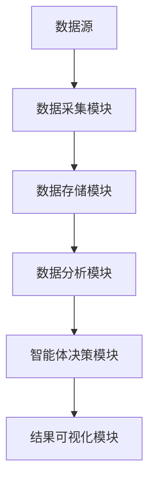
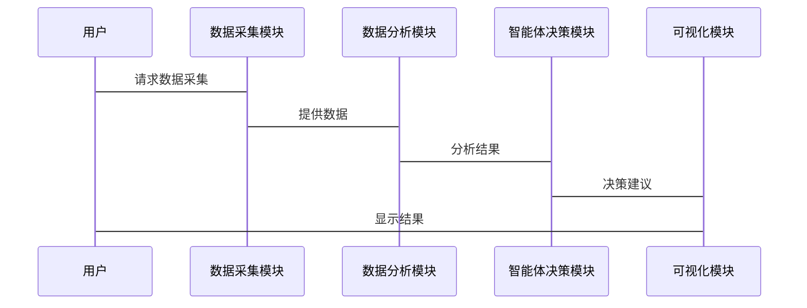

                 


```markdown
# AI智能体在识别经济护城河中的作用

> 关键词：AI智能体、经济护城河、强化学习、博弈论、系统架构设计

> 摘要：本文探讨AI智能体在识别经济护城河中的作用，分析其在数据处理、模型构建和自适应学习方面的优势，并结合强化学习和博弈论模型，提供系统的解决方案和实战案例，帮助读者深入理解AI技术在经济护城河识别中的应用。

---

## 第4章: 经济护城河识别的博弈论模型与AI智能体

### 4.1 博弈论基础

#### 4.1.1 博弈论的基本概念
博弈论是研究理性决策者之间策略互动的数学理论，广泛应用于经济学、社会学和计算机科学等领域。

#### 4.1.2 竞争与合作的博弈模型
博弈论中的竞争与合作模型帮助我们理解企业之间的策略互动，尤其是在经济护城河识别中，企业如何通过博弈策略构建竞争优势。

#### 4.1.3 经济护城河识别中的博弈场景
在经济护城河识别中，企业通常面临竞争对手分析、市场进入壁垒等博弈场景，这些场景可以通过博弈论模型进行建模和分析。

### 4.2 经济护城河识别的博弈论模型构建

#### 4.2.1 竞争对手分析的博弈模型
构建竞争对手分析的博弈模型，需明确参与方、策略空间和支付函数。

#### 4.2.2 市场进入壁垒的博弈分析
通过博弈论模型分析市场进入壁垒，评估潜在竞争者的行为和企业现有的护城河是否有效。

#### 4.2.3 博弈模型的动态演化
博弈模型需要根据市场变化进行动态调整，考虑企业策略的演化过程。

### 4.3 AI智能体在博弈论模型中的应用

#### 4.3.1 竞争对手策略预测
AI智能体可以通过强化学习预测竞争对手的策略，帮助企业在博弈中制定最优决策。

#### 4.3.2 竞争策略优化
结合博弈论模型，AI智能体优化企业的竞争策略，增强企业的市场地位。

#### 4.3.3 动态博弈环境适应
在动态市场环境中，AI智能体能够实时调整策略，适应博弈环境的变化。

---

## 第5章: AI智能体与经济护城河识别的系统架构设计

### 5.1 系统功能设计

#### 5.1.1 数据采集模块
- 数据来源：市场数据、企业数据、竞争者数据。
- 数据预处理：清洗、转换、特征提取。

#### 5.1.2 数据分析模块
- 数据挖掘：使用机器学习算法提取潜在模式。
- 统计分析：计算市场进入壁垒、竞争优势指标。

#### 5.1.3 智能体决策模块
- 策略生成：基于博弈论模型生成竞争策略。
- 决策优化：通过强化学习优化决策。

#### 5.1.4 可视化模块
- 数据可视化：展示分析结果和决策建议。
- 报告生成：输出经济护城河评估报告。

### 5.2 系统架构设计



### 5.3 系统接口设计

- 数据接口：与企业数据源对接，获取实时数据。
- 智能体接口：与其他系统或服务进行交互，执行决策。
- 用户接口：提供直观的操作界面，供用户查看和操作。

### 5.4 系统交互设计



---

## 第6章: 项目实战

### 6.1 环境安装

- 安装Python：推荐使用Anaconda。
- 安装相关库：TensorFlow、Keras、OpenAI API、Plotly。

```bash
pip install tensorflow keras openai plotly
```

### 6.2 核心代码实现

#### 6.2.1 数据预处理

```python
import pandas as pd
data = pd.read_csv('market_data.csv')
# 数据清洗
data = data.dropna()
# 特征提取
features = data[['revenue', 'profit_margin', 'market_share']]
```

#### 6.2.2 强化学习模型实现

```python
class Agent:
    def __init__(self, state_space, action_space):
        self.state_space = state_space
        self.action_space = action_space
        # 初始化策略网络
        self.model = self.build_model()

    def build_model(self):
        # 使用神经网络构建策略模型
        model = keras.Sequential([
            keras.layers.Dense(64, activation='relu', input_shape=(state_space,)),
            keras.layers.Dense(action_space, activation='softmax')
        ])
        model.compile(optimizer='adam', loss='sparse_categorical_crossentropy')
        return model

    def act(self, state):
        # 根据当前状态选择动作
        prediction = self.model.predict(state)
        return np.argmax(prediction[0])
```

#### 6.2.3 博弈论模型实现

```python
def payoff_matrix(row_player_strategies, col_player_strategies):
    # 支付矩阵计算
    payoff = {}
    for r in row_player_strategies:
        for c in col_player_strategies:
            payoff[(r,c)] = calculate_payoff(r, c)
    return payoff

def calculate_payoff(r, c):
    # 根据策略计算支付
    if r == 'high' and c == 'high':
        return 3
    elif r == 'high' and c == 'low':
        return 1
    elif r == 'low' and c == 'high':
        return 2
    else:
        return 0
```

### 6.3 案例分析

#### 6.3.1 数据分析结果
展示数据预处理后的特征和初步分析结果。

#### 6.3.2 智能体决策
通过强化学习模型，生成竞争策略，并分析其在博弈模型中的效果。

#### 6.3.3 可视化结果
使用Plotly或Matplotlib展示分析结果和决策建议。

### 6.4 项目总结

- 实践中AI智能体在经济护城河识别中的有效性。
- 实战中遇到的挑战和解决方案。
- 未来改进的方向和优化建议。

---

## 第7章: 总结与展望

### 7.1 当前研究的局限性

- 数据质量和数量的限制。
- 模型的可解释性问题。
- 动态博弈环境中的适应性。

### 7.2 未来研究方向

- 结合更多AI技术，如生成式AI。
- 探索更复杂的博弈模型。
- 开发更高效的强化学习算法。

### 7.3 最佳实践 Tips

- 数据质量是关键，确保数据的完整性和准确性。
- 在实际应用中，结合企业的具体业务场景进行调整。
- 定期更新模型和策略，适应市场变化。

### 7.4 项目小结

总结全文内容，强调AI智能体在经济护城河识别中的重要性，以及未来的发展潜力。

---

## 作者：AI天才研究院 & 禅与计算机程序设计艺术

---

通过本文，我们深入探讨了AI智能体在识别经济护城河中的作用，从理论到实践，为读者提供了全面的指导。希望本文能为相关领域的研究和实践提供有价值的参考。
```

