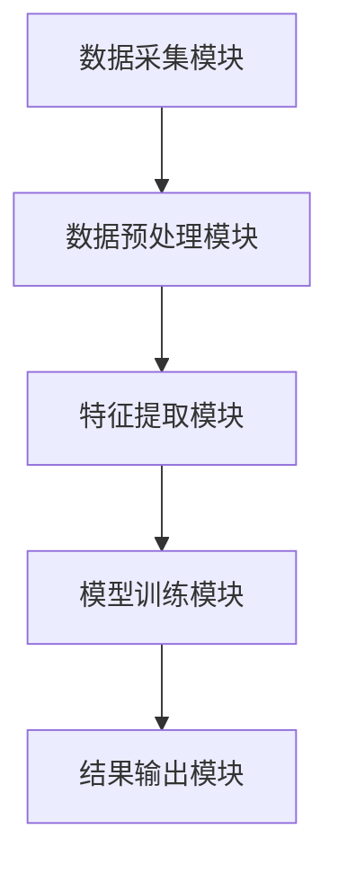
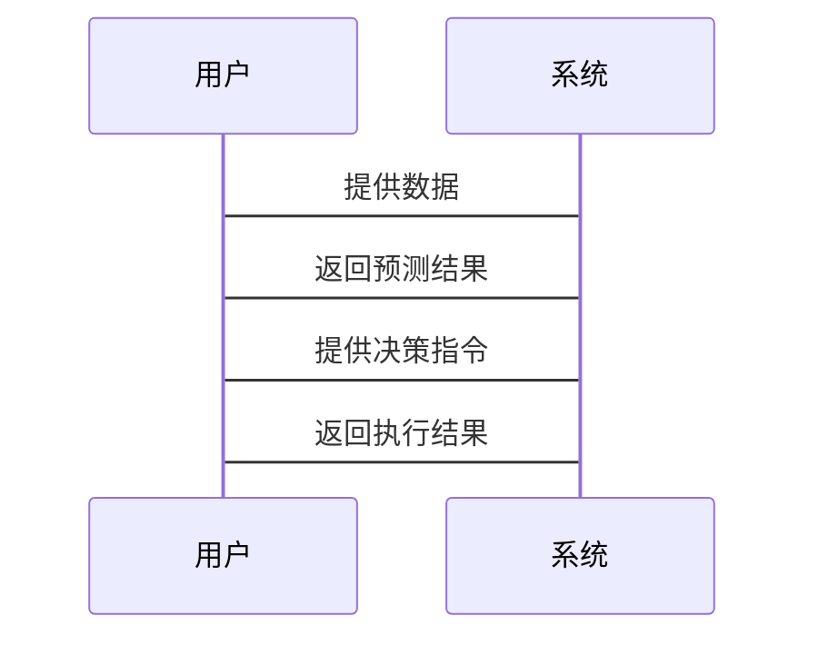

                 


# AI智能体在识别长期增长潜力中的应用

**关键词**：AI智能体, 长期增长潜力, 人工智能, 系统架构, 投资决策, 机器学习

**摘要**：  
本文探讨了AI智能体在识别长期增长潜力中的应用，详细介绍了AI智能体的基本概念、核心原理、算法实现、系统架构以及实际项目案例。通过分析长期增长潜力的评估方法和AI智能体的优势，结合具体的技术实现和最佳实践，本文为读者提供了全面的理解和实践指导。

---

# 第一部分: AI智能体与长期增长潜力的背景

## 第1章: AI智能体的基本概念

### 1.1 什么是AI智能体
AI智能体（Artificial Intelligence Agent）是指具备感知环境、做出决策并执行动作的智能系统。它能够根据输入的数据和环境反馈，自主地进行学习和优化，从而实现特定的目标。

#### 1.1.1 AI智能体的核心特征
- **自主性**：能够自主决策，无需外部干预。
- **反应性**：能够实时感知环境并做出响应。
- **学习性**：通过数据和经验不断优化自身的性能。
- **目标导向**：所有行为都围绕实现特定目标展开。

### 1.2 长期增长潜力的定义
长期增长潜力是指某个实体（如企业、项目、资产等）在未来一段时间内实现持续增长的可能性。这种潜力通常与市场需求、技术创新、资源分配等因素密切相关。

#### 1.2.1 长期增长潜力的评估维度
- **市场需求**：目标市场是否具备增长空间。
- **资源储备**：是否有足够的资源支持增长。
- **竞争优势**：是否具备在市场中脱颖而出的能力。
- **创新能力**：是否能够持续创新以应对变化。

### 1.3 AI智能体在长期增长潜力识别中的作用
AI智能体通过其强大的数据处理能力和学习算法，能够高效地识别潜在的增长机会。它可以从海量数据中提取关键信息，并通过预测模型帮助决策者制定科学的增长策略。

#### 1.3.1 AI智能体的优势
- **高效性**：能够快速处理大量数据，提供实时反馈。
- **准确性**：基于复杂算法，预测结果更为精准。
- **适应性**：能够根据环境变化自动调整策略。

---

# 第二部分: AI智能体的核心概念与联系

## 第2章: AI智能体的核心原理

### 2.1 AI智能体的感知机制
感知是AI智能体获取信息的第一步，主要包括数据采集和特征提取。

#### 2.1.1 数据采集
- **数据来源**：可以来自数据库、传感器、网络爬取等多种渠道。
- **数据预处理**：对采集到的数据进行清洗和标准化，确保数据质量。

#### 2.1.2 特征提取
- **特征选择**：通过统计分析或机器学习方法，筛选出对目标预测最重要的特征。
- **特征工程**：对特征进行转换或组合，以提高模型的性能。

### 2.2 AI智能体的决策机制
决策是AI智能体的核心环节，涉及模型构建和策略优化。

#### 2.2.1 模型构建
- **监督学习**：基于已标注的数据训练分类或回归模型。
- **无监督学习**：通过聚类分析等方法发现数据中的潜在模式。
- **强化学习**：通过与环境的交互不断优化决策策略。

#### 2.2.2 策略优化
- **多目标优化**：在多个目标之间找到平衡点，确保决策的全面性。
- **动态调整**：根据实时数据和环境变化，动态调整决策策略。

### 2.3 AI智能体的执行机制
执行是AI智能体将决策转化为实际行动的过程，包括策略执行和结果反馈。

#### 2.3.1 策略执行
- **动作生成**：根据决策结果生成具体的执行动作。
- **动作执行**：通过API或自动化工具将动作转化为实际操作。

#### 2.3.2 结果反馈
- **反馈收集**：收集执行后的结果数据，用于后续优化。
- **性能评估**：评估执行效果，为下一步决策提供依据。

### 2.4 长期增长潜力的评估模型
长期增长潜力的评估模型是AI智能体识别潜力的核心工具。

#### 2.4.1 模型构建
- **时间序列分析**：用于预测未来趋势。
- **机器学习模型**：如随机森林、神经网络等。

#### 2.4.2 模型验证
- **交叉验证**：通过多次训练和测试评估模型的泛化能力。
- **性能指标**：如准确率、召回率、F1分数等。

#### 2.4.3 模型优化
- **超参数调优**：通过网格搜索或随机搜索找到最佳参数组合。
- **模型融合**：结合多个模型的结果，提高预测精度。

### 2.5 AI智能体与长期增长潜力的关系
AI智能体通过其强大的数据处理和分析能力，能够高效地识别和评估长期增长潜力。两者相辅相成，共同推动目标的实现。

#### 2.5.1 AI智能体如何影响长期增长潜力
- **数据驱动的决策**：通过数据分析发现潜在的增长机会。
- **动态调整策略**：根据市场变化实时优化增长策略。

#### 2.5.2 长期增长潜力对AI智能体的反作用
- **数据丰富性**：长期增长潜力的评估需要大量历史数据支持。
- **模型迭代**：随着数据的积累，AI智能体的模型需要不断迭代优化。

---

# 第三部分: AI智能体的算法实现

## 第3章: 算法原理与实现

### 3.1 感知算法
感知算法负责从数据中提取有用的信息。

#### 3.1.1 数据预处理
- **数据清洗**：去除噪声数据，确保数据质量。
- **数据标准化**：将数据归一化，方便模型处理。

#### 3.1.2 特征提取
- **主成分分析（PCA）**：降低数据维度，提取主要特征。
- **自动编码器（Autoencoder）**：通过无监督学习提取特征。

### 3.2 决策算法
决策算法是AI智能体的核心，决定了系统的输出。

#### 3.2.1 监督学习算法
- **线性回归**：用于预测连续型变量。
  $$ y = \beta_0 + \beta_1 x + \epsilon $$
- **随机森林**：用于分类和回归问题，具有高准确性和抗过拟合能力。

#### 3.2.2 强化学习算法
- **Q-learning**：通过状态-动作-奖励机制优化决策策略。
- **Deep Q-Network (DQN)**：结合深度学习和强化学习，用于复杂环境的决策。

### 3.3 执行算法
执行算法将决策结果转化为实际操作。

#### 3.3.1 动作生成
- **策略网络**：基于当前状态生成具体的动作。
- **动作选择**：根据策略网络的输出选择最优动作。

#### 3.3.2 动作执行
- **自动化工具**：如API调用、脚本执行等。
- **反馈机制**：收集执行结果，用于后续优化。

---

# 第四部分: 系统架构与实现

## 第4章: 系统架构设计

### 4.1 系统功能设计
系统功能设计是实现AI智能体的基础。

#### 4.1.1 数据采集模块
- **数据源**：多种数据源的接入，如数据库、API接口等。
- **数据预处理**：清洗、转换和标准化数据。

#### 4.1.2 数据分析模块
- **特征提取**：通过PCA或自动编码器提取特征。
- **模型训练**：训练分类或回归模型。

#### 4.1.3 结果输出模块
- **预测结果**：输出模型的预测结果。
- **决策建议**：根据预测结果生成具体的决策建议。

### 4.2 系统架构图
以下是系统的整体架构图：



### 4.3 接口设计
- **输入接口**：接收外部数据和指令。
- **输出接口**：输出预测结果和决策建议。

### 4.4 交互流程
以下是系统的交互流程图：



---

# 第五部分: 项目实战

## 第5章: 项目实战与案例分析

### 5.1 环境安装
- **Python版本**：建议使用Python 3.8或更高版本。
- **依赖库安装**：如NumPy、Pandas、Scikit-learn、TensorFlow等。

#### 5.1.1 安装步骤
```bash
pip install numpy pandas scikit-learn tensorflow
```

### 5.2 核心代码实现
以下是一个简单的AI智能体实现代码示例：

#### 5.2.1 数据预处理
```python
import numpy as np
import pandas as pd

# 读取数据
data = pd.read_csv('input.csv')

# 数据清洗
data.dropna(inplace=True)

# 标准化处理
from sklearn.preprocessing import StandardScaler
scaler = StandardScaler()
scaled_data = scaler.fit_transform(data)
```

#### 5.2.2 模型训练
```python
from sklearn.ensemble import RandomForestRegressor

# 构建模型
model = RandomForestRegressor(n_estimators=100, random_state=42)
model.fit(scaled_data, target)
```

#### 5.2.3 模型预测
```python
# 预测结果
predictions = model.predict(new_data)
```

### 5.3 代码解读
- **数据预处理**：对数据进行清洗和标准化处理，确保数据质量。
- **模型训练**：使用随机森林回归模型进行训练，提取关键特征。
- **模型预测**：基于训练好的模型，预测未来的增长潜力。

### 5.4 案例分析
以股票投资为例，分析AI智能体如何帮助识别具有长期增长潜力的股票。

#### 5.4.1 数据分析
通过分析历史股价、财务数据和市场情绪，AI智能体可以识别出具有增长潜力的股票。

#### 5.4.2 模型验证
通过回测验证模型的准确性和稳定性，确保模型能够在实际应用中发挥作用。

---

# 第六部分: 最佳实践与总结

## 第6章: 最佳实践与总结

### 6.1 项目总结
通过本项目的实施，我们成功地将AI智能体应用于长期增长潜力的识别，验证了其在实际中的应用价值。

#### 6.1.1 成功经验
- **数据质量**：高质量的数据是模型准确性的关键。
- **模型优化**：持续优化模型结构和参数，提高预测精度。

#### 6.1.2 挑战与解决方案
- **数据稀疏性**：通过数据增强和迁移学习解决数据不足的问题。
- **模型解释性**：通过可视化工具提高模型的可解释性。

### 6.2 注意事项
- **数据隐私**：确保数据的安全性和隐私性。
- **模型鲁棒性**：在不同环境下验证模型的鲁棒性。
- **持续优化**：定期更新模型，适应环境变化。

### 6.3 拓展阅读
- 《Deep Learning》
- 《Python机器学习》
- 《强化学习：理论与应用》

---

# 作者信息

作者：AI天才研究院/AI Genius Institute & 禅与计算机程序设计艺术 /Zen And The Art of Computer Programming

---

以上是完整的文章大纲和内容，您可以根据需要进一步扩展和优化。

