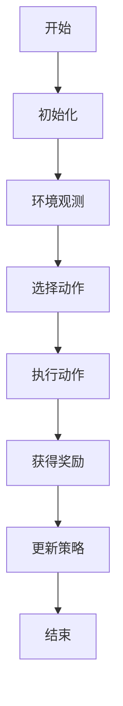
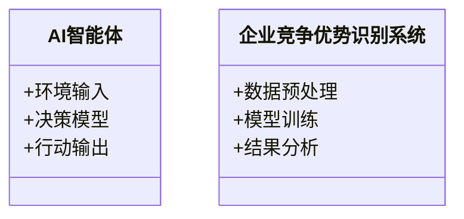

                 


# AI智能体在识别长期竞争优势中的作用

> 关键词：AI智能体、长期竞争优势、算法原理、系统架构、项目实战

> 摘要：本文详细探讨AI智能体在识别和维护长期竞争优势中的作用。通过分析核心概念、算法原理、系统架构，并结合实际项目案例，揭示AI智能体如何助力企业发现和保持竞争优势。

---

# 第一部分: AI智能体与长期竞争优势的背景介绍

## 第1章: AI智能体的基本概念

### 1.1 AI智能体的定义

AI智能体（Artificial Intelligence Agent，简称AI Agent）是指具有感知环境、做出决策并采取行动的智能系统。AI智能体能够根据环境输入做出自主决策，以实现特定目标。

### 1.2 AI智能体的核心特征

- **自主性**：能够在没有外部干预的情况下独立运作。
- **反应性**：能够实时感知环境变化并做出反应。
- **目标导向**：具备明确的目标，并采取行动以实现这些目标。
- **学习能力**：通过数据和经验不断优化自身的决策能力。

### 1.3 长期竞争优势的定义

长期竞争优势是指企业在市场中持续保持高于竞争对手的绩效和市场份额的能力。这种优势通常基于企业的核心竞争力，如技术创新、成本优势、品牌影响力等。

### 1.4 AI智能体在竞争优势中的作用

AI智能体通过分析市场趋势、消费者行为和竞争对手策略，帮助识别潜在的市场机会和威胁，从而制定有效的竞争策略。

---

## 第2章: AI智能体的核心概念与联系

### 2.1 核心概念原理

AI智能体的核心原理在于其感知和决策机制。感知环境是通过收集和处理数据，而决策则是基于这些数据进行分析和预测，从而做出最优选择。

### 2.2 核心概念特征对比表格

以下表格对比了AI智能体与传统算法在竞争优势识别中的特征：

| 特征维度 | AI智能体 | 传统算法 |
|----------|----------|----------|
| 自主性    | 高       | 低       |
| 反应性    | 高       | 中       |
| 学习能力  | 高       | 低       |
| 目标导向  | 高       | 中       |

### 2.3 ER实体关系图

以下是AI智能体识别竞争优势的实体关系图：

```mermaid
erd
actor 竞争优势识别系统
actor 竞争优势识别系统 --> entity 竞争优势
entity 竞争优势 --> attribute 竞争优势特征
entity 竞争优势 --> attribute 竞争优势度量
```

---

## 第3章: AI智能体算法原理讲解

### 3.1 算法原理

AI智能体的算法通常基于机器学习和深度学习。例如，强化学习（Reinforcement Learning）是一种常用的算法，通过智能体与环境的交互来优化决策策略。

### 3.2 强化学习算法流程图

以下是一个强化学习算法的流程图：



### 3.3 Python核心实现代码

以下是强化学习算法的Python代码示例：

```python
class AI-Agent:
    def __init__(self, state_space, action_space):
        self.state_space = state_space
        self.action_space = action_space
        # 初始化策略网络
        self.policy_network = self.build_network(state_space, action_space)
    
    def build_network(self, state_space, action_space):
        # 构建策略网络模型
        model = Sequential()
        model.add(Dense(64, activation='relu', input_dim=state_space))
        model.add(Dense(action_space, activation='softmax'))
        model.compile(optimizer='adam', loss='sparse_categorical_crossentropy')
        return model
    
    def act(self, state):
        # 根据当前状态选择动作
        probabilities = self.policy_network.predict(state)
        return np.random.choice(self.action_space, p=probabilities[0])
    
    def learn(self, state, action, reward):
        # 更新策略网络
        self.policy_network.fit(state, np.array([action]), epochs=1, verbose=0)
```

---

## 第4章: 系统分析与架构设计方案

### 4.1 问题场景介绍

在企业竞争中，识别长期竞争优势是一个复杂的任务，涉及大量数据的分析和处理。AI智能体可以通过实时数据处理和预测模型，帮助企业识别潜在的市场机会和威胁。

### 4.2 系统功能设计

以下是系统功能的领域模型类图：



---

## 第5章: 项目实战

### 5.1 环境安装

首先，安装所需的Python库：

```bash
pip install numpy matplotlib tensorflow
```

### 5.2 核心实现代码

以下是项目的核心实现代码：

```python
import numpy as np
import tensorflow as tf
from tensorflow.keras import layers

# 定义AI智能体类
class AI-Agent:
    def __init__(self, input_dim, output_dim):
        self.model = self.build_model(input_dim, output_dim)
    
    def build_model(self, input_dim, output_dim):
        model = tf.keras.Sequential()
        model.add(layers.Dense(64, activation='relu', input_dim=input_dim))
        model.add(layers.Dense(output_dim, activation='softmax'))
        model.compile(optimizer='adam', loss='sparse_categorical_crossentropy')
        return model
    
    def predict(self, input_data):
        return self.model.predict(input_data)
    
    def train(self, input_data, labels):
        self.model.fit(input_data, labels, epochs=10, batch_size=32)
```

### 5.3 案例分析

以电商行业的竞争为例，AI智能体可以分析用户的购买行为、市场趋势和竞争对手的策略，帮助企业制定有效的市场进入和促销策略。

---

## 第6章: 总结与展望

### 6.1 总结

通过本文的介绍，读者可以了解AI智能体在识别长期竞争优势中的重要性。从算法原理到系统设计，再到项目实战，AI智能体为企业提供了强大的工具来识别和保持竞争优势。

### 6.2 展望

未来，随着AI技术的不断发展，AI智能体将在更多领域发挥重要作用。建议企业积极采用AI技术，以在竞争激烈的市场中保持领先地位。

---

## 第7章: 最佳实践 Tips

- **数据质量**：确保输入数据的准确性和完整性，以提高模型的性能。
- **模型更新**：定期更新模型，以适应市场变化和新数据。
- **团队协作**：AI智能体的开发和应用需要跨学科团队的协作。

---

作者：AI天才研究院/AI Genius Institute & 禅与计算机程序设计艺术 /Zen And The Art of Computer Programming

---

通过以上详细目录大纲，读者可以系统地了解AI智能体在识别长期竞争优势中的作用，并通过实际案例掌握其应用方法。

