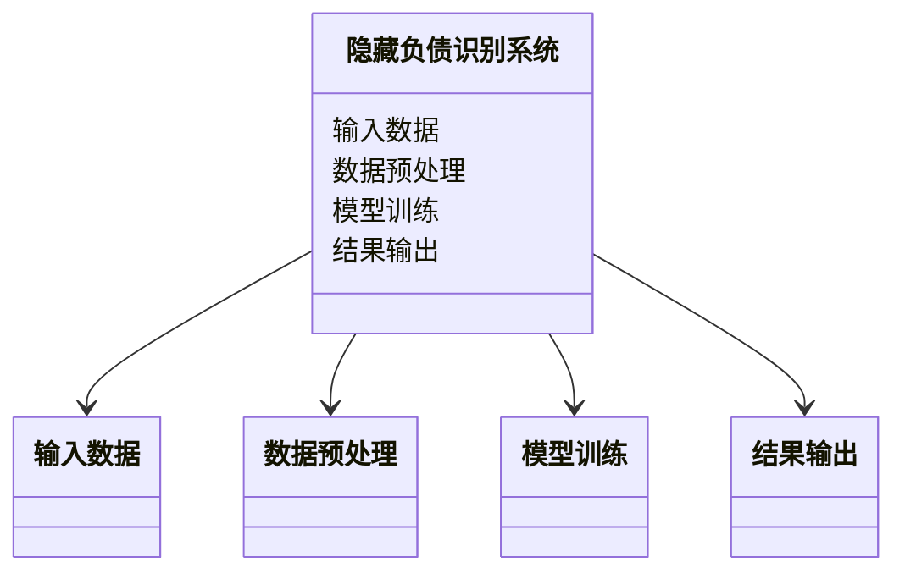
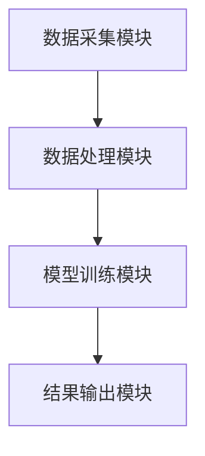
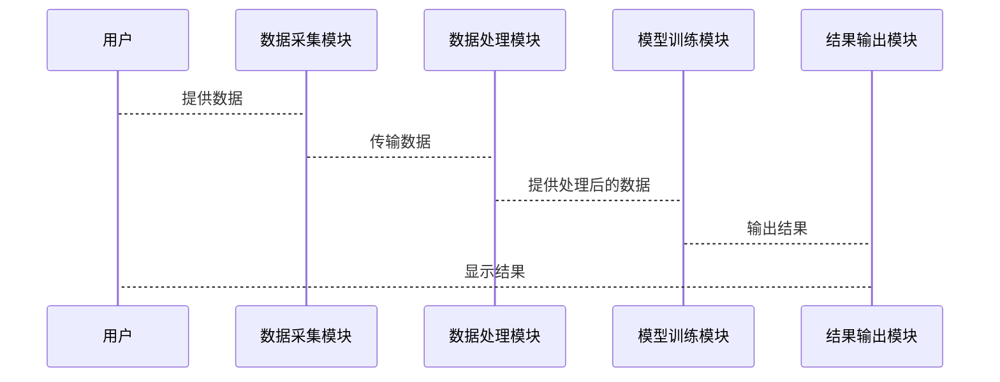

                 


# AI智能体在识别隐藏负债中的应用

## 关键词
AI智能体, 隐藏负债, 机器学习, 数据挖掘, 自然语言处理

## 摘要
隐藏负债是指企业在财务报表中未明确列出的债务，可能对企业财务健康和风险管理造成重大影响。随着人工智能技术的发展，AI智能体在识别隐藏负债方面展现出巨大潜力。本文将从背景介绍、核心概念、算法原理、系统设计、项目实战等方面详细探讨AI智能体在识别隐藏负债中的应用，分析其优势和挑战，并展望未来的发展方向。

---

# 第一部分: 隐藏负债与AI智能体概述

## 第1章: 隐藏负债的定义与重要性

### 1.1 隐藏负债的概念与特征
#### 1.1.1 隐藏负债的定义
隐藏负债是指企业在财务报表中未明确列示，但可能对企业财务状况产生重大影响的债务。这些负债通常隐藏在关联交易、或有事项或未决诉讼中。

#### 1.1.2 隐藏负债的特征
- **隐秘性**：隐藏负债通常未在财务报表中明确披露。
- **潜在性**：可能对企业未来财务状况产生重大影响。
- **复杂性**：涉及关联交易、法律纠纷等复杂因素。

#### 1.1.3 隐藏负债的分类
- **或有负债**：如未决诉讼、担保等。
- **隐含负债**：如未记录的关联交易债务。
- **其他隐藏负债**：如潜在的环保责任等。

### 1.2 隐藏负债对企业的影响
#### 1.2.1 对企业财务健康的影响
隐藏负债可能导致企业财务状况被低估，影响投资者信心和融资能力。

#### 1.2.2 对风险管理的影响
隐藏负债增加了企业的财务风险，可能引发连锁反应。

#### 1.2.3 对审计与合规的影响
隐藏负债可能违反会计准则和法规，导致企业面临法律风险。

### 1.3 AI智能体在识别隐藏负债中的作用
#### 1.3.1 AI智能体的基本概念
AI智能体是一种能够感知环境、自主决策并执行任务的智能系统，广泛应用于数据分析、模式识别等领域。

#### 1.3.2 AI智能体在财务分析中的优势
- **高效性**：AI智能体能够快速处理大量数据。
- **准确性**：通过机器学习算法，AI智能体能够识别隐藏模式。
- **实时性**：AI智能体可以实时监控财务数据，及时发现潜在问题。

#### 1.3.3 AI智能体在识别隐藏负债中的应用前景
随着企业对风险管理的需求增加，AI智能体在识别隐藏负债中的应用将越来越重要。

---

## 第2章: AI智能体的核心技术与原理

### 2.1 AI智能体的核心技术
#### 2.1.1 机器学习算法
- **监督学习**：用于分类和回归任务。
- **无监督学习**：用于聚类和异常检测。
- **深度学习**：用于复杂模式识别。

#### 2.1.2 自然语言处理
- **文本分析**：从财务报告和合同文本中提取信息。
- **实体识别**：识别隐藏负债相关的实体。

#### 2.1.3 数据挖掘与分析
- **数据清洗**：处理缺失值和异常值。
- **特征工程**：提取有用的特征用于模型训练。
- **预测建模**：构建预测模型识别隐藏负债。

### 2.2 AI智能体的工作原理
#### 2.2.1 数据采集与预处理
- 数据来源：企业财务报表、关联交易记录、法律文书等。
- 数据清洗：处理数据中的噪声和不一致。
- 数据标注：标注隐藏负债的样本数据。

#### 2.2.2 模型训练与优化
- **训练数据**：使用标注的隐藏负债数据训练模型。
- **模型选择**：选择合适的算法（如逻辑回归、随机森林）。
- **模型优化**：调整参数和超参数，提升性能。

#### 2.2.3 结果输出与解释
- **输出结果**：模型预测隐藏负债的可能性。
- **结果解释**：分析模型决策的原因和依据。

### 2.3 AI智能体的优缺点对比
#### 2.3.1 优点
- 高效性：AI智能体能够快速处理大量数据。
- 准确性：通过机器学习算法，AI智能体能够识别隐藏模式。
- 实时性：AI智能体可以实时监控财务数据，及时发现潜在问题。

#### 2.3.2 缺点
- **数据依赖性**：模型性能依赖于数据质量和数量。
- **黑箱问题**：模型决策难以解释。
- **计算成本**：训练和推理需要大量计算资源。

#### 2.3.3 改善方向
- 提高模型可解释性。
- 优化数据采集和预处理流程。
- 降低计算成本，提升效率。

---

# 第二部分: 隐藏负债识别的AI智能体系统设计

## 第3章: 隐藏负债识别的系统架构

### 3.1 系统总体架构
#### 3.1.1 数据采集模块
- 数据来源：企业财务报表、关联交易记录、法律文书等。
- 数据格式：结构化数据（如表格）和非结构化数据（如文本）。

#### 3.1.2 数据处理模块
- 数据清洗：处理缺失值和异常值。
- 数据标注：标注隐藏负债的样本数据。
- 特征工程：提取有用的特征用于模型训练。

#### 3.1.3 模型训练模块
- 模型选择：选择合适的算法（如逻辑回归、随机森林）。
- 模型训练：使用标注的隐藏负债数据训练模型。
- 模型优化：调整参数和超参数，提升性能。

#### 3.1.4 结果输出模块
- 输出结果：模型预测隐藏负债的可能性。
- 结果解释：分析模型决策的原因和依据。

### 3.2 系统功能设计
#### 3.2.1 领域模型设计


#### 3.2.2 系统架构设计


#### 3.2.3 接口设计
- 数据接口：与企业财务系统对接。
- 模型接口：与其他系统集成。
- 用户接口：提供友好的操作界面。

#### 3.2.4 交互流程图


---

## 第4章: 系统实现与项目实战

### 4.1 环境安装
- **Python**：安装Python 3.8及以上版本。
- **机器学习库**：安装scikit-learn、XGBoost、TensorFlow等。
- **文本处理库**：安装nltk、spaCy。
- **可视化工具**：安装Matplotlib、Seaborn。

### 4.2 核心代码实现
#### 4.2.1 数据预处理代码
```python
import pandas as pd
import numpy as np

# 读取数据
df = pd.read_csv('hidden_liabilities.csv')

# 数据清洗
df.dropna(inplace=True)
df = df[~df['amount'].isnull()]

# 特征工程
from sklearn.preprocessing import StandardScaler
scaler = StandardScaler()
df[['amount', 'date_diff']] = scaler.fit_transform(df[['amount', 'date_diff']])
```

#### 4.2.2 模型训练代码
```python
from sklearn.model_selection import train_test_split
from sklearn.ensemble import RandomForestClassifier
from sklearn.metrics import accuracy_score

# 划分数据集
X = df.drop('label', axis=1)
y = df['label']
X_train, X_test, y_train, y_test = train_test_split(X, y, test_size=0.2)

# 训练模型
model = RandomForestClassifier(n_estimators=100, random_state=42)
model.fit(X_train, y_train)

# 评估模型
y_pred = model.predict(X_test)
print("Accuracy:", accuracy_score(y_test, y_pred))
```

#### 4.2.3 模型解释代码
```python
from sklearn.inspection import permutation_importances

# 计算特征重要性
importances = permutation_importances(model, X_test, y_test, n_repeats=10)
importances_df = pd.DataFrame({'feature': X.columns, 'importance': importances})
print(importances_df.sort_values('importance', ascending=False))
```

### 4.3 实际案例分析
假设某企业存在隐藏负债，我们可以通过上述系统识别其隐藏负债。例如，通过分析企业的关联交易和财务数据，模型可以预测隐藏负债的可能性，并提供相关的解释和建议。

### 4.4 项目小结
通过实际案例分析，我们可以看到AI智能体在识别隐藏负债中的巨大潜力。然而，实际应用中还需要考虑数据质量和模型解释性等问题。

---

## 第5章: 总结与展望

### 5.1 总结
AI智能体通过机器学习算法和自然语言处理技术，能够高效、准确地识别隐藏负债。本文详细探讨了AI智能体的核心技术、系统设计和项目实战，展示了其在隐藏负债识别中的应用前景。

### 5.2 展望
未来，随着技术的进步，AI智能体在隐藏负债识别中的应用将更加广泛。同时，如何提高模型的可解释性和降低计算成本是需要进一步研究的方向。

---

## 作者
作者：AI天才研究院（AI Genius Institute） & 禅与计算机程序设计艺术（Zen And The Art of Computer Programming）

---

通过以上结构和内容，文章详细探讨了AI智能体在识别隐藏负债中的应用，从背景介绍到系统设计，再到项目实战，全面展示了其技术细节和实际应用价值。

