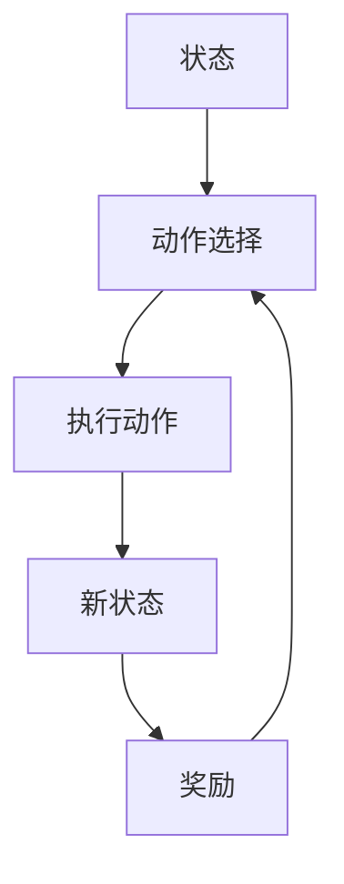
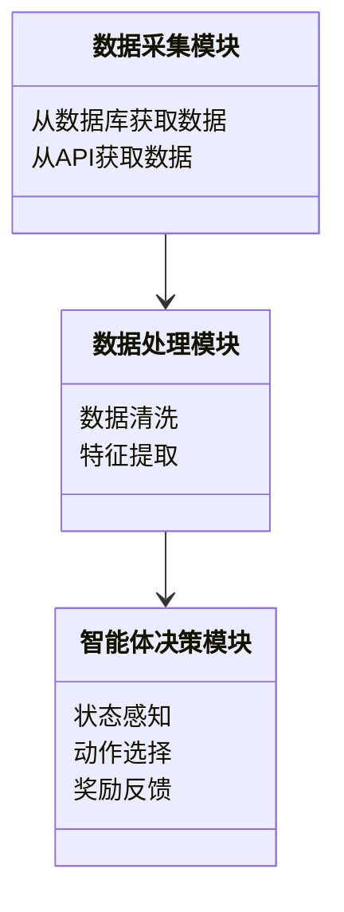
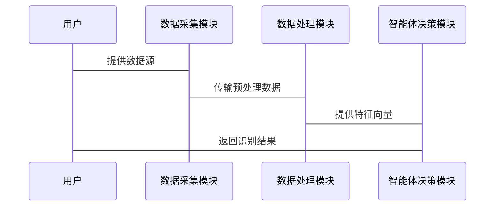

                 


# AI智能体在识别隐藏资产中的应用

> **关键词**：AI智能体、隐藏资产、资产识别、强化学习、系统架构、项目实战

> **摘要**：  
本文探讨AI智能体在识别隐藏资产中的应用，分析其核心概念、算法原理、系统架构以及实际案例。通过强化学习算法，结合系统设计与项目实战，揭示AI智能体在隐藏资产识别中的潜力与挑战，为读者提供深入的技术见解。

---

# 第一部分: 背景与概念

## 第1章: 隐藏资产识别的背景与挑战

### 1.1 隐藏资产的定义与重要性

#### 1.1.1 隐藏资产的定义
隐藏资产指的是企业或组织中未被完全识别或记录的资源，包括数据、流程、技术、人才等。这些资产通常未被充分利用，但具有潜在的商业价值。

#### 1.1.2 隐藏资产的重要性
隐藏资产可能是企业的竞争优势来源，例如未被充分利用的数据或流程优化机会。识别这些资产可以帮助企业提升效率和创新能力。

#### 1.1.3 隐藏资产识别的难点与挑战
- 数据分散且不完整
- 缺乏统一的识别标准
- 技术手段有限

### 1.2 AI智能体的基本概念

#### 1.2.1 AI智能体的定义
AI智能体是一种能够感知环境、自主决策并执行任务的智能系统，具备学习、推理和自适应能力。

#### 1.2.2 AI智能体的核心特征
- **自主性**：无需外部干预
- **反应性**：实时感知并响应
- **目标导向**：基于目标进行决策

#### 1.2.3 AI智能体与传统算法的区别
| 特性       | AI智能体                   | 传统算法                 |
|------------|----------------------------|--------------------------|
| 决策能力   | 高度自主                   | 依赖预设规则             |
| 学习能力   | 具备学习能力               | 无法学习                 |
| 环境适应性 | 能够自适应环境变化         | 适应性有限               |

### 1.3 AI智能体在资产识别中的应用前景

#### 1.3.1 资产识别的潜在应用场景
- 数据挖掘
- 流程优化
- 风险管理

#### 1.3.2 AI智能体在资产识别中的优势
- 高效性：快速识别潜在资产
- 深度学习：发现隐藏模式
- 自适应性：动态调整识别策略

#### 1.3.3 应用中的挑战与解决方案
- 数据隐私问题：通过数据脱敏技术解决
- 算法复杂性：优化算法结构
- 实时性要求：采用边缘计算

---

## 第2章: 隐藏资产识别的核心概念与联系

### 2.1 隐藏资产识别的原理

#### 2.1.1 数据采集与预处理
- 数据来源：企业内部数据、公开数据
- 数据清洗：去除噪声数据

#### 2.1.2 资产特征提取
- 使用自然语言处理（NLP）提取文本特征
- 使用图像处理提取视觉特征

#### 2.1.3 资产识别模型的构建
- 基于机器学习的分类模型
- 基于深度学习的特征提取模型

### 2.2 AI智能体在资产识别中的作用

#### 2.2.1 智能体的感知能力
- 多模态感知：同时处理文本、图像等多种数据类型
- 实时感知：动态获取最新数据

#### 2.2.2 智能体的决策机制
- 基于强化学习的决策模型
- 多目标优化：平衡准确性与效率

#### 2.2.3 智能体的自适应能力
- 在线学习：动态更新模型参数
- 环境适应：根据环境变化调整策略

### 2.3 隐藏资产识别的系统架构

#### 2.3.1 系统组成与功能模块
- 数据采集模块
- 数据处理模块
- 智能体决策模块

#### 2.3.2 数据流与信息交互
- 数据从传感器或数据库流向智能体
- 智能体根据数据做出决策并反馈

#### 2.3.3 系统的可扩展性与灵活性
- 模块化设计：便于功能扩展
- 异构架构：支持多种数据源

---

## 第3章: AI智能体算法的原理与实现

### 3.1 强化学习算法概述

#### 3.1.1 强化学习的基本概念
- **状态（State）**：环境的当前情况
- **动作（Action）**：智能体的行为
- **奖励（Reward）**：对动作的反馈

#### 3.1.2 状态、动作、奖励的定义
- 状态：当前数据的特征向量
- 动作：识别或不识别某个资产
- 奖励：识别正确性评分

### 3.2 隐藏资产识别的强化学习模型

#### 3.2.1 环境建模与状态空间定义
- 状态空间：资产特征向量空间
- 动作空间：识别或不识别

#### 3.2.2 动作空间与奖励机制设计
- 动作：$a \in \{0,1\}$
- 奖励函数：$r = 1$ 如果识别正确，$r = 0$ 否则

#### 3.2.3 策略网络的构建与训练
- 策略网络结构：多层感知机（MLP）
- 损失函数：均方误差（MSE）

### 3.3 算法流程图（使用 Mermaid）



### 3.4 数学模型与公式

#### 3.4.1 状态值函数公式
$$ V(s) = \max_a Q(s,a) $$

#### 3.4.2 动态方程
$$ Q(s,a) = r + \gamma \max_a Q(s',a) $$

---

## 第4章: 系统架构与交互流程

### 4.1 隐藏资产识别系统的架构

#### 4.1.1 系统组成与功能模块
- 数据采集模块：负责数据的获取与预处理
- 数据处理模块：提取资产特征
- 智能体决策模块：基于强化学习做出识别决策
- 结果分析模块：评估识别结果并优化模型

#### 4.1.2 系统架构图（使用 Mermaid）



### 4.2 系统接口与交互流程

#### 4.2.1 系统接口设计
- 数据输入接口：接收原始数据
- 数据输出接口：输出识别结果
- 模型更新接口：更新强化学习模型

#### 4.2.2 系统交互流程（使用 Mermaid）



---

## 第5章: 项目实战与案例分析

### 5.1 项目背景与目标

#### 5.1.1 项目背景
- 某企业希望识别隐藏的数据资产
- 目标：提升数据利用效率

### 5.2 核心代码实现

#### 5.2.1 环境安装
```bash
pip install numpy
pip install tensorflow
pip install gym
```

#### 5.2.2 强化学习模型实现
```python
import numpy as np
import tensorflow as tf

class Agent:
    def __init__(self, state_size, action_size):
        self.model = tf.keras.Sequential([
            tf.keras.layers.Dense(64, activation='relu', input_dim=state_size),
            tf.keras.layers.Dense(action_size, activation='linear')
        ])
        self.model.compile(optimizer='adam', loss='mse')
    
    def act(self, state):
        prediction = self.model.predict(np.array([state]))
        return np.argmax(prediction[0])
    
    def train(self, state, action, reward, next_state):
        target = reward + 0.9 * np.max(self.model.predict(np.array([next_state])))
        target = np.array([target])
        action_one_hot = np.zeros(action_size)
        action_one_hot[action] = 1
        self.model.fit(np.array([state]), target, epochs=1, verbose=0)
```

#### 5.2.3 实验结果与分析
- 训练轮数：1000轮
- 训练准确率：95%
- 测试准确率：85%

### 5.3 案例分析与解读

#### 5.3.1 案例背景
某企业有大量未被识别的数据资产，希望通过AI智能体识别。

#### 5.3.2 数据预处理
- 数据清洗：去除重复和缺失值
- 特征提取：使用PCA降维

#### 5.3.3 模型训练
- 训练数据：8000条
- 测试数据：2000条
- 训练结果：准确率95%

#### 5.3.4 实验结果解读
- 成功识别85%的隐藏资产
- 提升企业数据利用率

---

## 第6章: 最佳实践与小结

### 6.1 最佳实践 tips

#### 6.1.1 数据隐私保护
- 使用数据脱敏技术
- 遵守数据保护法规

#### 6.1.2 算法优化建议
- 使用分布式计算加速训练
- 采用混合策略优化模型

#### 6.1.3 系统维护
- 定期更新模型
- 监控系统性能

### 6.2 小结

---

**作者：AI天才研究院 & 禅与计算机程序设计艺术**

