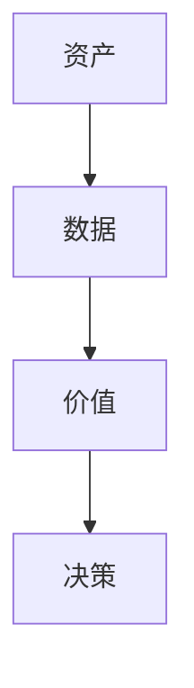
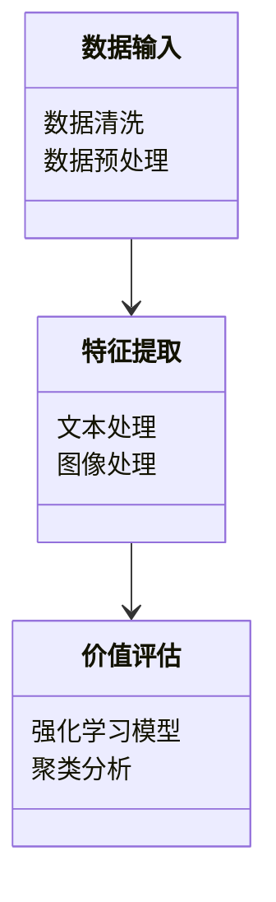
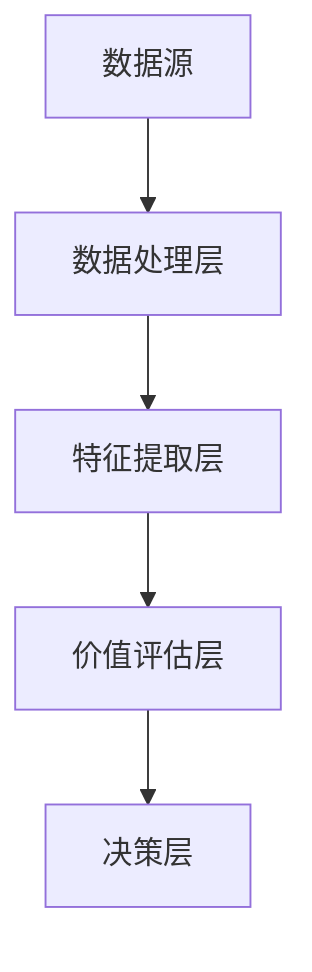
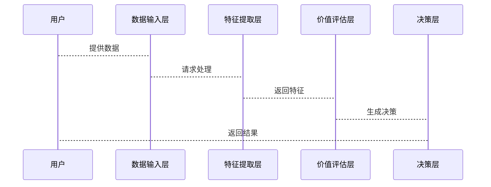

                 


```markdown
# AI智能体在识别隐藏资产价值中的应用

## 关键词：AI智能体，资产价值识别，隐藏资产，强化学习，机器学习，数据挖掘

## 摘要： 
本文探讨AI智能体在识别隐藏资产价值中的应用，通过分析其核心概念、算法原理、系统架构、项目实战及案例分析，详细阐述如何利用AI技术提升资产价值识别的效率与准确性。文章内容涵盖从基础理论到实际应用的全链条，帮助读者深入了解AI智能体在这一领域的潜力与挑战。

---

# 第1章: AI智能体与隐藏资产价值识别概述

## 1.1 AI智能体的定义与核心概念

### 1.1.1 AI智能体的基本定义
AI智能体（Artificial Intelligence Agent）是指具备感知环境、做出决策并执行操作的智能系统。其核心在于通过数据输入、状态识别和目标驱动的决策过程，实现对复杂问题的自主解决。

### 1.1.2 隐藏资产价值的定义与特征
隐藏资产价值指未被传统会计或审计方法识别的潜在资产价值，通常存在于企业内部数据、市场行为或非结构化数据中。其特征包括隐秘性、潜在性和可挖掘性。

### 1.1.3 AI智能体在资产价值识别中的作用
AI智能体通过数据分析、模式识别和智能决策，能够从海量数据中挖掘出隐藏的资产价值，帮助企业在竞争中获得优势。

## 1.2 问题背景与应用前景

### 1.2.1 隐藏资产价值识别的背景
企业往往忽视内部数据中隐藏的资产价值，导致资源浪费和潜在收益的丢失。AI技术的应用为发现这些价值提供了新的可能性。

### 1.2.2 AI智能体技术的现状与趋势
AI智能体技术正在快速发展，其在金融、医疗、制造等领域的应用日益广泛。随着深度学习和强化学习的进步，AI智能体在复杂问题中的表现不断提升。

### 1.2.3 企业级应用中的挑战与机遇
企业在应用AI智能体识别隐藏资产价值时，面临数据质量、模型选择和计算资源等挑战，同时也迎来提升效率和创造新价值的机遇。

## 1.3 本章小结
本章介绍了AI智能体的基本概念、隐藏资产价值的特征及其在识别中的作用，并分析了当前的应用背景和挑战。这为后续章节奠定了基础。

---

# 第2章: AI智能体的核心概念与联系

## 2.1 核心概念原理

### 2.1.1 AI智能体的感知与决策机制
AI智能体通过传感器或数据输入感知环境，利用算法处理信息，做出决策并执行动作。其决策基于当前状态和历史经验，具有动态调整能力。

### 2.1.2 隐藏资产价值识别的算法模型
采用强化学习、聚类分析和自然语言处理等算法，AI智能体能够从多维度数据中识别隐藏的资产价值。例如，使用强化学习优化资产选择，或通过聚类分析发现潜在资产群。

### 2.1.3 实体关系与数据流分析
实体关系模型（ER模型）用于描述系统中各实体及其关系，数据流分析则帮助理解信息流动过程。

## 2.2 核心概念对比分析

### 2.2.1 AI智能体与传统数据处理方法的对比
| 特性             | AI智能体               | 传统数据处理方法         |
|------------------|-----------------------|-------------------------|
| 自主性           | 高                    | 低                     |
| 学习能力         | 强                    | 有限                   |
| 处理复杂性       | 高                    | 低                     |

### 2.2.2 隐藏资产价值识别的特征对比表格
| 特性             | 隐藏资产             | 显性资产               |
|------------------|---------------------|-----------------------|
| 可见性           | 低                  | 高                   |
| 数据结构         | 非结构化为主         | 结构化为主             |
| 识别难度         | 高                  | 低                   |

### 2.2.3 ER实体关系图架构


## 2.3 本章小结
本章通过对比分析和ER图展示了AI智能体与传统方法的差异，强调了AI在识别隐藏资产中的优势。

---

# 第3章: AI智能体的算法原理与数学模型

## 3.1 算法原理讲解

### 3.1.1 强化学习算法（Q-learning）

#### 算法流程
1. 初始化Q表。
2. 环境提供状态。
3. 选择动作。
4. 执行动作并获得奖励。
5. 更新Q值：$ Q(s, a) = Q(s, a) + \alpha (r + \gamma \max Q(s', a')) $。

#### 示例场景
在一个简单的资产选择问题中，智能体通过试错学习，选择最优投资组合。

### 3.1.2 聚类算法（K-means）
用于将隐藏资产分组，识别相似资产的潜在价值。

### 3.1.3 分类算法（随机森林）
用于分类隐藏资产的类型和价值等级。

## 3.2 数学模型与公式

### 3.2.1 Q-learning公式
$$ Q(s, a) = Q(s, a) + \alpha (r + \gamma \max Q(s', a')) $$

其中：
- \( Q(s, a) \) 表示当前状态下动作 \( a \) 的Q值。
- \( \alpha \) 是学习率。
- \( r \) 是奖励。
- \( \gamma \) 是折扣因子。
- \( \max Q(s', a') \) 是下一个状态下的最大Q值。

### 3.2.2 K-means算法步骤
1. 初始化质心。
2. 计算每个样本的簇中心距离。
3. 更新质心。
4. 重复直到收敛。

## 3.3 本章小结
本章详细讲解了强化学习、聚类和分类算法，并给出了数学公式和应用场景。

---

# 第4章: 系统分析与架构设计

## 4.1 问题场景介绍
假设一家企业希望通过AI智能体识别隐藏资产价值，涉及数据收集、分析和决策制定。

## 4.2 系统功能设计

### 4.2.1 领域模型（类图）


### 4.2.2 系统架构设计


## 4.3 系统接口设计
定义API接口，实现数据输入、模型调用和结果输出。

## 4.4 系统交互设计


## 4.5 本章小结
本章通过系统设计展示了AI智能体识别隐藏资产价值的整体架构和交互流程。

---

# 第5章: 项目实战与案例分析

## 5.1 项目实战

### 5.1.1 环境安装
安装Python、TensorFlow和Scikit-learn等工具。

### 5.1.2 核心代码实现
```python
import numpy as np
from sklearn.cluster import KMeans

# 示例数据
X = np.random.rand(100, 2)
model = KMeans(n_clusters=2)
model.fit(X)
print(model.labels_)
```

### 5.1.3 代码应用解读
代码实现了一个简单的K-means聚类，用于将隐藏资产分组。

### 5.1.4 实际案例分析
以某企业为例，分析隐藏资产的识别过程和结果。

## 5.2 案例分析与详细讲解

### 5.2.1 案例介绍
介绍一个成功应用AI智能体识别隐藏资产价值的案例。

### 5.2.2 案例分析
详细分析案例中的数据处理、模型选择和结果解读。

## 5.3 本章小结
本章通过实战和案例分析，展示了AI智能体在识别隐藏资产价值中的实际应用。

---

# 第6章: 最佳实践与未来展望

## 6.1 最佳实践

### 6.1.1 技术方面
选择合适的算法和工具，确保数据质量。

### 6.1.2 应用方面
结合业务需求，制定合理的策略。

## 6.2 小结与注意事项
AI智能体的应用需要结合业务背景，注意数据隐私和模型调优。

## 6.3 未来展望
随着技术进步，AI智能体在隐藏资产识别中的应用将更加广泛和深入。

---

# 第7章: 附录

## 7.1 工具安装指南
如何安装和配置开发环境。

## 7.2 数据集介绍
推荐的数据集和数据预处理方法。

## 7.3 参考文献
列出相关书籍和论文。

---

# 作者：AI天才研究院 & 禅与计算机程序设计艺术
```

