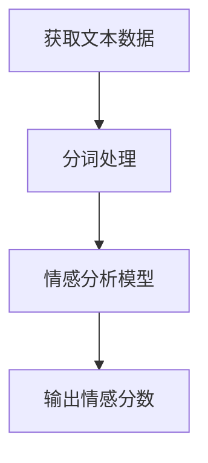
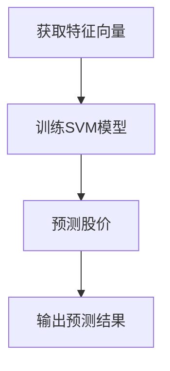
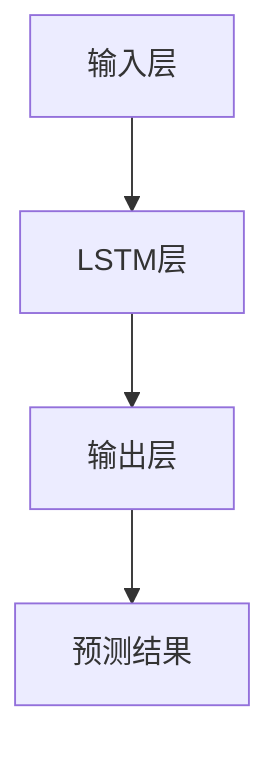
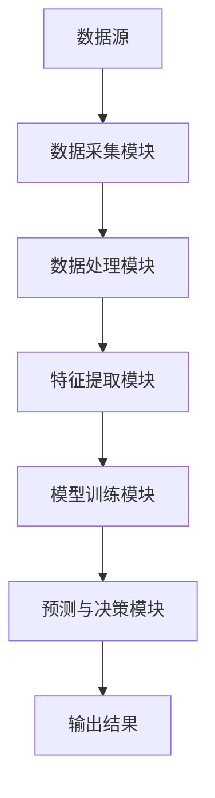
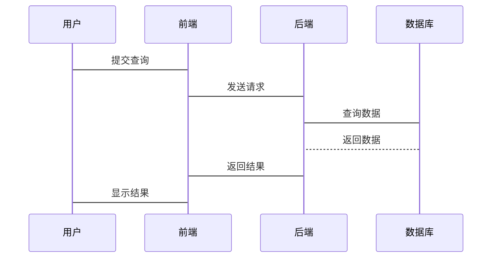

                 


# AI智能体如何识别被低估的价值股

> 关键词：人工智能、股票分析、价值识别、机器学习、自然语言处理、时间序列分析

> 摘要：本文将探讨AI智能体如何通过先进的算法和数据分析技术识别被低估的价值股。我们从背景介绍、核心概念、算法原理、系统设计到项目实战，逐步分析AI在价值股识别中的应用。通过结合自然语言处理、机器学习和时间序列分析等技术，我们展示了如何构建一个高效的AI智能体，帮助投资者发现潜在的投资机会。

---

# 第一部分: AI智能体与价值股识别的背景与基础

# 第1章: AI智能体与价值股识别的背景

## 1.1 问题背景与目标

### 1.1.1 传统价值股识别的局限性
传统的价值股识别依赖于人工分析，存在以下问题：
- 数据量庞大，难以快速筛选。
- 分析主观性强，容易受分析师情绪影响。
- 市场波动快，人工分析难以及时捕捉机会。

### 1.1.2 AI智能体在金融分析中的优势
AI智能体的优势在于：
- 高效处理海量数据，快速筛选潜在价值股。
- 通过算法消除人为情绪干扰，提高分析准确性。
- 实时监控市场动态，捕捉短期波动机会。

### 1.1.3 价值股识别的核心目标
价值股识别的核心目标是：
- 发现市场价格低于其内在价值的股票。
- 帮助投资者在市场波动中发现被低估的投资机会。

## 1.2 问题描述与解决路径

### 1.2.1 价值股识别的关键挑战
- 数据异质性：金融数据来源多样，格式复杂。
- 高维度性：涉及财务指标、市场情绪等多维度信息。
- 非线性关系：股票价格与多种因素相关，难以线性建模。

### 1.2.2 AI智能体的解决方案
- 数据预处理：统一数据格式，消除噪声。
- 特征提取：利用NLP提取文本特征，结合财务指标。
- 模型训练：使用机器学习和深度学习算法进行预测。

### 1.2.3 问题的边界与外延
- 边界：专注于识别被低估的价值股，不涉及高频交易。
- 外延：可扩展至其他类型股票分析，如成长股、周期股等。

## 1.3 核心概念与联系

### 1.3.1 AI智能体的定义与属性
- **定义**：AI智能体是一种能够感知环境、做出决策并采取行动的智能系统。
- **属性**：
  - 感知能力：通过数据输入感知市场动态。
  - 决策能力：基于数据做出价值股判断。
  - 行动能力：通过输出模块指导投资决策。

### 1.3.2 价值股识别的关键要素
- **内在价值**：公司基本面分析的核心。
- **市场价格**：与内在价值的偏离程度。
- **市场情绪**：投资者情绪对股价的影响。

### 1.3.3 核心概念的ER实体关系图

```mermaid
erDiagram
    company : id, name, industry, market_value
    stock : id, company_id, price, date
    news : id, company_id, content, date
    financial_report : id, company_id, content, date
    market_sentiment : id, company_id, sentiment_score, date
    value_prediction : id, company_id, predicted_value, date
```

---

# 第2章: 价值股识别的理论基础

## 2.1 价值股识别的核心理论

### 2.1.1 基本面分析的核心要素
基本面分析包括以下要素：
- 财务状况：收入、利润、资产负债情况。
- 行业地位：市场占有率、竞争能力。
- 管理团队：管理层稳定性与能力。

### 2.1.2 技术面分析的关键指标
技术面分析的关键指标包括：
- 移动平均线（MA）。
- 相对强弱指数（RSI）。
- 布林带（Bollinger Bands）。

### 2.1.3 市场情绪对股价的影响
市场情绪通过以下方式影响股价：
- 投资者情绪波动导致股价短期波动。
- 市场情绪指数（如VIX指数）反映市场风险偏好。

## 2.2 AI在金融分析中的技术基础

### 2.2.1 机器学习在金融预测中的应用
机器学习在金融中的应用包括：
- 监督学习：用于分类和回归任务。
- 非监督学习：用于聚类分析。
- 强化学习：用于动态决策。

### 2.2.2 自然语言处理在财经文本分析中的作用
NLP在财经文本分析中的作用包括：
- 从新闻和财报中提取情感信息。
- 分析市场情绪对股价的影响。
- 检测潜在的财务风险信号。

### 2.2.3 时间序列分析在股价预测中的价值
时间序列分析的价值在于：
- 捕捉股价的周期性变化。
- 识别市场趋势。
- 预测未来股价走势。

---

# 第3章: 价值股识别的算法原理

## 3.1 基于文本挖掘的价值股识别

### 3.1.1 文本数据的预处理流程
文本数据预处理步骤包括：
1. 数据清洗：去除噪声和无关信息。
2. 分词处理：将文本分割成单词或短语。
3. 去除停用词：去掉常见词汇（如“的”、“是”）。
4. 词干提取或词嵌入：生成有意义的词汇表示。

### 3.1.2 基于NLP的情感分析算法
情感分析算法流程如下：



### 3.1.3 文本挖掘在价值股识别中的应用
文本挖掘的应用包括：
- 分析财经新闻的情绪对股价的影响。
- 监测市场对公司的看法变化。
- 发现潜在的市场趋势。

## 3.2 基于机器学习的价值股预测

### 3.2.1 常见的机器学习算法对比
常见算法对比：

| 算法类型       | 优势               | 劣势               |
|----------------|--------------------|--------------------|
| 支持向量机 (SVM)| 高维数据表现好     | 不适合大数据量     |
| 随机森林 (RF)  | 抗噪声能力强       | 对超参数敏感       |
| 神经网络 (NN)  | 适合复杂非线性问题  | 需大量计算资源     |

### 3.2.2 支持向量机在股票预测中的应用
支持向量机的应用流程：



### 3.2.3 随机森林模型的特征选择
随机森林的特征选择方法包括：
- 特征重要性评分。
- 去除冗余特征。

## 3.3 基于时间序列分析的股价预测

### 3.3.1 时间序列分析的基本原理
时间序列分析的基本假设：
- 数据具有趋势性和周期性。
- 可通过历史数据预测未来走势。

### 3.3.2 基于ARIMA模型的股价预测
ARIMA模型的三个参数：
- p：自回归阶数。
- d：差分阶数。
- q：移动平均阶数。

ARIMA模型公式：

$$ ARIMA(p, d, q) = y_t = \phi_1 y_{t-1} + \dots + \phi_p y_{t-p} + \theta_1 \epsilon_{t-1} + \dots + \theta_q \epsilon_{t-q} + \epsilon_t $$

### 3.3.3 基于LSTM网络的股价预测
LSTM网络的优势：
- 能够捕捉长期依赖关系。
- 适合处理时间序列数据。

LSTM网络结构：



---

# 第4章: 价值股识别的系统设计

## 4.1 价值股识别系统的功能设计

### 4.1.1 系统功能模块
系统功能模块包括：
1. 数据采集模块：从多种数据源获取数据。
2. 数据处理模块：清洗和转换数据。
3. 特征提取模块：生成可用于模型的特征。
4. 模型训练模块：训练机器学习模型。
5. 预测与决策模块：输出预测结果并指导投资决策。

### 4.1.2 系统功能流程图



## 4.2 系统架构设计

### 4.2.1 系统架构图


### 4.2.2 系统接口设计
系统接口包括：
1. 数据接口：与数据源对接。
2. 模型接口：与机器学习模型对接。
3. 用户接口：与前端交互。

### 4.2.3 系统交互流程图



---

# 第5章: 价值股识别的项目实战

## 5.1 环境配置与安装

### 5.1.1 开发环境
- 操作系统：Linux/Windows/MacOS
- Python版本：3.8以上
- 依赖库：numpy、pandas、scikit-learn、tensorflow、keras、nltk

### 5.1.2 数据源获取
- 数据源：Yahoo Finance、Alpha Vantage、Reuters
- 数据格式：CSV/JSON

## 5.2 系统核心实现

### 5.2.1 数据预处理代码

```python
import pandas as pd
import numpy as np

# 读取数据
data = pd.read_csv('stock_data.csv')

# 删除缺失值
data.dropna(inplace=True)

# 标准化处理
from sklearn.preprocessing import StandardScaler
scaler = StandardScaler()
data_scaled = scaler.fit_transform(data)
```

### 5.2.2 情感分析模型实现

```python
from sklearn.svm import SVC
from sklearn.metrics import accuracy_score

# 训练SVM模型
model = SVC()
model.fit(X_train, y_train)

# 预测并评估
y_pred = model.predict(X_test)
print("准确率:", accuracy_score(y_test, y_pred))
```

### 5.2.3 ARIMA模型实现

```python
from statsmodels.tsa.arima_model import ARIMA

# 训练ARIMA模型
model = ARIMA(train_data, order=(5,1,0))
model_fit = model.fit()

# 预测未来值
forecast = model_fit.forecast(steps=10)
```

### 5.2.4 LSTM模型实现

```python
from keras.models import Sequential
from keras.layers import LSTM, Dense

# 定义LSTM模型
model = Sequential()
model.add(LSTM(50, input_shape=(timesteps, features)))
model.add(Dense(1))
model.compile(loss='mean_squared_error', optimizer='adam')

# 训练模型
model.fit(X_train, y_train, epochs=50, batch_size=32)
```

## 5.3 项目总结与经验分享

### 5.3.1 项目小结
- 成功实现了价值股识别系统。
- 通过多种算法结合，提高了识别准确率。
- 在实际应用中，需要注意数据质量和模型调优。

### 5.3.2 最佳实践Tips
- 数据预处理是关键，确保数据质量。
- 多算法结合可以提高预测的鲁棒性。
- 定期更新模型，适应市场变化。

---

# 第6章: 总结与展望

## 6.1 总结
本文详细介绍了AI智能体在价值股识别中的应用，从理论基础到算法实现，再到系统设计，为读者提供了全面的指导。

## 6.2 展望
未来的研究方向包括：
- 更复杂的时间序列分析模型。
- 结合更多数据源的多模态分析。
- 更高效的算法优化。

---

# 作者信息

作者：AI天才研究院/AI Genius Institute & 禅与计算机程序设计艺术 /Zen And The Art of Computer Programming

---

版权归作者所有，未经授权禁止转载。

