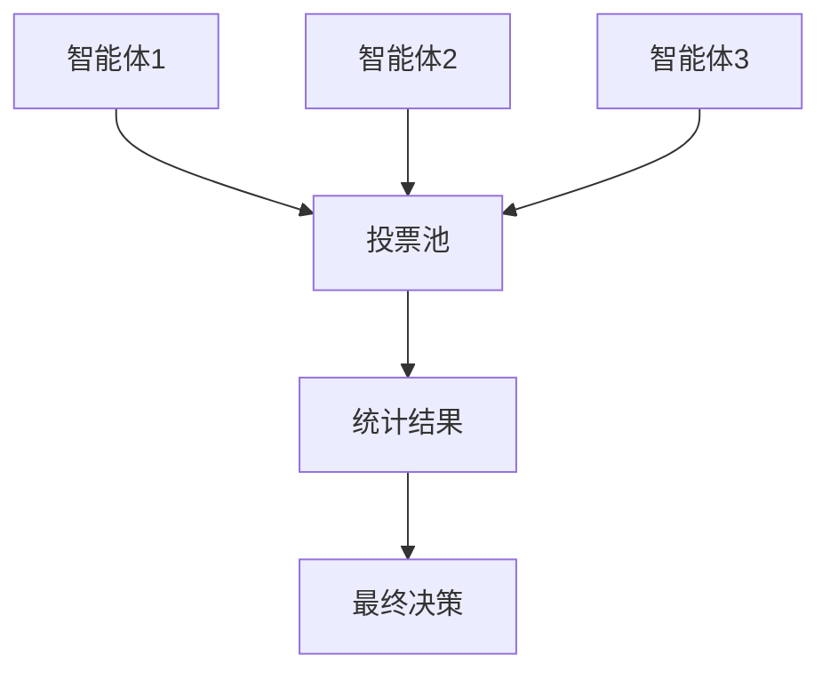
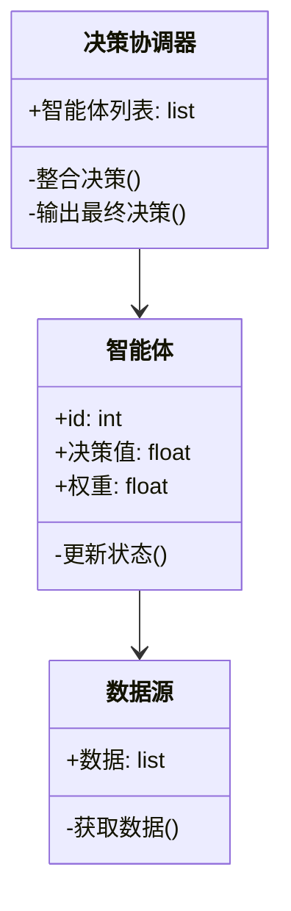

                 


**摘要：**  
本文探讨了AI智能体在群体决策中的应用，特别是如何通过群体决策提高价值投资的准确性和稳定性。文章从AI智能体的基本概念和群体决策的原理入手，分析了多种群体决策算法及其在价值投资中的应用，提出了基于AI智能体的群体决策系统架构，并通过实际案例展示了系统的实现与优化过程。文章最后总结了群体决策在价值投资中的优势，并提出了未来研究的方向。

---

# AI智能体群体决策：提高价值投资的准确性和稳定性

> **关键词：** AI智能体，群体决策，价值投资，算法，稳定性，准确性

---

## 第1章: AI智能体与群体决策基础

### 1.1 AI智能体的基本概念

#### 1.1.1 AI智能体的定义与分类  
AI智能体（Artificial Intelligence Agent）是指能够感知环境、自主决策并采取行动的智能实体。根据智能体的智能水平和应用场景，可以将其分为以下几类：  
1. **反应式智能体**：基于当前环境输入做出实时反应，适用于简单的任务（如PID控制器）。  
2. **认知式智能体**：具备复杂推理和规划能力，适用于需要策略优化的任务（如自动驾驶）。  
3. **学习型智能体**：通过机器学习算法不断优化自身决策能力，适用于动态环境（如金融交易）。  

#### 1.1.2 群体决策的定义与特点  
群体决策是指多个智能体通过协作或竞争，共同完成某项决策任务的过程。其特点包括：  
1. **去中心化**：决策过程不依赖于单一中心节点，多个智能体协同完成任务。  
2. **多样性**：不同智能体可能基于不同的数据或模型做出决策，从而提供多样化的视角。  
3. **鲁棒性**：群体决策能够通过多个个体的协同，提高整体决策的稳定性和容错性。  

#### 1.1.3 AI智能体在群体决策中的角色  
在群体决策中，AI智能体可以作为以下角色：  
- **参与者**：提供决策输入或数据支持。  
- **协调者**：负责整合不同智能体的决策结果。  
- **优化者**：通过算法优化群体决策的效率和准确性。  

---

### 1.2 价值投资的背景与挑战

#### 1.2.1 价值投资的基本原理  
价值投资是一种基于对公司内在价值的深入分析，寻找市场价格低于内在价值的投资策略。其核心在于识别被市场低估的优质资产。  

#### 1.2.2 传统价值投资的局限性  
传统价值投资依赖于分析师的主观判断，存在以下问题：  
1. **信息不对称**：分析师可能无法获取完整的市场数据。  
2. **人为误差**：主观判断容易受到情绪和偏见的影响。  
3. **效率低下**：人工分析耗时长，难以应对高频交易的需求。  

#### 1.2.3 AI智能体在价值投资中的应用前景  
AI智能体可以通过以下方式提升价值投资的效率和准确性：  
1. **数据处理能力**：快速分析海量数据，发现潜在的投资机会。  
2. **模型优化**：通过机器学习算法不断优化投资策略。  
3. **风险控制**：通过群体决策降低个体决策的偏差，提高整体决策的稳定性。  

---

## 第2章: AI智能体群体决策的核心概念与原理

### 2.1 群体决策的关键要素

#### 2.1.1 决策主体：AI智能体的属性与特征  
群体决策的主体是多个AI智能体，其属性包括：  
- **感知能力**：智能体能够获取环境中的相关信息。  
- **决策能力**：智能体能够基于感知信息做出决策。  
- **协作能力**：智能体能够与其他智能体协同完成任务。  

#### 2.1.2 决策目标：价值投资的优化方向  
群体决策的目标是优化价值投资的决策过程，具体包括：  
1. **提高决策效率**：通过群体协作减少单个智能体的计算负担。  
2. **降低决策风险**：通过多个智能体的协同，减少个体决策的偏差。  
3. **增强决策鲁棒性**：通过群体决策提高整体决策的稳定性和容错性。  

#### 2.1.3 决策环境：市场波动与数据来源  
决策环境是群体决策的基础，主要包括：  
- **市场波动**：金融市场的不确定性和波动性。  
- **数据来源**：包括历史价格、财务数据、新闻舆情等多种数据。  

---

### 2.2 群体决策的机制与模型

#### 2.2.1 基于投票的群体决策模型  
基于投票的群体决策模型是一种简单且高效的决策机制。每个智能体根据自身信息做出决策，最终通过投票的方式确定最终决策。  

**投票算法公式：**  
$$ \text{决策结果} = \sum_{i=1}^{n} w_i x_i $$  
其中，$w_i$是智能体$i$的权重，$x_i$是智能体$i$的决策结果。  

#### 2.2.2 基于共识的群体决策模型  
基于共识的群体决策模型通过不断迭代，使所有智能体的决策趋同。  

**共识算法公式：**  
$$ \text{共识值} = \frac{\sum_{i=1}^{n} v_i}{n} $$  
其中，$v_i$是智能体$i$的初始决策值，$n$是智能体的总数。  

#### 2.2.3 基于加权的群体决策模型  
基于加权的群体决策模型通过为每个智能体分配不同的权重，体现其决策的重要性和可靠性。  

---

## 第3章: AI智能体群体决策的算法原理

### 3.1 基于投票的群体决策算法

#### 3.1.1 传统投票算法的实现  
传统投票算法是一种简单但有效的群体决策方法。每个智能体根据自身信息做出决策，最终通过投票的方式确定最终决策。  

**投票算法流程图：**  


---

### 3.2 基于共识的群体决策算法

#### 3.2.1 Consensus算法的实现步骤  
1. **初始化**：所有智能体初始化为独立的决策值。  
2. **迭代更新**：每个智能体根据邻居的决策值更新自身的决策值。  
3. **收敛判断**：当所有智能体的决策值趋同或达到预设的收敛条件时，停止迭代。  

**Consensus算法的数学模型：**  
$$ \text{状态更新} = \lambda \cdot \text{邻居状态} + (1-\lambda) \cdot \text{自身状态} $$  

#### 3.2.2 Consensus算法的收敛性分析  
Consensus算法的收敛性取决于网络的连通性和智能体之间的权重分配。在完全连通的网络中，Consensus算法能够快速收敛。

---

## 第4章: 系统架构与实现

### 4.1 系统功能设计

#### 4.1.1 功能模块划分  
1. **数据采集模块**：采集市场数据（如历史价格、财务指标等）。  
2. **智能体模块**：实现多个AI智能体的决策功能。  
3. **决策协调模块**：整合多个智能体的决策结果，输出最终决策。  

#### 4.1.2 领域模型设计  
**领域模型类图：**  


---

## 第5章: 项目实战与案例分析

### 5.1 环境安装与配置

#### 5.1.1 安装依赖  
- Python 3.8+
- NumPy
- Matplotlib
- Scikit-learn

#### 5.1.2 核心代码实现  
```python
import numpy as np

class AI-Agent:
    def __init__(self, id, weight):
        self.id = id
        self.weight = weight
        self.value = 0

    def make_decision(self, data):
        # 简单的决策逻辑：基于数据计算价值
        self.value = np.mean(data)

def main():
    # 初始化智能体
    agents = [AI-Agent(1, 0.5), AI-Agent(2, 0.3), AI-Agent(3, 0.2)]
    
    # 数据采集
    data = np.random.rand(100)
    
    # 智能体决策
    for agent in agents:
        agent.make_decision(data)
    
    # 整合决策
    total = np.sum([agent.value for agent in agents])
    average = total / len(agents)
    
    print(f"最终决策值为：{average}")

if __name__ == "__main__":
    main()
```

---

## 第6章: 最佳实践与总结

### 6.1 关键点总结

#### 6.1.1 群体决策的优势  
1. **去中心化**：避免单点故障。  
2. **多样性**：多个智能体的决策可以互补。  
3. **鲁棒性**：群体决策的稳定性更高。  

#### 6.1.2 算法优化建议  
1. **动态权重分配**：根据智能体的表现动态调整权重。  
2. **混合算法**：结合多种群体决策算法，提升决策效率。  

### 6.2 小结与注意事项

#### 6.2.1 小结  
本文详细探讨了AI智能体在群体决策中的应用，分析了多种群体决策算法，并通过实际案例展示了系统的实现与优化过程。  

#### 6.2.2 注意事项  
- 群体决策系统的性能依赖于智能体的数量和算法的优化。  
- 在实际应用中，需要考虑数据的实时性和安全性。  

### 6.3 拓展阅读

#### 6.3.1 推荐书籍  
1. 《群体智能》  
2. 《分布式系统：概念与设计》  

#### 6.3.2 推荐论文  
1. "Consensus Algorithms for Distributed Systems"  
2. "Multi-Agent Systems and Their Applications"  

---

**作者：AI天才研究院/AI Genius Institute & 禅与计算机程序设计艺术 /Zen And The Art of Computer Programming**

