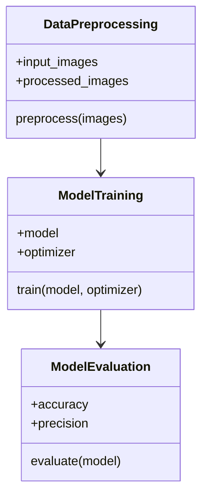

                 


# AI模型训练与优化步骤详解

> 关键词：AI模型，机器学习，深度学习，训练优化，算法优化，模型调优，性能优化

> 摘要：本文详细讲解了AI模型训练与优化的核心步骤，包括数据预处理、模型选择、优化算法设计以及系统架构设计等方面，深入分析了每个步骤的原理与实现，并通过实际案例和代码示例，帮助读者掌握AI模型训练与优化的关键技术。

---

## 第一部分: AI模型训练与优化背景介绍

## 第1章: AI模型训练与优化的核心概念

### 1.1 问题背景与问题描述

#### 1.1.1 人工智能模型训练的现状与挑战

随着人工智能技术的快速发展，AI模型的应用越来越广泛。然而，模型训练与优化的过程却面临诸多挑战：

- **数据质量问题**：数据的多样性和质量直接影响模型性能，如何处理噪声数据和数据偏差是关键。
- **计算资源限制**：训练大型模型需要大量计算资源，如何在有限资源下高效训练是重要课题。
- **模型复杂度**：复杂的模型可能导致过拟合，如何在模型复杂度与性能之间找到平衡点是一个挑战。
- **优化算法的选择**：不同的优化算法适用于不同的场景，选择合适的算法对训练效果至关重要。

#### 1.1.2 模型优化的必要性与目标

模型优化的目的是在有限资源下最大化模型性能。优化的目标包括：

1. **提高模型准确率**：通过优化算法和超参数调整，提升模型在测试集上的表现。
2. **降低训练时间**：通过优化算法和并行计算技术，缩短训练周期。
3. **减少计算资源消耗**：通过模型压缩和量化技术，降低内存占用和计算成本。

#### 1.1.3 训练与优化的关系与区别

- **训练**：通过数据拟合模型参数的过程，目的是使模型能够准确预测。
- **优化**：通过调整模型参数和超参数，使模型在训练和测试数据上表现最佳。

两者相辅相成，优化算法是训练过程中的关键环节，而训练则是优化的最终目标。

### 1.2 问题解决与边界

#### 1.2.1 模型训练与优化的主要问题

- 数据预处理的复杂性
- 模型选择的多样性
- 优化算法的多样性
- 训练过程中的过拟合问题

#### 1.2.2 解决方案的边界与限制

- 数据预处理只能解决部分数据质量问题，无法完全消除噪声。
- 优化算法的选择受限于模型结构和问题类型。
- 超参数调整需要经验积累和系统性搜索。

#### 1.2.3 相关概念的外延与内涵

- **数据预处理**：对数据进行清洗、归一化和特征提取等处理，为模型训练提供高质量输入。
- **模型训练**：利用优化算法调整模型参数，使模型在训练数据上表现最佳。
- **优化算法**：通过计算损失函数的梯度，更新模型参数，降低损失函数值。

### 1.3 核心概念与组成要素

#### 1.3.1 数据、模型、算法的关系

- 数据是模型训练的基础，决定了模型的学习能力。
- 模型是数据的映射函数，决定了模型的表达能力。
- 算法是模型优化的工具，决定了模型的收敛速度和稳定性。

#### 1.3.2 模型训练与优化的流程

1. 数据预处理：清洗数据，处理缺失值，归一化等。
2. 模型选择：选择合适的模型结构，如线性回归、神经网络等。
3. 优化算法选择：选择适合的优化算法，如随机梯度下降、Adam等。
4. 超参数调优：调整学习率、批量大小等超参数，优化模型性能。
5. 模型训练与验证：在训练集上训练模型，在验证集上调优。

#### 1.3.3 核心要素的结构化分析

| 要素 | 描述 | 作用 |
|------|------|------|
| 数据 | 输入到模型的原始或预处理数据 | 决定模型的输入特征 |
| 模型 | 学习数据的函数或算法 | 决定模型的输出和表达能力 |
| 算法 | 更新模型参数的规则 | 决定模型的收敛速度和稳定性 |

---

## 第二部分: AI模型训练与优化算法原理

## 第3章: 常见优化算法的原理与实现

### 3.1 随机梯度下降算法

#### 3.1.1 算法原理

随机梯度下降（Stochastic Gradient Descent, SGD）是一种常用优化算法，通过随机抽取一批数据，计算梯度并更新参数。其基本步骤如下：

1. 初始化模型参数。
2. 随机抽取一批数据。
3. 计算损失函数的梯度。
4. 更新模型参数，减少损失。

公式表示为：
$$ W_{new} = W_{old} - \eta \cdot \nabla W $$
其中，$\eta$ 是学习率，$\nabla W$ 是损失函数对参数的梯度。

#### 3.1.2 算法实现

```python
import numpy as np

def SGD(X, y, model, learning_rate=0.01, epochs=100):
    for epoch in range(epochs):
        np.random.shuffle(X)
        for i in range(len(X)):
            x = X[i]
            y_true = y[i]
            # 前向传播
            y_pred = model.predict(x)
            # 计算损失
            loss = np.mean((y_pred - y_true)**2)
            # 反向传播，计算梯度
            gradient = model.backward(x, y_true)
            # 更新参数
            model.weights -= learning_rate * gradient
    return model
```

### 3.2 Adam优化算法

#### 3.2.1 算法原理

Adam（Adaptive Moment Estimation）结合了动量和自适应学习率的思想，通过维护动量和方差估计，自适应调整学习率。其公式为：

$$ m_t = \beta_1 m_{t-1} + (1 - \beta_1) g_t $$
$$ v_t = \beta_2 v_{t-1} + (1 - \beta_2) g_t^2 $$
$$ \theta_{t} = \theta_{t-1} - \eta \frac{m_t}{\sqrt{v_t + \epsilon}} $$

其中，$\beta_1$ 和 $\beta_2$ 是动量和方差的系数，$\epsilon$ 是防止除以零的常数。

#### 3.2.2 算法实现

```python
class Adam:
    def __init__(self, params, lr=0.001, beta1=0.9, beta2=0.999, epsilon=1e-8):
        self.params = params
        self.lr = lr
        self.beta1 = beta1
        self.beta2 = beta2
        self.epsilon = epsilon
        self.m = [np.zeros_like(p) for p in params]
        self.v = [np.zeros_like(p) for p in params]
    
    def step(self):
        for i, (p, m, v) in enumerate(zip(self.params, self.m, self.v)):
            m[i] = self.beta1 * m[i] + (1 - self.beta1) * p.grad
            v[i] = self.beta2 * v[i] + (1 - self.beta2) * (p.grad ** 2)
            p_new = p - self.lr * m[i] / (np.sqrt(v[i]) + self.epsilon)
            self.params[i] = p_new
```

---

## 第三部分: 系统分析与架构设计方案

## 第4章: 系统分析与架构设计

### 4.1 问题场景介绍

假设我们正在开发一个图像分类系统，使用深度学习模型进行训练。系统需要处理大量的图像数据，训练过程需要高效且稳定。

### 4.2 系统功能设计

- 数据预处理模块：包括图像 resizing、归一化和数据增强。
- 模型训练模块：包括模型选择、优化算法选择和超参数调优。
- 模型评估模块：包括验证集上的准确率、召回率和F1分数计算。

### 4.3 系统架构设计

#### 4.3.1 领域模型类图



#### 4.3.2 系统架构图

```mermaid
container {
    title 训练系统架构
    DataPreprocessing --> ModelTraining --> ModelEvaluation
    ModelTraining --> Optimizer
}
```

### 4.4 接口设计与交互流程

#### 4.4.1 系统交互序列图

```mermaid
sequenceDiagram
    actor 用户
    调用 preprocess(images)
    -> DataPreprocessing: preprocess(images)
    DataPreprocessing -> ModelTraining: train(model, optimizer)
    ModelTraining -> Optimizer: update_parameters
    ModelTraining -> ModelEvaluation: evaluate(model)
    ModelEvaluation -> 用户: 返回评估结果
```

---

## 第四部分: 项目实战

## 第5章: 项目实战

### 5.1 环境安装与配置

```bash
pip install numpy matplotlib tensorflow
```

### 5.2 核心代码实现

#### 5.2.1 数据预处理

```python
import numpy as np

def preprocess_data(images, labels):
    # 归一化处理
    images_normalized = images / 255.0
    # 数据增强
    augmented_images = []
    for img in images_normalized:
        # 这里可以添加数据增强操作
        augmented_images.append(img)
    return np.array(augmented_images), labels
```

#### 5.2.2 模型训练

```python
import tensorflow as tf

model = tf.keras.Sequential([
    tf.keras.layers.Conv2D(32, (3,3), activation='relu', input_shape=(32,32,3)),
    tf.keras.layers.MaxPooling2D((2,2)),
    tf.keras.layers.Flatten(),
    tf.keras.layers.Dense(128, activation='relu'),
    tf.keras.layers.Dense(10, activation='softmax')
])

model.compile(optimizer='adam', loss='sparse_categorical_crossentropy', metrics=['accuracy'])
```

---

## 第五部分: 优化策略与未来趋势

## 第6章: 优化策略

### 6.1 数据增强与模型正则化

- 数据增强：通过旋转、翻转和裁剪等操作增加数据多样性。
- 正则化：使用Dropout层防止过拟合。

### 6.2 超参数调优

- 学习率：通过网格搜索或随机搜索找到最佳值。
- 批量大小：尝试不同的批量大小，找到最稳定收敛的值。

### 6.3 模型压缩与量化

- 模型剪枝：移除模型中冗余的神经元。
- 量化：将模型参数从浮点数转换为整数，降低存储和计算成本。

---

## 结语

AI模型训练与优化是一个复杂但 rewarding 的过程。通过合理的数据预处理、选择合适的优化算法和系统性地调优超参数，我们可以显著提升模型性能。未来，随着深度学习技术的发展，优化算法和模型结构将更加多样化，我们需要不断学习和探索，以应对新的挑战。

---

## 作者：AI天才研究院 / AI Genius Institute & 禅与计算机程序设计艺术 / Zen And The Art of Computer Programming

