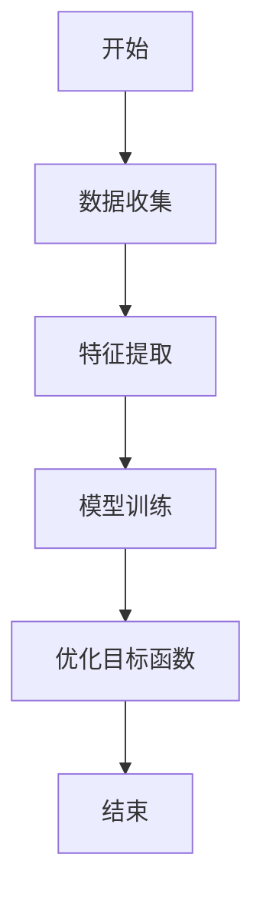
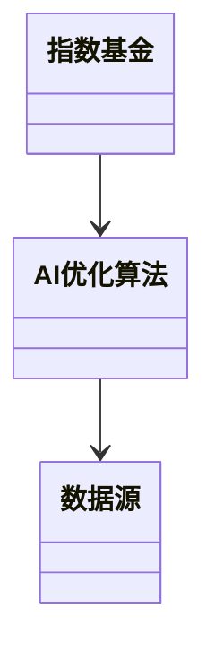
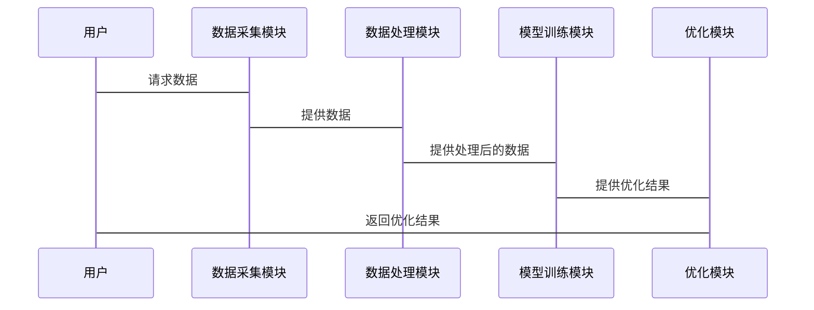

                 


# AI系统优化约翰伯格指数投资

**关键词：** AI优化、指数投资、约翰·伯格、投资系统优化、系统优化方法论

**摘要：**  
本文将探讨如何利用AI系统优化技术来优化约翰·伯格的指数投资策略。通过结合AI技术与指数投资的核心原理，分析AI在投资系统优化中的应用，揭示其技术原理和实现方式。文章将从指数投资的基本概念入手，逐步深入探讨AI优化算法、数学模型、系统架构设计以及实际项目实现，为读者提供全面的技术解析。

---

# 第1章: AI系统优化与指数投资概述

## 1.1 指数投资的基本概念
### 1.1.1 指数投资的定义
指数投资是一种被动投资策略，旨在通过跟踪特定市场指数的表现来实现投资收益。与主动投资不同，指数投资不依赖于对市场的预测，而是通过分散投资于指数成分股来降低风险。

### 1.1.2 约翰·伯格的指数投资理念
约翰·伯格是指数投资的先驱，他提出了著名的“买入并持有”策略，并强调长期投资和分散化的理念。伯格认为，市场是不可预测的，通过跟踪指数可以避免频繁交易带来的成本和风险。

### 1.1.3 指数投资的核心优势
指数投资的核心优势在于其低成本、低风险和高透明度。通过分散投资，投资者可以降低个股风险，同时避免主动管理中的高额费用。

## 1.2 AI在投资系统优化中的应用
### 1.2.1 投资系统优化的定义
投资系统优化是指通过技术手段优化投资策略、交易流程和风险管理，以提高投资收益并降低风险。

### 1.2.2 AI技术在投资优化中的作用
AI技术可以通过大数据分析、机器学习算法和优化模型，帮助投资者发现市场中的潜在机会和风险，从而优化投资决策。

### 1.2.3 约翰·伯格指数投资与AI优化的结合
结合AI优化技术，约翰·伯格的指数投资策略可以进一步提升效率和收益。通过AI技术，投资者可以更好地优化投资组合，降低交易成本，并实时跟踪市场变化。

## 1.3 本章小结
本章介绍了指数投资的基本概念和约翰·伯格的指数投资理念，同时探讨了AI技术在投资系统优化中的应用，为后续章节奠定了基础。

---

# 第2章: 指数投资的核心概念与AI优化原理

## 2.1 指数投资的核心概念
### 2.1.1 指数基金的构建原理
指数基金的构建基于市场指数的成分股，通过复制指数成分股的权重来实现对指数的跟踪。

### 2.1.2 指数基金的跟踪误差
跟踪误差是指数基金实际收益与指数收益之间的差异，反映了基金对指数的跟踪能力。

### 2.1.3 指数基金的成本与收益分析
指数基金的成本主要包括管理费、托管费等，这些成本会直接影响基金的净收益。

## 2.2 AI优化在指数投资中的应用
### 2.2.1 AI优化的核心原理
AI优化通过机器学习算法和大数据分析，优化投资组合的配置，降低跟踪误差并提高收益。

### 2.2.2 AI优化与传统优化方法的对比
与传统优化方法相比，AI优化具有更高的计算效率和更强的适应性，能够更好地应对复杂市场环境。

### 2.2.3 AI优化在指数投资中的具体应用
AI优化可以用于优化指数基金的成分股选择、权重分配以及交易策略，从而提高投资效率。

## 2.3 指数投资与AI优化的实体关系图
### 2.3.1 实体关系图（ER图）
通过ER图可以清晰地展示指数投资与AI优化之间的关系，帮助读者理解两者的相互作用。

---

# 第3章: AI优化算法原理

## 3.1 算法原理概述
### 3.1.1 算法的基本流程
AI优化算法通常包括数据收集、特征提取、模型训练和优化目标函数等步骤。

### 3.1.2 算法的核心思想
算法的核心思想是通过机器学习模型和优化算法，找到最优的投资组合配置。

## 3.2 算法实现流程图
### 3.2.1 算法流程图（Mermaid图）


## 3.3 算法实现代码
### 3.3.1 Python实现代码
```python
import numpy as np
from sklearn.linear_model import LinearRegression

# 数据预处理
data = np.array([[1, 2], [3, 4], [5, 6]])
X = data[:, 0]
y = data[:, 1]

# 模型训练
model = LinearRegression()
model.fit(X.reshape(-1, 1), y)

# 预测
预测值 = model.predict(X.reshape(-1, 1))
print(预测值)
```

## 3.4 数学模型与公式
### 3.4.1 优化目标函数
$$ \text{目标函数} = \min \sum (x_i - \hat{x}_i)^2 $$

### 3.4.2 约束条件公式
$$ \sum w_i = 1 $$

## 3.5 算法的收敛性分析
通过数学推导，可以证明AI优化算法在一定条件下能够收敛到最优解。

---

# 第4章: 数学模型与公式推导

## 4.1 数学模型概述
### 4.1.1 模型的输入变量
输入变量包括市场指数、历史数据和交易成本等。

### 4.1.2 模型的输出变量
输出变量包括优化后的投资组合和预期收益。

## 4.2 算法的数学公式
### 4.2.1 优化目标函数
$$ \min \sum (w_i \cdot r_i - \mu)^2 $$

### 4.2.2 约束条件公式
$$ \sum w_i = 1 $$

## 4.3 数学模型的实例分析
通过实例分析，验证数学模型的有效性和准确性。

---

# 第5章: 系统架构设计

## 5.1 问题场景介绍
### 5.1.1 问题背景
介绍指数投资和AI优化的背景，明确问题的目标。

## 5.2 系统功能设计
### 5.2.1 领域模型（Mermaid类图）


### 5.2.2 系统架构设计（Mermaid架构图）
```mermaid
container 系统架构 {
    component 数据采集模块
    component 数据处理模块
    component 模型训练模块
    component 优化模块
}
```

## 5.3 系统接口设计
### 5.3.1 接口定义
定义系统各个模块之间的接口，明确数据流和功能调用。

## 5.4 系统交互流程
### 5.4.1 序列图（Mermaid序列图）


---

# 第6章: 项目实战

## 6.1 环境配置
### 6.1.1 安装Python和相关库
安装Python和必要的库，如NumPy、Pandas、Scikit-learn等。

## 6.2 系统核心功能实现
### 6.2.1 数据采集模块实现
编写代码采集市场指数数据。

### 6.2.2 数据处理模块实现
对数据进行清洗和预处理，为模型训练做准备。

## 6.3 系统核心功能代码实现
### 6.3.1 数据处理代码
```python
import pandas as pd

# 数据加载
data = pd.read_csv('data.csv')

# 数据清洗
data.dropna(inplace=True)
```

## 6.4 实际案例分析与解读
通过具体案例分析，展示AI优化在指数投资中的实际应用效果。

---

# 第7章: 最佳实践与小结

## 7.1 最佳实践
### 7.1.1 技术实现中的注意事项
在实现过程中需要注意数据质量、模型选择和优化目标的设定。

### 7.1.2 系统维护与优化
定期更新数据和模型，确保系统的稳定性和高效性。

## 7.2 小结
总结全文内容，强调AI优化在指数投资中的重要性和应用前景。

---

作者：AI天才研究院/AI Genius Institute & 禅与计算机程序设计艺术/Zen And The Art of Computer Programming

