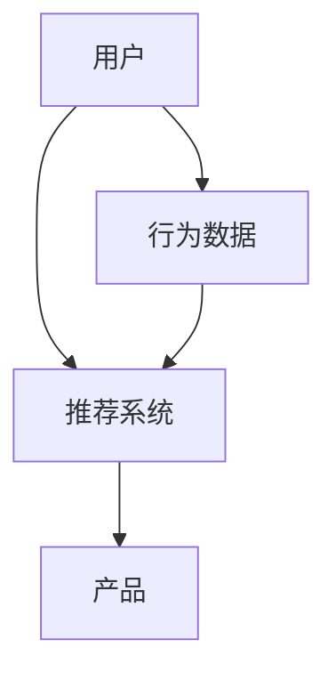
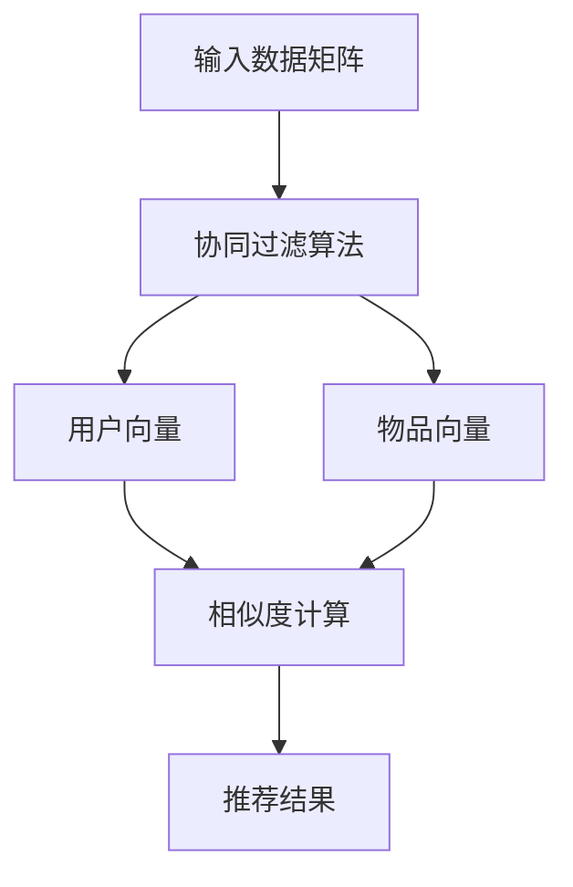
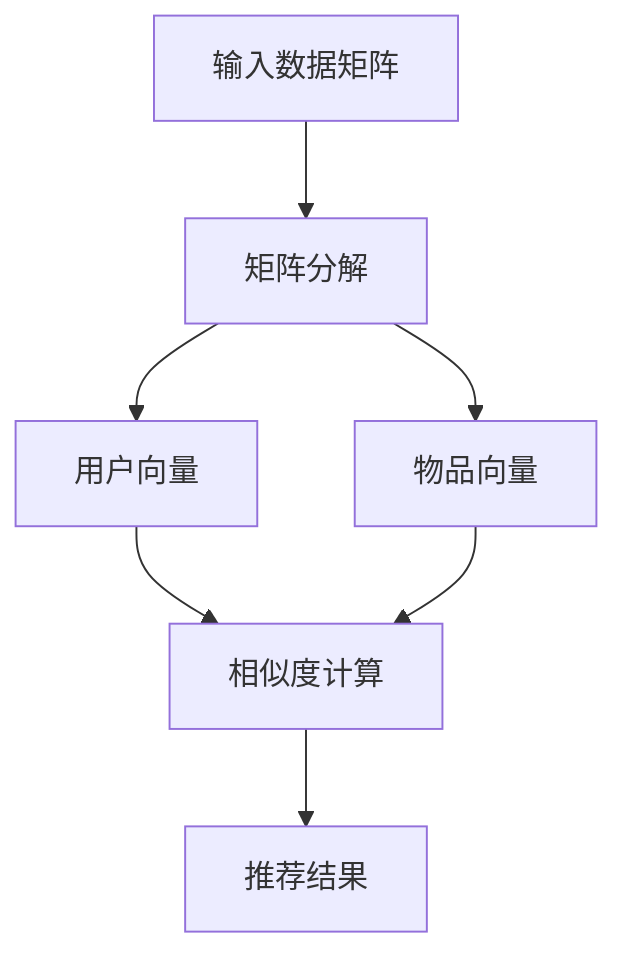
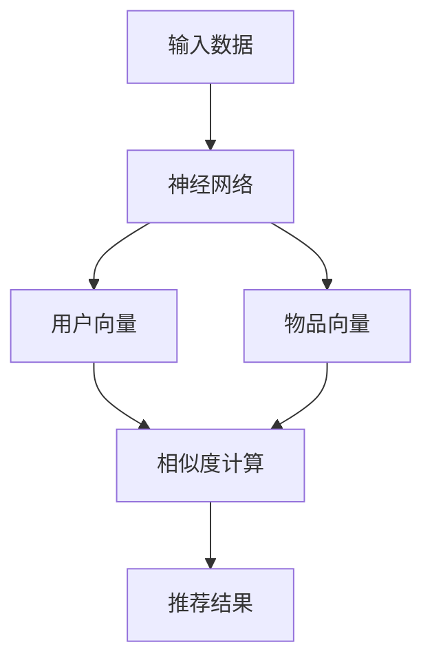
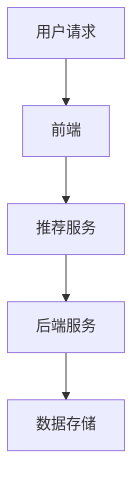
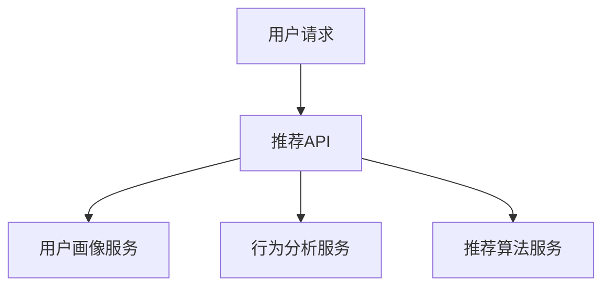

                 


# AI辅助产品推荐与个性化服务的算法与实现

> 关键词：AI推荐系统、个性化服务、算法实现、协同过滤、矩阵分解、深度学习

> 摘要：本文深入探讨了AI辅助产品推荐与个性化服务的核心算法与实现方案。首先介绍了推荐系统的背景与核心概念，包括协同过滤、矩阵分解和深度学习模型。接着详细分析了推荐算法的原理，包括基于用户的协同过滤、基于物品的协同过滤以及基于矩阵分解的推荐算法。随后，本文从系统架构设计的角度，详细阐述了推荐系统的功能设计、架构设计和交互设计。最后，通过一个实际的项目案例，详细讲解了个性化推荐系统的实现过程，包括环境搭建、核心代码实现和案例分析。本文旨在为读者提供一个全面的技术视角，帮助他们理解和实现高效的AI辅助推荐系统。

---

## 第一部分: AI辅助产品推荐与个性化服务的背景与核心概念

### 第1章: AI辅助产品推荐与个性化服务概述

#### 1.1 问题背景与问题描述

在当今互联网时代，用户每天面对的信息量呈爆炸式增长。如何在海量信息中快速找到用户感兴趣的内容，成为各类互联网产品面临的共同挑战。传统的信息检索方法虽然能够基于关键词进行匹配，但难以满足用户的个性化需求。例如，电商平台上用户可能对某一类商品感兴趣，但传统检索方法只能基于关键词匹配，无法根据用户的偏好进行推荐。此外，用户的行为数据（如点击、收藏、购买等）虽然包含了大量的潜在需求信息，但如何高效地挖掘这些数据中的价值，仍然是一个技术难题。

AI技术的快速发展为推荐系统的优化提供了新的可能性。通过机器学习算法，推荐系统能够从海量数据中提取用户的兴趣特征，并基于这些特征生成个性化的推荐结果。例如，在电商平台上，推荐系统可以根据用户的购买历史、浏览记录和收藏记录，预测用户可能感兴趣的商品，并进行精准推荐。这种基于AI的推荐方式不仅能够提高用户体验，还能帮助商家提高转化率和销售额。

#### 1.2 个性化服务的定义与边界

个性化服务是一种基于用户特征（如兴趣、偏好、行为等）提供定制化内容或服务的方式。个性化服务的核心目标是通过分析用户数据，为用户提供与其需求高度匹配的内容或服务。个性化服务的边界通常包括以下几个方面：

1. **用户特征分析**：包括用户的兴趣、行为习惯、地理位置等信息。
2. **内容或服务推荐**：基于用户特征，推荐相关的内容或服务。
3. **动态调整**：根据用户的实时行为和反馈，动态调整推荐结果。

个性化服务的核心要素包括用户特征、推荐算法和反馈机制。用户特征是个性化服务的基础，推荐算法是实现个性化服务的核心技术，而反馈机制则是优化推荐结果的重要手段。

#### 1.3 核心概念与联系

推荐系统是个性化服务的核心技术之一。推荐系统通过分析用户特征和行为数据，生成个性化推荐结果。以下是推荐系统与其他系统的主要区别：

| **系统类型** | **核心目标**                | **输入**               | **输出**               |
|--------------|----------------------------|-----------------------|-----------------------|
| 普通检索系统 | 基于关键词匹配信息           | 用户输入关键词         | 相关信息列表           |
| 推荐系统     | 基于用户特征推荐个性化内容   | 用户特征（行为、偏好） | 个性化推荐列表         |

通过对比可以看出，推荐系统的区别在于其输入是用户的特征数据，输出是个性化的推荐结果。以下是推荐系统的实体关系图：



### 第2章: 推荐算法的核心原理

#### 2.1 协同过滤算法

协同过滤是一种基于用户相似性或物品相似性的推荐算法。以下是协同过滤的主要实现方式：

1. **基于用户的协同过滤**：通过计算用户之间的相似性，将相似用户的评分进行加权平均，生成推荐结果。
2. **基于物品的协同过滤**：通过计算物品之间的相似性，将用户已评分的物品的相似物品进行推荐。
3. **混合协同过滤**：结合基于用户的协同过滤和基于物品的协同过滤的优点，通过加权的方式生成最终的推荐结果。

协同过滤的实现流程如下：



#### 2.2 基于矩阵分解的推荐算法

矩阵分解是一种将用户-物品评分矩阵分解为用户特征矩阵和物品特征矩阵的技术。以下是矩阵分解的主要实现方式：

1. **SVD算法**：奇异值分解（Singular Value Decomposition，SVD）是一种常用的矩阵分解技术，其数学模型如下：

$$ X = U \Sigma V^T $$

其中，X是用户-物品评分矩阵，U是用户特征矩阵，Σ是奇异值矩阵，V是物品特征矩阵。

2. **矩阵分解流程**：


3. **矩阵分解的优点**：矩阵分解能够有效地降维，提高推荐系统的计算效率和推荐准确率。

#### 2.3 基于深度学习的推荐算法

深度学习是一种基于人工神经网络的机器学习技术。以下是深度学习在推荐系统中的主要应用方式：

1. **神经网络模型**：通过构建神经网络模型，对用户特征和物品特征进行非线性变换，生成推荐结果。
2. **GRU模型**：门控循环单元（Gated Recurrent Unit，GRU）是一种常用的循环神经网络模型，适用于时序数据的处理。
3. **Transformer模型**：Transformer是一种基于自注意力机制的深度学习模型，适用于长文本的处理。

深度学习推荐模型的流程如下：



---

## 第二部分: 个性化推荐系统的系统架构设计

### 第3章: 个性化推荐系统的系统架构设计

#### 3.1 系统功能设计

个性化推荐系统的功能设计包括以下几个方面：

1. **用户画像构建**：通过分析用户的行为数据，构建用户的兴趣特征。
2. **行为分析与预测**：通过分析用户的行为数据，预测用户的兴趣偏好。
3. **推荐结果生成**：基于用户特征和预测结果，生成个性化的推荐列表。

#### 3.2 系统架构设计

个性化推荐系统的架构设计包括以下几个方面：

1. **分层架构设计**：

2. **微服务架构设计**：


#### 3.3 系统接口设计

个性化推荐系统的接口设计包括以下几个方面：

1. **API接口定义**：定义推荐系统对外提供的API接口。
2. **接口调用流程**：描述接口调用的流程。
3. **接口优化**：通过优化接口设计，提高推荐系统的性能。

#### 3.4 系统交互设计

个性化推荐系统的交互设计包括以下几个方面：

1. **用户与系统的交互流程**：描述用户与推荐系统之间的交互流程。
2. **推荐结果的展示与反馈**：描述推荐结果的展示方式和用户反馈的处理方式。
3. **个性化服务的动态调整**：描述如何根据用户反馈动态调整推荐结果。

---

## 第三部分: 个性化推荐系统的项目实战

### 第4章: 个性化推荐系统的项目实战

#### 4.1 环境搭建与工具安装

个性化推荐系统的环境搭建包括以下几个方面：

1. **Python安装**：安装Python编程语言。
2. **库的安装**：安装所需的Python库，如NumPy、Pandas、Scikit-learn等。

#### 4.2 系统核心实现

个性化推荐系统的核心实现包括以下几个方面：

1. **用户特征提取**：通过分析用户的行为数据，提取用户的兴趣特征。
2. **推荐算法实现**：实现协同过滤、矩阵分解和深度学习模型。
3. **推荐结果生成**：基于推荐算法生成推荐结果。

#### 4.3 代码实现与解读

以下是协同过滤算法的Python实现：

```python
import numpy as np
from sklearn.metrics.pairwise import cosine_similarity

# 用户-物品评分矩阵
rating_matrix = np.array([[4, 3, 0], 
                           [3, 0, 3], 
                           [0, 4, 2], 
                           [1, 2, 3]])

# 计算相似度矩阵
similarity_matrix = cosine_similarity(rating_matrix)

# 基于用户的协同过滤推荐
def user_based_recommendation(rating_matrix, user_id, k=3):
    # 计算相似度矩阵
    similarity = cosine_similarity(rating_matrix)
    # 获取当前用户的相似用户
    similar_users = np.argsort(-similarity[user_id])[:k]
    # 计算推荐结果
    recommendation = np.zeros(rating_matrix.shape[1])
    for u in similar_users:
        recommendation += rating_matrix[u]
    # 去除当前用户已评分的物品
    recommendation = recommendation - rating_matrix[user_id]
    recommendation = recommendation.astype(float)
    # 返回推荐结果
    return recommendation

# 推荐结果
recommendation = user_based_recommendation(rating_matrix, 0)
print("推荐结果：", recommendation)
```

#### 4.4 案例分析与总结

通过实际案例分析，我们可以看到协同过滤算法在推荐系统中的应用。例如，在电商平台上，协同过滤算法可以根据用户的行为数据，推荐用户可能感兴趣的商品。通过不断优化推荐算法，可以提高推荐系统的准确率和用户体验。

---

## 第四部分: 总结与展望

### 第5章: 总结与展望

#### 5.1 最佳实践

1. **数据预处理**：在推荐系统中，数据预处理是非常重要的一步。通过清洗数据，可以提高推荐系统的准确率。
2. **模型优化**：通过优化推荐算法的参数，可以提高推荐系统的性能。
3. **实时反馈**：通过实时反馈机制，可以动态调整推荐结果，提高用户体验。

#### 5.2 小结

本文详细探讨了AI辅助产品推荐与个性化服务的核心算法与实现方案。通过分析推荐算法的核心原理，设计个性化推荐系统的架构，并通过实际案例分析，展示了如何实现高效的个性化推荐系统。

#### 5.3 注意事项

1. **数据隐私**：在个性化推荐系统中，用户数据的隐私保护是非常重要的。需要遵守相关法律法规，保护用户隐私。
2. **模型解释性**：推荐系统的解释性是一个重要的问题。需要通过可视化等方式，提高推荐系统的透明度。

#### 5.4 拓展阅读

1. **深度学习推荐模型**：如Transformer模型在推荐系统中的应用。
2. **推荐系统的实时性优化**：如基于流数据的推荐算法。

---

## 作者

作者：AI天才研究院/AI Genius Institute & 禅与计算机程序设计艺术 /Zen And The Art of Computer Programming

