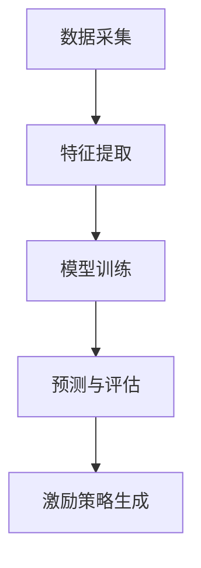
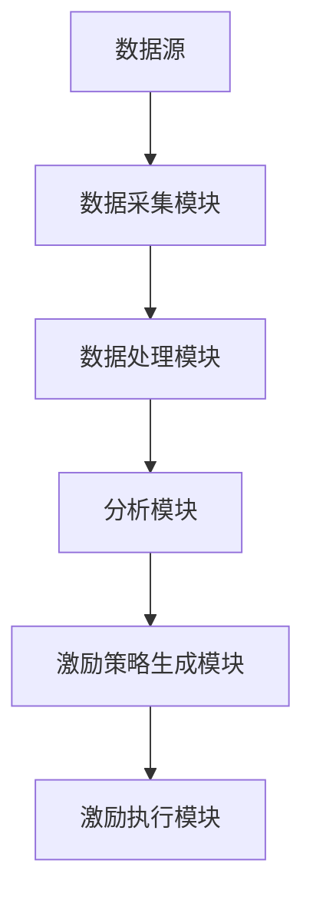

                 


# AI辅助企业创新文化培养：创新活动参与度分析与激励

> 关键词：AI、企业创新、参与度分析、激励机制、创新文化、员工积极性、数据分析

> 摘要：本文探讨了如何利用人工智能技术分析和提升企业创新活动的参与度，进而构建有效的激励机制，培养企业创新文化。文章从背景介绍、核心概念、算法原理、系统架构到实际案例，全面阐述了AI在创新激励中的应用，为企业的创新管理提供了新的思路和方法。

---

## 正文

### 第一部分：背景介绍

#### 第1章：企业创新文化的重要性

##### 1.1 问题背景

- **创新文化的定义**：创新文化是指企业在经营活动中，鼓励员工提出新想法、新方法，推动产品、服务或流程创新的企业氛围。
- **创新对企业发展的意义**：创新是企业保持竞争力的核心动力，能够帮助企业在市场中快速响应变化，抓住机会。
- **当前企业创新面临的挑战**：
  - 员工创新积极性不足。
  - 创新活动参与度低。
  - 传统激励机制难以精准匹配员工需求。

##### 1.2 问题描述

- **创新活动参与度低的原因**：
  - 员工对创新目标不明确。
  - 激励机制缺乏针对性。
  - 创新过程缺乏透明性和反馈机制。
- **员工创新积极性不足的表现**：
  - 员工缺乏创新动力。
  - 创新成果难以量化。
  - 创新过程缺乏系统支持。
- **传统激励机制的局限性**：
  - 传统激励方式（如奖金、晋升）难以激发持续创新。
  - 激励机制缺乏个性化和动态调整。

##### 1.3 问题解决

- **引入AI技术的必要性**：
  - AI能够通过数据分析，精准识别员工的创新潜力。
  - AI可以提供个性化的激励方案，提升员工参与度。
  - AI能够优化创新流程，降低创新成本。
- **AI在创新激励中的作用**：
  - 数据驱动的决策支持。
  - 个性化激励机制的设计。
  - 创新过程的智能化管理。
- **提高创新活动参与度的解决方案**：
  - 利用AI进行创新潜力评估。
  - 建立动态激励机制。
  - 提供创新过程中的实时反馈。

##### 1.4 边界与外延

- **创新活动的边界**：
  - 创新活动仅限于企业的核心业务领域。
  - 创新活动不涉及企业的核心机密。
- **AI辅助的适用范围**：
  - AI适用于数据分析和预测，不直接参与创新过程。
  - AI辅助适用于中大型企业，数据量和场景复杂度较高。
- **相关领域的联系与区别**：
  - 与企业绩效管理的区别：绩效管理更关注结果，创新激励更关注过程。
  - 与员工培训的区别：创新激励更注重激发内在动力，而培训更注重知识传递。

##### 1.5 核心要素组成

- **创新活动的主体**：员工、团队、管理层。
- **创新活动的客体**：产品、服务、流程、技术。
- **激励机制的关键要素**：
  - 明确的创新目标。
  - 个性化的激励措施。
  - 及时的反馈与认可。

---

### 第二部分：核心概念与联系

#### 第2章：创新活动参与度分析的核心概念

##### 2.1 核心概念原理

- **创新活动参与度的定义**：
  - 员工在创新活动中的主动性和投入程度。
- **参与度分析的指标体系**：
  - 创新行为的频率、质量、影响力。
  - 员工对创新活动的感知和态度。
- **数据采集与处理方法**：
  - 数据来源：员工行为数据、绩效数据、反馈数据。
  - 数据清洗：去除无效数据，处理异常值。
  - 数据分析：使用统计方法和机器学习模型。

##### 2.2 概念属性特征对比

| 比较维度 | 创新型员工 | 普通员工 | 消极员工 |
|----------|-------------|-----------|----------|
| 创新意识 | 高           | 中         | 低       |
| 创新行为 | 积极         | 一般       | 少        |
| 激励需求 | 多元化       | 单一化     | 低        |

##### 2.3 ER实体关系图

```mermaid
er
  员工 --> 创新行为
  创新行为 --> 参与度指标
  参与度指标 --> 激励措施
  激励措施 --> 员工
```

##### 2.4 算法流程图



---

### 第三部分：算法原理讲解

#### 第3章：基于机器学习的创新参与度分析

##### 3.1 算法选择与模型构建

- **算法选择**：
  - 线性回归：预测员工创新参与度。
  - 支持向量机（SVM）：分类员工的创新潜力。
  - 随机森林：特征重要性分析。
- **模型构建步骤**：
  1. 数据预处理：标准化、缺失值处理。
  2. 特征选择：使用特征重要性筛选关键指标。
  3. 模型训练：训练分类或回归模型。
  4. 模型评估：准确率、召回率、F1分数。

##### 3.2 数学模型与公式

- **线性回归模型**：
  $$ y = \beta_0 + \beta_1x_1 + \beta_2x_2 + ... + \beta_nx_n + \epsilon $$
  - 其中，$y$ 是创新参与度，$x_i$ 是特征变量，$\beta_i$ 是系数，$\epsilon$ 是误差项。
- **损失函数**：
  $$ L = \sum_{i=1}^{m} (y_i - \hat{y}_i)^2 $$
  - 其中，$m$ 是样本数量，$y_i$ 是真实值，$\hat{y}_i$ 是预测值。
- **优化目标**：
  $$ \min_{\beta} L $$

##### 3.3 算法实现与代码示例

```python
import pandas as pd
from sklearn.ensemble import RandomForestClassifier
from sklearn.metrics import accuracy_score

# 数据加载
data = pd.read_csv('innovation.csv')

# 特征与标签分离
X = data.drop('participation', axis=1)
y = data['participation']

# 模型训练
model = RandomForestClassifier()
model.fit(X, y)

# 预测
y_pred = model.predict(X)

# 评估
print(f'准确率: {accuracy_score(y, y_pred)}')
```

---

### 第四部分：系统分析与架构设计

#### 第4章：AI辅助创新激励系统的架构

##### 4.1 问题场景介绍

- **问题场景**：企业希望通过AI系统提升员工创新参与度，优化激励机制。
- **项目介绍**：构建一个基于AI的创新激励系统，实现数据采集、分析、激励策略生成和执行。

##### 4.2 系统功能设计

- **功能模块**：
  1. 数据采集模块：收集员工行为数据、绩效数据。
  2. 参与度分析模块：基于机器学习模型分析参与度。
  3. 激励策略生成模块：根据分析结果生成个性化激励方案。
  4. 激励执行模块：将激励方案应用于员工。

##### 4.3 系统架构设计



##### 4.4 接口设计与交互

- **API接口**：
  - 数据采集接口：`POST /api/data`
  - 分析结果接口：`GET /api/results`
  - 激励策略接口：`POST /api/incentives`

---

### 第五部分：项目实战

#### 第5章：AI辅助创新激励系统实战

##### 5.1 环境安装

- **工具安装**：
  - Python 3.8+
  - scikit-learn、pandas、numpy
  - Jupyter Notebook

##### 5.2 核心代码实现

```python
import pandas as pd
from sklearn.ensemble import RandomForestClassifier
from sklearn.metrics import accuracy_score

# 数据加载
data = pd.read_csv('innovation.csv')

# 特征与标签分离
X = data.drop('participation', axis=1)
y = data['participation']

# 模型训练
model = RandomForestClassifier()
model.fit(X, y)

# 预测
y_pred = model.predict(X)

# 评估
print(f'准确率: {accuracy_score(y, y_pred)}')

# 特征重要性分析
importances = model.feature_importances_
feature_names = X.columns
importance_df = pd.DataFrame({'feature': feature_names, 'importance': importances})
print(importance_df.sort_values(by='importance', ascending=False))
```

##### 5.3 代码解读与分析

- **数据加载**：从CSV文件加载数据。
- **特征与标签分离**：将创新参与度作为标签，其他列为特征。
- **模型训练**：使用随机森林分类器训练模型。
- **预测与评估**：计算模型准确率。
- **特征重要性分析**：识别影响创新参与度的关键因素。

##### 5.4 案例分析

- **案例背景**：某科技公司希望通过AI系统提升员工创新参与度。
- **实施步骤**：
  1. 数据采集：收集员工行为数据、绩效数据。
  2. 模型训练：使用随机森林模型分析参与度。
  3. 激励策略生成：根据模型结果制定个性化激励方案。
  4. 系统部署：在公司内部部署AI激励系统。

##### 5.5 项目小结

- **成功经验**：
  - 数据质量和完整性对模型准确性至关重要。
  - 个性化激励机制能够显著提升员工参与度。
  - 系统的实时反馈功能增强了员工的创新动力。

---

### 第六部分：最佳实践

#### 第6章：AI辅助创新激励的实践总结

##### 6.1 小结

- **总结**：AI技术能够有效提升企业创新活动的参与度，优化激励机制。
- **关键点**：
  - 数据驱动的决策。
  - 个性化的激励策略。
  - 系统化的创新管理。

##### 6.2 注意事项

- **数据隐私**：确保员工数据的安全和隐私。
- **模型解释性**：选择具有高解释性的模型，方便企业管理者理解。
- **持续优化**：定期更新模型，适应企业发展的变化。

##### 6.3 拓展阅读

- 推荐书籍：《创新者的窘境》、《算法策略》。
- 推荐课程：AI与企业创新管理、机器学习实战。
- 推荐工具：Python机器学习库、数据分析工具。

---

### 结语

通过本文的系统介绍，我们了解了AI在企业创新文化培养中的重要作用，以及如何利用AI技术分析创新活动参与度并制定有效的激励机制。希望本文能够为企业管理者和技术人员提供有价值的参考和启发。

---

### 作者信息

作者：AI天才研究院/AI Genius Institute & 禅与计算机程序设计艺术/Zen And The Art of Computer Programming

---

**感谢您的阅读！如需进一步探讨或合作，请随时联系。**

