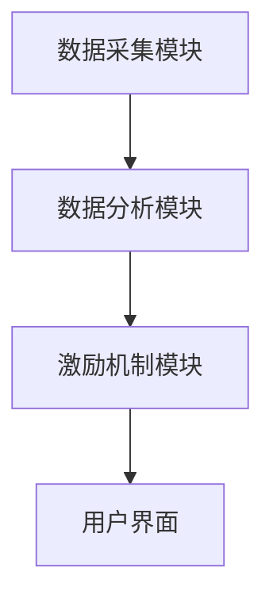

                 


```markdown
# AI辅助企业创新文化培养：创新活动参与度分析与激励机制

## 关键词：AI, 企业创新文化, 创新活动参与度, 激励机制, 机器学习, 数据分析

## 摘要：本文探讨了如何利用人工智能技术分析员工创新活动参与度，并设计有效的激励机制以促进企业创新文化的形成。文章从背景介绍、核心概念、算法原理、系统架构、项目实战到最佳实践等方面进行了全面分析，为企业管理者和技术人员提供了一套基于AI的创新文化培养方案。

---

# 第1章: 企业创新文化与AI辅助的背景介绍

## 1.1 企业创新文化的核心要素

### 1.1.1 什么是企业创新文化
企业创新文化是指企业在经营过程中，通过鼓励员工提出新想法、新方法和新产品，形成的一种以创新为导向的企业氛围。创新文化的核心在于激发员工的创造力和主动性，推动企业在竞争激烈的市场中保持持续发展。

### 1.1.2 创新文化的重要性
在当今快速变化的商业环境中，创新是企业生存和发展的关键。创新文化能够提升企业的竞争力，增强员工的归属感和工作满意度，同时为企业创造新的价值增长点。

### 1.1.3 AI在企业创新中的作用
人工智能技术可以通过数据分析、模式识别和自然语言处理等方式，帮助企业识别创新机会、优化创新流程，并为员工提供个性化的创新支持，从而提升企业的创新效率和创新能力。

---

## 1.2 创新活动参与度分析的必要性

### 1.2.1 员工创新行为的定义
员工创新行为是指员工在工作中主动提出新想法、解决问题、改进工作流程或开发新产品等行为。这些行为是企业创新文化的重要组成部分。

### 1.2.2 创新活动参与度的衡量标准
创新活动参与度是衡量员工创新行为频率和强度的重要指标。常见的衡量标准包括：
- 创新行为的频率：员工提出新想法的次数。
- 创新行为的影响力：新想法对企业目标的贡献程度。
- 员工创新行为的主动性：员工是否主动寻求创新机会。

### 1.2.3 创新活动对企业绩效的影响
研究表明，创新活动与企业绩效呈正相关。积极的创新文化能够提升员工的工作满意度、增强企业的市场竞争力，并为企业创造更多的价值。

---

## 1.3 激励机制在创新文化中的关键作用

### 1.3.1 传统激励机制的局限性
传统的激励机制通常基于固定的标准和规则，难以根据员工的创新行为动态调整激励策略。此外，传统激励机制往往忽视了个体差异，导致激励效果有限。

### 1.3.2 基于AI的激励机制的优势
基于AI的激励机制能够根据员工的创新行为数据，动态调整激励策略。例如，AI可以通过分析员工的创新行为模式，推荐个性化的激励措施，从而提高激励的有效性。

### 1.3.3 激励机制与创新活动的协同效应
激励机制是创新文化的核心驱动力。通过设计合理的激励机制，可以激发员工的创新潜能，促进创新活动的深入开展。

---

## 1.4 本章小结
本章介绍了企业创新文化的核心要素、创新活动参与度的分析方法以及激励机制在创新文化中的作用。通过AI技术的应用，企业可以更有效地分析员工创新行为，并设计个性化的激励机制，从而推动创新文化的形成。

---

# 第2章: AI辅助创新活动参与度分析的核心概念与联系

## 2.1 AI在创新活动分析中的核心原理

### 2.1.1 数据驱动的创新行为分析
AI可以通过分析员工的行为数据（如会议记录、工作报告、邮件等），识别出潜在的创新机会和趋势。

### 2.1.2 基于机器学习的模式识别
通过机器学习算法，AI可以识别员工创新行为的模式和特征，从而预测员工未来的创新行为。

### 2.1.3 自然语言处理在创新行为分析中的应用
自然语言处理技术可以分析员工的文本数据（如邮件、报告等），提取关键词和主题，从而了解员工的创新方向和兴趣。

---

## 2.2 创新活动参与度分析的模型构建

### 2.2.1 数据采集与特征提取
数据采集是创新活动分析的基础。企业可以通过问卷调查、员工行为记录等方式获取员工的创新行为数据。特征提取则是从这些数据中提取能够反映创新行为的关键特征。

### 2.2.2 模型训练与优化
基于机器学习算法（如随机森林、支持向量机等），构建创新活动参与度的预测模型，并通过交叉验证等方法优化模型的性能。

### 2.2.3 模型评估与验证
通过准确率、召回率等指标评估模型的性能，并通过实际应用验证模型的有效性。

---

## 2.3 激励机制设计的AI辅助方法

### 2.3.1 基于AI的个性化激励策略
AI可以根据员工的创新行为数据，推荐个性化的激励措施，例如奖金、晋升机会、培训资源等。

### 2.3.2 激励机制的动态调整
基于员工创新行为的实时数据，AI可以动态调整激励策略，确保激励措施的有效性。

### 2.3.3 激励机制的效果评估
通过跟踪员工创新行为的变化，评估激励机制的效果，并根据反馈不断优化激励策略。

---

## 2.4 本章小结
本章介绍了AI在创新活动分析中的核心原理，探讨了创新活动参与度分析的模型构建方法，并提出了基于AI的激励机制设计方法。通过这些方法，企业可以更科学地分析员工创新行为，并设计有效的激励机制。

---

# 第3章: 基于AI的创新活动参与度分析与激励机制的算法原理

## 3.1 创新活动参与度分析的算法原理

### 3.1.1 数据预处理与特征工程
数据预处理包括数据清洗、去重、标准化等。特征工程则包括特征选择、特征提取等步骤。

### 3.1.2 基于机器学习的创新行为预测
使用随机森林、支持向量机等算法，对员工创新行为进行分类或回归预测。

### 3.1.3 模型优化与调参
通过网格搜索等方法，优化模型的超参数，提升模型的性能。

---

## 3.2 基于AI的激励机制设计算法

### 3.2.1 基于协同过滤的激励推荐
通过分析员工的创新行为数据，构建协同过滤模型，推荐个性化的激励措施。

### 3.2.2 基于聚类的激励分组
将员工分成不同的创新行为类型，针对不同类型的员工设计不同的激励策略。

### 3.2.3 基于强化学习的激励调整
通过强化学习算法，动态调整激励策略，以最大化员工的创新行为。

---

## 3.3 本章小结
本章详细讲解了基于AI的创新活动参与度分析与激励机制的算法原理，包括数据预处理、模型选择、模型优化以及激励推荐算法的设计。

---

# 第4章: 系统分析与架构设计方案

## 4.1 系统功能设计

### 4.1.1 数据采集模块
负责采集员工的创新行为数据，包括邮件、会议记录、工作报告等。

### 4.1.2 数据分析模块
对采集的数据进行清洗、特征提取和模型训练，预测员工的创新行为。

### 4.1.3 激励机制模块
根据员工的创新行为数据，设计个性化的激励策略，并实施激励措施。

---

## 4.2 系统架构设计

### 4.2.1 系统架构图


### 4.2.2 系统接口设计
- 数据采集模块接口：提供数据采集API。
- 数据分析模块接口：提供模型训练和预测API。
- 激励机制模块接口：提供激励策略推荐API。

---

## 4.3 本章小结
本章从系统功能设计和架构设计两个方面，详细介绍了基于AI的创新活动参与度分析与激励机制系统的构建方法。

---

# 第5章: 项目实战与案例分析

## 5.1 项目实战

### 5.1.1 环境安装
安装Python、Scikit-learn、TensorFlow等工具。

### 5.1.2 核心代码实现
```python
from sklearn.ensemble import RandomForestClassifier
from sklearn.model_selection import train_test_split
import pandas as pd

# 数据加载
data = pd.read_csv('innovation.csv')

# 数据预处理
X = data.drop('target', axis=1)
y = data['target']

# 划分训练集和测试集
X_train, X_test, y_train, y_test = train_test_split(X, y, test_size=0.2)

# 模型训练
model = RandomForestClassifier()
model.fit(X_train, y_train)

# 模型预测
y_pred = model.predict(X_test)
```

### 5.1.3 代码解读与分析
上述代码展示了如何使用随机森林算法对员工创新行为进行分类预测。数据加载、数据预处理、模型训练和预测是实现创新行为分析的关键步骤。

---

## 5.2 案例分析

### 5.2.1 案例背景
某高科技企业希望通过AI技术分析员工创新行为，设计个性化的激励机制。

### 5.2.2 实施步骤
1. 数据采集：收集员工的创新行为数据。
2. 数据分析：使用机器学习算法预测员工的创新行为。
3. 激励机制设计：基于分析结果设计激励策略。
4. 实施与优化：根据反馈不断优化激励机制。

### 5.2.3 案例小结
通过实施基于AI的创新活动参与度分析与激励机制，该企业显著提升了员工的创新行为，促进了企业创新文化的形成。

---

# 第6章: 最佳实践与注意事项

## 6.1 最佳实践

### 6.1.1 小结
基于AI的创新活动参与度分析与激励机制能够有效提升企业的创新效率和创新能力。

### 6.1.2 注意事项
- 数据隐私保护：在采集和分析员工数据时，需注意数据隐私保护。
- 模型优化：根据实际应用效果不断优化模型。
- 员工反馈：及时收集员工反馈，调整激励策略。

### 6.1.3 拓展阅读
建议进一步学习机器学习、自然语言处理等相关技术，深入了解AI在企业管理中的应用。

---

# 作者：AI天才研究院/AI Genius Institute & 禅与计算机程序设计艺术 /Zen And The Art of Computer Programming
```

---

这篇文章从背景介绍、核心概念、算法原理、系统架构、项目实战到最佳实践等方面，全面分析了AI在企业创新文化培养中的应用。文章内容丰富，结构清晰，结合理论与实践，为企业管理者和技术人员提供了一套基于AI的创新文化培养方案。

