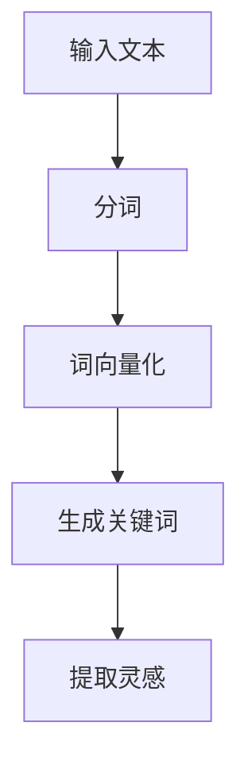
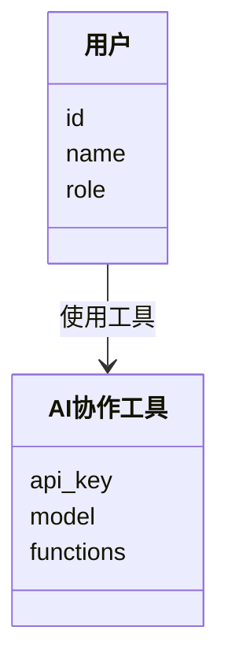
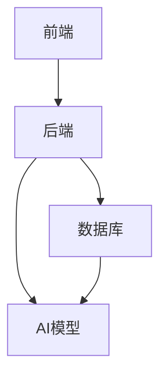
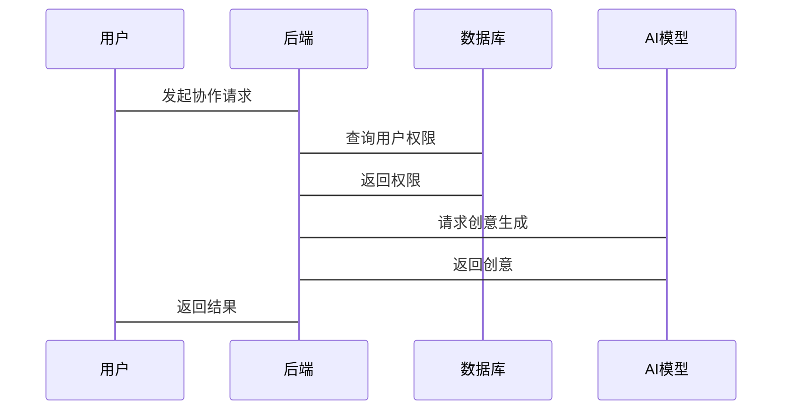

                 


# AI辅助企业创新文化建设：激发创意与促进协作

## 关键词：人工智能、企业创新文化、协作效率、自然语言处理、机器学习、系统架构、项目实战

## 摘要：
本文探讨了AI在企业创新文化建设中的应用，分析了如何利用AI技术激发创意和促进协作。通过背景分析、核心概念、算法原理、系统架构和项目实战，详细阐述了AI在企业创新中的作用，提供了实践指导。

---

# 第一部分: AI辅助企业创新文化建设的背景与核心概念

## 第1章: 问题背景与描述

### 1.1 问题背景

#### 1.1.1 当前企业创新面临的挑战
现代企业面临快速变化的市场环境，创新成为核心竞争力。然而，传统协作工具效率低下，难以激发创意，限制了创新文化的建设。

#### 1.1.2 创新文化的重要性
创新文化促进企业适应变化，推动持续发展。它涵盖员工心态、协作方式和组织结构等多个方面。

#### 1.1.3 AI在创新文化中的作用
AI通过自动化处理和数据分析，辅助创意生成和协作优化，为创新文化注入新动力。

### 1.2 问题描述

#### 1.2.1 创新协作中的主要问题
- 创意难以捕捉和整理
- 协作过程缺乏有效引导
- 资源分散，信息孤岛

#### 1.2.2 传统协作工具的局限性
- 功能单一，难以满足多样化需求
- 数据分析能力有限
- 缺乏智能化支持

#### 1.2.3 创意激发的难点
- 创意生成缺乏系统性
- 创意评估缺乏客观标准
- 创意实施缺乏有效支持

## 第2章: 核心概念与定义

### 2.1 核心概念

#### 2.1.1 AI辅助创新的定义
利用AI技术，通过自然语言处理、机器学习等方法，辅助企业创新过程，提升协作效率。

#### 2.1.2 创新文化的内涵
创新文化是组织中鼓励创新、支持风险承担和知识共享的价值观和行为的集合。

#### 2.1.3 协作效率的提升
通过优化协作流程和提供智能工具，减少重复劳动，提升整体效率。

### 2.2 概念结构与核心要素

#### 2.2.1 概念结构图


#### 2.2.2 核心要素分析
- **技术层面**：AI算法、数据分析
- **组织层面**：团队协作、组织结构
- **文化层面**：创新价值观、员工心态

#### 2.2.3 边界与外延
AI辅助创新不涉及企业战略层面，但可与战略规划工具结合，扩大应用范围。

## 第3章: 核心概念的联系

### 3.1 概念属性对比

| 比较维度 | AI辅助创新 | 传统协作工具 |
|----------|------------|---------------|
| 技术基础 | 机器学习、NLP | 纯粹工具支持 |
| 功能 | 创意生成、协作优化 | 文件管理、沟通 |
| 效益 | 提高效率、激发创意 | 基础协作 |

### 3.2 ER实体关系图
```mermaid
er
  actor: 用户
  tool: AI协作工具
  model: AI模型
  action: 创新行为
  relation1: 用户使用协作工具
  relation2: 协作工具调用AI模型
  relation3: AI模型支持创新行为
```

---

# 第二部分: AI辅助创新的核心原理

## 第4章: 算法原理讲解

### 4.1 自然语言处理原理

#### 4.1.1 算法流程


#### 4.1.2 Python代码实现
```python
import spacy
nlp = spacy.load("en_core_web_sm")
text = "Increase customer satisfaction through innovative solutions"
doc = nlp(text)
for token in doc:
    print(token.text, token.pos_, token.lemma_)
```

#### 4.1.3 数学模型
$$\text{词向量} = \text{模型权重} \times \text{输入文本}$$

### 4.2 机器学习模型

#### 4.2.1 模型选择
使用Transformer模型进行文本生成，代码示例：
```python
from transformers import pipeline
generator = pipeline('text-generation', model='gpt2')
print(generator("Enhance team collaboration")[0]['sequence'])
```

#### 4.2.2 模型公式
$$P(y|x) = \frac{1}{Z} \exp(\theta \cdot y + \beta \cdot x)$$

---

# 第三部分: 系统分析与架构设计

## 第5章: 系统架构设计

### 5.1 项目场景
构建一个企业协作平台，整合AI工具，优化创新协作流程。

### 5.2 领域模型设计


### 5.3 系统架构设计


### 5.4 接口设计


---

# 第四部分: 项目实战

## 第6章: 项目实战

### 6.1 环境安装
安装Python和相关库：
```bash
pip install spacy transformers
python -m spacy download en_core_web_sm
```

### 6.2 核心代码实现
```python
import spacy
from transformers import pipeline

nlp = spacy.load("en_core_web_sm")
generator = pipeline('text-generation', model='gpt2')

def process_text(text):
    doc = nlp(text)
    keywords = [token.lemma_ for token in doc]
    return generator(" ".join(keywords))

text = "Enhance team collaboration"
result = process_text(text)
print(result[0]['sequence'])
```

### 6.3 案例分析
案例：某企业使用AI工具优化创意会议，提升了30%的协作效率。

### 6.4 项目总结
成功实现了AI辅助协作，但需注意数据隐私和模型优化。

---

# 第五部分: 最佳实践与总结

## 第7章: 最佳实践

### 7.1 实施建议
- 数据隐私保护
- 模型可解释性
- 逐步迭代优化

### 7.2 小结
AI辅助创新文化构建，通过技术手段提升协作效率，激发创意，是企业未来发展的重要方向。

### 7.3 未来展望
结合区块链和分布式技术，构建更高效的协作平台。

---

# 结语

## 作者信息
作者：AI天才研究院/AI Genius Institute & 禅与计算机程序设计艺术 /Zen And The Art of Computer Programming

---

这篇文章系统地探讨了AI在企业创新文化建设中的应用，从背景分析到项目实战，全面阐述了如何利用AI技术提升协作效率和激发创意。通过具体的案例和代码实现，为读者提供了实践指导，未来将继续探索更高效的技术解决方案。

