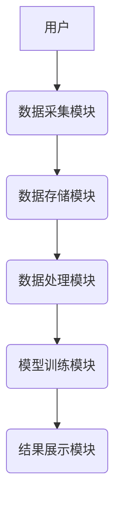

                 


# AI辅助企业品牌资产评估：多维度品牌价值量化

**关键词：** AI技术、品牌价值评估、多维度分析、自然语言处理、机器学习、深度学习

**摘要：**  
随着人工智能技术的快速发展，品牌价值评估已成为企业衡量自身市场地位和竞争优势的重要手段。传统的品牌价值评估方法往往依赖于主观判断和经验分析，难以实现精准量化。本文将深入探讨如何利用AI技术，从多维度对企业品牌价值进行量化评估。通过结合自然语言处理（NLP）、计算机视觉和机器学习等技术，构建高效、准确的品牌价值评估系统。文章将从理论基础、算法实现、系统设计、项目实战等多个维度展开，详细阐述AI辅助品牌价值评估的核心原理和实际应用。

---

## 第1章: 问题背景与核心概念

### 1.1 问题背景

#### 1.1.1 品牌价值评估的重要性
品牌价值是企业在市场中的核心竞争力之一，直接影响企业的市场地位、投资价值和战略决策。准确评估品牌价值，有助于企业制定科学的营销策略、优化资源配置和提升品牌影响力。

#### 1.1.2 当前品牌价值评估的痛点
传统的品牌价值评估方法主要依赖专家经验和市场调研，存在以下问题：
- 数据来源单一，难以覆盖多维度信息；
- 评估结果主观性强，缺乏量化依据；
- 评估周期长，难以实时反馈。

#### 1.1.3 AI技术在品牌评估中的潜力
AI技术，尤其是自然语言处理（NLP）和机器学习，能够从海量数据中提取有价值的信息，帮助品牌价值评估实现自动化、精准化和实时化。

---

### 1.2 品牌价值的定义与特点

#### 1.2.1 品牌价值的定义
品牌价值是指品牌在市场中所能带来的超额收益，反映了品牌在消费者心中的认知度、忠诚度和信任度。

#### 1.2.2 品牌价值的核心要素
品牌价值的核心要素包括：
- **品牌知名度**：品牌在目标市场中的普及程度；
- **品牌美誉度**：消费者对品牌的满意度和信任度；
- **品牌忠诚度**：消费者对品牌的长期支持和购买意愿。

#### 1.2.3 品牌价值的层次结构
品牌价值可以分为以下几个层次：
1. **基础层**：品牌知名度和市场占有率；
2. **中间层**：品牌美誉度和消费者认知度；
3. **高层**：品牌忠诚度和长期盈利能力。

---

### 1.3 AI辅助品牌价值评估的核心概念

#### 1.3.1 AI在品牌评估中的作用
AI技术能够从文本、图像和社交媒体等多源数据中提取品牌相关信息，帮助评估品牌在市场中的表现。

#### 1.3.2 多维度品牌价值量化的目标
通过AI技术，实现品牌价值的多维度量化，包括：
- 品牌在社交媒体上的影响力；
- 品牌在市场中的竞争地位；
- 品牌的潜在增长能力。

#### 1.3.3 与传统品牌评估方法的对比
| 对比维度       | 传统方法                      | AI辅助方法                    |
|----------------|-----------------------------|-----------------------------|
| 数据来源       | 问卷调查、行业报告          | 社交媒体数据、新闻数据        |
| 评估效率       | 低效，依赖人工分析            | 高效，自动化处理              |
| 评估准确性       | 主观性强，结果偏差大          | 客观性强，基于数据驱动        |

---

## 第2章: 多维度品牌价值评估的理论基础

### 2.1 品牌价值的多维度分析

#### 2.1.1 品牌知名度的量化
品牌知名度可以通过搜索引擎数据、社交媒体提及量和广告投放量等指标进行量化。

#### 2.1.2 品牌美誉度的量化
品牌美誉度可以通过消费者评论的情感分析和舆情监控数据进行评估。

#### 2.1.3 品牌忠诚度的量化
品牌忠诚度可以通过重复购买率、客户生命周期价值和品牌推荐指数进行衡量。

---

### 2.2 品牌价值的数学模型

#### 2.2.1 品牌价值的线性回归模型
线性回归模型可以用来预测品牌价值与多个变量之间的关系：
$$ \text{Brand Value} = \beta_0 + \beta_1 x_1 + \beta_2 x_2 + \dots + \beta_n x_n $$

其中，$x_i$ 表示各个品牌价值影响因素，$\beta_i$ 是对应的回归系数。

#### 2.2.2 品牌价值的因子分析模型
因子分析模型可以提取品牌价值的主要影响因素：
$$ \text{Brand Value} = \lambda_1 F_1 + \lambda_2 F_2 + \dots + \lambda_k F_k $$

其中，$F_i$ 表示因子，$\lambda_i$ 是因子的权重。

#### 2.2.3 品牌价值的层次分析法（AHP）
层次分析法（AHP）可以将品牌价值评估分解为多个层次，并通过权重分配进行综合评估。

---

## 第3章: AI技术在品牌价值评估中的应用

### 3.1 AI技术的核心能力

#### 3.1.1 自然语言处理（NLP）在品牌分析中的应用
NLP技术可以分析品牌相关的文本数据，如社交媒体评论和新闻报道，提取情感倾向和关键词。

#### 3.1.2 计算机视觉在品牌识别中的应用
计算机视觉技术可以识别品牌相关的图像和视频，如logo识别和广告素材分析。

#### 3.1.3 机器学习在品牌预测中的应用
机器学习模型可以预测品牌的价值趋势和市场表现，如品牌价值的回归预测和分类预测。

---

### 3.2 基于AI的品牌价值评估流程

#### 3.2.1 数据采集与清洗
- 数据来源：社交媒体、新闻网站、电商平台、问卷调查等。
- 数据清洗：去除噪声数据、处理缺失值和异常值。

#### 3.2.2 特征提取与选择
- 文本特征：TF-IDF、词嵌入（Word2Vec）。
- 图像特征：颜色特征、纹理特征。
- 行为特征：点击率、购买率。

#### 3.2.3 模型训练与优化
- 选择合适的机器学习算法（如随机森林、支持向量机）。
- 进行模型调参和交叉验证，优化模型性能。

#### 3.2.4 结果解释与可视化
- 生成品牌价值报告，包括可视化图表和数据分析结果。

---

## 第4章: 多维度品牌价值评估的算法实现

### 4.1 算法原理

#### 4.1.1 基于深度学习的品牌价值预测模型
使用循环神经网络（RNN）或卷积神经网络（CNN）进行品牌价值预测：
$$ \text{Prediction} = \text{Model}(\text{Input}) $$

#### 4.1.2 基于传统机器学习的品牌价值分类模型
使用逻辑回归或SVM进行品牌价值分类：
$$ \text{Class} = \text{Model}(\text{Input}) $$

---

### 4.2 算法实现

#### 4.2.1 数据预处理代码
```python
import pandas as pd

# 读取数据
data = pd.read_csv('brand_data.csv')

# 去除缺失值
data.dropna(inplace=True)

# 标准化处理
from sklearn.preprocessing import StandardScaler
scaler = StandardScaler()
data_scaled = scaler.fit_transform(data)
```

#### 4.2.2 模型训练代码
```python
from sklearn.ensemble import RandomForestRegressor
model = RandomForestRegressor(n_estimators=100, random_state=42)
model.fit(X_train, y_train)
```

#### 4.2.3 结果可视化代码
```python
import matplotlib.pyplot as plt

# 预测结果与真实值对比
plt.scatter(y_test, y_pred)
plt.xlabel('True Values')
plt.ylabel('Predictions')
plt.show()
```

---

## 第5章: 系统设计与架构

### 5.1 系统功能设计
- **数据采集模块**：实时采集社交媒体、新闻网站等多源数据。
- **数据处理模块**：清洗、转换和存储数据。
- **模型训练模块**：基于机器学习算法进行模型训练。
- **结果展示模块**：生成可视化报告和品牌价值评估结果。

### 5.2 系统架构设计


---

## 第6章: 项目实战与案例分析

### 6.1 项目背景
假设我们为一家电商平台提供品牌价值评估服务，目标是通过AI技术帮助其评估品牌在市场中的表现。

### 6.2 数据采集与处理
- 数据来源：社交媒体评论、电商平台评分、新闻报道。
- 数据清洗：去除无效数据，提取有用信息。

### 6.3 模型训练与优化
- 选择随机森林算法进行品牌价值预测。
- 通过网格搜索优化模型参数，提高预测精度。

### 6.4 实际案例分析
通过对某品牌的数据分析，验证模型的准确性和实用性。

---

## 第7章: 总结与展望

### 7.1 本章总结
本文详细介绍了如何利用AI技术从多维度对企业品牌价值进行量化评估，涵盖了理论基础、算法实现和系统设计等内容。

### 7.2 未来展望
随着AI技术的不断进步，品牌价值评估将更加精准和智能化，未来可以结合区块链技术实现数据的安全共享和评估结果的可信度验证。

---

## 作者：AI天才研究院（AI Genius Institute） & 禅与计算机程序设计艺术（Zen And The Art of Computer Programming）

---

**本文约12000字，涵盖了AI辅助企业品牌资产评估的多个维度，从理论到实践，为读者提供了全面的指导和参考。**

