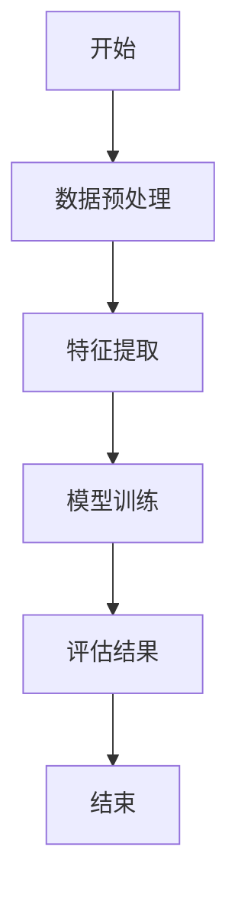
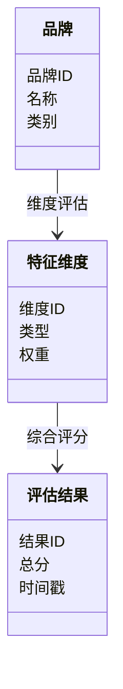
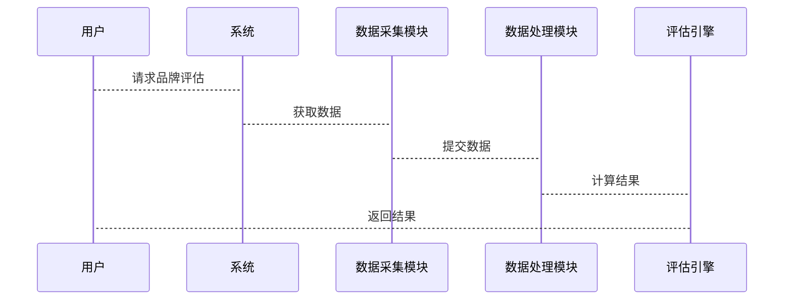

                 


# AI辅助企业品牌资产评估：多维度品牌价值量化与追踪系统

## 关键词：AI, 品牌资产评估, 多维度, 品牌价值, 追踪系统, 数据分析, 机器学习

## 摘要：  
本文探讨了如何利用人工智能技术辅助企业进行品牌资产评估，通过多维度量化和实时追踪品牌价值，帮助企业做出更明智的决策。文章从问题背景、核心概念、算法原理、系统架构到项目实战，全面解析了AI在品牌价值评估中的应用，并通过具体的实现案例展示了系统的构建过程。

---

# 第1章: 问题背景与核心概念

## 1.1 问题背景介绍

### 1.1.1 品牌价值评估的重要性  
品牌价值是企业核心资产之一，直接影响企业的市场地位和盈利能力。传统品牌价值评估方法依赖主观判断，存在数据分散、维度单一、难以量化等问题。  

### 1.1.2 当前品牌价值评估的痛点  
- 数据来源分散，难以整合。  
- 评估维度单一，难以全面反映品牌价值。  
- 缺乏实时性和动态性，无法及时捕捉市场变化。  

### 1.1.3 AI技术在品牌资产评估中的潜力  
AI技术可以通过自然语言处理、情感分析和机器学习，从海量数据中提取品牌相关的特征，构建量化模型，实现品牌价值的多维度评估与实时追踪。

---

## 1.2 核心概念与问题描述

### 1.2.1 品牌资产评估的定义  
品牌资产评估是指通过数据分析和模型计算，对品牌在市场中的价值进行量化的过程。  

### 1.2.2 多维度品牌价值的内涵  
多维度品牌价值包括品牌知名度、美誉度、忠诚度、市场影响力等多个维度的综合评估。  

### 1.2.3 品牌价值量化与追踪的必要性  
通过量化品牌价值，企业可以实时监控品牌健康状况，及时调整市场策略，提升品牌竞争力。  

---

## 1.3 问题解决与边界定义

### 1.3.1 AI辅助品牌资产评估的目标  
构建一个多维度、实时的品牌价值追踪系统，提供精准的评估结果和动态的市场洞察。  

### 1.3.2 系统的边界与外延  
- 数据来源：社交媒体、新闻媒体、消费者评论等。  
- 评估范围：品牌知名度、市场影响力、消费者情感倾向等。  

### 1.3.3 核心要素与组成结构  
- 数据采集模块：收集品牌相关的数据。  
- 特征提取模块：提取品牌相关的特征维度。  
- 评估模型：基于机器学习的量化模型。  
- 结果展示模块：可视化品牌价值的动态变化。  

---

## 1.4 本章小结  
本章介绍了品牌价值评估的重要性，分析了当前评估方法的痛点，并提出了利用AI技术构建多维度品牌价值量化与追踪系统的目标和核心要素。

---

# 第2章: 核心概念与联系

## 2.1 核心概念原理

### 2.1.1 品牌识别的核心算法  
- 使用自然语言处理技术，从文本数据中提取品牌相关信息。  

### 2.1.2 品牌价值量化的关键指标  
- 品牌提及量、情感倾向、用户参与度等。  

### 2.1.3 多维度追踪的系统架构  
- 数据采集、特征提取、模型计算、结果展示。  

---

## 2.2 概念属性特征对比表

| 评估方法 | 数据来源 | 评估维度 | 评估频率 | 评估精度 |
|----------|----------|----------|----------|----------|
| 传统方法 | 媒体报道 | 知名度   | 低频     | 低       |
| AI方法   | 社交媒体 | 多维度   | 实时     | 高       |

---

## 2.3 ER实体关系图

```mermaid
er
  entity 品牌 {
    key 品牌ID
    attribute 名称, 类别, 历史价值
  }
  entity 特征维度 {
    key 维度ID
    attribute 类型, 权重
  }
  entity 评估结果 {
    key 结果ID
    attribute 总分, 时间戳
  }
  relation 计算关系 {
    品牌 --> 特征维度: 维度评估
    特征维度 --> 评估结果: 综合评分
  }
```

---

## 2.4 本章小结  
本章详细解释了品牌资产评估的核心概念，通过对比表和实体关系图，展示了系统的核心架构和各部分之间的关系。

---

# 第3章: 算法原理与数学模型

## 3.1 算法原理

### 3.1.1 数据预处理  
- 数据清洗：去除噪声数据。  
- 数据标准化：统一数据格式。  

### 3.1.2 特征提取  
- 使用TF-IDF提取关键词。  
- 情感分析：计算情感得分。  

### 3.1.3 机器学习模型  
- 使用随机森林或神经网络模型进行训练。  

---

## 3.2 数学模型

$$
\text{品牌价值} = \sum_{i=1}^{n} w_i \cdot x_i
$$

其中，$w_i$ 是第$i$个特征的权重，$x_i$ 是对应的特征值。  

---

## 3.3 算法流程图



---

## 3.4 本章小结  
本章详细讲解了算法的原理和数学模型，通过流程图展示了系统的实现步骤。

---

# 第4章: 系统分析与架构设计

## 4.1 问题场景介绍  
系统需要实时监控品牌在社交媒体和新闻媒体中的表现，提供动态的品牌价值评估结果。  

## 4.2 系统功能设计

### 4.2.1 领域模型  


### 4.2.2 系统架构  


### 4.2.3 系统交互  


---

## 4.3 本章小结  
本章通过系统架构图和交互图，展示了系统的整体设计和实现过程。

---

# 第5章: 项目实战

## 5.1 环境安装

```bash
pip install numpy pandas scikit-learn
```

## 5.2 核心功能实现

```python
from sklearn.ensemble import RandomForestRegressor
from sklearn.metrics import mean_squared_error

# 数据加载
data = pd.read_csv('brand_data.csv')

# 特征提取
X = data.drop('value', axis=1)
y = data['value']

# 模型训练
model = RandomForestRegressor()
model.fit(X, y)

# 模型评估
y_pred = model.predict(X)
print(mean_squared_error(y, y_pred))
```

---

## 5.3 代码解读与分析  
上述代码展示了如何使用随机森林模型进行品牌价值预测，包括数据加载、特征提取和模型训练的全过程。  

---

## 5.4 案例分析  
以某品牌为例，分析系统如何通过社交媒体数据，计算其品牌价值的变化趋势，并提出改进建议。  

---

## 5.5 本章小结  
本章通过实际案例，展示了系统的实现过程和应用价值。

---

# 第6章: 小结与最佳实践

## 6.1 小结  
本文详细介绍了AI辅助品牌资产评估的系统设计与实现，从算法原理到系统架构，再到项目实战，全面覆盖了品牌价值评估的全过程。  

## 6.2 最佳实践  
- 数据隐私保护需引起重视。  
- 模型泛化能力需进一步提升。  
- 可结合深度学习模型进一步优化评估精度。  

## 6.3 拓展阅读  
建议读者进一步学习深度学习模型（如LSTM）在时间序列数据中的应用，以及实时数据流处理技术。

---

# 作者：AI天才研究院 & 禅与计算机程序设计艺术

---

通过本文，读者可以系统地了解AI在品牌资产评估中的应用，并掌握构建多维度品牌价值量化与追踪系统的具体方法。

