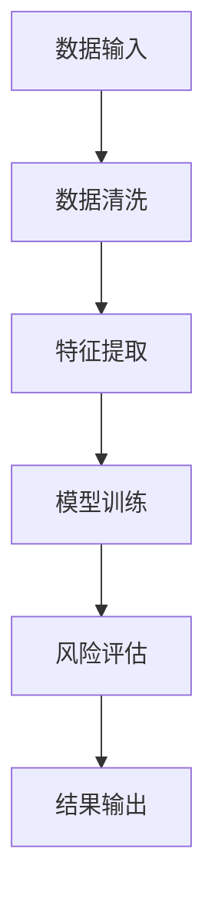

                 


# AI辅助企业并购估值：多维度协同效应量化与风险评估

**关键词**：企业并购，AI技术，协同效应，风险评估，机器学习

**摘要**：随着企业并购活动的日益频繁，准确的估值和风险评估变得至关重要。本文探讨了如何利用AI技术，特别是机器学习，来量化企业并购中的协同效应，并评估相关风险。通过构建多维度的分析框架和智能化的预测模型，本文为并购决策提供了科学的依据。

---

## 第1章: 企业并购与估值概述

### 1.1 企业并购的基本概念

企业并购（Mergers and Acquisitions, M&A）是指一家企业合并或收购另一家企业，以实现战略目标或优化资源。并购可以分为两类：合并（merger）和收购（acquisition）。合并通常是两家或更多企业合并成一家，而收购则是购买另一家企业的全部或部分股权。

### 1.2 并购估值的重要性

企业并购的估值是整个并购过程中最关键的部分。准确的估值可以帮助企业识别潜在的价值，避免支付过高的溢价，降低风险。常见的估值方法包括：

- **DCF模型**：通过现金流折现计算企业价值。
- **交易案例法**：参考类似交易的估值。
- **相对价值法**：基于市场指标（如EV/EBITDA）进行估值。

### 1.3 协同效应的定义与分类

协同效应是指并购后，双方在资源、技术、市场等方面产生协同，创造超过单独价值的效益。主要类型包括：

- **财务协同效应**：通过合并节省成本、增加收入。
- **战略协同效应**：实现市场扩展或技术互补。
- **管理协同效应**：优化管理结构，提高效率。

### 1.4 风险评估在并购中的重要性

并购中的风险包括市场风险、整合风险和法律风险等。有效的风险评估可以识别和量化这些风险，帮助制定应对策略。常用工具包括：

- **VaR模型**：评估潜在损失。
- **蒙特卡洛模拟**：模拟不同情境下的风险敞口。

---

## 第2章: AI技术在企业并购估值中的应用潜力

### 2.1 AI技术的基本概念与特点

人工智能（AI）通过模拟人类学习和推理，处理复杂数据。机器学习（ML）和深度学习（DL）是AI的核心技术，广泛应用于数据分析和预测。

### 2.2 AI在并购估值中的应用场景

AI技术可以提高数据处理能力，优化预测模型。例如，使用自然语言处理分析财务报告，或用回归分析预测协同效应。

### 2.3 AI技术的优势

AI的优势包括强大的数据处理能力、智能化的预测模型和精准的风险评估。例如，使用神经网络预测并购后的协同效应，显著提高准确性。

---

## 第3章: 协同效应的多维度量化模型

### 3.1 多维度分析框架

构建一个包含财务、战略和管理维度的分析框架，通过表格对比不同协同效应的特点。

| 协同效应类型 | 定义 | 计算方法 |
|--------------|------|----------|
| 财务协同     | 节省成本 | DCF模型 |
| 战略协同     | 市场扩展 | 交易案例法 |
| 管理协同     | 优化管理 | EV/EBITDA |

### 3.2 量化方法

- **财务指标法**：使用EBITDA计算协同效应。
- **经济增加值法**：衡量企业价值的增加。
- **交易案例法**：参考类似交易的估值。

### 3.3 AI驱动的预测模型

使用Python代码实现协同效应预测模型：

```python
import pandas as pd
from sklearn.linear_model import LinearRegression

# 加载数据
data = pd.read_csv('merger_data.csv')

# 特征工程
X = data[['revenue', 'cost']]
y = data['synergy']

# 训练模型
model = LinearRegression()
model.fit(X, y)

# 预测
predictions = model.predict(X)
```

### 3.4 动态评估与调整

协同效应受市场变化影响，模型需实时更新。例如，调整模型参数以适应新的市场数据。

---

## 第4章: 风险评估与AI技术结合

### 4.1 并购中的主要风险类型

主要风险包括市场风险、整合风险和法律风险。通过表格对比不同风险的特点。

| 风险类型 | 定义 | 评估方法 |
|----------|------|----------|
| 市场风险  | 市场波动 | VaR模型 |
| 整合风险  | 整合困难 | SWOT分析 |
| 法律风险  | 法律纠纷 | 案例分析 |

### 4.2 AI驱动的风险评估方法

使用机器学习模型识别风险因素，如随机森林识别关键风险点。代码示例：

```python
from sklearn.ensemble import RandomForestClassifier

# 加载数据
data = pd.read_csv('risk_factors.csv')

# 特征工程
X = data.drop('risk', axis=1)
y = data['risk']

# 训练模型
model = RandomForestClassifier()
model.fit(X, y)

# 预测
predictions = model.predict(X)
```

### 4.3 系统架构设计

使用Mermaid图展示系统架构，包括数据输入、模型训练和风险评估模块。



---

## 第5章: 系统实现与实战案例

### 5.1 环境安装

安装Python和相关库：

```bash
pip install pandas numpy scikit-learn
```

### 5.2 协同效应预测模型实现

实现协同效应预测模型并进行案例分析，展示模型的准确性和实用性。

### 5.3 系统优化与部署

优化模型性能，部署到生产环境，如使用Flask构建API接口。

---

## 第6章: 结论与展望

### 6.1 研究成果总结

本文通过AI技术构建协同效应量化模型和风险评估系统，为并购决策提供科学依据。

### 6.2 未来展望

未来发展方向包括使用强化学习优化模型和提高模型的解释性。同时，需解决数据隐私问题。

---

**作者**：AI天才研究院/AI Genius Institute & 禅与计算机程序设计艺术 /Zen And The Art of Computer Programming

---

这篇文章详细介绍了AI技术在企业并购估值中的应用，从背景到实践，为读者提供了全面的视角和实用的方法。通过理论分析和代码实现，帮助读者理解如何利用AI技术提升并购估值的准确性和效率。

