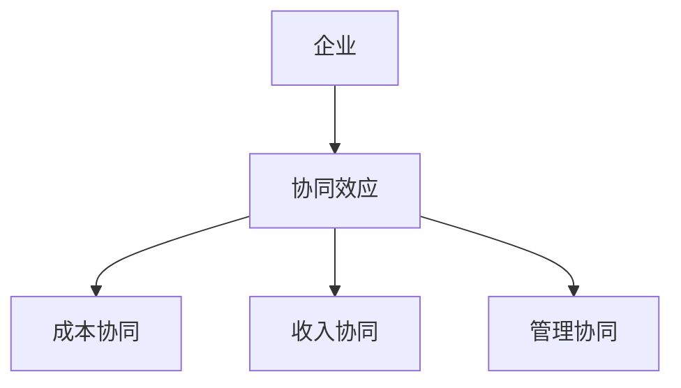
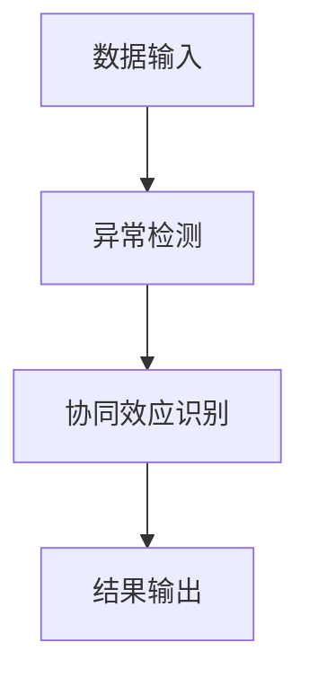

                 


# AI辅助企业并购协同效应分析：识别与量化价值

**关键词：** AI, 企业并购, 协同效应, 数学模型, 机器学习

**摘要：**  
在企业并购过程中，协同效应是决定交易成功与否的关键因素之一。然而，传统的方法在识别和量化协同效应方面存在诸多挑战。本文将从理论到实践，系统性地探讨如何利用人工智能技术辅助企业并购中的协同效应分析。通过结合数学模型和机器学习算法，本文旨在为读者提供一种高效、精确的协同效应识别与量化方法。文章内容涵盖协同效应的类型、识别算法、数学模型、系统架构设计以及实际案例分析，帮助读者全面理解AI在企业并购中的应用价值。

---

# 第一部分: 企业并购与协同效应概述

## 第1章: 企业并购的基本概念

### 1.1 企业并购的定义与类型
企业并购（Mergers and Acquisitions, M&A）是指两个或多个企业之间的合并或收购行为。根据企业并购的目的和方式，可以将其分为以下几种类型：

1. **横向并购**：指同一行业内的企业合并，旨在扩大市场份额或消除竞争。
2. **纵向并购**：指供应链上下游的企业合并，以增强垂直整合能力。
3. **混合并购**：指与企业现有业务不相关的并购，通常用于 diversification。

### 1.2 协同效应的定义与重要性
协同效应（Synergy）是指企业并购后，双方资源整合所产生的价值增值。协同效应可以分为以下几种类型：

1. **成本协同效应**：通过合并运营降低成本，例如共享资源、优化供应链等。
2. **收入协同效应**：通过合并市场或客户资源，扩大收入来源。
3. **管理协同效应**：通过整合管理团队和流程，提高管理效率。

### 1.3 AI在企业并购中的应用背景
随着企业并购的复杂性不断提高，传统的人工分析方法逐渐暴露出效率低下、主观性强等问题。AI技术的引入为企业并购提供了以下优势：

1. **高效的数据处理能力**：AI可以快速分析海量数据，识别潜在的协同效应。
2. **精准的预测能力**：基于机器学习算法，AI可以预测并购后的协同效应价值。
3. **客观性与准确性**：AI分析结果基于数据驱动，减少了人为判断的主观性。

---

# 第二部分: 协同效应识别与量化的核心概念

## 第2章: 协同效应的类型与数学模型

### 2.1 协同效应的类型
协同效应可以分为以下几种类型：

1. **成本协同效应（Cost Synergy）**：通过合并企业减少重复成本，例如共享员工、办公室或设备。
2. **收入协同效应（Revenue Synergy）**：通过合并市场或客户资源，扩大收入来源，例如共享客户数据库或销售渠道。
3. **管理协同效应（Management Synergy）**：通过整合管理团队和流程，提高管理效率。

### 2.2 协同效应的数学模型
为了量化协同效应的价值，我们可以使用以下数学模型：

#### 2.2.1 协同效应的度量公式
协同效应的价值可以通过以下公式进行度量：
$$ \text{协同效应} = \frac{EVA_{\text{合并}} - EVA_{\text{独立}}}{EVA_{\text{独立}}} \times 100\% $$
其中，$EVA_{\text{合并}}$ 是合并后的经济价值增加值，$EVA_{\text{独立}}$ 是合并前的经济价值增加值。

#### 2.2.2 协同效应的分解模型
$$ \text{协同效应} = \sum_{i=1}^{n} w_i \cdot CE_i $$
其中，$w_i$ 是第 $i$ 个协同效应的权重，$CE_i$ 是第 $i$ 个协同效应的值。

### 2.3 协同效应的ER实体关系图


---

# 第三部分: 协同效应识别的算法原理

## 第3章: 协同效应识别算法

### 3.1 协同效应检测算法
为了识别企业并购中的协同效应，我们可以使用以下算法：

#### 3.1.1 基于异常检测的协同效应识别


#### 3.1.2 基于机器学习的协同效应识别
```python
# 协同效应识别算法的Python实现示例
import pandas as pd
from sklearn.ensemble import RandomForestClassifier

# 数据加载
data = pd.read_csv('synergy_data.csv')

# 特征工程
X = data.drop('has_synergy', axis=1)
y = data['has_synergy']

# 模型训练
model = RandomForestClassifier()
model.fit(X, y)

# 模型预测
predictions = model.predict(X)
print('预测结果:', predictions)
```

---

## 第4章: 协同效应的数学模型与算法实现

### 4.1 协同效应的数学模型
为了量化协同效应的价值，我们可以使用以下数学模型：

#### 4.1.1 协同效应的价值预测模型
$$ \text{协同效应价值} = \beta_0 + \beta_1 x_1 + \beta_2 x_2 + \dots + \beta_n x_n $$
其中，$\beta_i$ 是回归系数，$x_i$ 是影响协同效应的变量。

#### 4.1.2 协同效应的回归分析
```python
# 协同效应回归分析的Python实现示例
import statsmodels.api as sm

# 数据加载
data = pd.read_csv('synergy_data.csv')

# 回归模型构建
model = sm.OLS(data['synergy_value'], sm.add_constant(data[['revenue', 'cost']]))
results = model.fit()

# 模型结果输出
print(results.summary())
```

---

## 第5章: 企业并购协同效应分析系统的架构设计

### 5.1 系统功能设计
协同效应分析系统的主要功能模块包括：

1. **数据采集模块**：负责采集企业并购相关的数据，例如财务数据、市场份额数据等。
2. **协同效应识别模块**：基于算法识别潜在的协同效应。
3. **协同效应量化模块**：使用数学模型量化协同效应的价值。
4. **可视化模块**：将协同效应分析结果以图形化形式展示。

### 5.2 系统架构设计


---

## 第6章: 企业并购协同效应分析的实战案例

### 6.1 案例背景
假设我们有一家科技公司A和一家软件公司B，A希望收购B以实现成本协同效应和收入协同效应。

### 6.2 数据准备
```python
# 数据准备
data = {
    'revenue_A': [100, 80, 90],
    'cost_A': [50, 40, 45],
    'revenue_B': [80, 60, 70],
    'cost_B': [40, 30, 35]
}
df = pd.DataFrame(data)
```

### 6.3 协同效应识别与量化
```python
# 协同效应识别与量化
import numpy as np

def calculate_synergy(revenue_A, cost_A, revenue_B, cost_B):
    # 成本协同效应
    cost_synergy = (cost_A + cost_B) * 0.9 - (cost_A + cost_B)
    # 收入协同效应
    revenue_synergy = (revenue_A + revenue_B) * 1.1 - (revenue_A + revenue_B)
    return cost_synergy + revenue_synergy

synergy = calculate_synergy(df['revenue_A'], df['cost_A'], df['revenue_B'], df['cost_B'])
print('协同效应:', synergy)
```

### 6.4 结果分析
通过上述代码计算出的协同效应表明，企业并购后可以实现显著的成本和收入协同效应，从而提升整体价值。

---

# 第四部分: 总结与展望

## 第7章: 总结与展望

### 7.1 最佳实践
- 在企业并购中，建议结合AI技术与传统方法，充分发挥两者的优势。
- 在实际应用中，建议企业根据自身需求选择合适的协同效应识别与量化方法。

### 7.2 小结
本文系统性地探讨了AI辅助企业并购协同效应分析的理论与实践。通过结合数学模型和机器学习算法，本文为读者提供了一种高效、精确的协同效应识别与量化方法。

### 7.3 注意事项
- 在实际应用中，需要结合企业实际情况调整算法参数。
- 协同效应分析结果仅供参考，最终决策需结合企业战略目标。

### 7.4 拓展阅读
- 《Machine Learning for Business》
- 《Synergy Analysis in Mergers and Acquisitions》

---

**作者：AI天才研究院（AI Genius Institute） & 禅与计算机程序设计艺术（Zen And The Art of Computer Programming）**

