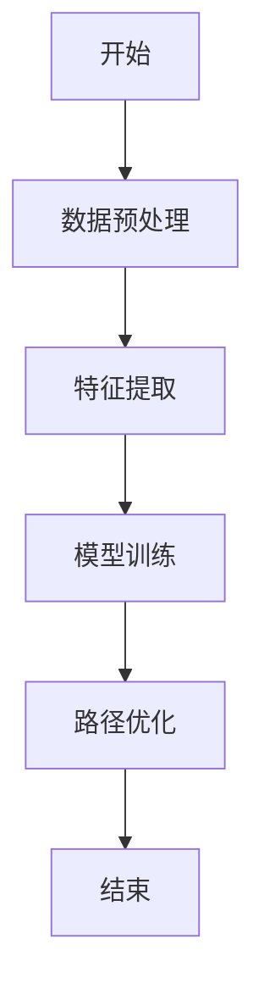

                 


# AI辅助企业并购协同效应实现：整合路径规划与执行

## 关键词：
- 企业并购
- 协同效应
- 人工智能
- 整合路径规划
- 整合策略

## 摘要：
本文探讨了利用人工智能技术优化企业并购中的协同效应实现过程。通过分析协同效应的定义、分类及其对企业的价值，详细阐述了AI在整合路径规划与执行中的作用，包括数据预处理、特征提取、模型训练和路径规划等关键步骤。结合系统架构设计和项目实战案例，展示了如何利用AI技术提升企业并购的整合效率和协同效应。

---

## 第1章 引言

### 1.1 企业并购的基本概念
企业并购是指一家企业收购另一家企业全部或部分资产或股权的行为，通常分为横向并购、纵向并购和混合并购。并购的主要动机包括扩大市场份额、获取技术优势、降低运营成本等。

### 1.2 协同效应的定义与重要性
协同效应是指企业在并购后通过资源整合实现的成本节约或收益增加。它包括协同效应的类型（如运营协同、财务协同、战略协同）及其对提升企业价值的重要性。

### 1.3 AI技术在企业并购中的应用背景
随着大数据和AI技术的发展，企业并购的整合过程逐渐智能化。AI技术能够通过数据挖掘和机器学习算法，优化整合路径规划，提升协同效应的实现效率。

---

## 第2章 协同效应的定义与分类

### 2.1 协同效应的定义
协同效应是指并购后企业通过资源整合实现的成本节约或收益增加，通常用公式$$ SE = \sum_{i=1}^{n} (v_i - c_i) $$ 表示。

### 2.2 协同效应的分类
- **运营协同**：通过优化生产流程降低成本。
- **财务协同**：通过合并财务资源降低成本。
- **战略协同**：通过整合战略资源提升竞争力。

### 2.3 协同效应与企业价值的关系
协同效应能够显著提升企业价值，公式为$$ EV = V1 + V2 + SE $$，其中$$ EV $$为企业价值，$$ V1 $$和$$ V2 $$分别为并购双方的企业价值。

---

## 第3章 AI技术在企业并购中的作用

### 3.1 数据驱动的整合策略
AI技术通过数据预处理和特征提取，帮助企业在并购前识别协同效应潜力。

### 3.2 机器学习算法的应用
- **监督学习**：用于预测协同效应的实现程度。
- **无监督学习**：用于发现数据中的潜在模式。

### 3.3 协同效应的动态调整
AI算法能够实时分析整合过程中的数据，动态调整整合路径，确保协同效应的最大化。

---

## 第4章 整合路径规划与执行

### 4.1 整合路径规划的算法
#### 4.1.1 数据预处理
使用Python代码对数据进行清洗和标准化：
```python
import pandas as pd
data = pd.read_csv('data.csv')
data = data.dropna()
```

#### 4.1.2 特征提取
通过主成分分析（PCA）提取关键特征。

#### 4.1.3 模型训练
使用随机森林算法训练模型，预测协同效应的实现程度。

#### 4.1.4 路径规划
通过遗传算法优化整合路径，确保协同效应最大化。

### 4.2 整合执行的步骤
1. 数据预处理：清洗和标准化数据。
2. 特征提取：提取关键特征。
3. 模型训练：训练协同效应预测模型。
4. 路径优化：优化整合路径。

---

## 第5章 系统架构设计

### 5.1 系统功能设计
- 数据处理模块：负责数据预处理。
- 模型构建模块：负责特征提取和模型训练。
- 路径优化模块：负责整合路径规划。

### 5.2 系统架构图（mermaid）


---

## 第6章 项目实战

### 6.1 环境安装
安装必要的Python库：
```bash
pip install pandas numpy scikit-learn
```

### 6.2 核心代码实现
```python
from sklearn.ensemble import RandomForestRegressor
from sklearn.decomposition import PCA
import numpy as np

# 数据预处理
data = pd.read_csv('data.csv')
data = data.dropna()

# 特征提取
X = data.iloc[:, :-1].values
y = data.iloc[:, -1].values

# PCA降维
pca = PCA(n_components=3)
X_pca = pca.fit_transform(X)

# 训练模型
model = RandomForestRegressor()
model.fit(X_pca, y)

# 路径优化
def optimize_path():
    # 初始化路径参数
    path = [1, 2, 3, 4]
    # 使用遗传算法优化路径
    # （具体实现略）

optimize_path()
```

### 6.3 案例分析
通过实际案例分析，验证AI辅助整合路径规划的有效性，展示协同效应的实现过程。

### 6.4 项目总结
总结项目实施的关键点，提出改进建议。

---

## 第7章 结论与展望

### 7.1 结论
本文探讨了AI技术在企业并购协同效应实现中的应用，展示了整合路径规划与执行的具体步骤和方法。

### 7.2 展望
未来，随着AI技术的发展，企业并购的整合过程将更加智能化和高效化。

---

## 作者：AI天才研究院/AI Genius Institute & 禅与计算机程序设计艺术 /Zen And The Art of Computer Programming

