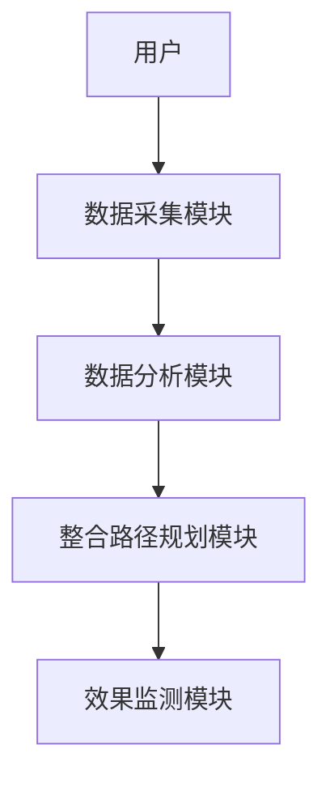

                 


# AI辅助企业并购协同效应实现：整合路径规划与效果监测

**关键词：** AI技术, 企业并购, 协同效应, 整合路径, 效果监测

**摘要：**  
随着企业并购活动的日益频繁，如何利用人工智能技术优化整合路径并实现协同效应的最大化成为企业关注的焦点。本文将从AI辅助企业并购的背景出发，系统阐述协同效应的实现机制，详细分析整合路径规划的核心算法，深入探讨效果监测的实现方法，并结合实际案例提供可落地的系统架构设计与代码实现。

---

## 第1章 AI辅助企业并购的背景与概念

### 1.1 企业并购的定义与背景

#### 1.1.1 企业并购的基本概念  
企业并购（Mergers and Acquisitions，简称M&A）是指两个或多个企业之间通过合并、收购或重组等方式，实现资源整合和战略协同的过程。并购的目的是为了优化资源配置、提升市场竞争力或扩大业务规模。

#### 1.1.2 并购的动机与目标  
企业进行并购的动机多样，包括市场扩展、技术获取、成本节约等。并购的目标通常包括：  
1. **市场扩展**：通过并购进入新市场或区域。  
2. **技术获取**：通过并购获得关键技术或专利。  
3. **成本节约**：通过规模效应降低成本。  
4. **战略协同**：通过资源整合实现业务协同。

#### 1.1.3 并购的类型与特点  
并购的类型主要包括：  
1. **横向并购**：同一行业内的企业并购。  
2. **纵向并购**：产业链上下游的企业并购。  
3. **混合并购**：与主业无关的跨行业并购。  

---

### 1.2 协同效应的定义与实现路径

#### 1.2.1 协同效应的定义  
协同效应是指企业在并购后，通过资源整合、能力互补或效率提升所实现的额外价值。协同效应的核心在于“1+1>2”的效果。

#### 1.2.2 协同效应的分类与影响因素  
协同效应主要分为以下几类：  
1. **成本协同**：通过资源整合降低运营成本。  
2. **收入协同**：通过市场扩展或产品互补增加收入。  
3. **技术协同**：通过技术共享提升创新能力。  

#### 1.2.3 协同效应的实现机制  
协同效应的实现机制涉及企业战略、组织结构、文化和资源等多个方面。关键在于如何通过AI技术优化资源整合和能力互补。

---

### 1.3 AI在企业并购中的应用价值

#### 1.3.1 AI技术在企业并购中的优势  
AI技术可以帮助企业在并购过程中实现以下目标：  
1. **精准评估目标企业价值**：通过大数据分析和机器学习模型预测企业的潜在价值。  
2. **优化整合路径**：通过算法模拟不同整合方案的效果，选择最优路径。  
3. **实时监测整合效果**：通过数据监控和反馈机制动态调整整合策略。

#### 1.3.2 AI在协同效应实现中的作用  
AI技术可以通过以下方式提升协同效应：  
1. **预测协同潜力**：通过数据分析预测并购后的协同潜力。  
2. **优化整合策略**：通过算法模拟不同整合方案，找到最优路径。  
3. **动态调整整合计划**：通过实时数据分析动态优化整合策略。

#### 1.3.3 AI辅助企业并购的未来趋势  
随着AI技术的不断进步，企业并购将更加智能化和数据驱动。未来，AI将在企业估值、整合路径规划和效果监测等方面发挥更大的作用。

---

## 第2章 协同效应的实现机制

### 2.1 协同效应的核心要素

#### 2.1.1 企业资源的整合  
资源整合是实现协同效应的基础。企业需要将双方的资源（如资金、技术、人才）进行优化配置。

#### 2.1.2 企业能力的互补性  
能力互补是协同效应的核心。企业需要通过并购实现能力的互补，例如技术互补、市场互补等。

#### 2.1.3 企业文化的融合  
文化融合是协同效应的关键。企业需要通过文化整合实现团队的高效协作。

---

### 2.2 协同效应的评估模型

#### 2.2.1 协同效应的数学模型  
协同效应的评估可以采用以下数学模型：  
$$ 协同效应 = \sum_{i=1}^{n} (R_i + C_i) $$  
其中，$R_i$ 表示资源协同，$C_i$ 表示能力协同。

#### 2.2.2 协同效应的评估指标  
协同效应的评估指标包括：  
1. **成本节约率**：整合后成本降低的比例。  
2. **收入增长率**：整合后收入增长的比例。  
3. **净资产收益率（ROE）**：衡量企业盈利能力的指标。  

---

### 2.3 协同效应的影响因素分析

#### 2.3.1 企业战略匹配度  
企业战略的匹配度是协同效应的关键影响因素。双方的战略一致性越高，协同效应越强。

#### 2.3.2 企业组织结构的适应性  
组织结构的适应性是协同效应的重要保障。企业需要通过组织结构调整实现高效的资源整合。

#### 2.3.3 企业文化的兼容性  
企业文化的兼容性是协同效应的重要前提。双方的文化冲突越小，整合越顺利。

---

## 第3章 整合路径规划的AI方法

### 3.1 整合路径规划的核心算法

#### 3.1.1 基于图论的路径规划算法  
基于图论的路径规划算法可以通过构建有向图来模拟整合路径，并通过最短路径算法找到最优路径。

#### 3.1.2 基于强化学习的路径规划算法  
强化学习可以通过模拟器训练AI模型，找到最优的整合路径。

#### 3.1.3 基于遗传算法的路径优化  
遗传算法可以通过迭代优化找到整合路径的最优解。

---

### 3.2 整合路径规划的数学模型

#### 3.2.1 路径规划的目标函数  
整合路径规划的目标函数可以表示为：  
$$ 目标函数 = \sum_{i=1}^{n} (C_i + D_i) $$  
其中，$C_i$ 表示协同成本，$D_i$ 表示协同收益。

#### 3.2.2 路径规划的约束条件  
整合路径规划需要考虑以下约束条件：  
1. 资源分配的合理性。  
2. 整合时间的最优化。  
3. 整合成本的最小化。

---

## 第4章 效果监测的AI实现

### 4.1 效果监测的核心算法

#### 4.1.1 基于机器学习的效果监测算法  
机器学习可以通过历史数据训练模型，预测整合效果。

#### 4.1.2 基于时间序列分析的效果监测算法  
时间序列分析可以通过对历史数据的建模，预测整合后的效果变化。

#### 4.1.3 基于反馈机制的效果监测算法  
反馈机制可以通过实时数据调整监测模型，动态优化整合效果。

---

### 4.2 效果监测的数学模型

#### 4.2.1 效果监测的目标函数  
效果监测的目标函数可以表示为：  
$$ 效果 = \sum_{i=1}^{n} (E_i + F_i) $$  
其中，$E_i$ 表示实际效果，$F_i$ 表示预测效果。

#### 4.2.2 效果监测的约束条件  
效果监测需要考虑以下约束条件：  
1. 数据的实时性。  
2. 模型的准确性。  
3. 监测的周期性。

---

## 第5章 系统架构设计与实现

### 5.1 系统功能模块设计

#### 5.1.1 数据采集模块  
数据采集模块负责收集企业的各项数据，包括财务数据、业务数据等。

#### 5.1.2 数据分析模块  
数据分析模块通过机器学习算法对数据进行分析，生成协同效应评估报告。

#### 5.1.3 整合路径规划模块  
整合路径规划模块通过算法模拟不同整合方案，找到最优路径。

#### 5.1.4 效果监测模块  
效果监测模块通过实时数据分析，动态调整整合策略。

---

### 5.2 系统架构设计

#### 5.2.1 系统架构设计图  


#### 5.2.2 系统接口设计  
系统接口设计包括数据接口和API接口，确保各模块之间的数据流转。

---

## 第6章 项目实战与最佳实践

### 6.1 项目实战

#### 6.1.1 环境安装  
需要安装Python、机器学习库（如Scikit-learn）和数据可视化工具（如Matplotlib）。

#### 6.1.2 核心代码实现  
以下是协同效应评估的Python代码示例：
```python
import numpy as np
from sklearn import linear_model

# 数据准备
X = np.array([[1, 2], [3, 4], [5, 6]])
y = np.array([7, 8, 9])

# 训练模型
model = linear_model.LinearRegression()
model.fit(X, y)

# 预测结果
print(model.predict([[2, 3]]))
```

#### 6.1.3 案例分析  
以某企业并购案例为例，分析整合路径规划和效果监测的具体实现。

---

### 6.2 最佳实践

#### 6.2.1 数据驱动决策  
数据驱动决策是实现协同效应的关键。

#### 6.2.2 持续优化  
整合路径规划和效果监测需要持续优化。

#### 6.2.3 团队协作  
团队协作是实现协同效应的重要保障。

---

## 第7章 总结与展望

### 7.1 总结  
本文系统阐述了AI辅助企业并购协同效应实现的整合路径规划与效果监测方法，提出了基于AI的整合路径规划和效果监测的实现方案。

### 7.2 展望  
未来，随着AI技术的不断发展，企业并购将更加智能化和数据驱动。AI将在企业并购的全生命周期中发挥更大的作用。

---

**作者：AI天才研究院/AI Genius Institute & 禅与计算机程序设计艺术/Zen And The Art of Computer Programming**

