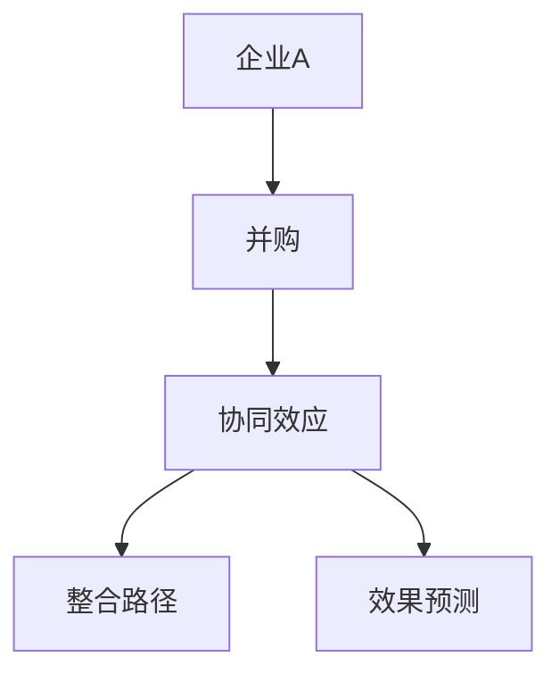

                 


# AI辅助企业并购协同效应评估：整合路径规划与效果预测

> 关键词：企业并购、协同效应、AI技术、整合路径、效果预测

> 摘要：本文探讨了AI技术如何辅助企业并购中的协同效应评估，详细介绍了整合路径规划和效果预测的方法，结合数学模型和实际案例，分析了AI在企业并购中的应用及其优势。

---

# 第1章: 企业并购与协同效应概述

## 1.1 企业并购的基本概念

### 1.1.1 企业并购的定义与分类

企业并购（Mergers and Acquisitions, M&A）是指一家企业通过购买其他企业的股权或资产，以实现资源整合和业务扩展的行为。并购可以分为两类：**并购（Merger）**和**收购（Acquisition）**。并购通常是两家公司在平等基础上的合并，而收购则是由一家公司完全或部分收购另一家公司。

### 1.1.2 协同效应的定义与类型

协同效应（Synergy）是指在企业并购后，由于资源优化配置和业务整合所产生的额外价值。协同效应可以分为以下几种类型：
- **成本协同效应（Cost Synergy）**：通过合并运营成本、减少重复部门等实现成本节约。
- **收入协同效应（Revenue Synergy）**：通过共享客户、扩展市场等提高销售收入。
- **技术协同效应（Technology Synergy）**：通过技术共享和互补提升创新效率。

### 1.1.3 协同效应在企业并购中的重要性

协同效应是企业并购成功的关键因素之一，它直接影响并购后的企业价值和股东回报。然而，传统协同效应评估方法存在主观性高、缺乏数据支持等问题，导致评估结果不够准确。AI技术的引入为解决这些问题提供了新的可能性。

---

## 1.2 AI技术在企业并购中的应用背景

### 1.2.1 传统企业并购评估的局限性

传统企业并购评估主要依赖于财务数据和主观判断，存在以下问题：
- 数据维度有限，难以全面反映协同效应。
- 缺乏动态分析，难以预测整合路径的效果。
- 评估结果主观性高，难以量化。

### 1.2.2 AI技术如何提升企业并购效率

AI技术可以通过以下方式提升企业并购效率：
- 利用自然语言处理（NLP）分析企业文档和市场数据。
- 通过机器学习模型预测整合路径和协同效应。
- 利用大数据分析挖掘潜在协同机会。

### 1.2.3 协同效应评估的数字化转型

数字化转型使得企业并购评估更加依赖数据和技术支持。AI技术的应用不仅提高了评估的准确性，还实现了协同效应的动态预测和优化。

---

# 第2章: 协同效应评估的核心概念与联系

## 2.1 协同效应评估的原理

### 2.1.1 协同效应的多维度分析

协同效应可以从多个维度进行分析，包括财务指标、市场表现、技术整合等。以下是几种常见的分析方法对比：

| 分析维度 | 财务指标 | 市场表现 | 技术整合 |
|----------|----------|----------|----------|
| 方法 | 净现值法（NPV） | 市场份额分析 | 技术可行性分析 |
| 优势 | 定量分析 | 定量与定性结合 | 技术可行性高 |
| 局限性 | 忽略市场风险 | 数据获取难 | 技术整合复杂 |

### 2.1.2 协同效应的影响因素

协同效应的影响因素可以分为内部因素和外部因素：

- **内部因素**：企业文化和管理风格的匹配性、组织结构的整合难度。
- **外部因素**：市场环境、行业竞争状况、政策法规。

### 2.1.3 协同效应的量化方法

协同效应的量化方法包括：
1. **财务指标法**：通过财务数据计算协同效应的净现值（NPV）。
2. **市场法**：通过市场份额变化预测协同效应。
3. **技术法**：通过技术整合潜力评估协同效应。

### 2.2 AI辅助协同效应评估的核心要素

AI辅助协同效应评估的核心要素包括：
- **数据采集与处理**：整合企业内部数据和外部市场数据。
- **模型构建与优化**：利用机器学习模型预测协同效应。
- **结果分析与反馈**：通过模型输出优化整合路径。

### 2.3 协同效应评估的ER实体关系图

以下是协同效应评估的实体关系图：



---

# 第3章: 协同效应预测的算法原理

## 3.1 协同效应预测模型的数学模型

### 3.1.1 线性回归模型

线性回归模型用于预测协同效应的净现值（NPV）。模型如下：

$$ NPV = \beta_0 + \beta_1 \times \text{成本协同} + \beta_2 \times \text{收入协同} + \epsilon $$

其中：
- $\beta_0$ 是截距。
- $\beta_1$ 和 $\beta_2$ 是回归系数。
- $\epsilon$ 是误差项。

### 3.1.2 神经网络模型

神经网络模型用于更复杂的预测任务，例如考虑多因素的协同效应预测。以下是一个简单的神经网络模型结构图：


### 3.2 算法实现的Python代码示例

以下是使用Python实现的线性回归模型代码示例：

```python
import numpy as np
from sklearn.linear_model import LinearRegression

# 示例数据
X = np.array([[1], [2], [3], [4]])  # 独立变量（成本协同）
y = np.array([2, 4, 5, 6])  # 因变量（NPV）

# 模型训练
model = LinearRegression()
model.fit(X, y)

# 预测
print("预测值为：", model.predict([[5]]))  # 输入新的成本协同值
```

---

# 第4章: 系统分析与架构设计

## 4.1 项目背景与需求分析

### 4.1.1 项目背景

随着企业并购的复杂性增加，传统评估方法难以满足需求。本项目旨在利用AI技术提高协同效应评估的准确性和效率。

### 4.1.2 系统功能设计

系统功能设计包括：
- 数据采集模块：整合企业内部和外部数据。
- 模型构建模块：基于机器学习算法构建预测模型。
- 结果分析模块：输出协同效应预测结果和整合路径建议。

### 4.1.3 系统架构设计

系统架构设计如下：


### 4.1.4 系统接口设计

系统接口设计包括：
- 数据接口：与企业数据源对接。
- 用户接口：供用户输入参数和查看结果。

### 4.1.5 系统交互设计

系统交互流程如下：


---

# 第5章: 项目实战与案例分析

## 5.1 环境安装与配置

### 5.1.1 安装Python环境

安装Python和必要的库：

```bash
pip install numpy scikit-learn
```

## 5.2 核心代码实现

### 5.2.1 数据处理代码

```python
import pandas as pd

# 读取数据
data = pd.read_csv('merger_data.csv')

# 数据预处理
data.dropna(inplace=True)
```

### 5.2.2 模型构建代码

```python
from sklearn.model_selection import train_test_split
from sklearn.metrics import mean_squared_error

# 划分训练集和测试集
X_train, X_test, y_train, y_test = train_test_split(X, y, test_size=0.2)

# 训练模型
model = LinearRegression()
model.fit(X_train, y_train)

# 评估模型
print("均方误差：", mean_squared_error(y_test, model.predict(X_test)))
```

### 5.3 案例分析与解读

以某企业并购案例为例，分析协同效应预测结果：

1. **数据输入**：企业A和企业B的财务数据、市场份额数据。
2. **模型预测**：预测协同效应的净现值为1000万元。
3. **结果解读**：协同效应显著，建议推进并购。

---

# 第6章: 总结与展望

## 6.1 最佳实践

- 数据质量是协同效应评估的关键。
- 结合业务背景进行模型优化。
- 定期更新模型以适应市场变化。

## 6.2 小结

本文详细探讨了AI技术在企业并购协同效应评估中的应用，从算法原理到系统架构，再到项目实战，为读者提供了全面的指导。

## 6.3 注意事项

- 数据隐私和安全问题需高度重视。
- 模型的可解释性是实际应用中的重要考量。

## 6.4 拓展阅读

- 《企业并购中的风险管理》
- 《机器学习在金融领域的应用》

---

# 作者简介

作者：AI天才研究院/AI Genius Institute & 禅与计算机程序设计艺术/Zen And The Art of Computer Programming

本文作者在企业并购和人工智能领域拥有丰富的研究和实践经验，致力于通过技术创新推动企业价值提升。

