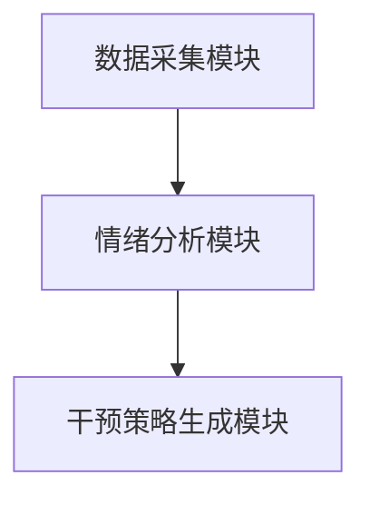
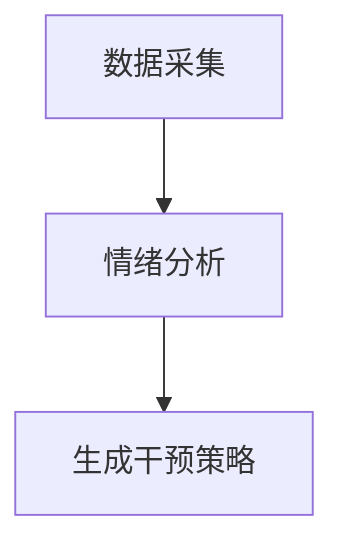

                 


# AI辅助企业并购后文化整合：员工情绪分析与干预策略

> 关键词：企业并购、文化整合、员工情绪分析、AI技术、干预策略

> 摘要：随着企业并购的频繁发生，文化整合成为并购成功的关键因素。本文探讨如何利用AI技术，特别是员工情绪分析，来优化企业并购后的文化整合过程。通过分析员工情绪，企业可以制定有效的干预策略，促进文化融合，提升企业绩效。

---

## 第一章：企业并购与文化整合概述

### 1.1 企业并购的基本概念
企业并购是指一家企业通过购买或合并另一家企业，以实现资源优化和市场扩展。并购不仅是企业发展的常见策略，也是企业战略的重要组成部分。

#### 1.1.1 企业并购的定义与类型
企业并购可以分为两类：**横向并购**（同一行业）和**纵向并购**（上下游产业）。并购的目的是为了扩大市场份额、降低成本或获取新技术。

#### 1.1.2 文化整合在企业并购中的重要性
文化整合是指将两家企业的文化和价值观融合在一起。文化整合的失败可能导致员工士气低落、工作效率下降，甚至导致并购失败。因此，文化整合是并购成功的关键。

#### 1.1.3 并购失败的常见原因与文化整合的关系
许多并购失败的原因在于文化冲突。例如，一家以创新文化为主的企业并购一家以保守文化为主的企业时，员工可能会因为价值观差异而产生冲突。

---

### 1.2 AI技术在企业整合中的应用潜力
AI技术可以通过分析员工情绪、识别文化冲突，帮助企业制定有效的文化整合策略。

#### 1.2.1 AI技术的基本概念与发展现状
AI技术，特别是自然语言处理（NLP）和机器学习，已经在企业管理中得到了广泛应用。例如，AI可以用于员工情绪分析、客户行为预测等。

#### 1.2.2 AI在企业并购中的应用场景
AI可以帮助企业在并购后快速识别文化冲突，分析员工情绪，制定文化整合计划。例如，AI可以通过分析员工的邮件、聊天记录，识别员工的情绪状态。

#### 1.2.3 员工情绪分析与文化整合的结合
员工情绪分析是文化整合的重要工具。通过分析员工的情绪，企业可以了解员工对并购的反应，及时采取干预措施，缓解文化冲突。

---

## 第二章：员工情绪分析与文化整合的理论基础

### 2.1 情绪分析的理论基础
员工情绪分析是基于情感计算和自然语言处理的技术，旨在识别和理解员工的情绪状态。

#### 2.1.1 情感计算与自然语言处理
情感计算是指通过分析文本、语音、面部表情等信息，识别和理解情感状态。自然语言处理（NLP）技术可以用于分析员工的文本数据，如邮件、聊天记录等。

#### 2.1.2 员工情绪与文化适应的关系
员工情绪与文化适应密切相关。例如，员工对新企业文化的态度会影响他们的工作态度和行为。

#### 2.1.3 情绪分析在文化整合中的作用
情绪分析可以帮助企业识别员工的文化冲突，了解员工的文化适应情况，从而制定有效的文化整合策略。

---

### 2.2 文化整合的理论框架
文化整合的理论框架包括文化整合的阶段模型和实现路径。

#### 2.2.1 文化整合的定义与核心要素
文化整合是指将两家企业的文化和价值观融合在一起。核心要素包括企业使命、愿景、价值观、管理风格等。

#### 2.2.2 不同企业文化的特点与冲突分析
不同企业文化的特点可能导致文化冲突。例如，一家以创新文化为主的企业并购一家以保守文化为主的企业时，可能会出现冲突。

#### 2.2.3 文化整合的阶段模型与实现路径
文化整合的阶段模型包括识别、分析、融合和评估阶段。实现路径包括文化培训、团队建设、沟通机制等。

---

## 第三章：AI辅助员工情绪分析的算法与实现

### 3.1 情绪分析的核心算法
员工情绪分析的核心算法包括情感分类算法和自然语言处理模型。

#### 3.1.1 基于机器学习的情绪分类算法
支持向量机（SVM）和随机森林是常用的情绪分类算法。例如，SVM可以通过训练数据识别文本中的情感倾向。

#### 3.1.2 基于深度学习的情绪分析模型
深度学习模型，如循环神经网络（RNN）和Transformer模型，可以用于情感分析。例如，Transformer模型可以通过分析文本上下文，识别员工情绪。

#### 3.1.3 情感分析的数学模型与公式
情感分析的数学模型可以通过以下公式表示：
$$
\text{概率} = \frac{\text{正确分类数}}{\text{总分类数}}
$$

---

### 3.2 基于NLP的情绪分析流程
情绪分析的流程包括数据预处理、特征提取、模型训练和评估。

#### 3.2.1 数据预处理与特征提取
数据预处理包括去除停用词、分词和词干提取。特征提取可以通过TF-IDF或词嵌入（如Word2Vec）实现。

#### 3.2.2 情感分类器的训练与优化
情感分类器的训练可以通过监督学习实现。模型优化可以通过交叉验证和网格搜索实现。

#### 3.2.3 情感分析的评估指标与方法
情感分析的评估指标包括准确率、召回率和F1值。例如，准确率可以通过以下公式计算：
$$
\text{准确率} = \frac{\text{正确分类数}}{\text{总分类数}}
$$

---

## 第四章：员工情绪分析与文化整合的系统架构设计

### 4.1 系统功能模块设计
员工情绪分析与文化整合的系统包括数据采集模块、情绪分析模块和干预策略生成模块。

#### 4.1.1 数据采集模块
数据采集模块可以通过邮件、聊天记录和员工反馈收集数据。

#### 4.1.2 情绪分析模块
情绪分析模块通过NLP技术分析员工情绪，识别文化冲突。

#### 4.1.3 干预策略生成模块
干预策略生成模块根据分析结果，生成文化整合的干预策略。

---

### 4.2 系统架构设计
系统架构设计包括模块设计和交互流程设计。

#### 4.2.1 系统整体架构图（Mermaid）


#### 4.2.2 模块间的交互流程（Mermaid）


---

## 第五章：员工情绪分析的数学模型与实现

### 5.1 基于机器学习的情绪分类模型
支持向量机（SVM）和随机森林是常用的情绪分类模型。

#### 5.1.1 支持向量机（SVM）模型
SVM通过构建超平面将数据分为两类。例如，可以用于二分类情感分析。

#### 5.1.2 随机森林模型
随机森林通过集成学习提高分类准确率。例如，可以用于多分类情感分析。

#### 5.1.3 模型的训练与优化
模型优化可以通过交叉验证和网格搜索实现。

---

### 5.2 基于深度学习的情绪分析模型
深度学习模型，如Transformer模型，可以通过分析文本上下文，识别员工情绪。

#### 5.2.1 Transformer模型
Transformer模型通过自注意力机制分析文本，识别情感倾向。

#### 5.2.2 模型的数学公式与实现细节
Transformer模型的注意力机制公式如下：
$$
\text{Attention}(Q, K, V) = \text{softmax}(\frac{QK^T}{\sqrt{d_k}})
$$

---

## 第六章：项目实战与案例分析

### 6.1 项目背景与介绍
以某互联网公司并购后的文化整合项目为例，分析AI在员工情绪分析中的应用。

#### 6.1.1 项目背景
某互联网公司并购一家传统企业，面临文化冲突问题。

#### 6.1.2 数据采集与预处理
通过员工邮件和聊天记录，提取情绪数据。

#### 6.1.3 情绪分析与干预策略生成
通过AI分析员工情绪，制定文化整合干预策略。

---

### 6.2 项目核心实现
项目核心实现包括数据处理、模型训练和干预策略生成。

#### 6.2.1 环境配置与数据处理
```python
import pandas as pd
from sklearn.feature_extraction.text import TfidfVectorizer
```

#### 6.2.2 情绪分析模型训练
```python
from sklearn.svm import SVC
model = SVC()
model.fit(X_train, y_train)
```

#### 6.2.3 干预策略生成
根据模型分析结果，生成文化整合干预策略，如组织文化培训、团队建设活动等。

---

## 第七章：最佳实践与总结

### 7.1 最佳实践
员工情绪分析与文化整合的实践建议包括数据隐私保护、模型迭代优化等。

#### 7.1.1 数据隐私保护
企业需要保护员工数据隐私，避免数据泄露。

#### 7.1.2 模型迭代优化
模型需要定期迭代优化，提高分类准确率。

#### 7.1.3 干预策略的有效性评估
企业需要定期评估干预策略的有效性，及时调整策略。

---

### 7.2 全文总结
本文探讨了AI辅助企业并购后文化整合的应用，特别是员工情绪分析与干预策略的制定。通过分析员工情绪，企业可以制定有效的文化整合策略，促进并购成功。

---

## 作者：AI天才研究院 & 禅与计算机程序设计艺术

---

通过本文的分析，我们可以看到，AI技术在企业并购后文化整合中的应用前景广阔。未来，随着AI技术的不断发展，员工情绪分析和干预策略将更加智能化和精准化，为企业并购的成功提供有力支持。

