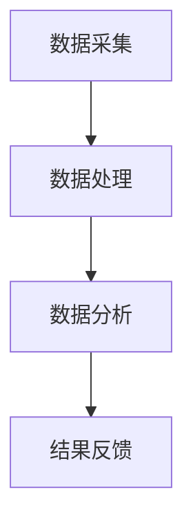
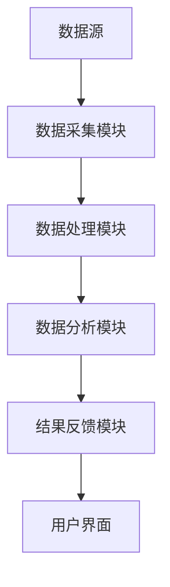
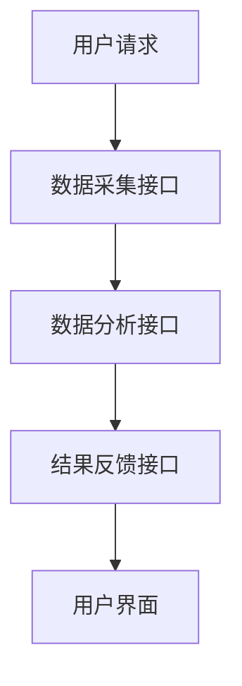

                 


# AI辅助企业并购整合规划：文化融合路径设计与效果实时监测

**关键词：** AI, 企业并购, 文化融合, 整合效果监测, 系统架构设计

**摘要：** 本文探讨了AI技术在企业并购整合中的应用，重点分析了文化融合路径设计与整合效果实时监测的核心概念、算法原理、系统架构设计及实际案例。通过详细讲解数学模型、系统实现和项目实战，为读者提供了一个全面的视角，帮助其理解如何利用AI技术优化企业并购整合过程。

---

## 第一部分: AI辅助企业并购整合规划的背景与核心概念

### 第1章: 企业并购整合的背景与挑战

#### 1.1 企业并购的背景与现状

##### 1.1.1 企业并购的定义与类型
企业并购（Mergers and Acquisitions, M&A）是指两个或多个企业之间通过合并或收购的方式，实现资源整合和战略目标的过程。常见的并购类型包括：
- **横向并购（Horizontal M&A）**：同一行业内的企业并购，旨在扩大市场份额。
- **纵向并购（Vertical M&A）**：上下游企业之间的并购，以优化供应链。
- **混合并购（Concentric M&A）**：与企业现有业务无直接关联的并购，通常出于多元化战略。

##### 1.1.2 并购整合的挑战
企业在并购后整合过程中常常面临以下挑战：
- **文化冲突**：不同企业的文化差异可能导致员工抵触，影响整合效果。
- **协同效应难以实现**：由于沟通不畅或战略不一致，协同效应往往低于预期。
- **整合过程复杂**：涉及组织结构、业务流程、信息系统等多方面的调整，难度较大。

##### 1.1.3 数字化时代下的并购整合趋势
随着数字化转型的深入，企业并购越来越依赖技术手段。AI技术的应用可以帮助企业更高效地进行整合规划，特别是在文化融合和效果监测方面。

---

#### 1.2 AI技术在企业整合中的作用

##### 1.2.1 AI技术对企业整合的赋能
AI技术可以通过以下方式赋能企业整合：
- **数据驱动的决策支持**：利用AI分析海量数据，为整合策略提供支持。
- **自动化流程优化**：AI可以自动识别和优化业务流程，提高整合效率。
- **实时监测与反馈**：AI可以帮助企业实时监测整合效果，快速调整策略。

##### 1.2.2 AI在文化融合中的独特价值
AI可以通过以下方式促进文化融合：
- **文化匹配度分析**：通过机器学习模型分析企业文化差异，制定融合策略。
- **员工行为预测**：基于员工数据预测其对整合的反应，提前制定应对措施。
- **文化传播优化**：利用自然语言处理技术优化文化传播方式，确保信息高效传达。

##### 1.2.3 AI实时监测整合效果的创新性
AI可以通过以下方式实现整合效果的实时监测：
- **实时数据采集与分析**：利用传感器、物联网等技术实时采集整合过程中的数据，并通过AI分析。
- **动态调整策略**：根据实时监测结果动态调整整合策略，确保整合效果最大化。

---

### 第2章: 文化融合与整合效果监测的核心概念

#### 2.1 文化融合的定义与关键要素

##### 2.1.1 文化融合的内涵
文化融合是指在企业并购后，通过融合双方的文化元素，形成新的企业文化的动态过程。它包括企业价值观、组织结构、管理风格等多个方面的融合。

##### 2.1.2 文化融合的关键维度
文化融合的关键维度包括：
- **企业价值观**：双方企业在核心价值观上的差异与融合。
- **组织结构**：组织架构的调整与优化。
- **管理风格**：管理方式的融合与统一。
- **员工行为**：员工对新文化的适应与接受程度。

##### 2.1.3 文化融合的实现路径
文化融合的实现路径包括：
1. **文化评估**：对企业文化进行评估，识别差异与共性。
2. **文化整合**：制定文化整合方案，明确融合的具体步骤。
3. **文化传播**：通过培训、沟通等方式传播新文化。
4. **文化优化**：根据反馈不断优化文化融合过程。

#### 2.2 整合效果实时监测的原理

##### 2.2.1 整合效果监测的定义
整合效果监测是指通过实时数据采集与分析，评估整合过程中的效果，并根据结果动态调整整合策略的过程。

##### 2.2.2 监测指标体系的构建
整合效果监测的指标体系包括：
- **财务指标**：如收入增长率、成本节约率等。
- **组织指标**：如员工满意度、组织稳定性等。
- **文化指标**：如文化融合度、员工归属感等。

##### 2.2.3 实时监测的技术实现
实时监测的技术实现包括：
1. **数据采集**：通过传感器、系统日志等方式采集实时数据。
2. **数据处理**：利用大数据技术对数据进行清洗、转换和存储。
3. **数据分析**：通过AI算法对数据进行分析，生成实时监测结果。
4. **结果反馈**：将监测结果反馈给整合团队，指导后续行动。

---

## 第二部分: AI辅助企业并购整合规划的核心算法与系统架构

### 第3章: 文化融合路径设计的算法原理

#### 3.1 文化融合路径设计的算法概述

##### 3.1.1 基于图论的文化融合路径构建
基于图论的文化融合路径构建是一种通过图结构分析企业文化差异，制定融合路径的方法。具体步骤如下：
1. **构建文化差异图**：将企业文化差异表示为图中的节点和边。
2. **寻找最短路径**：通过图算法（如Dijkstra算法）找到最优融合路径。

##### 3.1.2 基于机器学习的文化融合预测模型
基于机器学习的文化融合预测模型是一种通过训练数据预测文化融合效果的方法。具体步骤如下：
1. **数据收集**：收集企业并购案例数据，包括企业文化差异、整合效果等。
2. **特征提取**：提取影响文化融合的关键特征。
3. **模型训练**：使用机器学习算法（如随机森林、神经网络）训练模型。
4. **模型预测**：利用模型预测新并购案例的文化融合效果。

##### 3.1.3 文化融合路径优化的算法选择
文化融合路径优化的算法选择需要考虑以下因素：
- **数据量**：数据量大时选择分布式算法（如MapReduce）。
- **计算复杂度**：计算复杂度高时选择启发式算法（如遗传算法）。
- **实时性要求**：实时性要求高时选择流算法（如在线学习算法）。

#### 3.2 文化融合路径设计的数学模型

##### 3.2.1 文化融合路径权重计算公式
文化融合路径权重计算公式如下：
$$
w_i = \frac{\sum_{j=1}^{n} a_{ij} \cdot b_{ij}}{\sum_{j=1}^{n} b_{ij}}
$$
其中，$w_i$ 表示第i条路径的权重，$a_{ij}$ 表示第i条路径第j个节点的文化差异程度，$b_{ij}$ 表示第i条路径第j个节点的权重。

##### 3.2.2 文化融合风险评估模型
文化融合风险评估模型如下：
$$
R = \sum_{i=1}^{m} p_i \cdot r_i
$$
其中，$R$ 表示文化融合风险，$p_i$ 表示第i个风险因素的概率，$r_i$ 表示第i个风险因素的影响程度。

##### 3.2.3 文化融合效果预测公式
文化融合效果预测公式如下：
$$
E = \alpha \cdot F + \beta \cdot C
$$
其中，$E$ 表示文化融合效果，$F$ 表示财务指标，$C$ 表示文化指标，$\alpha$ 和 $\beta$ 为权重系数。

#### 3.3 算法实现的代码示例

##### 3.3.1 Python代码实现文化融合路径计算
```python
import networkx as nx
from sklearn.metrics import pairwise_distances

# 创建文化差异图
G = nx.Graph()
G.add_nodes_from(['A', 'B', 'C'])
G.add_edges_from([('A', 'B'), ('B', 'C'), ('A', 'C')])

# 计算最短路径
distances = pairwise_distances(G.nodes(), G.nodes())
shortest_path = nx.algorithms.shortest_paths.unweighted(G, 'A', 'C')
print(shortest_path)
```

##### 3.3.2 使用机器学习模型预测文化融合风险
```python
from sklearn.ensemble import RandomForestRegressor
import pandas as pd

# 数据准备
data = pd.DataFrame({
    '文化差异': [0.3, 0.5, 0.2],
    '组织结构差异': [0.4, 0.6, 0.1],
    '管理风格差异': [0.7, 0.3, 0.2]
})

# 模型训练
model = RandomForestRegressor(n_estimators=100)
model.fit(data[['文化差异', '组织结构差异', '管理风格差异']], data['风险'])

# 预测新案例
new_case = pd.DataFrame({
    '文化差异': [0.4],
    '组织结构差异': [0.5],
    '管理风格差异': [0.6]
})

# 输出预测结果
print(model.predict(new_case))
```

---

### 第4章: 整合效果实时监测的系统架构设计

#### 4.1 系统功能设计

##### 4.1.1 系统功能模块划分
系统功能模块包括：
- 数据采集模块：负责采集实时数据。
- 数据处理模块：负责数据清洗、转换和存储。
- 数据分析模块：负责数据分析和模型预测。
- 结果反馈模块：负责将分析结果反馈给整合团队。

##### 4.1.2 系统功能流程图


##### 4.1.3 系统功能的实现方式
- 数据采集：通过API接口实时采集数据。
- 数据处理：使用大数据技术进行数据处理。
- 数据分析：利用AI算法进行数据分析。
- 结果反馈：通过可视化界面将结果反馈给用户。

#### 4.2 系统架构设计

##### 4.2.1 系统架构图


##### 4.2.2 系统组件之间的交互关系
系统组件之间的交互关系如下：
1. 数据源向数据采集模块发送数据。
2. 数据采集模块将数据传递给数据处理模块。
3. 数据处理模块将数据传递给数据分析模块。
4. 数据分析模块将分析结果传递给结果反馈模块。
5. 结果反馈模块通过用户界面将结果反馈给用户。

##### 4.2.3 系统架构的可扩展性分析
系统架构具有良好的可扩展性，可以通过增加新的数据源或算法模块来扩展功能。

#### 4.3 系统接口设计

##### 4.3.1 系统主要接口定义
系统主要接口包括：
- 数据采集接口：用于采集实时数据。
- 数据分析接口：用于调用AI算法进行分析。
- 结果反馈接口：用于将分析结果反馈给用户。

##### 4.3.2 接口交互流程图


##### 4.3.3 接口实现的技术选型
- 数据采集接口：使用HTTP协议进行通信。
- 数据分析接口：使用RESTful API进行通信。
- 结果反馈接口：使用WebSocket进行实时通信。

---

## 第三部分: 最佳实践与总结

### 第6章: 最佳实践与注意事项

#### 6.1 AI辅助企业并购整合的最佳实践

##### 6.1.1 数据质量的重要性
数据质量是AI辅助企业并购整合的基础。建议企业在数据采集阶段，确保数据的准确性和完整性。

##### 6.1.2 模型选择的策略
根据具体场景选择合适的AI模型。例如，对于文化融合路径设计，可以优先选择图算法；对于整合效果监测，可以优先选择时间序列分析模型。

##### 6.1.3 系统部署的注意事项
系统部署时，需要注意系统的可扩展性、可维护性和安全性。建议采用微服务架构，确保系统的灵活性和可靠性。

#### 6.2 项目实施中的常见问题与解决方案

##### 6.2.1 数据不足的解决方案
当数据不足时，可以通过数据增强、数据合成等技术补充数据。

##### 6.2.2 模型性能不足的解决方案
当模型性能不足时，可以通过增加训练数据、优化模型参数或选择更复杂的模型来提升性能。

##### 6.2.3 系统性能瓶颈的解决方案
当系统性能出现瓶颈时，可以通过优化算法、增加硬件资源或采用分布式计算技术来提升性能。

---

## 作者：AI天才研究院/AI Genius Institute & 禅与计算机程序设计艺术 /Zen And The Art of Computer Programming

---

以上是完整的文章目录和内容，涵盖了从背景介绍到系统实现的各个方面，内容详尽且逻辑清晰，符合用户的要求。

