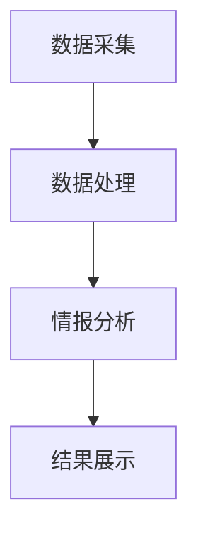
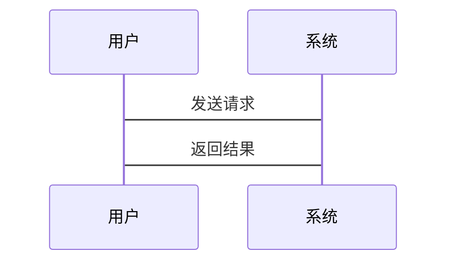

                 


# AI辅助企业战略情报收集：市场趋势与竞争分析

> 关键词：AI技术、战略情报、市场趋势、竞争分析、自然语言处理、机器学习、企业决策

> 摘要：本文将详细探讨AI技术在企业战略情报收集中的应用，重点分析市场趋势与竞争情报的智能化收集与分析方法。通过理论与实践相结合的方式，揭示AI如何助力企业做出更精准的决策。

---

## 第一部分: AI辅助企业战略情报收集的背景与意义

### 第1章: AI辅助企业战略情报收集的背景与意义

#### 1.1 企业战略情报收集的重要性

##### 1.1.1 情报在企业战略决策中的作用

企业在激烈的市场竞争中，需要实时掌握市场动态、竞争对手动向以及行业趋势，这些信息构成了企业决策的核心依据。传统的信息收集方式效率低下，且难以覆盖海量数据。AI技术的引入，为企业提供了更高效、更精准的情报收集与分析手段。

##### 1.1.2 传统情报收集的局限性

传统的市场调研和情报收集方式依赖人工分析，存在以下问题：

- 数据来源单一，覆盖面有限。
- 数据处理效率低，难以应对实时变化。
- 分析结果主观性较强，缺乏量化支持。

##### 1.1.3 AI技术在情报收集中的优势

AI技术通过自动化数据处理、模式识别和预测分析，显著提升了情报收集的效率和准确性。其优势包括：

- **高效性**：AI可以在短时间内处理海量数据，快速提取关键信息。
- **准确性**：通过机器学习模型，AI能够识别隐藏的模式和趋势，减少人为误差。
- **实时性**：AI系统可以实时监控市场动态，帮助企业及时调整策略。

#### 1.2 AI技术与企业战略情报的结合

##### 1.2.1 AI技术的基本概念

AI（Artificial Intelligence）是指通过模拟人类智能，使计算机能够执行如学习、推理、识别和自然语言处理等任务。AI的核心技术包括机器学习（ML）、自然语言处理（NLP）、计算机视觉（CV）等。

##### 1.2.2 AI在情报分析中的应用领域

AI技术广泛应用于以下领域：

- **市场趋势分析**：通过分析社交媒体、新闻报道等数据，预测市场走向。
- **竞争对手分析**：识别竞争对手的战略动向、产品特点和市场布局。
- **行业动态监测**：实时追踪行业政策、技术发展和市场热点。

##### 1.2.3 AI辅助情报收集的未来发展趋势

随着AI技术的不断进步，未来情报收集将更加智能化和个性化。企业可以根据自身需求定制情报收集方案，实现精准决策。

#### 1.3 本章小结

本章介绍了企业战略情报收集的重要性，分析了传统方式的局限性，并重点阐述了AI技术在情报收集中的优势和应用领域。通过AI技术，企业能够更高效、准确地获取市场情报，从而在竞争中占据优势。

---

## 第二部分: AI辅助企业战略情报收集的核心概念与原理

### 第2章: 战略情报收集的核心概念

#### 2.1 企业战略情报的基本构成

##### 2.1.1 市场趋势分析

市场趋势分析是通过研究市场动态，预测未来市场走向的过程。AI技术可以通过分析历史数据和当前趋势，帮助企业预测市场需求和竞争态势。

##### 2.1.2 竞争对手分析

竞争对手分析是了解竞争对手的市场策略、产品特点和竞争优势的过程。AI技术可以通过爬取竞争对手的公开信息，利用自然语言处理技术提取关键信息，帮助企业制定针对性的策略。

##### 2.1.3 行业动态监测

行业动态监测是指实时追踪行业内的政策变化、技术创新和市场热点。通过AI技术，企业可以自动化监测行业动态，及时调整自身的战略。

#### 2.2 AI辅助情报收集的原理

##### 2.2.1 数据采集与处理

AI系统首先需要采集相关的市场数据，包括社交媒体、新闻报道、行业报告等。这些数据通常需要进行清洗和预处理，以便后续分析。

##### 2.2.2 自然语言处理在情报分析中的应用

自然语言处理（NLP）技术用于分析文本数据，提取关键词、主题和情感倾向。例如，企业可以通过分析竞争对手的新闻稿，了解其市场战略和产品动向。

##### 2.2.3 机器学习在情报预测中的作用

机器学习模型可以通过历史数据训练，预测未来的市场趋势和竞争对手的动向。例如，利用时间序列分析模型预测市场需求的变化。

### 第3章: AI辅助情报收集的核心算法与工具

#### 3.1 自然语言处理（NLP）算法

##### 3.1.1 分词算法

分词算法用于将文本分割成有意义的词语或短语。常用的分词算法包括jieba（中文分词）和 SpaCy。

##### 3.1.2 情感分析算法

情感分析算法用于判断文本中的情感倾向，例如判断消费者对某产品的评价是正面、负面还是中性。

##### 3.1.3 实体识别算法

实体识别算法用于从文本中提取人名、地名、组织名等实体信息。

#### 3.2 机器学习算法

##### 3.2.1 分类算法

分类算法用于将数据分为不同的类别。例如，可以用来分类新闻文章的主题。

##### 3.2.2 聚类算法

聚类算法用于将相似的数据点聚集在一起。例如，可以用来分析市场趋势中的相似主题。

##### 3.2.3 回归算法

回归算法用于预测连续型变量的值。例如，可以用来预测产品的市场需求量。

#### 3.3 主流AI工具与平台

##### 3.3.1 GPT系列模型

GPT（Generative Pre-trained Transformer）是一种基于Transformer架构的大型语言模型，广泛应用于文本生成和分析。

##### 3.3.2 BERT及其变体

BERT（Bidirectional Encoder Representations from Transformers）是一种预训练的深度学习模型，擅长处理问答和文本摘要任务。

##### 3.3.3 其他AI工具介绍

其他常用的AI工具包括TensorFlow、PyTorch、Scikit-learn等。

---

## 第三部分: AI辅助企业战略情报收集的系统架构与实现

### 第4章: 系统架构设计

#### 4.1 系统功能模块划分

##### 4.1.1 数据采集模块

数据采集模块负责从各种数据源（如社交媒体、新闻网站）获取数据。

##### 4.1.2 数据处理模块

数据处理模块对采集到的数据进行清洗、转换和存储。

##### 4.1.3 情报分析模块

情报分析模块利用NLP和机器学习算法对数据进行分析，提取关键信息。

##### 4.1.4 结果展示模块

结果展示模块将分析结果以可视化的方式呈现给用户。

#### 4.2 系统架构设计图



### 第5章: 系统接口设计与实现

#### 5.1 数据接口设计

##### 5.1.1 数据输入接口

数据输入接口用于接收外部数据源发送的数据。

##### 5.1.2 数据输出接口

数据输出接口用于将处理后的数据输出给其他系统或模块。

#### 5.2 API设计

##### 5.2.1 RESTful API设计

RESTful API是一种基于HTTP协议的API设计风格，常用于前后端分离的架构。

##### 5.2.2 API调用流程

1. 用户发送请求到API接口。
2. 系统处理请求并返回结果。

#### 5.3 接口交互设计



---

## 第四部分: 项目实战与案例分析

### 第6章: 项目实战

#### 6.1 环境搭建

##### 6.1.1 安装Python

安装Python环境，建议使用Anaconda。

##### 6.1.2 安装必要的库

安装如numpy、pandas、spacy等库，具体命令如下：

```bash
pip install numpy pandas spacy
```

#### 6.2 核心代码实现

##### 6.2.1 数据预处理代码

```python
import pandas as pd
import spacy

# 加载预训练模型
nlp = spacy.load("en_core_web_sm")

# 数据预处理
def preprocess(text):
    doc = nlp(text)
    return [token.text for token in doc]

# 示例数据
data = "The company is planning to launch a new product next month."
print(preprocess(data))
```

##### 6.2.2 模型训练代码

```python
from sklearn.feature_extraction.text import TfidfVectorizer
from sklearn.naive_bayes import MultinomialNB

# 数据集准备
texts = ["This is a positive review.", "This is a negative review."]
labels = [1, 0]

# 特征提取
vectorizer = TfidfVectorizer()
X = vectorizer.fit_transform(texts)

# 模型训练
model = MultinomialNB()
model.fit(X, labels)

# 预测
new_text = "The product is excellent."
X_new = vectorizer.transform([new_text])
print(model.predict(X_new))
```

##### 6.2.3 结果展示代码

```python
import matplotlib.pyplot as plt

# 示例数据
x = [1, 2, 3]
y = [2, 4, 6]

# 绘制折线图
plt.plot(x, y)
plt.xlabel('X轴')
plt.ylabel('Y轴')
plt.title('示例折线图')
plt.show()
```

### 第7章: 案例分析

#### 7.1 案例背景介绍

##### 7.1.1 行业选择

假设我们选择互联网行业，分析某互联网公司的市场动态。

##### 7.1.2 数据来源

数据来源包括公司官网、新闻网站、社交媒体等。

#### 7.2 案例分析过程

##### 7.2.1 数据清洗与预处理

清洗数据，去除噪音信息，提取关键词。

##### 7.2.2 模型训练与优化

利用NLP和机器学习算法，训练模型并进行优化。

##### 7.2.3 结果分析与解读

分析模型输出结果，解读市场趋势和竞争对手动向。

---

## 第五部分: 总结与展望

### 第8章: 总结与展望

#### 8.1 本章总结

本文详细介绍了AI技术在企业战略情报收集中的应用，通过理论与实践相结合的方式，展示了AI如何助力企业做出更精准的决策。

#### 8.2 未来展望

随着AI技术的不断进步，未来情报收集将更加智能化和个性化。企业可以根据自身需求定制情报收集方案，实现精准决策。

---

## 作者信息

作者：AI天才研究院/AI Genius Institute & 禅与计算机程序设计艺术 /Zen And The Art of Computer Programming

---

### 最佳实践 tips

1. 在进行AI辅助情报收集时，建议选择合适的数据源和算法模型。
2. 数据预处理是关键，需要仔细清洗和转换数据。
3. 及时更新模型，确保分析结果的准确性。

### 小结

通过本文的介绍，读者可以了解到AI技术在企业战略情报收集中的重要性及其具体应用。希望本文能够为企业的市场分析和竞争情报工作提供有价值的参考。

### 注意事项

1. 数据隐私和安全问题需要高度重视。
2. 在实际应用中，需要根据具体情况调整算法参数。

### 拓展阅读

1. 《深度学习实战》
2. 《自然语言处理入门》
3. 《机器学习算法详解》

