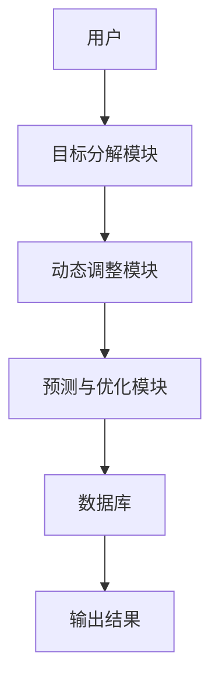

                 


# AI辅助企业战略执行：OKR自动化跟踪与动态调整系统

## 关键词：OKR、人工智能、企业战略、自动化跟踪、动态调整、机器学习、系统架构

## 摘要：本文探讨了利用人工智能技术优化企业战略执行中的OKR（目标与关键成果）管理。通过分析OKR的结构化分解、动态调整及自动化跟踪，结合机器学习算法和系统架构设计，提出了一种智能化的OKR管理解决方案，旨在提升企业战略执行效率和成果达成率。

---

# 第一部分：OKR与企业战略执行

## 第1章：OKR的核心概念与特点

### 1.1 什么是OKR？

OKR（目标与关键成果）是一种目标设定方法，广泛应用于企业战略管理。它由目标（Objective）和关键成果（Key Results）组成，目标是定性的，而关键成果是定量的。例如，目标可能是“提升客户满意度”，关键成果可能是“客户满意度评分从75%提升到90%”。

### 1.2 OKR与企业战略的关系

企业战略是企业的长期发展目标，而OKR是一种实现战略的具体工具。OKR通过设定具体、可衡量的目标，帮助企业将战略分解为可执行的任务，从而推动战略落地。

### 1.3 OKR的核心特点

- **聚焦性**：OKR强调聚焦于最重要的目标，避免资源分散。
- **可衡量性**：关键成果必须是可量化的，便于跟踪和评估。
- **动态调整**：OKR不是一成不变的，可以根据实际情况进行调整。
- **透明性**：OKR通常是公开的，便于团队协作和透明沟通。

---

## 第2章：企业战略执行中的问题与挑战

### 2.1 传统战略执行的痛点

- **目标分解不清晰**：战略目标往往过于笼统，难以分解为具体行动项。
- **执行不透明**：缺乏实时跟踪和反馈机制，导致执行过程不透明。
- **动态调整困难**：市场环境变化快，但调整目标和关键成果往往耗时且复杂。
- **资源分配不合理**：缺乏数据支持，难以优化资源分配。

### 2.2 OKR在战略执行中的作用

OKR通过设定具体、可衡量的目标，帮助企业将战略目标分解为可执行的任务，并通过实时跟踪和反馈机制，提升战略执行的透明度和效率。

### 2.3 AI如何赋能OKR管理

人工智能技术可以通过以下方式赋能OKR管理：

- **自动分解目标**：利用自然语言处理技术，自动将战略目标分解为具体的OKR。
- **动态调整**：通过机器学习算法，实时分析执行数据，自动调整OKR以适应变化的环境。
- **预测与优化**：利用数据挖掘技术，预测目标达成的可能性，并优化资源分配。

---

# 第二部分：AI与OKR的结合原理

## 第3章：OKR的结构化分解与AI的关系

### 3.1 OKR的分解方法

- **目标分解**：将战略目标分解为更具体的目标。
- **关键成果分解**：将目标进一步分解为可量化的关键成果。
- **关联性分析**：分析目标与关键成果之间的关系，确保分解的合理性和一致性。

### 3.2 AI在OKR分解中的应用

- **自然语言处理**：通过自然语言处理技术，从战略文档中提取目标和关键成果。
- **知识图谱构建**：利用知识图谱技术，构建目标与关键成果之间的关系网络。
- **自动化分解**：基于机器学习模型，自动将战略目标分解为具体的OKR。

### 3.3 OKR分解的数学模型

以下是基于机器学习的目标分解模型：

$$
\text{目标分解} = f_{\text{分解}}(\text{战略目标}, \text{历史数据})
$$

其中，$f_{\text{分解}}$是一个机器学习模型，输入战略目标和历史数据，输出分解后的OKR。

---

## 第4章：基于机器学习的OKR预测模型

### 4.1 算法原理

- **线性回归模型**：用于预测关键成果的达成情况。
- **决策树模型**：用于分类目标的实现可能性。
- **集成学习**：通过集成多个模型提升预测精度。

### 4.2 OKR预测的数学模型

以下是线性回归模型的公式：

$$
y = \beta_0 + \beta_1x_1 + \beta_2x_2 + \cdots + \beta_nx_n + \epsilon
$$

其中，$y$是预测的关键成果，$x_i$是输入特征，$\beta_i$是模型参数，$\epsilon$是误差项。

### 4.3 算法实现

以下是Python代码实现：

```python
import pandas as pd
from sklearn.linear_model import LinearRegression
from sklearn.metrics import mean_squared_error

data = pd.read_csv('okr_data.csv')
X = data[['feature1', 'feature2']]
y = data['target']

model = LinearRegression()
model.fit(X, y)

y_pred = model.predict(X)
print('预测结果:', y_pred)
print('均方误差:', mean_squared_error(y, y_pred))
```

---

## 第5章：系统架构设计与实现

### 5.1 系统功能设计

- **目标分解模块**：将战略目标分解为具体的OKR。
- **动态调整模块**：实时跟踪OKR执行情况，并动态调整。
- **预测与优化模块**：基于历史数据，预测目标达成情况，并优化资源分配。

### 5.2 系统架构图



### 5.3 系统接口设计

- **输入接口**：接收战略目标和历史数据。
- **输出接口**：输出分解后的OKR和优化建议。

---

## 第6章：项目实战与案例分析

### 6.1 项目背景

某企业希望利用AI技术优化其OKR管理，提升战略执行效率。

### 6.2 核心实现

- **数据预处理**：清洗和整理战略目标和历史数据。
- **模型训练**：基于历史数据训练OKR分解和预测模型。
- **系统集成**：将模型集成到企业管理系统中。

### 6.3 实际案例分析

通过实际案例分析，验证系统的有效性和可行性。

---

## 第7章：总结与展望

### 7.1 本章小结

本文详细探讨了AI辅助企业战略执行中的OKR管理，提出了基于机器学习的OKR分解与预测模型，并设计了完整的系统架构。通过实际案例分析，验证了系统的有效性。

### 7.2 未来展望

未来，随着AI技术的不断发展，OKR管理将更加智能化和自动化。可以通过引入更多高级算法和技术，进一步提升OKR管理的效率和精度。

---

# 作者：AI天才研究院（AI Genius Institute） & 禅与计算机程序设计艺术（Zen And The Art of Computer Programming）

---

通过本文的系统分析与实践，我们展示了AI技术在OKR管理中的巨大潜力，为企业的战略执行提供了新的思路和解决方案。

