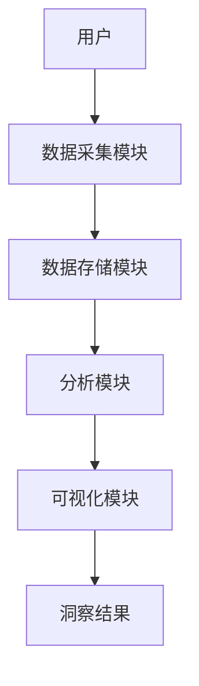

                 


# AI辅助企业竞争情报分析：自动化数据采集与洞察生成

> 关键词：AI，竞争情报分析，数据采集，自然语言处理，数据挖掘，系统架构

> 摘要：本文详细探讨了AI在企业竞争情报分析中的应用，重点介绍了自动化数据采集与洞察生成的技术与方法。通过分析竞争情报分析的核心概念、AI技术的应用流程、系统架构设计以及实际项目案例，本文为读者提供了从理论到实践的全面指导，帮助企业在竞争情报分析中实现智能化和高效化。

---

## 第一部分: AI辅助企业竞争情报分析的背景与概念

### 第1章: 竞争情报分析概述

#### 1.1 竞争情报分析的定义与重要性

- **1.1.1 竞争情报分析的定义**  
  竞争情报分析（Competitive Intelligence Analysis）是指通过收集、整理、分析和应用竞争对手及市场相关信息，为企业制定战略决策提供支持的过程。它不仅包括对竞争对手的产品、市场策略、技术研发等方面的分析，还包括对行业趋势、政策法规等外部环境的洞察。

- **1.1.2 竞争情报分析的重要性**  
  在当今竞争激烈的市场环境中，企业需要快速获取和分析大量数据，以掌握市场动态和竞争对手的动向。竞争情报分析能够帮助企业识别市场机会、规避风险、优化产品策略，并在竞争中占据优势地位。

- **1.1.3 企业竞争情报分析的核心目标**  
  竞争情报分析的核心目标是通过数据驱动的方式，为企业提供精准的市场洞察，支持决策制定。具体目标包括：  
  - 监测竞争对手的动态，发现市场机会。  
  - 分析行业趋势，预测市场走向。  
  - 优化企业产品策略，提升竞争力。  

---

#### 1.2 AI在竞争情报分析中的作用

- **1.2.1 AI技术如何提升竞争情报分析效率**  
  AI技术通过自动化数据采集、自然语言处理（NLP）和机器学习算法，能够快速处理大量非结构化数据，提取关键信息，显著提升竞争情报分析的效率和准确性。

- **1.2.2 数据采集与自动化分析的优势**  
  AI驱动的数据采集技术能够自动从多种数据源（如网页、社交媒体、行业报告等）获取信息，并通过自动化分析工具生成洞察，减少人工干预，降低成本。

- **1.2.3 AI驱动的竞争情报分析新范式**  
  基于AI的竞争情报分析形成了新的范式：从数据采集到洞察生成的全流程自动化，结合实时监控和预测分析，为企业提供动态、精准的市场洞察。

---

## 第二部分: 竞争情报分析的AI技术实现

### 第2章: 数据采集与处理的AI技术

#### 2.1 网络爬虫技术

- **2.1.1 网络爬虫的实现原理**  
  网络爬虫是一种用于从网页中提取数据的自动化工具。其基本原理包括以下几个步骤：  
  1. 发送HTTP请求到目标网页。  
  2. 获取返回的HTML页面内容。  
  3. 解析HTML内容，提取所需数据。  
  4. 存储提取的数据。

- **2.1.2 数据抽取与清洗**  
  数据抽取是通过正则表达式或其他文本解析技术从HTML中提取目标信息的过程。数据清洗则包括去除重复数据、处理缺失值以及标准化数据格式。

- **2.1.3 数据存储与管理**  
  提取的数据可以存储在数据库中，如MySQL或MongoDB，以便后续分析和处理。数据存储的设计需要考虑数据的结构化和高效查询。

---

#### 2.2 自然语言处理技术在竞争情报分析中的应用

- **2.2.1 文本预处理与分词**  
  文本预处理包括去除停用词、标点符号以及进行词干提取。分词是将文本分割成单个词语的过程，常使用jieba等中文分词工具。

- **2.2.2 信息抽取与实体识别**  
  信息抽取是从文本中提取特定信息（如公司名称、产品名称）的过程，实体识别则是将文本中的实体（如人名、地名）进行分类和标记。

- **2.2.3 文本相似度计算与主题分析**  
  基于余弦相似度或BM25算法，可以计算文本之间的相似度。主题分析可以通过TF-IDF或LDA（Latent Dirichlet Allocation）算法提取文本的主题。

---

### 第3章: 数据挖掘与分析

#### 3.1 数据挖掘的基本概念

- 数据挖掘是从大量数据中发现隐藏模式和规律的过程，常用于客户画像、市场趋势预测等领域。

#### 3.2 常见的数据挖掘算法

- **分类算法**：如决策树（CART）、随机森林（Random Forest）、支持向量机（SVM）。  
- **聚类算法**：如K-means、层次聚类。  
- **关联规则挖掘**：如Apriori算法。

#### 3.3 数据可视化与洞察生成

- 数据可视化工具如Tableau和Power BI可以帮助用户直观理解数据。洞察生成则是通过数据挖掘结果，结合业务背景，提出 actionable insights。

---

## 第三部分: 竞争情报分析的系统架构与设计

### 第4章: 系统架构设计

#### 4.1 竞争情报分析系统的组成

- **数据采集模块**：负责从多种数据源采集数据。  
- **数据处理模块**：包括数据清洗、转换和存储。  
- **分析模块**：包括文本挖掘、机器学习模型训练和预测。  
- **可视化模块**：将分析结果以图表形式展示。

#### 4.2 系统架构图



---

### 第5章: 系统功能设计与实现

#### 5.1 竞争情报分析系统的功能模块

- **数据采集**：支持多种数据源的采集，如网页、API接口等。  
- **数据处理**：提供数据清洗、转换和存储功能。  
- **分析与建模**：支持文本挖掘、机器学习模型训练和预测。  
- **可视化与报告**：生成图表和报告，帮助用户理解分析结果。

#### 5.2 系统实现的核心代码

```python
import requests
from bs4 import BeautifulSoup
import json

def scrape_data(url):
    response = requests.get(url)
    soup = BeautifulSoup(response.text, 'html.parser')
    data = []
    for item in soup.find_all('div', class_='item'):
        title = item.find('h2').text
        content = item.find('p').text
        data.append({'title': title, 'content': content})
    return data

# 示例调用
url = 'https://example.com/competitors'
data = scrape_data(url)
print(data)
```

---

## 第四部分: 项目实战与案例分析

### 第6章: 项目实战

#### 6.1 项目背景与目标

- **项目背景**：某企业需要分析竞争对手的产品发布信息，以优化自身的产品策略。  
- **项目目标**：通过AI技术实现竞争对手产品信息的自动采集、分析和洞察生成。

#### 6.2 系统实现

- **数据采集**：从竞争对手的官方网站和新闻平台采集产品信息。  
- **数据处理**：清洗数据并存储到数据库中。  
- **分析与建模**：使用NLP技术提取产品关键词，分析市场趋势。  
- **可视化**：生成产品对比图表和市场趋势报告。

#### 6.3 项目小结

- 通过AI技术实现了竞争对手产品信息的自动化采集与分析。  
- 提供了精准的市场洞察，帮助企业在竞争中占据优势。

---

## 第五部分: 最佳实践与未来展望

### 第7章: 最佳实践

#### 7.1 技术选型建议

- 数据采集：使用Scrapy框架实现高效数据采集。  
- 数据分析：结合Python的pandas和numpy库进行数据处理。  
- 可视化：使用Plotly或Matplotlib生成动态图表。

#### 7.2 注意事项

- 数据采集需遵守相关法律法规，避免爬取敏感数据。  
- 数据分析需结合业务背景，避免过度解读数据。

#### 7.3 未来展望

- 随着AI技术的不断发展，竞争情报分析将更加智能化和自动化。  
- 结合区块链技术，实现数据的安全共享与分析。

---

## 结语

本文从理论到实践，全面探讨了AI在企业竞争情报分析中的应用。通过详细的技术讲解和项目实战，为读者提供了从数据采集到洞察生成的完整解决方案。未来，随着AI技术的进一步发展，竞争情报分析将为企业创造更大的价值。

---

作者：AI天才研究院/AI Genius Institute & 禅与计算机程序设计艺术 /Zen And The Art of Computer Programming

