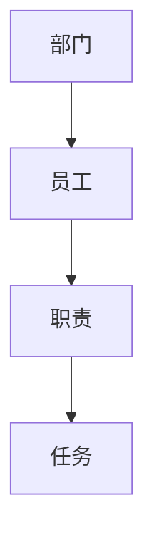
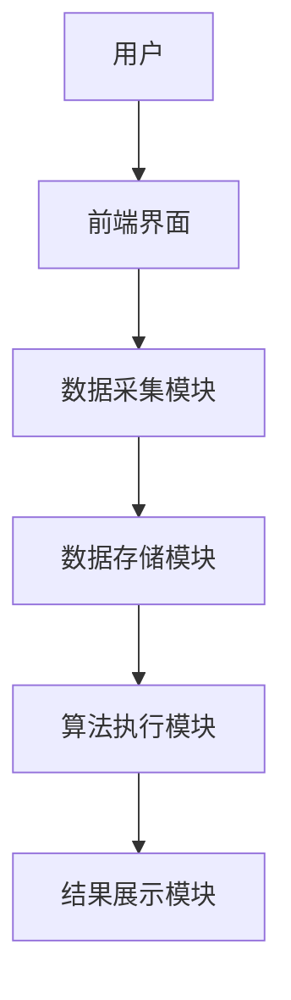

                 


# AI辅助企业组织结构优化：效能评估与动态调整模型

> 关键词：AI，组织结构优化，效能评估，动态调整模型，企业架构设计

> 摘要：本文系统地探讨了如何利用人工智能技术优化企业组织结构，重点分析了效能评估与动态调整模型的构建与应用。通过理论分析、算法设计、系统实现和案例分析，详细阐述了AI在企业组织优化中的核心作用，为企业管理者和技术人员提供了理论指导和实践参考。

---

## 第一章：背景介绍

### 1.1 问题背景

#### 1.1.1 企业组织结构的传统挑战
企业的组织结构通常包括部门划分、岗位设置、信息流和决策机制等。传统的组织结构设计依赖于经验和主观判断，难以量化评估其效率和效果。随着市场竞争的加剧和业务需求的多样化，传统的组织结构往往暴露出以下问题：

- **效率低下**：部门间协作不畅，信息传递延迟。
- **资源浪费**：资源分配不合理，导致成本增加。
- **适应性差**：面对外部环境变化（如市场波动、政策调整）时，难以快速响应。

#### 1.1.2 AI技术的崛起与应用
人工智能技术的发展为企业组织结构优化提供了新的可能性。AI技术可以通过数据分析、模式识别和自动化决策等手段，帮助企业在组织结构设计和调整中实现更高效的管理。

#### 1.1.3 组织优化的核心目标
企业组织结构优化的核心目标是通过科学的方法和工具，最大化组织效率、资源利用率和员工满意度，同时降低管理成本。

---

### 1.2 核心概念与术语

#### 1.2.1 效能评估
效能评估是指对组织结构的运行效果进行量化分析，包括效率、效果和员工满意度等方面。

#### 1.2.2 动态调整
动态调整是指根据实时数据和外部环境变化，对组织结构进行实时优化和调整。

#### 1.2.3 AI辅助优化
AI辅助优化是指利用人工智能技术（如机器学习、自然语言处理等）来辅助组织结构设计和调整的过程。

---

## 第二章：AI辅助组织优化的核心模型

### 2.1 效能评估模型

#### 2.1.1 模型构建原理
效能评估模型基于企业运营数据（如销售额、利润、员工满意度等）和组织结构数据（如部门设置、岗位职责等），通过机器学习算法（如随机森林、神经网络）进行建模，量化评估组织结构的效率。

#### 2.1.2 评估指标
- **效率指标**：如部门间协作效率、任务完成时间。
- **效果指标**：如企业利润增长率、市场占有率。
- **员工满意度指标**：如员工的工作满意度、离职率。

#### 2.1.3 模型实现步骤
1. 数据采集：收集企业运营数据和组织结构数据。
2. 数据预处理：清洗数据，处理缺失值和异常值。
3. 模型训练：使用机器学习算法训练效能评估模型。
4. 模型验证：通过交叉验证评估模型的准确性和稳定性。

#### 2.1.4 案例分析
以某制造企业为例，通过效能评估模型分析发现，部门间协作效率低下是导致生产成本增加的主要原因。模型建议优化部门分工和信息传递流程。

---

### 2.2 动态调整模型

#### 2.2.1 动态调整机制
动态调整模型基于实时数据（如市场变化、客户需求）和内部数据（如员工表现、项目进度）进行实时分析，动态调整组织结构。

#### 2.2.2 调整策略
- **自动化调整**：基于算法自动优化组织结构。
- **半自动化调整**：结合人工决策进行调整。
- **周期性调整**：定期评估组织结构，进行优化。

#### 2.2.3 调整反馈机制
动态调整模型需要建立反馈机制，根据调整后的效果评估模型的准确性和稳定性，不断优化调整策略。

---

## 第三章：AI辅助组织优化的算法原理

### 3.1 算法选择与实现

#### 3.1.1 机器学习算法
- **随机森林**：用于分类和回归分析。
- **神经网络**：用于复杂非线性关系的建模。

#### 3.1.2 自然语言处理
- **文本挖掘**：分析组织文档和沟通记录，提取关键信息。
- **情感分析**：评估员工满意度和团队氛围。

#### 3.1.3 图神经网络
- 用于分析组织关系图，识别关键节点和潜在风险。

#### 3.1.4 算法实现步骤
1. 数据采集与预处理。
2. 模型训练与验证。
3. 模型部署与应用。

---

### 3.2 算法实现的数学模型

#### 3.2.1 线性回归模型
$$ y = \beta_0 + \beta_1x_1 + \beta_2x_2 + \ldots + \beta_nx_n $$

其中，$y$是目标变量，$x_i$是自变量，$\beta_i$是回归系数。

#### 3.2.2 逻辑回归模型
$$ p = \frac{1}{1 + e^{- (\beta_0 + \beta_1x_1 + \ldots + \beta_nx_n)}} $$

其中，$p$是目标变量的概率。

#### 3.2.3 神经网络模型
神经网络模型通过多层感知机（MLP）实现复杂关系的建模，具体结构包括输入层、隐藏层和输出层。

---

## 第四章：系统分析与架构设计

### 4.1 系统功能设计

#### 4.1.1 领域模型
领域模型是企业组织结构优化系统的核心模块，包括以下功能：
- 数据采集：从企业ERP系统、CRM系统等获取数据。
- 数据分析：使用机器学习算法进行数据分析。
- 结果展示：以可视化形式展示分析结果。

#### 4.1.2 实体关系图
使用Mermaid图展示企业组织结构的实体关系：



---

### 4.2 系统架构设计

#### 4.2.1 系统架构图
使用Mermaid图展示系统的整体架构：



---

## 第五章：项目实战

### 5.1 环境安装与配置

#### 5.1.1 环境要求
- Python 3.8及以上版本
- 安装必要的库（如scikit-learn、TensorFlow、matplotlib）

#### 5.1.2 安装命令
```bash
pip install scikit-learn tensorflow matplotlib
```

---

### 5.2 核心代码实现

#### 5.2.1 数据采集与预处理
```python
import pandas as pd

# 数据采集
data = pd.read_csv('organization_data.csv')

# 数据预处理
data.dropna(inplace=True)
data = pd.get_dummies(data)
```

#### 5.2.2 模型训练与验证
```python
from sklearn.ensemble import RandomForestClassifier
from sklearn.metrics import accuracy_score

# 模型训练
model = RandomForestClassifier()
model.fit(X_train, y_train)

# 模型验证
y_pred = model.predict(X_test)
print("Accuracy:", accuracy_score(y_test, y_pred))
```

#### 5.2.3 结果展示
```python
import matplotlib.pyplot as plt

plt.figure(figsize=(10,6))
plt.scatter(X_test[:,0], y_test, color='blue', label='实际值')
plt.scatter(X_test[:,0], y_pred, color='red', label='预测值')
plt.xlabel('特征值')
plt.ylabel('目标值')
plt.legend()
plt.show()
```

---

## 第六章：最佳实践与小结

### 6.1 最佳实践

#### 6.1.1 数据质量
确保数据的准确性和完整性，数据预处理是关键。

#### 6.1.2 模型选择
根据具体问题选择合适的算法，避免过度复杂的模型。

#### 6.1.3 系统集成
将AI模型与企业现有系统集成，确保数据流畅流通。

---

### 6.2 小结

本文系统地探讨了AI辅助企业组织结构优化的效能评估与动态调整模型，从理论分析到算法实现，再到项目实战，全面展示了AI在组织优化中的应用。通过本文的分析，读者可以深入了解如何利用AI技术优化企业组织结构，提升组织效率和员工满意度。

---

## 第七章：注意事项与拓展阅读

### 7.1 注意事项

#### 7.1.1 数据隐私
在数据采集和处理过程中，需遵守相关法律法规，保护数据隐私。

#### 7.1.2 模型解释性
复杂的模型可能缺乏解释性，需结合业务背景进行分析。

#### 7.1.3 持续优化
动态调整模型需要持续优化，结合实时数据和业务需求进行调整。

---

### 7.2 拓展阅读

#### 7.2.1 推荐书籍
- 《企业架构设计：复杂系统的优雅解决方案》
- 《机器学习实战》

#### 7.2.2 推荐博客
- AI与企业管理的博客文章链接
- 组织优化的行业最佳实践博客

---

## 作者：AI天才研究院（AI Genius Institute） & 禅与计算机程序设计艺术（Zen And The Art of Computer Programming）

---

以上是《AI辅助企业组织结构优化：效能评估与动态调整模型》的技术博客文章的完整目录和内容概述。本文通过理论分析、算法设计、系统实现和案例分析，详细阐述了AI在企业组织优化中的核心作用，为企业管理者和技术人员提供了理论指导和实践参考。

