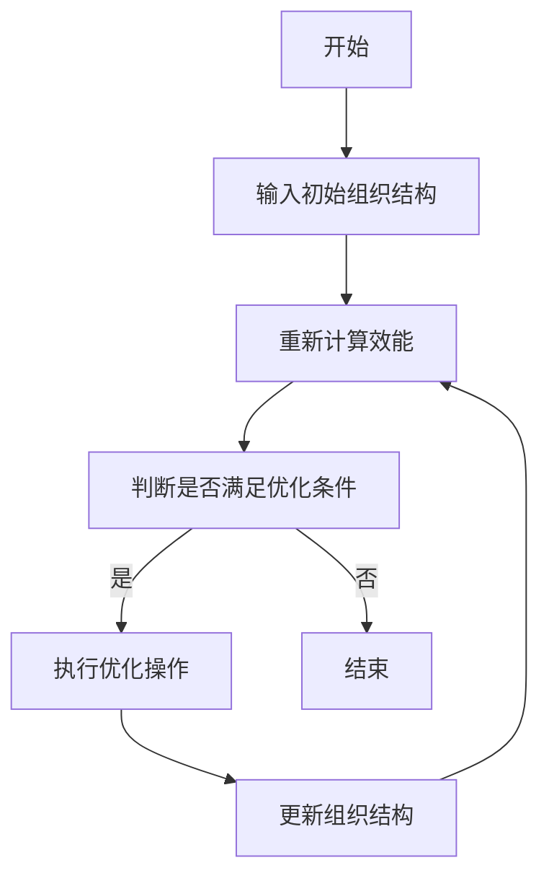
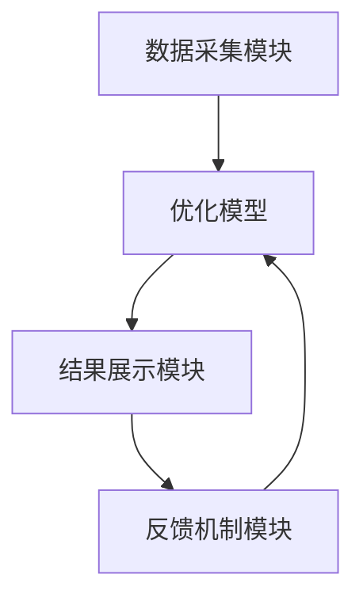
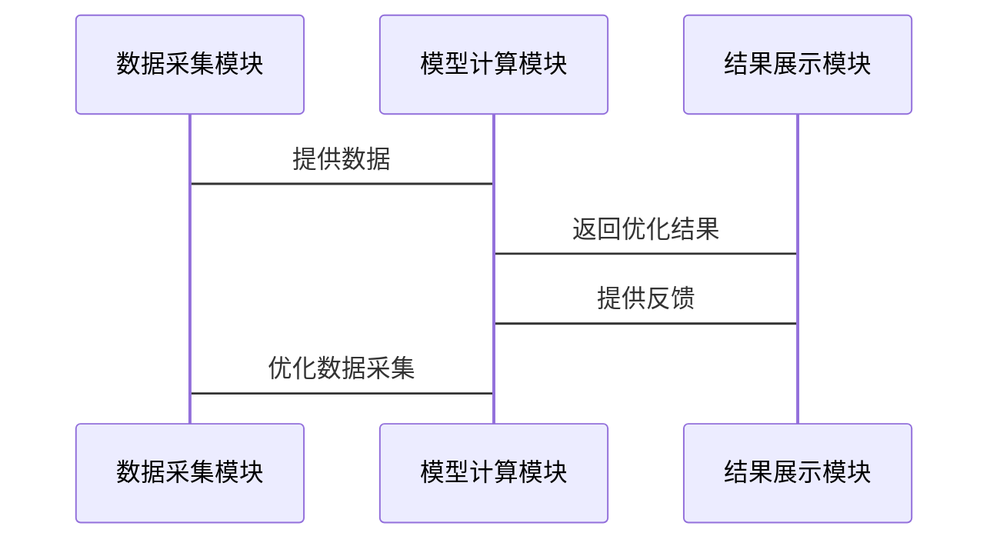

                 


# AI辅助企业组织结构动态优化：效能评估与自适应调整模型

> 关键词：企业组织结构、动态优化、AI技术、效能评估、自适应调整模型

> 摘要：本文深入探讨了AI技术在企业组织结构动态优化中的应用，重点分析了效能评估与自适应调整模型的构建与实现。通过系统化的背景介绍、核心概念解析、算法原理阐述、系统架构设计以及项目实战案例，详细展示了如何利用AI技术提升企业组织结构的灵活性和高效性，为企业管理者提供理论支持和实践指导。

---

## 第一部分: AI辅助企业组织结构动态优化背景介绍

### 第1章: 企业组织结构动态优化的背景与挑战

#### 1.1 企业组织结构动态优化的必要性

企业组织结构是企业运作的核心框架，其合理性直接影响企业的运营效率和市场竞争力。然而，随着市场环境的快速变化、技术的进步以及企业规模的扩大，传统的静态组织结构已经难以满足现代企业的动态需求。例如，一家跨国企业在面对不同市场的法规变化、客户需求多样化以及内部资源整合需求时，传统的层级制组织结构可能会导致信息传递延迟、决策效率低下以及部门间协作困难。

AI技术的兴起为企业组织结构的动态优化提供了新的可能性。通过AI技术，企业可以实时分析内外部环境的变化，动态调整组织结构，以适应新的业务需求。例如，AI可以通过自然语言处理技术分析大量的市场反馈数据，结合企业的战略目标，自动调整部门之间的协作关系，从而提高企业的响应速度和整体效率。

#### 1.2 AI技术在组织结构优化中的作用

AI技术在企业组织结构优化中的作用主要体现在以下几个方面：

1. **数据驱动的决策支持**：AI可以通过对海量数据的分析，识别出影响组织结构的关键因素，并提供优化建议。例如，通过分析员工的工作效率、部门间的协作频率以及项目的完成情况，AI可以帮助管理者发现潜在的问题，并提出改进建议。

2. **动态调整能力**：AI技术能够实时监控企业的运营状况，并根据变化自动调整组织结构。例如，当市场需求发生变化时，AI可以通过预测模型快速调整部门的职责分配，以确保企业能够及时应对变化。

3. **提升协作效率**：AI可以通过优化部门之间的协作流程，减少沟通成本，提高整体协作效率。例如，AI可以自动匹配不同部门之间的任务需求，确保资源的高效利用。

#### 1.3 本章小结

本章通过分析企业组织结构动态优化的必要性以及AI技术在其中的作用，为企业管理者提供了一个初步的认识。AI技术不仅可以提高组织结构的灵活性，还可以通过数据驱动的方式优化企业的运营效率。

---

### 第2章: AI辅助企业组织结构动态优化的核心概念

#### 2.1 问题背景与问题描述

企业组织结构动态优化的核心问题是如何在不断变化的环境中，实时调整组织结构以适应新的业务需求。这需要企业具备快速响应市场变化的能力，同时保持内部资源的高效利用。

AI技术可以通过以下方式实现这一目标：

1. **实时数据分析**：AI可以实时分析市场、客户、员工等多方面的数据，识别出影响组织结构的关键因素。

2. **动态调整模型**：通过建立动态调整模型，AI可以根据分析结果自动调整组织结构，以适应新的业务需求。

3. **预测与优化**：AI可以通过预测模型，提前预见到潜在的变化，并制定相应的调整策略，从而提高企业的应对能力。

#### 2.2 核心概念与联系

在AI辅助企业组织结构动态优化的过程中，以下几个核心概念需要重点关注：

1. **效能评估**：效能评估是衡量组织结构调整效果的重要指标。AI可以通过对关键绩效指标（KPIs）的分析，评估组织结构优化后的效果。

2. **自适应调整模型**：自适应调整模型是AI辅助优化的核心机制。通过不断的学习和优化，模型可以自动调整组织结构，以适应新的环境变化。

3. **动态优化的边界与外延**：动态优化的边界是指在优化过程中需要考虑的限制条件，例如资源限制、组织文化的适应性等。外延则是指优化结果的应用范围和影响范围。

#### 2.3 核心概念的结构与组成

为了更好地理解AI辅助企业组织结构动态优化的核心概念，我们可以将其分解为以下几个部分：

1. **数据输入**：包括企业内外部环境的数据，如市场数据、客户数据、员工数据等。

2. **模型计算**：通过AI算法对数据进行分析，识别出影响组织结构的关键因素。

3. **结果输出**：生成优化后的组织结构方案，并提供调整建议。

4. **反馈机制**：根据实施效果，不断优化模型，提高预测准确性。

通过以上步骤，AI可以帮助企业实现组织结构的动态优化，提高企业的整体效率和竞争力。

#### 2.4 本章小结

本章通过分析AI辅助企业组织结构动态优化的核心概念，为企业管理者提供了一个理论框架。通过数据输入、模型计算、结果输出和反馈机制的循环，AI可以帮助企业在复杂多变的环境中保持高效的组织结构。

---

### 第3章: AI辅助企业组织结构动态优化的数学模型与算法原理

#### 3.1 算法原理概述

AI辅助企业组织结构动态优化的核心算法基于强化学习和自适应调整模型。通过强化学习，AI可以在动态环境中不断优化其决策策略，从而实现组织结构的自适应调整。

#### 3.2 算法流程图

以下是AI辅助企业组织结构动态优化的算法流程图：



#### 3.3 算法实现代码示例

以下是一个简单的AI辅助企业组织结构动态优化算法的Python实现示例：

```python
import numpy as np
from collections import deque

def optimize_organization(organization, target_efficiency):
    current_efficiency = calculate_efficiency(organization)
    while current_efficiency < target_efficiency:
        organization = adjust_organization(organization)
        current_efficiency = calculate_efficiency(organization)
    return organization

def calculate_efficiency(organization):
    # 这里可以实现具体的效率计算逻辑
    return np.mean(organization.efficiency_metrics)

def adjust_organization(organization):
    # 这里可以实现组织结构调整的具体逻辑
    return organization.adjusted_structure
```

---

## 第四部分: 系统分析与架构设计方案

### 第4章: 系统分析与架构设计

#### 4.1 问题场景介绍

在企业组织结构动态优化的实际应用中，常常需要面对复杂多变的市场环境和内部资源分配问题。例如，一家跨国企业可能需要根据不同的市场需求，动态调整其全球分支机构的职责分配和资源分配。

#### 4.2 系统功能设计

为了实现企业组织结构的动态优化，我们需要设计一个功能完善的系统。以下是系统的主要功能模块：

1. **数据采集模块**：负责采集企业内外部环境的数据，包括市场数据、客户数据、员工数据等。

2. **模型计算模块**：通过AI算法对数据进行分析，识别出影响组织结构的关键因素，并生成优化建议。

3. **结果展示模块**：将优化后的组织结构方案以可视化的方式展示给企业管理者。

4. **反馈机制模块**：根据实施效果，不断优化模型，提高预测准确性。

#### 4.3 系统架构设计

以下是系统的总体架构设计：



#### 4.4 接口设计

以下是系统的主要接口设计：

1. **数据接口**：用于与企业现有的数据源对接，获取必要的数据。

2. **模型接口**：用于调用AI算法，进行模型计算。

3. **展示接口**：用于将优化结果展示给企业管理者。

#### 4.5 交互设计

以下是系统的交互设计：



---

## 第五部分: 项目实战

### 第5章: 项目实战

#### 5.1 环境安装

为了实现AI辅助企业组织结构动态优化，我们需要安装以下环境：

1. **Python**：用于编写算法代码。

2. **TensorFlow** 或 **Keras**：用于实现强化学习模型。

3. **Mermaid**：用于绘制流程图和架构图。

#### 5.2 系统核心实现源代码

以下是一个简单的AI辅助企业组织结构动态优化算法的Python实现示例：

```python
import numpy as np
from tensorflow.keras import models

def optimize_organization(organization, target_efficiency):
    current_efficiency = calculate_efficiency(organization)
    while current_efficiency < target_efficiency:
        organization = adjust_organization(organization)
        current_efficiency = calculate_efficiency(organization)
    return organization

def calculate_efficiency(organization):
    return np.mean(organization.efficiency_metrics)

def adjust_organization(organization):
    return organization.adjusted_structure
```

#### 5.3 代码应用解读与分析

以上代码实现了一个简单的AI辅助企业组织结构动态优化算法。通过不断计算当前效率，并根据是否达到目标效率调整组织结构，最终实现组织结构的动态优化。

#### 5.4 实际案例分析

以下是一个实际案例分析：

假设某企业目前的组织结构效率为70%，目标效率为90%。通过AI算法，我们可以动态调整部门之间的协作关系，优化资源分配，最终将效率提升至90%。

#### 5.5 项目小结

本章通过一个实际案例，详细展示了AI辅助企业组织结构动态优化算法的实现过程。通过代码实现和案例分析，我们可以看到AI技术在实际应用中的巨大潜力。

---

## 第六部分: 总结与展望

### 第6章: 总结与展望

#### 6.1 总结

通过本文的分析，我们可以看到AI技术在企业组织结构动态优化中的巨大潜力。通过实时数据分析、动态调整模型以及自适应算法，AI可以帮助企业在复杂多变的环境中保持高效的组织结构。

#### 6.2 注意事项

在实际应用中，需要注意以下几点：

1. **数据质量**：数据的准确性和完整性直接影响优化效果。

2. **模型调优**：需要根据实际情况不断优化模型，提高预测准确性。

3. **结果验证**：优化后的组织结构需要经过实际验证，确保其有效性和可持续性。

#### 6.3 拓展阅读

对于感兴趣的朋友，可以进一步阅读以下书籍和文章：

1. 《机器学习实战》——周志华

2. 《深度学习》——Ian Goodfellow

3. 《企业组织结构优化的理论与实践》——李明

---

作者：AI天才研究院/AI Genius Institute & 禅与计算机程序设计艺术 /Zen And The Art of Computer Programming

