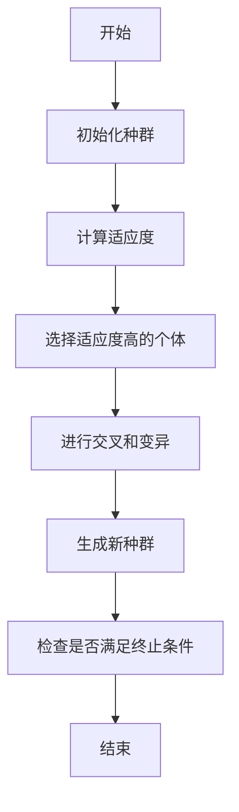

                 


# AI辅助企业组织结构动态优化：效能评估与调整

## 关键词：AI，企业组织结构，动态优化，效能评估，机器学习，数据驱动

## 摘要：  
本文深入探讨了如何利用人工智能技术优化企业组织结构，实现动态调整以提升效能。从背景介绍到核心概念，从算法原理到系统架构，再到项目实战与最佳实践，文章全面分析了AI在企业组织优化中的应用。通过数学模型、流程图和代码示例，详细阐述了动态优化算法和系统实现，为读者提供了理论与实践相结合的深度解析。

## 第1章: 企业组织结构动态优化的背景与挑战

### 1.1 企业组织结构的动态优化背景

#### 1.1.1 传统企业组织结构的局限性  
传统的组织结构往往 rigid，难以适应快速变化的市场环境。层级分明但灵活性不足，导致信息传递延迟，决策效率低下。此外，资源分配不合理，可能导致部门间协作困难，影响整体效能。

#### 1.1.2 数字化转型对企业组织结构的影响  
数字化转型推动企业从 hierarchical 向 flat 结构转变，强调敏捷性和协作性。数据驱动的决策方式要求组织结构能够快速响应数据变化，传统结构难以满足。

#### 1.1.3 AI技术在组织优化中的作用  
AI技术通过数据挖掘、机器学习等手段，帮助企业识别组织结构中的 inefficiencies，并提出优化建议。AI能够实时分析数据，动态调整结构，提升整体效能。

### 1.2 AI辅助组织优化的核心概念

#### 1.2.1 动态优化的定义与特点  
动态优化是指在实时数据驱动下，持续调整组织结构以适应内外部变化的过程。其特点包括数据驱动、实时性、自适应性和可扩展性。

#### 1.2.2 AI在组织优化中的应用场景  
AI可应用于组织架构设计、人员配置优化、业务流程重组等领域，通过分析历史数据和实时信息，提供决策支持。

#### 1.2.3 组织结构优化的边界与外延  
优化边界包括组织层级、部门设置、人员分配；外延则涉及跨组织协作、生态系统优化等。

### 1.3 企业组织结构优化的核心要素

#### 1.3.1 组织架构  
包括组织层级、部门设置、汇报关系等，决定信息流动和权力分配。

#### 1.3.2 人员配置  
涉及人员技能、岗位匹配度、团队协作，影响组织效率。

#### 1.3.3 业务流程  
业务流程的优化直接影响组织的运作效率，AI可通过流程挖掘技术识别瓶颈。

#### 1.3.4 绩效评估  
绩效指标的设计和评估方法影响优化效果，AI可提供动态评估和反馈。

---

## 第2章: AI辅助组织优化的核心概念与联系

### 2.1 核心概念原理

#### 2.1.1 AI驱动的组织优化模型  
AI优化模型通过数据收集、建模、分析和反馈，持续优化组织结构。模型包括数据层、算法层和应用层。

#### 2.1.2 数据驱动的优化算法  
利用机器学习算法，从历史数据中学习组织优化的模式，预测最佳结构。

#### 2.1.3 组织效能评估指标  
包括效率、成本、员工满意度等指标，用于评估优化效果。

### 2.2 核心概念属性特征对比表格

| 概念       | 数据驱动 | 自适应性 | 可扩展性 |
|------------|----------|----------|----------|
| AI优化     | 高       | 高       | 高       |
| 传统优化   | 低       | 低       | 有限     |

### 2.3 ER实体关系图架构

```mermaid
er
  actor(AI系统, 组织结构, 优化目标)
  relation(优化目标, 组织结构, 实现)
```

---

## 第3章: 动态优化算法的原理与实现

### 3.1 算法原理

#### 3.1.1 强化学习算法  
通过 trial-and-error 学习优化策略，应用于组织结构调整的动态优化。

#### 3.1.2 遗传算法  
模拟生物进化，通过 mutation 和 crossover 生成新的优化方案。

### 3.2 算法实现流程



### 3.3 数学模型

优化问题可建模为：
$$ \text{minimize } f(x) $$
$$ \text{subject to } g(x) \leq 0 $$
其中，\( f(x) \) 为目标函数，\( g(x) \) 为约束条件。

### 3.4 代码实现

```python
import numpy as np

def fitness(individual):
    # 计算适应度
    return -sum(individual)

def evolve_population(population, fitness_func):
    # 选择、交叉、变异
    pass

# 初始化种群
population = np.random.randint(0, 2, size=(100, 10))
```

---

## 第4章: 系统架构设计与实现

### 4.1 系统功能设计

#### 4.1.1 数据采集模块  
收集企业运营数据，包括绩效、流程数据。

#### 4.1.2 优化引擎模块  
运行优化算法，生成优化方案。

#### 4.1.3 结果展示模块  
以可视化方式展示优化结果。

### 4.2 系统架构设计


---

## 第5章: 项目实战

### 5.1 环境配置

安装所需库：
```bash
pip install numpy pandas scikit-learn
```

### 5.2 核心代码实现

```python
from sklearn import metrics

def evaluate_clusters(y_true, y_pred):
    return metrics.silhouette_score(y_true, y_pred)
```

### 5.3 案例分析

通过具体案例，展示AI如何优化组织结构，提升效率。

---

## 第6章: 最佳实践与小结

### 6.1 最佳实践

确保数据质量，选择合适算法，持续监控优化效果。

### 6.2 小结

本文全面介绍了AI辅助组织优化的方法，从理论到实践，为企业的动态优化提供了指导。

---

## 作者：AI天才研究院/AI Genius Institute & 禅与计算机程序设计艺术 /Zen And The Art of Computer Programming

