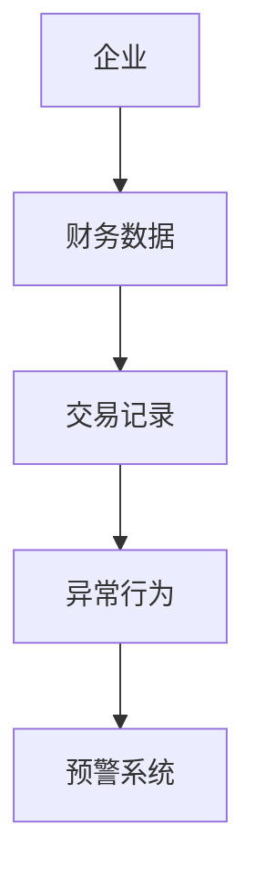
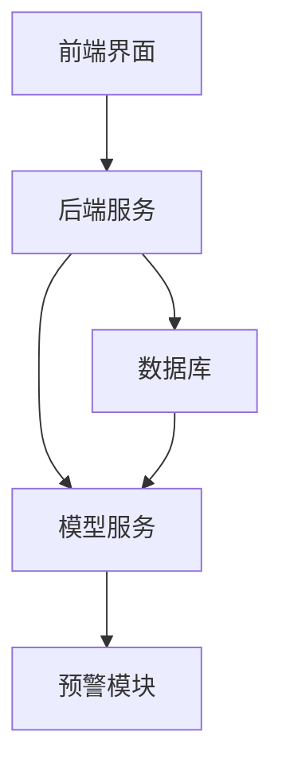

                 


# AI辅助企业财务异常检测：实时监控与智能预警系统

## 关键词：
- 人工智能
- 财务异常检测
- 实时监控
- 智能预警系统
- 异常检测算法
- 机器学习

## 摘要：
本文探讨了利用人工智能技术辅助企业进行财务异常检测的方法，重点介绍了实时监控与智能预警系统的构建。文章从背景介绍、核心概念、算法原理、系统架构、项目实战到最佳实践，全面阐述了AI在财务异常检测中的应用。通过详细的技术分析和实际案例，展示了如何利用AI技术提升财务监控的效率和准确性，为企业提供智能化的财务风险管理解决方案。

---

## 第一部分: 背景介绍

### 第1章: 问题背景与描述

#### 1.1 问题背景
企业财务健康状况是衡量其经营状况的重要指标。然而，传统财务分析方法依赖人工审查和固定规则，难以及时发现隐藏的异常情况。随着企业规模的扩大和业务复杂度的增加，财务数据量急剧增长，人工检测的效率和准确性逐渐成为瓶颈。AI技术的引入，为企业提供了更高效的解决方案。

#### 1.2 问题描述
财务异常检测需要识别财务数据中的异常模式，例如收入与支出的不匹配、账单异常、交易频率突变等。传统方法依赖于固定的规则和阈值，容易漏检或误检。而AI技术可以通过深度学习和自然语言处理等手段，从海量数据中挖掘潜在异常，提供实时监控和智能预警。

#### 1.3 问题解决
AI技术的应用使得财务异常检测更加智能化和自动化。通过机器学习算法，系统可以自动识别异常模式，实时监控财务数据的变化，并在发现问题时及时触发预警。这种实时监控和智能预警机制能够显著提高企业风险管理能力。

#### 1.4 核心要素与概念结构
财务异常检测系统的核心要素包括数据采集、特征提取、模型训练、异常检测和预警触发。这些要素共同构成了系统的功能模块，确保从数据输入到异常识别的全流程自动化。

---

## 第二部分: 核心概念与联系

### 第2章: AI与财务异常检测的核心概念

#### 2.1 核心概念原理
- **异常检测的基本原理**：通过分析数据的统计特征或分布模式，识别与正常模式不符的数据点。
- **AI在财务数据处理中的作用**：利用机器学习模型从大量财务数据中提取特征，发现潜在异常。
- **智能预警系统的实现机制**：基于异常检测结果，触发预警并提供风险评估报告。

#### 2.2 核心概念属性特征对比
| 比较维度 | 异常检测算法 | 传统规则检测 |
|----------|--------------|----------------|
| 效率     | 高            | 低              |
| 准确性   | 高            | 中              |
| 灵活性   | 高            | 低              |
| 可扩展性 | 高            | 低              |

#### 2.3 ER实体关系图架构


---

## 第三部分: 算法原理讲解

### 第3章: 异常检测算法与实现

#### 3.1 异常检测算法原理
- **基于统计的方法**：如马氏距离、Z-score等，通过计算数据点与平均值的距离来识别异常。
- **基于聚类的方法**：如K-means、DBSCAN等，通过将数据点聚类，识别远离主集群的数据点。
- **基于深度学习的方法**：如自动编码器、变分自编码器（VAE）等，通过重构数据来识别异常。

#### 3.2 异常检测的数学模型
- **马氏距离公式**：
  $$ d(x_i, x_j) = \sqrt{(x_i - \mu_i)(x_j - \mu_j)^T \Sigma^{-1} (x_i - \mu_i)(x_j - \mu_j)} $$
  其中，$\mu$ 表示均值，$\Sigma$ 表示协方差矩阵。

- **聚类分析公式**：
  $$ \text{distance}(x_i, x_j) = \sqrt{(x_i - x_j)^T (x_i - x_j)} $$

#### 3.3 异常检测的实现步骤
1. 数据预处理：标准化或归一化数据。
2. 特征提取：选择关键财务指标（如收入、支出、利润等）。
3. 模型训练：训练异常检测模型。
4. 异常识别：计算数据点与模型重构结果的误差，判断是否为异常。

---

## 第四部分: 系统分析与架构设计

### 第4章: 系统功能设计

#### 4.1 系统功能模块
- **数据采集模块**：实时采集企业财务数据。
- **特征工程模块**：提取关键财务特征。
- **模型训练模块**：训练异常检测模型。
- **预警触发模块**：根据检测结果触发预警。

#### 4.2 系统架构设计


#### 4.3 接口设计与交互流程
- **接口设计**：
  ```python
  # 示例接口定义
  def get_anomaly_report(start_date, end_date):
      # 数据采集与处理逻辑
      pass
  ```

- **交互流程图**：
  ```mermaid
  sequenceDiagram
      participant 用户
      participant 系统
      participant 预警模块
      用户 -> 系统: 请求财务报告
      系统 -> 预警模块: 查询异常数据
      预警模块 -> 系统: 返回异常报告
      系统 -> 用户: 显示报告
  ```

---

## 第五部分: 项目实战

### 第5章: 项目实现与案例分析

#### 5.1 环境安装
- 安装Python和相关库：
  ```bash
  pip install numpy pandas scikit-learn tensorflow
  ```

#### 5.2 核心代码实现
```python
import numpy as np
from sklearn.cluster import DBSCAN
from sklearn.preprocessing import StandardScaler

# 示例数据预处理
def preprocess_data(data):
    scaler = StandardScaler()
    scaled_data = scaler.fit_transform(data)
    return scaled_data

# 示例异常检测
def detect_anomalies(data):
    scaled_data = preprocess_data(data)
    clustering = DBSCAN(eps=0.5, min_samples=5).fit(scaled_data)
    return clustering.labels_
```

#### 5.3 案例分析
- 数据采集：从企业财务系统中获取过去一年的交易记录。
- 特征提取：提取收入、支出、利润等关键指标。
- 模型训练：训练DBSCAN聚类模型，识别异常交易。
- 预警触发：当检测到异常交易时，立即通知财务部门。

---

## 第六部分: 最佳实践与总结

### 第6章: 实施建议与注意事项

#### 6.1 最佳实践
- **数据预处理**：确保数据质量，避免噪声干扰。
- **模型调优**：根据实际需求调整算法参数，提升检测精度。
- **系统可扩展性**：设计模块化架构，方便后续功能扩展。

#### 6.2 注意事项
- **数据隐私**：确保财务数据的安全性，防止数据泄露。
- **模型解释性**：选择可解释性较强的算法，便于分析异常原因。
- **系统稳定性**：确保系统在高负载下的稳定运行。

---

## 第七部分: 总结

通过本文的详细讲解，我们了解了AI在企业财务异常检测中的重要作用。从算法原理到系统架构，再到项目实战，我们展示了如何利用AI技术构建实时监控与智能预警系统。未来，随着技术的不断进步，AI将在财务风险管理领域发挥更大的作用，为企业提供更智能、更高效的解决方案。

---

## 作者：AI天才研究院/AI Genius Institute & 禅与计算机程序设计艺术/Zen And The Art of Computer Programming

---

