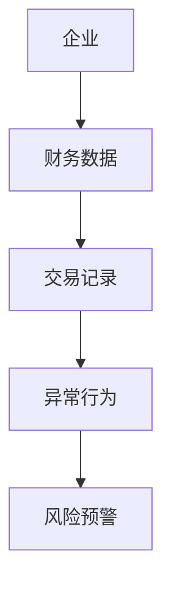
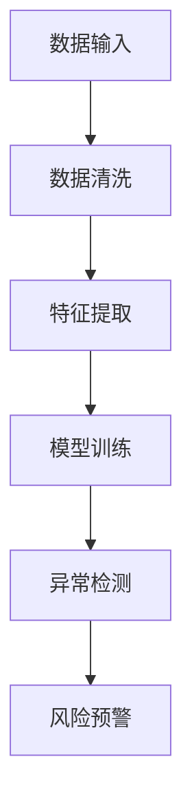

                 


# AI辅助企业财务异常检测：实时监控与风险预警

> 关键词：AI技术，财务异常检测，实时监控，风险预警，孤立森林算法，K近邻算法，系统架构设计

> 摘要：本文详细探讨了如何利用人工智能技术实现企业财务异常检测的实时监控与风险预警。通过分析财务数据中的异常模式，结合先进的算法和系统架构设计，构建高效的风险预警系统，帮助企业及时识别和应对潜在的财务风险。

---

## 第一部分：背景介绍

### 第1章：问题背景与目标

#### 1.1 财务异常检测的背景
- **1.1.1 企业财务风险的现状**  
  企业的财务健康状况直接影响其经营稳定性。然而，财务数据中的异常情况（如虚假交易、资金挪用、欺诈行为等）往往隐藏在大量正常数据中，难以被传统方法及时发现。

- **1.1.2 财务异常对企业的影响**  
  财务异常可能导致企业损失巨大，如税务处罚、法律纠纷、声誉损失等。及时发现和处理异常情况，可以有效降低企业的财务风险。

- **1.1.3 传统财务检测的局限性**  
  传统财务检测方法依赖人工审核，效率低、成本高且容易遗漏异常情况。面对海量数据，人工检查难以覆盖所有潜在风险点。

#### 1.2 AI技术在财务领域的应用前景
- **1.2.1 AI在财务领域的应用现状**  
  AI技术在财务领域的应用越来越广泛，包括智能记账、自动审计、风险评估等。AI的强大计算能力和数据分析能力使其成为财务检测的理想工具。

- **1.2.2 AI在财务异常检测中的优势**  
  AI能够快速处理海量数据，发现隐藏的异常模式，提供实时监控和风险预警，帮助企业及时应对潜在风险。

- **1.2.3 未来发展趋势**  
  随着AI技术的不断进步，财务异常检测将更加智能化和自动化，实现从单点检测到全局风险评估的转变。

---

## 第二部分：核心概念与联系

### 第2章：核心概念与联系

#### 2.1 财务异常检测的核心概念
- **2.1.1 财务异常的定义与特征**  
  财务异常是指在企业的财务数据中出现与正常模式不符的情况。常见的异常特征包括金额突变、交易频率异常、账单不匹配等。

- **2.1.2 异常检测的关键指标**  
  关键指标包括交易金额、交易时间、交易频率、账户余额变化等。

#### 2.2 AI辅助检测的原理
- **2.2.1 数据预处理与特征提取**  
  数据预处理包括数据清洗、标准化和特征工程。特征提取是将原始数据转化为能够反映异常情况的特征向量。

- **2.2.2 异常检测算法的选择与应用**  
  常用的异常检测算法包括孤立森林（Isolation Forest）、K近邻（KNN）、聚类算法（K-means）等。

- **2.2.3 风险预警模型的构建**  
  通过机器学习算法训练模型，识别异常数据，并根据异常程度生成风险预警信号。

#### 2.3 实体关系图（ER图）


#### 2.4 算法流程图


---

## 第三部分：算法原理与数学模型

### 第3章：算法原理与数学模型

#### 3.1 异常检测算法
- **3.1.1 Isolation Forest算法**
  ```python
  import numpy as np
  from sklearn.ensemble import IsolationForest

  # 示例数据
  X = np.random.randn(100, 2)
  model = IsolationForest(n_estimators=100, random_state=42)
  model.fit(X)
  ```

  Isolation Forest通过构建随机树，将数据点隔离到叶子节点，从而判断是否为异常点。算法的时间复杂度为O(n log n)，适用于高维数据。

- **3.1.2 K-近邻算法（KNN）**
  ```python
  from sklearn.neighbors import KNeighborsClassifier

  model = KNeighborsClassifier(n_neighbors=3)
  model.fit(X, y)
  ```

  KNN算法通过计算数据点之间的距离，找到与当前数据点最接近的K个邻居，判断是否为异常点。算法的时间复杂度为O(n^2)，适用于低维数据。

#### 3.2 数学公式与模型分析
- **孤立森林算法的数学模型**  
  孤立森林通过随机选择特征和分割数据，计算每个数据点的异常分数。异常分数越低，表示数据点越可能是异常点。

  $$ \text{异常分数} = \frac{\text{路径长度}}{\text{平均路径长度}} $$

- **K近邻算法的数学模型**  
  K近邻算法基于距离度量，计算数据点之间的相似性。常用的距离度量包括欧氏距离、曼哈顿距离等。

  $$ \text{欧氏距离} = \sqrt{\sum_{i=1}^{n}(x_i - y_i)^2} $$

---

## 第四部分：系统分析与架构设计

### 第4章：系统分析与架构设计

#### 4.1 系统分析
- **4.1.1 问题场景介绍**  
  系统需要实时监控企业的财务数据，识别异常交易，生成风险预警信号。

- **4.1.2 系统功能设计**  
  系统功能包括数据采集、异常检测、风险预警、报告生成等。

- **4.1.3 领域模型类图**  
  ```mermaid
  classDiagram
      class 财务数据 {
          交易记录
          账户信息
          金额
          时间
      }
      class 异常检测算法 {
          Isolation Forest
          K近邻
      }
      class 风险预警系统 {
          异常分数
          预警等级
      }
      财务数据 --> 异常检测算法
      异常检测算法 --> 风险预警系统
  ```

#### 4.2 系统架构设计
- **4.2.1 系统架构图**  
  ```mermaid
  graph TD
      A[数据采集层] --> B[数据处理层]
      B --> C[算法层]
      C --> D[用户界面层]
  ```

- **4.2.2 系统接口设计**  
  系统接口包括数据输入接口、算法调用接口、预警信号输出接口等。

- **4.2.3 系统交互序列图**  
  ```mermaid
  sequenceDiagram
      用户 --> 数据采集层: 提交财务数据
      数据采集层 --> 数据处理层: 传递数据
      数据处理层 --> 算法层: 调用异常检测算法
      算法层 --> 数据处理层: 返回异常结果
      数据处理层 --> 用户界面层: 显示预警信息
  ```

---

## 第五部分：项目实战

### 第5章：项目实战

#### 5.1 项目环境安装
- 需要安装的工具包括Python、Scikit-learn、Mermaid等。

#### 5.2 核心代码实现
- 异常检测代码示例：
  ```python
  import numpy as np
  from sklearn.ensemble import IsolationForest

  # 示例数据
  X = np.random.randn(100, 2)
  model = IsolationForest(n_estimators=100, random_state=42)
  model.fit(X)
  ```

- 风险预警系统代码示例：
  ```python
  from sklearn.neighbors import KNeighborsClassifier

  model = KNeighborsClassifier(n_neighbors=3)
  model.fit(X, y)
  ```

#### 5.3 项目小结
- 通过项目实战，读者可以掌握如何使用AI技术实现财务异常检测，以及如何构建实时监控和风险预警系统。

---

## 第六部分：最佳实践

### 第6章：最佳实践

#### 6.1 小结
- 总结全文内容，强调AI在财务异常检测中的重要性。

#### 6.2 注意事项
- 数据预处理是关键，特征选择和数据清洗直接影响模型效果。
- 模型调优需要结合业务需求，选择合适的算法和参数。
- 系统优化包括数据存储优化、算法加速等。

#### 6.3 拓展阅读
- 推荐相关书籍和论文，帮助读者深入学习。

---

## 第七部分：总结与展望

### 第7章：总结与展望

#### 7.1 总结
- 回顾全文，强调AI在财务异常检测中的应用价值。

#### 7.2 展望
- 展望未来，AI技术将更加智能化，财务异常检测将更加精准和实时。

---

## 参考文献和索引

- 参考文献：列出本文中引用的文献和资料。
- 索引：按照主题和算法分类，方便读者查阅。

---

## 作者信息

作者：AI天才研究院/AI Genius Institute & 禅与计算机程序设计艺术 /Zen And The Art of Computer Programming

---

以上是《AI辅助企业财务异常检测：实时监控与风险预警》的完整目录大纲，按照逻辑清晰、结构紧凑、简单易懂的原则进行编写，涵盖从背景介绍到项目实战的全过程，适合技术博客文章的撰写。

