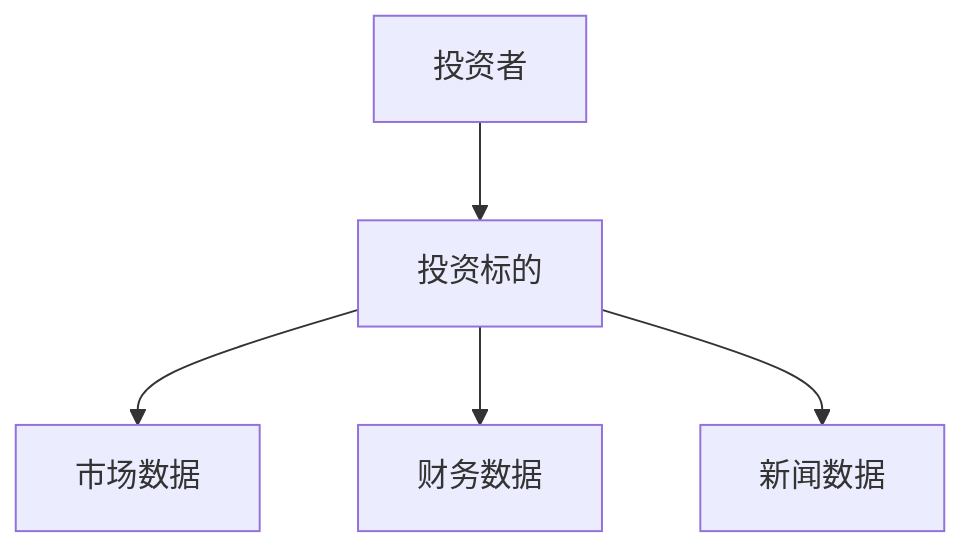

                 


# AI辅助发现新兴市场价值投资标的

> 关键词：AI，价值投资，新兴市场，机器学习，量化投资

> 摘要：本文将探讨如何利用人工智能技术辅助发现新兴市场的价值投资标的。通过分析AI在金融投资中的应用现状，结合机器学习和深度学习算法，构建一套完整的AI辅助投资系统，并通过实际案例展示其在新兴市场中的应用效果。

---

# 第一部分：背景介绍

## 第1章：AI在金融投资中的应用现状

### 1.1 从传统投资到量化投资的演变

传统投资主要依赖于人类的直觉和经验，而量化投资则通过数学模型和算法来进行决策。近年来，随着人工智能技术的快速发展，量化投资逐渐占据了重要地位。AI技术的应用不仅提高了投资效率，还能够发现传统方法难以察觉的投资机会。

### 1.2 人工智能技术在金融领域的优势

人工智能技术具有以下优势：
1. **数据处理能力**：AI能够处理海量数据，发现数据中的潜在规律。
2. **自动化决策**：通过机器学习模型，AI可以自动生成投资策略。
3. **实时性**：AI能够实时分析市场动态，快速做出反应。

### 1.3 新兴市场的特点与投资机会

新兴市场通常具有高增长潜力，但也伴随着高风险。新兴市场的波动性较大，信息不对称现象严重。AI技术可以帮助投资者克服这些挑战，发现潜在的投资机会。

---

## 第2章：价值投资的核心概念

### 2.1 价值投资的基本原理

价值投资的核心思想是寻找市场价格低于其内在价值的标的。这种方法强调长期投资，注重企业的基本面分析。

### 2.2 新兴市场的特点与投资策略

新兴市场具有以下特点：
1. **高增长潜力**：新兴市场的经济增速通常高于发达市场。
2. **波动性大**：新兴市场的股票价格波动较大。
3. **信息不透明**：新兴市场的企业信息披露可能不够完善。

### 2.3 价值投资与AI技术的结合

AI技术可以通过以下方式辅助价值投资：
1. **数据挖掘**：利用AI技术挖掘企业财务数据，发现潜在的价值标的。
2. **风险控制**：通过AI模型评估投资风险，优化投资组合。

---

# 第二部分：AI辅助投资的核心概念

## 第3章：AI辅助投资的核心概念与联系

### 3.1 数据驱动的投资决策

数据驱动的投资决策是AI辅助投资的核心。通过分析市场数据、财务数据、新闻数据等多维度信息，AI可以帮助投资者做出更科学的投资决策。

#### 3.1.1 数据来源与特征提取

数据来源包括：
1. **市场数据**：股票价格、成交量等。
2. **财务数据**：公司财报、财务指标等。
3. **新闻数据**：公司新闻、行业新闻等。

特征提取是将这些数据转化为模型可以使用的特征，例如使用文本挖掘技术提取新闻数据中的关键词。

#### 3.1.2 数据清洗与预处理

数据清洗是将数据中的噪声去除，例如处理缺失值、异常值等。预处理包括数据标准化、数据归一化等步骤。

### 3.2 模型驱动的投资策略

模型驱动的投资策略是通过机器学习模型生成投资信号。常用的方法包括：
1. **机器学习模型**：如线性回归、随机森林、支持向量机等。
2. **深度学习模型**：如LSTM、Transformer等。

#### 3.2.1 机器学习模型在投资中的应用

机器学习模型可以通过历史数据训练，预测未来的价格走势。例如，使用随机森林模型进行分类，判断股票是否为价值股。

#### 3.2.2 深度学习模型的优势

深度学习模型在处理非结构化数据（如新闻文本）方面具有优势。例如，使用LSTM模型分析时间序列数据，预测股票价格走势。

### 3.3 风险控制与投资组合优化

风险控制是投资过程中不可忽视的一部分。AI可以通过以下方式优化投资组合：
1. **风险评估**：通过模型评估投资标的的风险。
2. **风险对冲**：通过组合投资降低整体风险。

#### 3.3.1 风险评估的AI方法

使用VaR（Value at Risk）模型评估投资组合的风险。VaR模型可以通过历史模拟法或蒙特卡洛模拟法进行计算。

#### 3.3.2 投资组合优化的数学模型

投资组合优化的目标是在给定风险水平下最大化收益。常用的方法是马科维茨均值-方差模型。

---

## 第4章：核心概念对比表格与ER图

### 4.1 核心概念对比表格

| 概念       | 传统投资       | AI辅助投资       |
|------------|----------------|------------------|
| 数据来源   | 基本面分析     | 多维度数据挖掘   |
| 模型选择   | 专家经验       | 自动化模型训练   |
| 风险控制   | 经验判断       | 数学优化模型     |

### 4.2 ER实体关系图



---

# 第三部分：算法原理讲解

## 第5章：AI辅助投资的核心算法

### 5.1 机器学习算法

#### 5.1.1 线性回归

线性回归是一种简单但常用的回归算法。其基本假设是自变量与因变量之间存在线性关系。线性回归模型的公式为：

$$ y = \beta_0 + \beta_1x + \epsilon $$

其中，$\beta_0$ 是截距，$\beta_1$ 是斜率，$\epsilon$ 是误差项。

#### 5.1.2 随机森林

随机森林是一种基于决策树的集成学习算法。通过构建多个决策树，并将它们的结果进行投票或平均，可以提高模型的准确性和鲁棒性。

### 5.2 深度学习算法

#### 5.2.1 LSTM

LSTM（长短期记忆网络）是一种特殊的RNN，能够有效处理时间序列数据。LSTM通过引入记忆单元和遗忘门，可以捕捉长期依赖关系。

---

## 第6章：系统分析与架构设计方案

### 6.1 问题场景介绍

在新兴市场中，投资者需要面对大量的信息和复杂的市场环境。通过构建一个AI辅助投资系统，可以帮助投资者快速发现潜在的价值标的。

### 6.2 系统功能设计

系统功能包括：
1. **数据采集**：从多个来源获取市场数据。
2. **特征提取**：对数据进行特征提取和处理。
3. **模型训练**：训练机器学习模型，生成投资信号。
4. **风险控制**：评估投资组合风险，优化投资策略。

#### 6.2.1 领域模型mermaid类图

```mermaid
classDiagram
    class 投资者 {
        +资金：float
        +投资标的：list
        +风险偏好：string
        -投资策略：string
        +投资组合：list
    }
    class 数据源 {
        +市场数据：list
        +财务数据：list
        +新闻数据：list
    }
    class 模型训练 {
        +训练数据：list
        +特征工程：function
        +模型参数：list
    }
    class 投资系统 {
        +数据采集：function
        +特征提取：function
        +模型训练：function
        +风险评估：function
    }
    投资者 --> 数据源：查询数据
    数据源 --> 投资系统：提供数据
    投资者 --> 投资系统：输入参数
    投资系统 --> 模型训练：训练模型
    模型训练 --> 投资者：输出策略
```

### 6.3 系统架构设计

系统架构包括：
1. **数据层**：存储市场数据、财务数据等。
2. **算法层**：实现特征提取、模型训练等功能。
3. **应用层**：提供用户界面，展示投资结果。

#### 6.3.1 系统架构mermaid架构图


---

## 第7章：项目实战

### 7.1 环境安装

需要安装以下环境：
1. Python
2. NumPy
3. Pandas
4. Scikit-learn
5. Keras
6. TensorFlow

### 7.2 核心实现代码

以下是一个简单的随机森林模型实现代码：

```python
import pandas as pd
from sklearn.ensemble import RandomForestClassifier
from sklearn.metrics import accuracy_score

# 加载数据
data = pd.read_csv('dataset.csv')

# 分割特征与标签
X = data.drop('label', axis=1)
y = data['label']

# 训练模型
model = RandomForestClassifier()
model.fit(X, y)

# 预测结果
y_pred = model.predict(X)

# 计算准确率
print(accuracy_score(y, y_pred))
```

### 7.3 实际案例分析

通过分析新兴市场的股票数据，利用随机森林模型进行分类，识别出具有价值投资潜力的标的。

---

## 第8章：最佳实践

### 8.1 小结

通过本文的介绍，读者可以了解如何利用AI技术辅助发现新兴市场的价值投资标的。AI技术可以帮助投资者提高投资效率，降低投资风险。

### 8.2 注意事项

1. **数据质量**：数据的准确性和完整性对模型的性能影响很大。
2. **模型调优**：需要不断调整模型参数，提高模型的准确率。
3. **风险控制**：投资过程中需要时刻关注市场动态，及时调整投资策略。

### 8.3 拓展阅读

推荐阅读以下书籍：
1. 《Python机器学习实战》
2. 《深度学习》
3. 《量化投资：数据科学的驱动方法》

---

作者：AI天才研究院 & 禅与计算机程序设计艺术

