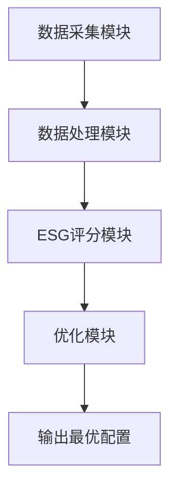

                 


# AI辅助的ESG投资组合优化工具

> 关键词：ESG投资，人工智能，投资组合优化，强化学习，系统架构

> 摘要：随着全球对可持续投资的关注增加，ESG（环境、社会和治理）投资变得越来越重要。本文探讨如何利用人工智能技术构建ESG投资组合优化工具，从背景介绍、核心算法、系统设计到项目实战，全面解析AI在ESG投资中的应用。

---

# 第1章: ESG投资与AI辅助优化概述

## 1.1 ESG投资的基本概念

### 1.1.1 什么是ESG投资
ESG投资是一种关注环境、社会和公司治理因素的投资策略。投资者在选择投资标的时，不仅考虑财务回报，还评估公司在可持续发展方面的表现。

- 环境（E）：公司对环境保护的贡献，如减少碳排放。
- 社会（S）：公司在社会责任方面的表现，如员工权益。
- 治理（G）：公司治理结构和透明度。

### 1.1.2 ESG评分标准与指标体系
ESG评分通常基于标准化的指标体系，包括几十个甚至上百个具体指标。例如：
- 环境指标：碳排放强度、可再生能源使用比例。
- 社会指标：员工满意度、产品安全。
- 治理指标：董事会多样性、高管薪酬透明度。

### 1.1.3 ESG投资的意义与价值
ESG投资不仅有助于实现可持续发展目标，还能帮助投资者规避风险，提升投资组合的长期稳定性。

---

## 1.2 AI在金融投资中的应用

### 1.2.1 AI在金融领域的核心作用
人工智能通过处理海量数据，发现传统方法难以察觉的模式，优化投资决策。

- 数据分析：利用机器学习模型分析非结构化数据，如新闻、社交媒体。
- 预测模型：使用时间序列模型预测股价走势。
- 风险管理：通过AI实时监控市场风险。

### 1.2.2 AI在投资组合优化中的优势
AI能够处理复杂约束条件，快速找到最优解。

- 高效计算：AI算法能够在短时间内处理大量数据。
- 多目标优化：同时考虑收益、风险、ESG评分等多个目标。

### 1.2.3 ESG投资与AI技术的结合
通过AI技术，ESG投资能够更精准地筛选优质标的，优化投资组合。

---

## 1.3 投资组合优化的基本原理

### 1.3.1 投资组合优化的定义与目标
投资组合优化是在给定风险水平下，寻找收益最大化的一组资产配置。

- 定义：优化投资组合的收益-风险关系。
- 目标：最大化收益，最小化风险。

### 1.3.2 传统投资组合优化方法
传统方法以马科维茨均值-方差模型为代表，但难以处理多目标约束。

- 均值-方差模型：优化资产的期望收益和方差。
- 缺点：难以处理复杂的约束条件。

### 1.3.3 ESG约束下的投资组合优化
在传统模型基础上加入ESG评分约束，构建符合可持续发展理念的投资组合。

---

## 1.4 本章小结
本章介绍了ESG投资的基本概念、AI在金融中的应用，以及投资组合优化的基本原理。AI技术为ESG投资提供了新的可能性，特别是在处理多目标优化问题上表现突出。

---

# 第2章: ESG评分模型与数据来源

## 2.1 ESG评分的核心要素

### 2.1.1 环境因素（E）
- 碳排放强度：单位产出的碳排放量。
- 可再生能源使用比例：公司使用可再生能源的占比。

### 2.1.2 社会因素（S）
- 员工满意度：员工对公司的满意度调查结果。
- 产品安全：产品对消费者安全的影响。

### 2.1.3 治理因素（G）
- 董事会多样性：董事会成员的性别、年龄等多样性。
- 高管薪酬透明度：高管薪酬与公司业绩的关联性。

---

## 2.2 ESG数据的获取与处理

### 2.2.1 数据来源渠道
- 第三方评级机构：如MSCI、晨星。
- 公司财报：提取ESG相关数据。
- 第三方数据库：如Sustainalytics。

### 2.2.2 数据清洗与预处理
- 数据清洗：处理缺失值、异常值。
- 标准化：将不同来源的数据统一标准化。

### 2.2.3 数据特征提取
- 经济学指标：如ROE、EPS。
- 非财务指标：如碳排放强度、员工满意度。

---

## 2.3 ESG评分模型的构建

### 2.3.1 基于机器学习的ESG评分模型
- 算法选择：使用随机森林或神经网络。
- 数据特征：结合财务和非财务指标。

### 2.3.2 基于规则的ESG评分模型
- 规则制定：根据行业标准制定评分规则。
- 优缺点：规则模型简单但可能不够灵活。

### 2.3.3 混合型ESG评分模型
- 综合机器学习和规则模型的优点，提升评分准确性。

---

## 2.4 本章小结
本章详细介绍了ESG评分的核心要素、数据来源以及模型构建方法。高质量的ESG数据是构建优化工具的基础。

---

# 第3章: AI算法在投资组合优化中的应用

## 3.1 强化学习在投资组合优化中的应用

### 3.1.1 强化学习的基本原理
- 状态、动作、奖励：通过试错学习最优策略。
- 算法：如Q-Learning、Deep Q-Network。

### 3.1.2 在投资组合优化中的应用案例
- 动态调整资产配置。
- 实时响应市场变化。

### 3.1.3 强化学习的优势与挑战
- 优势：适合动态环境，可处理高维问题。
- 挑战：需要大量数据，计算成本高。

---

## 3.2 遗传算法在投资组合优化中的应用

### 3.2.1 遗传算法的基本原理
- 编码、选择、交叉、变异：模拟生物进化过程。

### 3.2.2 在投资组合优化中的实现
- 编码资产组合：将资产配置编码为基因。
- 适应度函数：收益-风险指标。

### 3.2.3 遗传算法的优缺点
- 优点：全局搜索能力强。
- 缺点：收敛速度慢。

---

## 3.3 模拟退火算法在投资组合优化中的应用

### 3.3.1 模拟退火的基本原理
- 退火过程：逐步降低温度，找到全局最优解。

### 3.3.2 在投资组合优化中的实现
- 状态空间：资产组合。
- 能量函数：收益-风险指标。

### 3.3.3 模拟退火的优缺点
- 优点：能够跳出局部最优。
- 缺点：计算效率较低。

---

## 3.4 本章小结
本章介绍了几种常见的AI算法在投资组合优化中的应用，每种算法都有其适用场景和优缺点。

---

# 第4章: 数学模型与算法实现

## 4.1 投资组合优化的数学模型

### 4.1.1 优化目标
- 最大化收益：$$\max \sum w_i r_i$$
- 最小化风险：$$\min \sum w_i^2 \sigma_i^2$$

### 4.1.2 约束条件
- 资产权重：$$\sum w_i = 1$$
- ESG评分：$$\sum w_i s_i \geq s_{\text{threshold}}$$

## 4.2 强化学习算法实现

### 4.2.1 状态空间
- 状态：当前资产组合、市场状况。
- 动作：买入、卖出、持有。

### 4.2.2 适应度函数
- 奖励：收益减去风险。

### 4.2.3 算法实现代码
```python
import numpy as np
class ESGInvestmentAgent:
    def __init__(self, state_space, action_space):
        self.state_space = state_space
        self.action_space = action_space
        # 初始化参数
```

---

## 4.3 本章小结
本章详细推导了投资组合优化的数学模型，并给出了强化学习算法的实现框架。

---

# 第5章: 系统架构设计

## 5.1 系统功能模块

### 5.1.1 数据采集模块
- 数据源：股票、基金等资产数据。
- 数据处理：清洗、标准化。

### 5.1.2 ESG评分模块
- 输入：资产数据。
- 输出：ESG评分。

### 5.1.3 优化模块
- 输入：ESG评分、收益、风险数据。
- 输出：最优资产配置。

---

## 5.2 系统架构图



---

## 5.3 接口设计

### 5.3.1 数据接口
- 输入：API接口获取实时数据。
- 输出：处理后的数据。

### 5.3.2 优化接口
- 输入：用户设定的约束条件。
- 输出：优化后的资产配置。

---

## 5.4 本章小结
本章设计了系统的整体架构，并通过模块化设计实现了功能划分。

---

# 第6章: 项目实战

## 6.1 环境搭建

### 6.1.1 安装依赖
- Python 3.8+
- NumPy、Pandas、Scikit-learn
- TensorFlow、Keras

### 6.1.2 数据准备
- 数据来源：股票数据、ESG评分数据。

---

## 6.2 核心实现

### 6.2.1 ESG评分实现
```python
def calculate_esg_score(company_data):
    # 实现ESG评分逻辑
    pass
```

### 6.2.2 优化算法实现
```python
def optimize_portfolio(esg_scores, returns):
    # 实现优化算法
    pass
```

---

## 6.3 实际案例分析
通过具体案例展示如何利用AI工具优化ESG投资组合。

---

## 6.4 本章小结
本章通过实际项目展示了如何将理论应用于实践。

---

# 第7章: 总结与展望

## 7.1 本章总结
本文详细介绍了AI辅助的ESG投资组合优化工具，从理论到实践，全面解析了实现过程。

## 7.2 未来展望
未来研究方向包括：
- 更复杂的约束条件。
- 更高效的算法优化。
- 更多的实际应用场景。

## 7.3 最佳实践 tips
- 数据质量是关键。
- 选择合适的算法。
- 定期更新模型。

---

# 作者：AI天才研究院 & 禅与计算机程序设计艺术

---

这篇文章详细介绍了AI辅助的ESG投资组合优化工具，从背景到实现，再到项目实战，为读者提供了全面的视角。通过结合AI技术和ESG投资，为可持续投资提供了新的思路。

