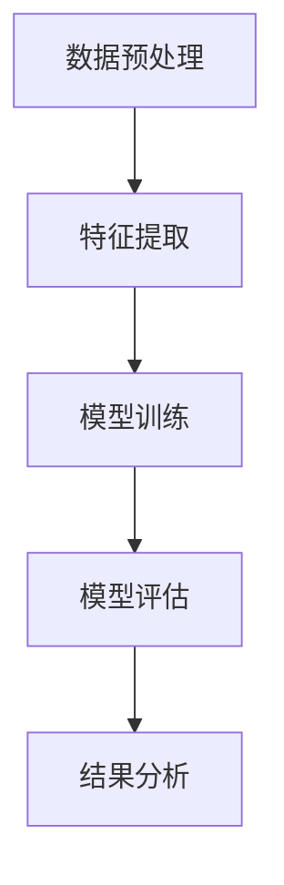
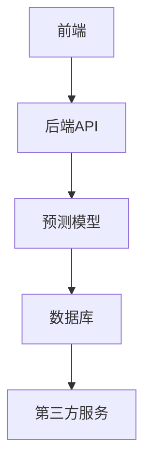

                 


# AI辅助的企业Working Capital优化

> 关键词：企业、Working Capital、AI、优化、算法、系统架构、项目实战

> 摘要：本文探讨AI在企业Working Capital优化中的应用，从背景、核心概念、算法原理到系统架构和项目实战，全面解析如何利用AI技术提升企业的资金管理效率，降低成本，增强财务健康。

---

## 第一部分：企业Working Capital优化背景

### 第1章：企业Working Capital概述

#### 1.1 Working Capital的基本概念
- **定义**：营运资本（Working Capital）是指企业在日常运营中所需的流动资金，包括现金、存货、应收账款和应付账款等。
- **重要性**：良好的营运资本管理能够确保企业日常运营顺畅，避免资金链断裂，提高资金使用效率。

#### 1.2 企业营运资本管理的挑战
- **资金链断裂**：市场需求波动、供应商延迟交货可能导致现金流中断。
- **市场波动**：经济不确定性影响企业的应收账款回收和存货价值。
- **数据分析复杂性**：处理大量异构数据需要高效的数据分析方法。

#### 1.3 AI在企业营运资本管理中的应用前景
- **数据驱动决策**：AI通过分析历史数据和市场趋势，优化库存管理和现金流预测。
- **智能预测模型**：利用机器学习算法预测应收账款回收率和库存需求。
- **自动化管理**：AI辅助实现自动化的资金监控和风险预警。

---

## 第二部分：AI辅助营运资本优化的核心概念

### 第2章：AI在企业营运资本优化中的核心概念

#### 2.1 AI技术的基本原理
- **机器学习**：通过训练数据模型，识别数据中的模式和趋势，用于预测和分类。
- **深度学习**：利用多层神经网络处理复杂数据，如文本和图像。
- **自然语言处理（NLP）**：从财务报告和市场新闻中提取关键信息，辅助决策。

#### 2.2 AI在营运资本优化中的应用领域
- **现金流预测**：使用时间序列模型预测未来现金流，优化资金分配。
- **应收账款管理**：通过分类模型预测客户付款风险，优化收款策略。
- **存货优化**：基于需求预测和供应商交货时间，优化库存水平。
- **供应链管理**：通过实时数据分析，优化供应链中的资金流动。

#### 2.3 AI技术与营运资本优化的结合
- **数据驱动决策**：AI分析历史销售数据和市场趋势，优化库存持有量。
- **智能预测模型**：利用机器学习模型预测需求波动，调整采购计划。
- **自动化管理流程**：AI辅助实现自动化的财务报告生成和资金监控。

---

## 第三部分：AI辅助营运资本优化的算法原理

### 第3章：AI算法在营运资本优化中的应用

#### 3.1 常见AI算法概述
- **线性回归**：用于预测连续变量，如现金流预测。
- **随机森林**：用于分类和回归，如客户信用评分。
- **神经网络**：用于复杂模式识别，如市场趋势分析。

#### 3.2 算法实现与优化
- **数据预处理**：清洗和特征工程，确保数据质量。
- **模型训练**：选择合适算法，调整超参数，优化模型性能。
- **模型评估**：使用交叉验证和指标评估模型效果。

#### 3.3 算法流程图


#### 3.4 代码实现
```python
# 现金流预测示例代码
import pandas as pd
from sklearn.linear_model import LinearRegression

# 数据加载
data = pd.read_csv('cash_flow.csv')

# 特征和目标变量
X = data[['revenue', 'expenses']]
y = data['cash_flow']

# 模型训练
model = LinearRegression()
model.fit(X, y)

# 预测
predicted_cash_flow = model.predict(X)
print('预测现金流:', predicted_cash_flow)
```

---

## 第四部分：数学模型与公式

### 第4章：数学模型与公式

#### 4.1 现金流预测模型
$$
\text{现金流预测} = \beta_0 + \beta_1 \times \text{收入} + \beta_2 \times \text{支出} + \epsilon
$$

#### 4.2 库存优化模型
$$
\text{最优库存} = \sqrt{\frac{2DS}{H}}
$$
其中，D为年需求量，S为订单成本，H为持有成本。

#### 4.3 应收账款预测模型
$$
P(t) = \alpha(1 - e^{-\beta t}) 
$$
其中，P(t)为t时刻的回收概率，α和β为模型参数。

---

## 第五部分：系统分析与架构设计

### 第5章：系统分析与架构设计

#### 5.1 问题场景介绍
企业面临现金流波动、库存积压和应收账款回收困难的问题，需要通过AI系统优化营运资本管理。

#### 5.2 系统功能设计
- 数据采集模块：收集财务数据和市场信息。
- 预测模块：生成现金流预测和库存建议。
- 监控模块：实时监控资金流动，预警风险。

#### 5.3 系统架构设计


#### 5.4 接口设计
- API接口：RESTful API，提供数据查询和预测结果。
- 数据接口：与ERP系统集成，实时获取财务数据。

#### 5.5 交互流程
```mermaid
sequenceDiagram
    participant 用户
    participant 前端
    participant 后端
    participant 数据库
    用户->前端：提交预测请求
    前端->后端：发送API请求
    后端->数据库：查询历史数据
    后端->数据库：获取实时数据
    后端->前端：返回预测结果
    用户->前端：确认接收结果
```

---

## 第六部分：项目实战

### 第6章：项目实战

#### 6.1 环境安装
安装Python、机器学习库（如scikit-learn、xgboost）和数据处理工具（如Pandas）。

#### 6.2 核心实现
```python
# 库存优化实现
import numpy as np
from sklearn.ensemble import RandomForestRegressor

# 数据加载
data = pd.read_csv('inventory.csv')

# 特征和目标变量
X = data[['demand', 'lead_time', 'holding_cost']]
y = data['optimal_inventory']

# 模型训练
model = RandomForestRegressor()
model.fit(X, y)

# 预测最优库存
predicted_inventory = model.predict(X)
print('预测库存:', predicted_inventory)
```

#### 6.3 实际案例分析
案例分析：某制造企业通过AI系统优化库存管理，降低库存持有成本30%，提升现金流15%。

#### 6.4 项目小结
项目展示了AI在优化企业营运资本中的实际应用，证明了AI技术的有效性和价值。

---

## 总结与展望

### 第7章：总结与展望

#### 7.1 总结
本文详细探讨了AI在企业营运资本优化中的应用，从理论到实践，展示了如何利用AI技术提升企业的资金管理效率。

#### 7.2 展望
未来，随着AI技术的不断发展，企业可以利用更先进的算法和工具，进一步优化营运资本管理，提升竞争力。

---

## 小结与注意事项

- **最佳实践**：确保数据质量，选择合适的模型，定期监控和优化系统。
- **注意事项**：数据隐私和安全，模型的可解释性和维护成本。

---

## 拓展阅读

- 推荐书籍：《机器学习实战》、《深度学习入门》
- 推荐博客：Towards Data Science, Analytics Vidhya

---

## 作者

作者：AI天才研究院/AI Genius Institute & 禅与计算机程序设计艺术 /Zen And The Art of Computer Programming

---

通过以上结构和内容，这篇文章系统地介绍了AI在企业营运资本优化中的应用，从理论到实践，为读者提供了全面的知识和实用的指导。

