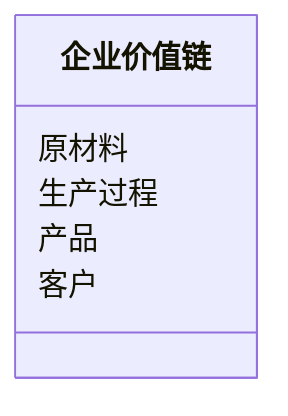
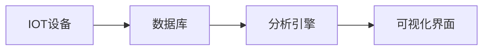
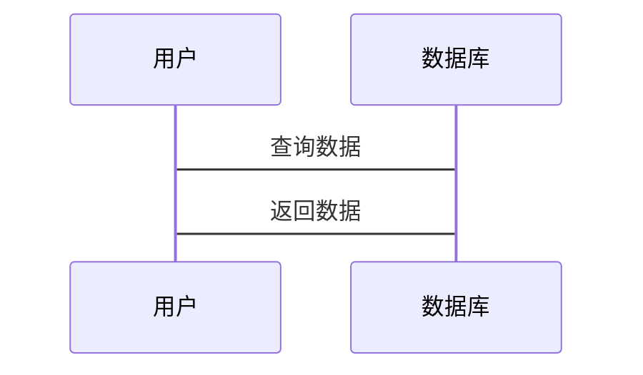

                 


# AI辅助的企业价值链分析

## 关键词：
- 人工智能 (AI)
- 企业价值链
- 数据分析
- 优化模型
- 系统架构

## 摘要：
本文探讨AI在企业价值链分析中的应用，详细分析其核心概念、算法原理、系统架构设计及项目实战，旨在为企业提供优化业务流程的思路和方法。通过结合具体案例，文章展示了AI如何赋能企业价值链分析，助力企业提升竞争力。

---

## 第一章: AI与企业价值链概述

### 1.1 企业价值链的基本概念

#### 1.1.1 企业价值链的定义
企业价值链是指企业从原材料采购、生产加工、分销到最终交付给客户的一系列价值创造活动。每个环节都对企业的整体价值贡献产生影响。

#### 1.1.2 企业价值链的核心要素
- **输入**：原材料、资金、人力资源、技术等。
- **过程**：生产、加工、物流、销售等。
- **输出**：产品或服务、客户价值、利润等。

#### 1.1.3 企业价值链的结构与功能
企业价值链由多个环节组成，每个环节都有特定的功能，共同为企业创造价值。

### 1.2 AI技术的基本概念

#### 1.2.1 人工智能的定义与特点
人工智能（AI）是模拟人类智能的计算机系统，具有学习、推理和自适应能力。

#### 1.2.2 机器学习与深度学习的区别
- **机器学习**：通过数据训练模型，预测新数据。
- **深度学习**：基于人工神经网络，处理复杂数据。

#### 1.2.3 当前AI技术的主要应用领域
包括图像识别、自然语言处理、预测分析等。

### 1.3 AI与企业价值链的结合

#### 1.3.1 AI技术在企业价值链中的作用
- 数据分析：提取有价值的信息。
- 流程优化：提高效率。
- 决策支持：提供数据驱动的决策依据。

#### 1.3.2 AI如何优化企业价值链
- 通过数据分析优化生产流程。
- 利用预测模型优化库存管理。
- 提供客户行为分析以改善销售策略。

### 1.4 本章小结
本章介绍了企业价值链和AI的基本概念，并探讨了AI如何优化企业价值链。

---

## 第二章: AI辅助企业价值链分析的核心概念

### 2.1 企业价值链分析的框架

#### 2.1.1 价值链分析的步骤与方法
1. 确定关键环节。
2. 采集数据。
3. 分析问题。
4. 提出优化建议。

#### 2.1.2 价值链分析的关键指标
- 成本、效率、质量、客户满意度。

#### 2.1.3 价值链分析的工具与技术
- 数据分析工具：Excel、Python。
- 数据可视化工具：Tableau、Power BI。

### 2.2 AI在企业价值链分析中的角色

#### 2.2.1 AI作为数据处理工具
- 数据清洗、特征工程。
- 使用机器学习模型进行预测。

#### 2.2.2 AI作为决策支持工具
- 提供实时数据监控。
- 建立预测模型支持决策。

#### 2.2.3 AI作为优化工具
- 利用优化算法改进流程。

### 2.3 核心概念的联系与对比

#### 2.3.1 AI技术与企业价值链的对比分析
| 特性 | AI技术 | 企业价值链 |
|------|---------|------------|
| 输入 | 数据    | 原材料等   |
| 输出 | 预测    | 产品或服务 |

#### 2.3.2 AI技术对企业价值链各环节的影响
- 数据分析优化采购。
- 预测模型优化生产。

#### 2.3.3 AI技术在企业价值链中的应用矩阵
| 阶段 | 采购 | 生产 | 分销 |
|------|------|------|------|
| 技术 | 数据分析 | 优化模型 | 客户行为分析 |

---

## 第三章: AI辅助企业价值链分析的算法原理

### 3.1 数据预处理与特征工程

#### 3.1.1 数据清洗
- 删除重复数据。
- 处理缺失值。

#### 3.1.2 特征选择
- 使用相关系数筛选特征。

#### 3.1.3 数据标准化
- 使用标准化方法处理特征。

### 3.2 常见机器学习算法

#### 3.2.1 线性回归模型
- **公式**：$$y = \beta_0 + \beta_1x + \epsilon$$
- **应用**：预测销售量与广告投入的关系。

#### 3.2.2 支持向量机（SVM）
- **公式**：$$\text{max} \quad \frac{1}{2}\|w\|^2$$
- **约束**：$$y_i(w \cdot x_i + b) \geq 1$$

---

## 第四章: 系统架构设计

### 4.1 系统功能设计

#### 4.1.1 领域模型
- **类图**：


#### 4.1.2 系统架构
- **架构图**：


#### 4.1.3 系统接口设计
- API接口：RESTful API。

#### 4.1.4 系统交互流程
- **序列图**：


---

## 第五章: 项目实战

### 5.1 环境安装
- 安装Python、TensorFlow、Pandas。

### 5.2 系统核心实现

#### 5.2.1 数据预处理代码
```python
import pandas as pd

# 读取数据
data = pd.read_csv('data.csv')

# 删除重复数据
data = data.drop_duplicates()

# 处理缺失值
data = data.dropna()
```

#### 5.2.2 训练模型代码
```python
import tensorflow as tf
from tensorflow.keras import layers

# 构建模型
model = tf.keras.Sequential([
    layers.Dense(64, activation='relu'),
    layers.Dense(1)
])

# 编译模型
model.compile(optimizer='adam', loss='mean_squared_error')
```

### 5.3 案例分析
- 某制造企业的库存优化案例。

---

## 第六章: 总结与展望

### 6.1 最佳实践 tips
- 数据质量是关键。
- 结合业务需求选择模型。

### 6.2 小结
AI技术能够显著优化企业价值链分析。

### 6.3 注意事项
- 数据隐私保护。
- 模型的可解释性。

### 6.4 拓展阅读
推荐相关书籍和论文。

---

## 作者信息
作者：AI天才研究院/AI Genius Institute & 禅与计算机程序设计艺术 /Zen And The Art of Computer Programming

