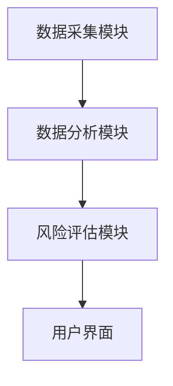
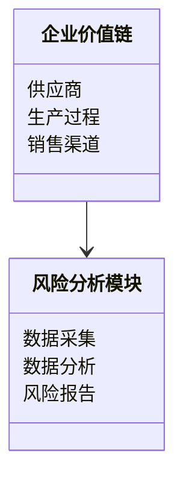

                 


# AI辅助的企业价值链风险分析

> 关键词：AI技术，企业价值链，风险分析，数据采集，机器学习，风险管理

> 摘要：随着人工智能技术的快速发展，企业价值链的优化与风险分析正逐渐成为企业竞争力的关键因素。本文详细探讨了如何利用AI技术辅助企业价值链中的风险分析，从数据采集与处理、模型构建到系统架构设计，再到实际项目案例的实现，最后总结了最佳实践和未来发展方向。

---

## 第1章：AI辅助的企业价值链风险分析概述

### 1.1 问题背景与描述

#### 1.1.1 企业价值链的基本概念
企业价值链是指企业从原材料采购、生产加工、销售到售后服务的整个过程中的价值创造链。价值链中的每个环节都可能产生风险，如供应链中断、市场需求波动等。

#### 1.1.2 风险分析的必要性
在现代商业环境中，企业面临的风险多种多样，包括市场风险、供应链风险、运营风险等。及时识别和评估这些风险，可以帮助企业制定有效的应对策略，降低潜在损失。

#### 1.1.3 AI在风险分析中的作用
人工智能技术，特别是机器学习和自然语言处理，能够通过分析大量数据，识别潜在风险，并提供预测性见解，从而帮助企业在价值链的各个阶段做出更明智的决策。

### 1.2 核心概念与边界

#### 1.2.1 企业价值链的核心要素
企业价值链的核心要素包括供应商管理、生产过程、物流、销售和客户关系管理等。

#### 1.2.2 风险分析的边界与外延
风险分析的边界通常包括企业内部运营风险和外部市场风险。外延则可能扩展到行业趋势和宏观经济因素。

#### 1.2.3 AI辅助的实现方式
AI辅助可以通过自动化数据处理、预测建模和实时监控等方式，帮助企业更高效地进行风险分析。

### 1.3 问题解决与应用

#### 1.3.1 风险分析的传统方法
传统风险分析方法通常依赖于人工经验，具有耗时长、效率低的特点。

#### 1.3.2 AI辅助的优势与局限性
AI辅助的优势在于快速处理大量数据和高精度预测。其局限性包括对数据质量的依赖和模型解释性问题。

#### 1.3.3 实际应用场景分析
本文将通过一个具体的项目案例，展示AI如何辅助企业价值链中的风险分析。

---

## 第2章：企业价值链中的数据采集与处理

### 2.1 数据采集方法

#### 2.1.1 结构化数据采集
结构化数据包括企业内部的销售数据、生产记录等，可以通过数据库查询直接获取。

#### 2.1.2 非结构化数据采集
非结构化数据如新闻报道、社交媒体评论等，通常需要通过网络爬虫技术进行采集。

#### 2.1.3 数据清洗与预处理
数据清洗包括去除重复数据、处理缺失值和异常值等。

### 2.2 数据分析方法

#### 2.2.1 统计分析
统计分析可以帮助识别数据中的趋势和异常值。

#### 2.2.2 机器学习模型
使用监督学习算法，如随机森林和神经网络，进行风险预测。

#### 2.2.3 自然语言处理
自然语言处理技术可以分析文本数据，提取情感倾向和关键词。

---

## 第3章：AI辅助的风险分析模型构建

### 3.1 模型构建原理

#### 3.1.1 数据特征提取
特征提取是将原始数据转换为模型可识别的特征向量。

#### 3.1.2 模型训练与优化
通过交叉验证优化模型参数，提高预测准确性。

#### 3.1.3 模型评估与验证
使用准确率、召回率和F1分数等指标评估模型性能。

### 3.2 风险识别与评估

#### 3.2.1 风险识别方法
基于机器学习模型的预测结果，识别高风险区域。

#### 3.2.2 风险评估指标
采用概率评分和风险影响矩阵进行风险量化。

#### 3.2.3 案例分析
通过具体案例，展示模型在实际应用中的效果。

---

## 第4章：系统架构设计

### 4.1 系统功能设计

#### 4.1.1 数据采集模块
负责采集企业价值链中的结构化和非结构化数据。

#### 4.1.2 数据分析模块
执行数据清洗、特征提取和模型训练。

#### 4.1.3 风险评估模块
生成风险报告并提供可视化界面。

### 4.2 系统架构图


---

## 第5章：系统实现与接口设计

### 5.1 系统接口设计

#### 5.1.1 API设计
定义RESTful API接口，供其他系统调用。

#### 5.1.2 数据格式
使用JSON格式进行数据传输，确保兼容性和可读性。

---

## 第6章：项目实战

### 6.1 项目需求分析

#### 6.1.1 项目背景
假设我们为一家制造企业进行风险分析。

#### 6.1.2 需求分析
识别供应链中断和市场需求波动风险。

### 6.2 系统设计

#### 6.2.1 领域模型


#### 6.2.2 系统架构
```mermaid
container 企业价值链风险分析系统 {
    class 数据采集模块 {
        +采集接口
        -数据清洗
    }
    class 数据分析模块 {
        +特征提取
        -模型训练
    }
    class 风险报告模块 {
        +风险评分
        -可视化报告
    }
    数据采集模块 --> 数据分析模块
    数据分析模块 --> 风险报告模块
}
```

### 6.3 系统实现

#### 6.3.1 环境安装
需要安装Python、TensorFlow和Flask框架。

#### 6.3.2 核心代码实现
```python
import pandas as pd
from sklearn.ensemble import RandomForestClassifier
from sklearn.metrics import accuracy_score

# 数据加载
data = pd.read_csv('value_chain.csv')

# 特征提取
features = data.drop('risk', axis=1)
target = data['risk']

# 模型训练
model = RandomForestClassifier()
model.fit(features, target)

# 预测与评估
 predictions = model.predict(features)
print("准确率：", accuracy_score(target, predictions))
```

#### 6.3.3 代码应用解读
上述代码展示了如何使用随机森林模型进行风险预测，并输出模型的准确率。

### 6.4 项目测试与优化

#### 6.4.1 测试用例设计
设计涵盖不同场景的测试用例，验证系统功能。

#### 6.4.2 系统优化
优化模型参数，提高预测准确性。

### 6.5 项目小结

#### 6.5.1 成果总结
展示了如何通过AI技术提升企业价值链的风险分析能力。

#### 6.5.2 经验分享
强调数据质量的重要性，以及模型可解释性的必要性。

---

## 第7章：扩展与最佳实践

### 7.1 高级算法与模型优化

#### 7.1.1 使用XGBoost提升性能
XGBoost在处理高维数据时表现优异。

#### 7.1.2 模型调参技巧
使用网格搜索优化模型参数。

### 7.2 安全与伦理问题

#### 7.2.1 数据隐私保护
确保数据处理符合GDPR等隐私保护法规。

#### 7.2.2 模型公平性
避免算法偏见，确保模型对所有群体公平。

### 7.3 技术结合与未来发展

#### 7.3.1 与其他技术结合
如区块链技术可以增强数据可信度。

#### 7.3.2 未来发展
AI技术在企业价值链中的应用将更加深入，推动企业数字化转型。

### 7.4 最佳实践 tips

- 数据预处理是关键，确保数据质量。
- 选择合适的算法，避免过度拟合。
- 定期更新模型，适应数据变化。

---

## 小结

通过本文的详细讲解，我们了解了如何利用AI技术辅助企业价值链中的风险分析。从数据采集、模型构建到系统实现，每一步都需要精心设计和实施。未来，随着技术的不断进步，AI在企业风险管理中的应用将更加广泛和深入。

---

## 作者信息

作者：AI天才研究院/AI Genius Institute & 禅与计算机程序设计艺术 /Zen And The Art of Computer Programming

---

感谢您的阅读！希望本文对您在AI辅助的企业价值链风险分析方面有所帮助！

