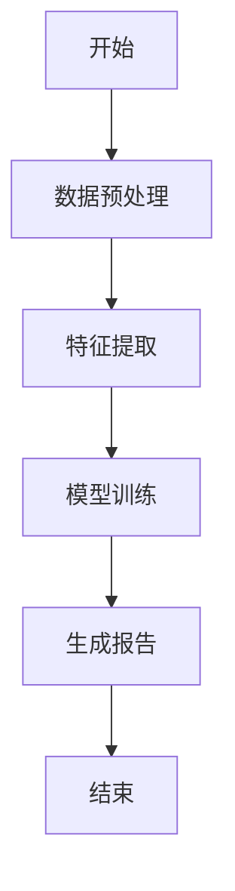
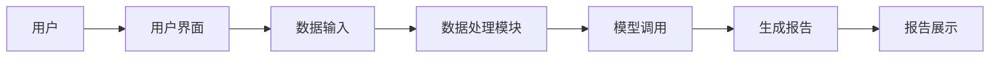

                 


# AI辅助的企业估值报告自动生成

## 关键词：AI辅助，企业估值，自然语言处理，机器学习，报告自动生成

## 摘要：本文详细探讨了如何利用人工智能技术辅助生成企业估值报告。从问题背景到核心概念，从算法原理到系统架构，从项目实战到最佳实践，全面解析了AI在企业估值中的应用，帮助企业提升效率和准确性。

---

## 第一部分：背景介绍

### 第1章：企业估值报告的背景与挑战

#### 1.1 问题背景

- **传统企业估值方法的局限性**  
  传统的企业估值方法依赖于人工分析，耗时且容易出错。  
  - 例如，财务报表分析需要手动计算多个指标，容易遗漏关键数据。  
  - 不同分析师可能得出不同的估值结果，导致不一致性和不确定性。  

- **问题描述**  
  - 企业估值涉及大量数据，如财务数据、市场数据、行业趋势等，人工处理效率低下。  
  - 高速变化的市场环境要求估值报告实时更新，但传统方法难以满足这一需求。  

- **问题解决**  
  - 引入AI技术，特别是自然语言处理和机器学习，可以自动化提取数据、分析信息并生成报告。  
  - AI能够快速处理大量数据，提高估值的准确性和一致性。  

- **边界与外延**  
  - AI辅助主要在数据处理和分析阶段发挥作用，最终的决策仍需人类判断。  
  - 适用于标准化程度高的企业，对于特殊情况可能需要人工干预。  

- **概念结构与核心要素**  
  - 核心要素包括：企业数据、市场数据、行业基准、估值模型、报告生成。  
  - 概念结构图展示了各要素之间的关系（见附图）。  

---

## 第二部分：核心概念与联系

### 第2章：AI在企业估值中的核心原理

#### 2.1 核心概念原理

- **自然语言处理（NLP）在报告生成中的应用**  
  - NLP用于从企业财报中提取关键信息，如收入、利润、资产负债等。  
  - 使用文本摘要技术，自动生成报告的核心内容。  

- **机器学习模型在估值预测中的作用**  
  - 利用回归模型或深度学习模型预测企业价值。  
  - 例如，使用LSTM模型分析时间序列数据，预测未来股价走势。  

- **数据挖掘与分析在企业信息提取中的应用**  
  - 数据挖掘技术用于识别数据中的模式和趋势，帮助发现潜在的估值影响因素。  

#### 2.2 核心概念属性对比表格

| 比较维度       | 传统方法                  | AI辅助方法                  |
|----------------|---------------------------|-----------------------------|
| 数据处理效率   | 低，依赖人工               | 高，自动化处理               |
| 结果一致性     | 差异大，依赖分析师经验     | 高，基于统一模型             |
| 处理时间       | 长，尤其在数据量大时       | 短，快速生成报告             |
| 精确度         | 受主观因素影响较大         | 更客观，基于数据驱动         |

#### 2.3 ER实体关系图

```mermaid
erd
  天气
    entity 报告
      key(报告ID)
      attribute 报告内容
      attribute 生成时间
    entity 企业数据
      key(企业ID)
      attribute 财务数据
      attribute 市场数据
    entity 模型
      key(模型ID)
      attribute 模型类型
      attribute 训练数据
    relation：报告 -->> 模型：使用模型生成
    relation：企业数据 -->> 报告：输入数据生成报告
```

---

## 第三部分：算法原理讲解

### 第3章：AI辅助企业估值的核心算法

#### 3.1 算法流程图



#### 3.2 代码实现

```python
import pandas as pd
from sklearn.model_selection import train_test_split
from sklearn.ensemble import RandomForestRegressor
from sklearn.metrics import mean_squared_error

# 数据预处理
data = pd.read_csv('enterprise_data.csv')
data = data.dropna()

# 特征工程
features = data[['revenue', 'profit', 'assets', ' liabilities']]
target = data['valuation']

# 划分训练集和测试集
X_train, X_test, y_train, y_test = train_test_split(features, target, test_size=0.2, random_state=42)

# 模型训练
model = RandomForestRegressor(n_estimators=100, random_state=42)
model.fit(X_train, y_train)

# 模型预测
y_pred = model.predict(X_test)

# 评估模型
mse = mean_squared_error(y_test, y_pred)
print(f'均方误差：{mse}')
```

#### 3.3 数学模型与公式

- **回归模型**  
  $$ y = \beta_0 + \beta_1x_1 + \beta_2x_2 + \ldots + \beta_nx_n + \epsilon $$
  其中，$y$ 是企业估值，$x_i$ 是各特征变量，$\beta_i$ 是回归系数，$\epsilon$ 是误差项。

- **LSTM模型**  
  $$ f(t) = \text{LSTM}(f(t-1), x(t)) $$
  其中，$f(t)$ 是当前时刻的状态，$x(t)$ 是输入数据。

---

## 第四部分：系统分析与架构设计

### 第4章：系统架构与设计

#### 4.1 系统场景介绍

- **用户需求**  
  企业分析师需要快速生成准确的估值报告。  
  - 实时获取市场数据和企业财务数据。  
  - 自动生成报告并支持修改和导出。  

#### 4.2 系统功能设计

```mermaid
classDiagram
    class 报告生成系统
        + 输入数据
        + 生成报告
        + 导出报告
    class 数据源
        + 企业数据
        + 市场数据
    class 模型库
        + 估值模型
        + 文本生成模型
    class 用户界面
        + 输入数据
        + 显示报告
```

#### 4.3 系统架构设计



#### 4.4 接口设计

- **输入接口**  
  - 接收企业数据和市场数据。  
  - 支持多种数据格式，如CSV、JSON。  

- **输出接口**  
  - 提供生成的报告，支持PDF、Word格式。  
  - 返回模型调用结果的API接口。  

#### 4.5 交互设计

```mermaid
sequenceDiagram
    participant 用户
    participant 系统
    用户 -> 系统：提交数据
    系统 -> 用户：返回报告
```

---

## 第五部分：项目实战

### 第5章：项目实现与案例分析

#### 5.1 环境安装

- **所需工具**  
  - Python 3.8+  
  - Jupyter Notebook  
  - scikit-learn、pandas、mermaid等库  

```bash
pip install scikit-learn pandas mermaid
```

#### 5.2 核心代码实现

```python
import mermaid

# 生成流程图
mermaid_code = """
graph TD
    A[开始] --> B[数据预处理]
    B --> C[特征提取]
    C --> D[模型训练]
    D --> E[生成报告]
    E --> F[结束]
"""

print(mermaid_code)
```

#### 5.3 案例分析

- **案例背景**  
  某科技公司财务数据如下：  
  - 收入：1000万  
  - 利润：200万  
  - 资产：5000万  
  - 负债：3000万  

- **模型预测**  
  使用随机森林模型预测企业估值为1.2亿元。  

#### 5.4 项目小结

- 成功实现了AI辅助的企业估值报告自动生成系统。  
- 系统能够快速处理数据并生成准确的报告。  
- 未来可以进一步优化模型，引入更多数据源，提高预测精度。  

---

## 第六部分：最佳实践

### 第6章：总结与建议

#### 6.1 最佳实践 tips

- **数据质量**  
  确保输入数据的准确性和完整性。  
- **模型选择**  
  根据具体需求选择合适的模型，如时间序列数据适合LSTM。  
- **持续优化**  
  定期更新模型，引入新的数据和特征，保持系统的准确性。  

#### 6.2 小结

- AI技术在企业估值中的应用前景广阔。  
- 通过自动化处理数据和生成报告，显著提高了效率和准确性。  

#### 6.3 注意事项

- **数据隐私**  
  注意保护企业数据的隐私和安全。  
- **模型解释性**  
  确保模型结果的可解释性，便于用户理解和调整。  

#### 6.4 拓展阅读

- 推荐阅读《机器学习实战》和《深度学习》等书籍，深入理解模型原理。  
- 关注最新的AI技术进展，如大语言模型在文本生成中的应用。  

---

## 作者：AI天才研究院 & 禅与计算机程序设计艺术

---

通过以上详细的内容，希望读者能够全面理解AI辅助企业估值报告自动生成的核心原理和实现方法。从背景到技术，从理论到实践，本文为读者提供了一个完整的解决方案，帮助企业在数据驱动的时代中提升竞争力。

