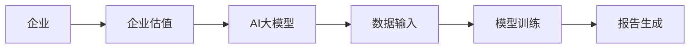
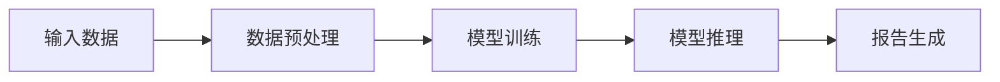
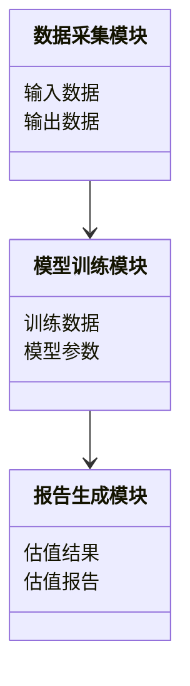
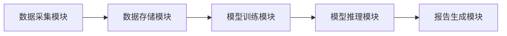
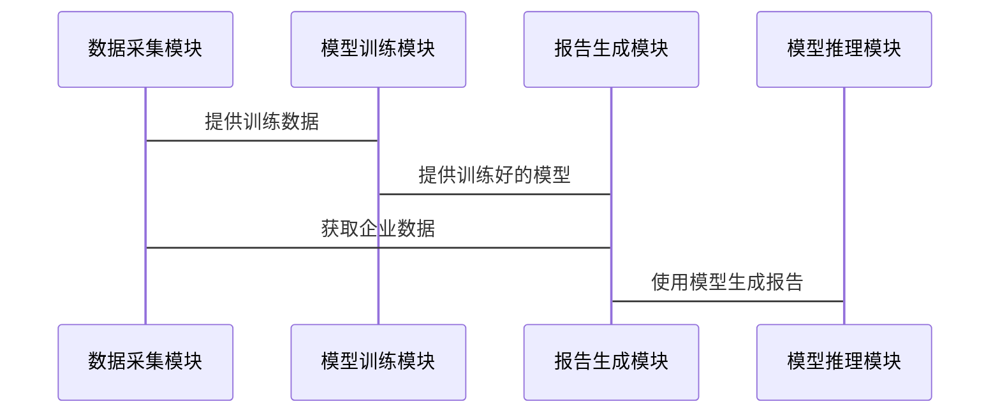

                 


# AI辅助的企业估值报告自动生成系统

## 关键词：AI技术、企业估值、自动生成、报告生成、大模型、系统架构

## 摘要：本文详细介绍了如何利用AI技术来辅助生成企业估值报告。通过分析传统企业估值方法的局限性，探讨了AI大模型在企业估值中的应用潜力，详细讲解了AI辅助企业估值的核心概念、算法原理和系统架构设计，最后通过实际案例展示了如何实现AI辅助的企业估值报告自动生成系统。

---

# 第1章: 企业估值与AI辅助的背景介绍

## 1.1 企业估值的定义与传统方法
### 1.1.1 企业估值的核心概念
- 企业估值是通过对企业的财务数据、市场表现、行业地位等多方面进行分析，估算企业价值的过程。
- 传统方法包括DCF模型、可比公司法等，依赖大量人工计算和分析，耗时且容易出错。

### 1.1.2 传统企业估值方法的局限性
- 数据依赖性强，需要大量历史数据支持。
- 人工分析耗时长，容易受到主观因素影响。
- 难以快速响应市场变化，缺乏实时性。

### 1.1.3 企业估值的边界与外延
- 边界：企业价值的计算范围和方法。
- 外延：扩展到企业融资、并购、上市等应用场景。

## 1.2 AI技术在企业估值中的应用背景
### 1.2.1 AI技术的发展与企业估值的结合
- AI技术的进步，如大模型的出现，为自动化分析提供了可能性。
- 企业估值需要大量数据处理和模式识别，AI技术能够提高效率和准确性。

### 1.2.2 企业估值报告自动生成的潜力
- AI技术可以快速处理大量数据，生成初步估值报告。
- 通过不断训练，模型能够学习更多行业和市场知识，提升估值准确性。

### 1.2.3 企业估值与AI辅助的边界与外延
- 边界：AI辅助不能完全替代人类专家，仅作为工具。
- 外延：AI技术在企业估值中的应用扩展到风险管理、投资决策等领域。

## 1.3 本章小结
- 介绍了企业估值的基本概念和传统方法的局限性。
- 探讨了AI技术在企业估值中的应用背景及其潜力。
- 明确了企业估值与AI辅助的边界和外延。

---

# 第2章: AI大模型与企业估值的核心概念

## 2.1 AI大模型的基本原理
### 2.1.1 AI大模型的输入输出机制
- 输入：企业财务数据、市场数据、行业报告等。
- 输出：生成的企业估值报告。

### 2.1.2 大模型的训练与推理过程
- 训练：使用大量历史数据进行模型参数优化。
- 推理：根据输入数据生成估值报告。

### 2.1.3 大模型在企业估值中的应用特点
- 高效性：快速处理和分析大量数据。
- 准确性：通过深度学习提升估值的准确性。

## 2.2 企业估值报告生成的关键要素
### 2.2.1 估值报告的结构与内容
- 公司概况、财务分析、行业分析、估值方法、结论等。

### 2.2.2 估值报告生成的逻辑流程
1. 数据收集
2. 数据清洗
3. 数据分析
4. 估值计算
5. 报告生成

### 2.2.3 估值报告生成的核心要素对比表

| 核心要素 | 传统方法 | AI辅助方法 |
|----------|----------|------------|
| 数据来源 | 单一数据源 | 多数据源整合 |
| 分析速度 | 人工分析，耗时 | 自动化分析，快速 |
| 结果准确性 | 受主观因素影响 | 高度客观，基于大数据 |

## 2.3 AI大模型与企业估值的关系
### 2.3.1 AI大模型在企业估值中的作用
- 数据处理与分析：快速整理和分析大量数据。
- 模型训练与优化：通过不断学习提升估值准确性。
- 报告生成：自动生成结构化报告。

### 2.3.2 企业估值对AI大模型的需求
- 高精度：需要准确的估值结果。
- 高效率：需要快速的处理速度。
- 多功能性：能够适应不同行业和市场环境。

### 2.3.3 AI大模型与企业估值的实体关系图（Mermaid）



## 2.4 本章小结
- 介绍了AI大模型的基本原理及其在企业估值中的应用特点。
- 列举了企业估值报告生成的关键要素，并通过对比表展示了传统方法与AI辅助方法的差异。
- 通过Mermaid图展示了AI大模型与企业估值的关系。

---

# 第3章: AI大模型的算法原理

## 3.1 大模型的基本算法框架
### 3.1.1 大模型的输入处理
- 数据清洗：去除噪声数据。
- 数据转换：将数据转换为模型可接受的格式。

### 3.1.2 大模型的编码与解码过程
- 编码：将输入数据转换为模型内部表示。
- 解码：将模型内部表示转换为输出报告。

### 3.1.3 大模型的训练目标
- 最小化预测误差：通过损失函数优化模型参数。
- 提高模型泛化能力：通过正则化防止过拟合。

## 3.2 企业估值报告生成的算法流程
### 3.2.1 数据预处理
- 数据清洗：去除缺失值、异常值。
- 数据标准化：将不同量纲的数据统一处理。

### 3.2.2 模型训练
- 模型选择：选择适合任务的模型结构。
- 参数优化：通过反向传播调整模型参数。

### 3.2.3 模型推理
- 输入数据：企业相关数据。
- 模型推理：生成估值报告。

## 3.3 算法的数学模型与公式
### 3.3.1 损失函数
$$ L = -\sum_{i=1}^{n} y_i \log(p_i) + (1 - y_i) \log(1 - p_i) $$

### 3.3.2 优化目标
$$ \text{优化目标} = \text{最小化损失函数} + \text{正则化项} $$

## 3.4 算法流程图（Mermaid）


## 3.5 本章小结
- 介绍了AI大模型的基本算法框架，包括输入处理、编码与解码过程。
- 描述了企业估值报告生成的算法流程，包括数据预处理、模型训练和推理。
- 通过数学公式和流程图详细讲解了算法的原理和实现步骤。

---

# 第4章: 系统架构设计方案

## 4.1 问题场景介绍
- 企业估值报告生成需要高效、准确的解决方案。
- 传统方法效率低，容易出错，难以应对大量数据和快速变化的市场。

## 4.2 项目介绍
- 项目目标：开发一个基于AI的大模型，能够自动生成企业估值报告。
- 项目范围：涵盖数据收集、模型训练、报告生成等模块。

## 4.3 系统功能设计
### 4.3.1 领域模型（Mermaid类图）



### 4.3.2 系统架构设计（Mermaid架构图）



### 4.3.3 系统接口设计
- 数据接口：与数据源对接，获取企业数据。
- 模型接口：与AI大模型对接，进行模型训练和推理。
- 报告接口：生成并输出估值报告。

### 4.3.4 系统交互设计（Mermaid序列图）



## 4.4 本章小结
- 介绍了系统架构设计方案，包括问题场景、项目介绍、系统功能设计、系统架构设计、系统接口设计和系统交互设计。
- 通过类图、架构图和序列图详细展示了系统的各个部分及其交互关系。

---

# 第5章: 项目实战

## 5.1 环境安装
### 5.1.1 安装Python
- 安装Python 3.x以上版本。
- 安装必要的库：numpy、pandas、torch、transformers等。

### 5.1.2 安装模型框架
- 安装Hugging Face的Transformers库：`pip install transformers`

## 5.2 系统核心实现源代码
### 5.2.1 数据采集模块
```python
import requests
import json

def get_company_data(company_id):
    url = f"https://api.example.com/company/{company_id}"
    response = requests.get(url)
    if response.status_code == 200:
        return json.loads(response.text)
    else:
        return None
```

### 5.2.2 模型训练模块
```python
from transformers import AutoModelForCausalLM, AutoTokenizer
import torch

def train_model(model_name, train_data):
    model = AutoModelForCausalLM.from_pretrained(model_name)
    tokenizer = AutoTokenizer.from_pretrained(model_name)
    # 训练过程略...
    return model, tokenizer
```

### 5.2.3 报告生成模块
```python
def generate_report(model, tokenizer, company_data):
    inputs = tokenizer.encode(str(company_data), add_special_tokens=True, return_tensors='pt')
    outputs = model.generate(inputs, max_length=500, temperature=0.7)
    report = tokenizer.decode(outputs[0], skip_special_tokens=True)
    return report
```

## 5.3 代码应用解读与分析
### 5.3.1 数据采集模块
- 功能：从API获取企业数据。
- 注意事项：处理API请求失败的情况。

### 5.3.2 模型训练模块
- 功能：使用Hugging Face的Transformers库训练模型。
- 注意事项：需要大量计算资源，建议使用GPU加速。

### 5.3.3 报告生成模块
- 功能：使用训练好的模型生成企业估值报告。
- 注意事项：调整温度参数以平衡生成内容的多样性和准确性。

## 5.4 案例分析和详细讲解剖析
### 5.4.1 案例背景
- 某公司需要生成季度财务报告的估值部分。

### 5.4.2 数据准备
- 收集公司的财务数据、市场数据、行业报告等。

### 5.4.3 模型训练
- 使用收集到的数据训练AI模型，生成报告。

### 5.4.4 生成报告
- 输入公司数据，生成估值报告。

## 5.5 项目小结
- 介绍了项目实战的环境安装和核心代码实现。
- 通过案例分析展示了如何使用AI大模型生成企业估值报告。
- 提出了在实际应用中需要注意的问题和优化建议。

---

# 第6章: 总结与展望

## 6.1 本章小结
- 本文详细介绍了AI辅助企业估值报告自动生成系统的核心概念、算法原理和系统架构设计。
- 通过实际案例展示了如何利用AI技术提高企业估值的效率和准确性。

## 6.2 最佳实践 tips
- 数据质量是关键，确保输入数据的准确性和完整性。
- 模型训练需要大量计算资源，建议使用云平台进行训练。
- 定期更新模型，保持其适应市场变化的能力。

## 6.3 未来展望
- 更广泛的应用场景：从企业估值扩展到风险管理、投资决策等领域。
- 更先进的技术：如多模态模型的应用，提升报告的多样性和准确性。
- 更高效的实现：优化模型结构和训练方法，提高生成效率。

---

# 作者：AI天才研究院/AI Genius Institute & 禅与计算机程序设计艺术 /Zen And The Art of Computer Programming

